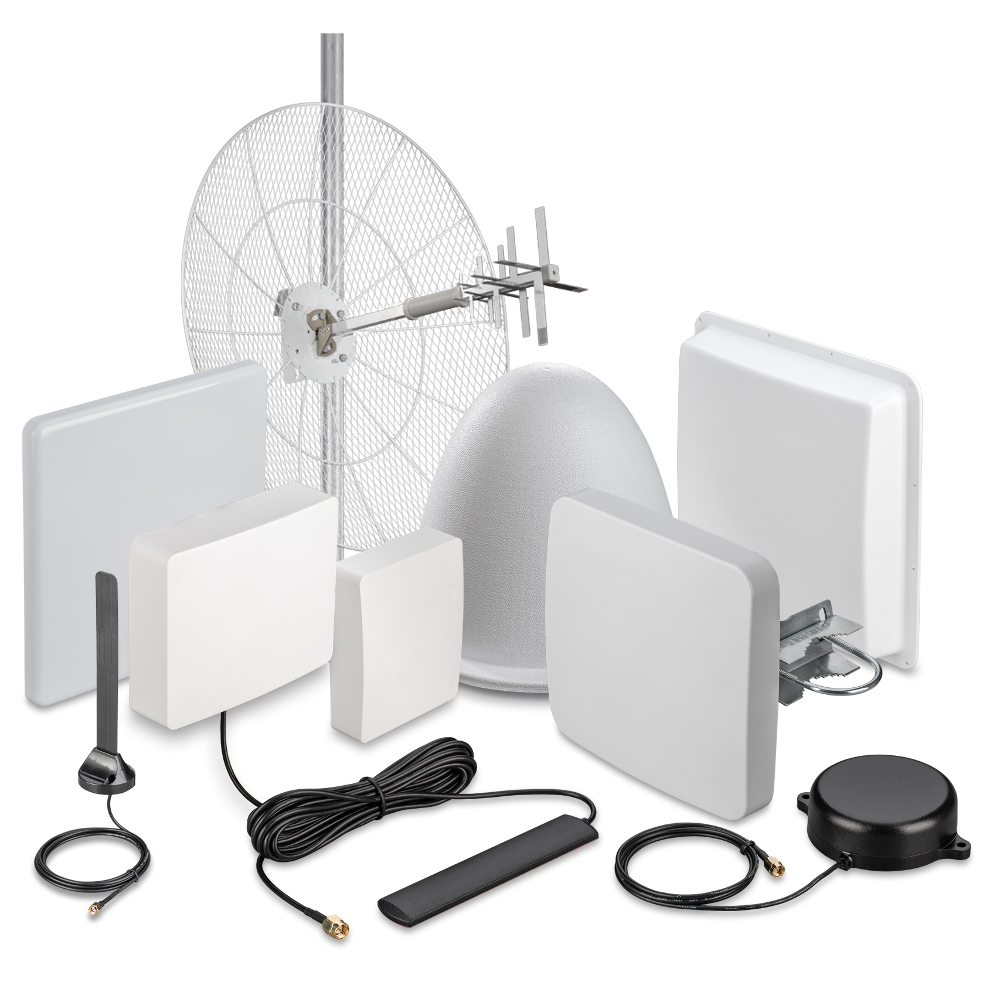

# Как определиться с выбором антенны

Установка внешней антенны может понадобиться вам в различных ситуациях, в зависимости от которых следует делать окончательные выбор.  
Ниже мы разберем типы антенн, имеющихся [на нашем сайте](https://kroks.ru/shop/antenny-gsm-3g-4g-wifi/). А также их особенности и цели, для которых они могут подойти лучше всего.

В большинстве случаев антенны используются для усиления сигнала, например, если ваш роутер или мобильный телефон имеет плохое качество сигнала, но так же существуют и антенны для усиления Wi-Fi сигнала. Правильно подобранная и установленная антенна помогает сделать связь стабильной и быстрой.

## ***Для чего вам нужна антенна?***

Наиболее распространенные задачи при выборе антенны:

* **Телевидение** — для приема цифрового сигнала используется специальный тип [антенн](https://kroks.ru/shop/antenny-gsm-3g-4g-wifi/?price_from=0&price_to=30000&property_5322%5B%5D=25950&filter=1&sorting=). Они отличаются только усилением, о котором мы поговорим чуть позже;  
* **Мобильный интернет и звонки** — в этом случае используются **GSM**, **3G**, **4G**, или **5G** антенны. При выборе важно учитывать не только усиление, но и рабочий диапазон частот;
* **Wi-Fi** — для усиления Wi-Fi сигнала или создания "моста" также необходимо учитывать диапазон рабочих частот и усиление антенны.

## ***Диапазон частот***

Антенна должна поддерживать те частоты, на которых работает нужная вам сеть:

* Для мобильных операторов связи наиболее популярны частоты **900, 1800, 2100, 2600 МГц**, но наверняка вы можете узнать их с помощью специальных приложений для телефона (нужно запустить приложение в месте установки антенны) например:
    * **OpenSignal**  
    * **Network Cell Info**  
    * **Сотовые вышки. Локатор**  
    * **Cellmapper**

Если в приложении вместо конкретной частоты указан **BAND**, то вы можете узнать соответствующую бэнду частоту в [этой](/docs/repitery/standarty-i-diapazony-chastot-mobilnyh-operatorov.md) статье;  
* Для Wi-FI вам подойдёт **2,4 ГГц**, **5 ГГц** или **6 ГГц** в зависимости от того, на какой частоте работает ваша домашняя сеть.

## ***Усиление антенны***

Грубо говоря, это мощность вашей антенны, высокие показатели усиления необходимы для повышения дальности, проходимости и стабильности сигнала.

Обратите внимание, у некоторых антенн может быть указана их дальность, соответсвующая усилению. Однако не забывайте, что это усредненное значение, которое зависит от многих параметров, например, количество препятствий на пути, материал из которого они состоят, ландшафт и прочее.  
Также это не значит что вам нужно выбирать антенну с максимальным усилением: слишком большое усиление также может негативно сказываться на качестве сигнала, переусилить его и создать помехи.

## ***Направление***

Один из вариантов исполнения антенн — **направленные**. Они ловят сигнал лицевой стороной. Подходят, если вы знаете, где находится ближайшая базовая станция оператора и направите антенну в её сторону (проверить место нахождение вышек можно в выше перечисленных мобильных приложениях, либо на специальной [карте](https://infocelltowers.ru/ymaps)).  
Кроме того существуют **всенаправленные** антенны. Они ловят сигнал со всех сторон, но не так хорошо, как направленные антенны. Подойдут, если поблизости от вас много базовых станций или вы не знаете где находится ваша.

## ***Распространенные свойства антенн***

* **MIMO антенны** — антенны с поддержкой технологии MIMO, которая умеет использовать несколько потоков одновременно, что положительно сказывается на стабильности и скорости соединения.  
По сути это две антенны в одном корпусе, и не все модемы могут работать с такой технологией. Обязательно убедитесь, что ваше устройство поддерживает технологию **MIMO** перед выбором такой антенны.

* **Параболические антенны** — выглядят как тарелка с излучателем. Обладают очень большой дальностью, но требуют точного наведения.  
Используются, если до ближайшей базовой станции далеко.

* **GSM антенны** — усиливают сигнал мобильной сети, но в довольно узком диапазоне.

* **3G/4G (LTE)** — то же самое, что GSM, но адаптирован для новых поколений частот. Почти всегда поддерживают технологию MIMO.

* **Wi-Fi антенны** — применяются внутри дома или на небольших расстояниях.  
    * **Всенаправленные** — для использования внутри дома;
    * **Направленные** — например, если хотите провести интернет в мастерскую через двор.

Обратите внимание, усиление хоть и помогает сигналу проходить через стены, но иногда лучше просто поставить второй роутер(если дом большой и/или стены толстые).

## ***Итог***

Для выбора антенны выполните следующие шаги:  
* Определите, для чего нужна антенна — интернет, звонки или Wi-Fi;  
* Узнайте нужный вам диапазон частот;  
* Решите, нужна ли вам направленная антенна или достаточно всенаправленной;  
* Проверьте, поддерживает ли ваш роутер технологию MIMO. Если да, то выбирайте антенну с этой технологией;  
* Если вы находитесь далеко от города, сигнал слабый или полностью отсутствует — выбирайте антенны с большим усилением, возможно, параболические.
