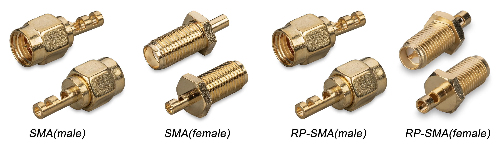
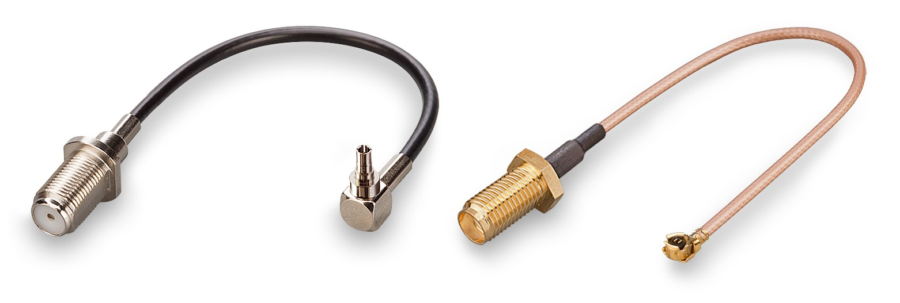
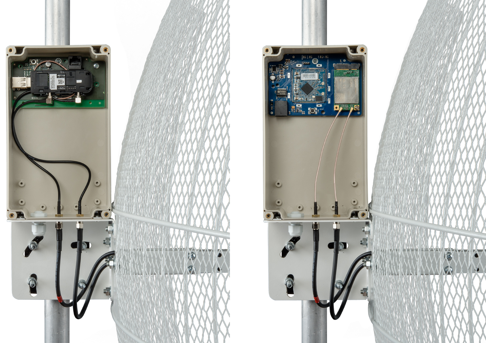
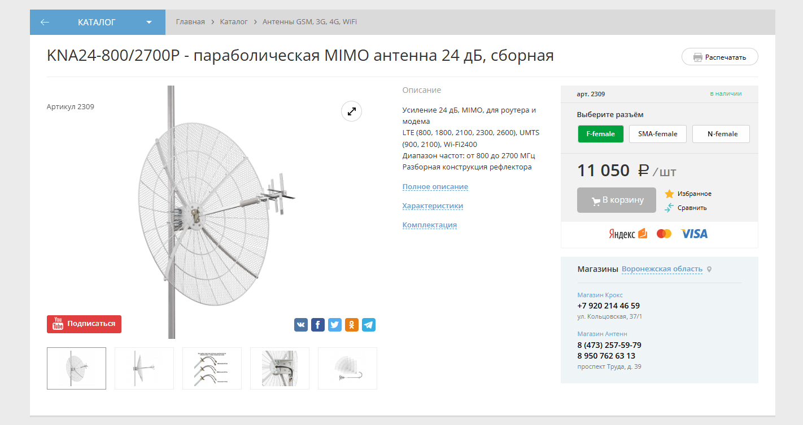
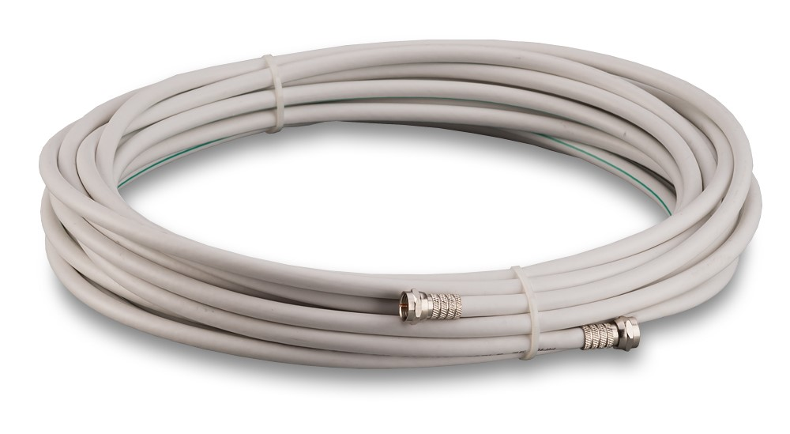
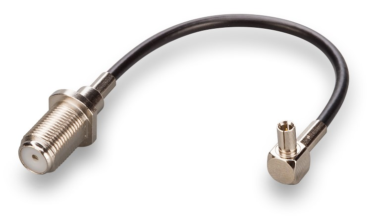

# Подбор набора для установки антенны

## ***Высокочастотные кабели***

Одной из главных характеристик кабеля является волновое сопротивление. Существуют два стандарта — 50 и 75 Ом.

* Стандарт 50 Ом применяется для таких кабелей, как [5D-FB](https://kroks.ru/shop/cable-rf/kabel-koaksialnyj-5d-fb-50-om/), [8D-FB](https://kroks.ru/shop/cable-rf/kabel-koaksialnyj-8d-fb-cca-50-om/), [RG-316](https://kroks.ru/shop/cable-rf/coaxial-rg316bu/) и т.д. Обычно они используются с [N-разъемами](https://kroks.ru/shop/connectors/razemy/?price_from=0&price_to=1610&property_5317%5B%5D=1049&filter=1&sorting=) или [SMA-разъемами](https://kroks.ru/shop/connectors/razemy/?price_from=0&price_to=1610&property_5317%5B%5D=1047&filter=1&sorting=).

* Стандарт 75 Ом применяется, например, для кабеля [RG-6U](https://kroks.ru/shop/cable-rf/kabel-koaksialnyj-rg-6u-96-premium-hq/), с ним обычно используется [F-разъемы](https://kroks.ru/shop/connectors/razemy/?price_from=0&price_to=1610&property_5317%5B%5D=1050&filter=1&sorting=).

В большинстве случаев для подключения репитера или роутера к антенне достаточно 75 Ом, подробнее об этом рассказано на нашем сайте в статьях ["Волновое сопротивление 50 или 75 Ом, медненое железо или медь?"](https://kroks.ru/useful-articles/stati/an-impedance-of-50-or-75-ohm-mednine-iron-or-copper/) и ["Почему мы предлагаем антенны с разъемами N и F типа?"](https://kroks.ru/useful-articles/stati/why-we-proposed-antenna-with-n-connectors-and-f-type/).

:::tip
Обратите внимание, написаное выше не обязывает вас к использованию только разъемов F типа. Окончательный выбор обосновывается вашими соображениями и нуждами.  
Наша задача предоставить вам выбор, поэтому мы и предлагаем антенны с разными вариантами разъемов.

:::

## ***Разъёмы антенн и роутеров***

### ***Общая терминология***

Поскольку разъемное соединение состоит из двух частей, все парные друг другу разъемы бывают двух видов.

* Male - штырькова часть ("Папа")

* Female - гнездовая часть ("Мама")

* RP (Reverse Polarity) - обратная полярность. Используется в обозначениях SMA разъемов, например, **RP-SMA male** — разъём female типа в корпусе male разъёма.

### ***Типы разъемов***

На нашем сайте представлено довольно большое разнообразие разъёмов, но для антенн используются следующие:

* Разъем F типа — дешевый, не требует пайки, для монтажа на кабель рекомендуется использовать обжимной инструмент.  
    * Варианты исполнения: F(male) - штырьковая часть и F(female) - гнездовая часть.

* Разъем N типа — дороже F разъема, сложнее в установке. Состоит из нескольких частей, иногда в диаметре может быть гораздо больше кабеля, что может быть быть неудобно при монтаже. Требует пайки.  
    * Варианты исполнения: N(male) - штырьковая часть и N(female) - гнездовая часть.

* Разъём SMA типа — сложный монтаж, требует пайки, терпения и аккуратности.  
    * Варианты исполнения: SMA(male) - штырьковая часть, SMA(female) - гнездовая часть, RP-SMA(male) - гнездовая часть в корпусе штырьковой, RP-SMA(female) - штырьковая часть в корпусе гнездовой.  
    Визуальное различие SMA разъёмов разных типов приведено ниже.  

## ***Разъемы модемов***

Разъемы на модемах отличаются от вышеперечисленных.  
К наиболее популярным можно отнести:

* Разъем CRC9 типа — используется во многих модемах Huawei, некоторых моделях Мегафон и ZTE.

* Разъем TS9 типа — так же используется в модемах Huawei, Мегафон и ZTE. Похож на CRC9, но отличается диаметром.

* Разъем U.Fl типа — используется во многих модемах Quectel, например, EC-25, EC-06, EC200T.

Из-за отличия разъемов для подключения модема к антенне или кабельной сборке используются пигтейлы.

## ***Пигтейлы***

Как уже было сказано выше, пигтейлы необходимы для подключения разъемов роутеров и коаксиальных кабелей к разъемам модемов. Ниже приведены примеры пигтейлов — F(female) - CRC9 слева и SMA(female) - U.Fl справа.

Примеры пигтейлов, установленных в гермобоксе:

## ***Выбор комплектующих***

Разберем пример, когда мы подбираем антенну для некого модема (или роутера) имеющего неизвестный тип разъема. Пусть это будет модем ZTE MF831, подключаемый к ноутбуку, и параболическая антенна [KNA24-800/2700P](https://kroks.ru/shop/antenny-gsm-3g-4g-wifi/kna24-8002700p-parabolicheskaya-mimo-antenna-24-db-sbornaya/). Расстояние от антенны до модема около шести метров.  
Далее мы произведем подбор необходимых комплектующих.

Антенна KNA24-800/2700P, как видно на сайте, позволяет выбрать тип разъема — F(female), SMA(female) и N(female).

Как было сказано выше, в большинстве случаев практичнее оказывается использование кабеля 75 Ом с разъемом F типа.  
Выберем его.

Для дальнейшего подключения нам понадобится кабельная сборка — отрезок кабеля с двух сторон обжатый коннекторами. Его можно как изготовить самостоятельно, так и преобрести готовый.  
Мы предлагаем готовые кабельные сборки RG-6U F(male) - F(male) длиной [5](https://kroks.ru/shop/kabelnye-sborki/cable-assembly-fmale-fmale-5-meters/) и [10](https://kroks.ru/shop/kabelnye-sborki/cable-assembly-fmale-fmale-10-meters/) метров.

Так как в условиях мы задали расстояние от модема до антенны около 6 метров, то нам понадобятся две кабельные сборки диной 10 метров.

Именно две сборки понадабятся потому что антенна поддерживает технологию MIMO. Это означает что у нее два разъема под кабельные сборки.  
Предварительно убедившись что у модема также два разъема под внешнюю антенну, мы можем сделать вывод что и антенна и модем могут работать, используя MIMO.  
Это позволит увеличить пропускную способность канала, что положительно скажется на скорости соединения.

Теперь у нас есть антенна с двумя кабельными сборками, оканчивающимися разъемами F(male). Осталось только выбрать подходящие пигтейлы.  
В документации к модему мы можем узнать что там используются разъемы TS-9. Следовательно нам необходима пара пигтейлов [F(female) - TS-9](https://kroks.ru/shop/cables/antenna-coupler-ts9-f-female/).

На этом выбор оборудования окончен. У нас получился следующий список:

* [Параболическая антенна KNA24-800/2700P](https://kroks.ru/shop/antenny-gsm-3g-4g-wifi/kna24-8002700p-parabolicheskaya-mimo-antenna-24-db-sbornaya/) — 1 шт;

* [Кабельная сборка RG-6U F(male) - F(male) — 10 метров](https://kroks.ru/shop/kabelnye-sborki/cable-assembly-fmale-fmale-10-meters/) — 2 шт;

* [Пигтейл F(female) - TS-9](https://kroks.ru/shop/cables/antenna-coupler-ts9-f-female/) — 2 шт.
