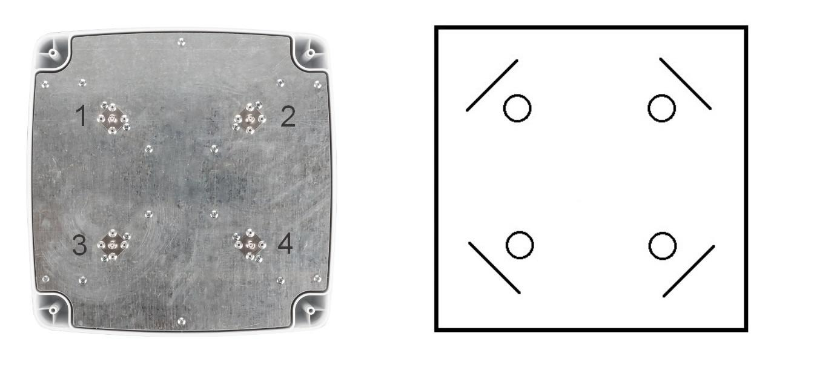

# Поляризация и подключение панельных антенн MIMO 4x4

Антенна MIMO 4x4 может быть рассмотрена как две антенны в одном корпусе.

Каждая из антенн представляет из себя две любые перпендикулярно расположенные друг к другу пластины. Это может быть как 1-2, так и 1-3, 2-4, 3-4.

Подключение выводов к модему следует выполнять в соответствии с документацией к вашему модему.

На некоторых моделях это могут быть пары:

**MAIN - AUX1** - антенна №1;

**AUX2 - AUX3** - антенна №2;

или

**MAIN - DIV** - антенна №1;

**MIMO1 - MIMO2** - антенна №2.

В других случаях правило подключение может отличаться и указано в документации к модему.
