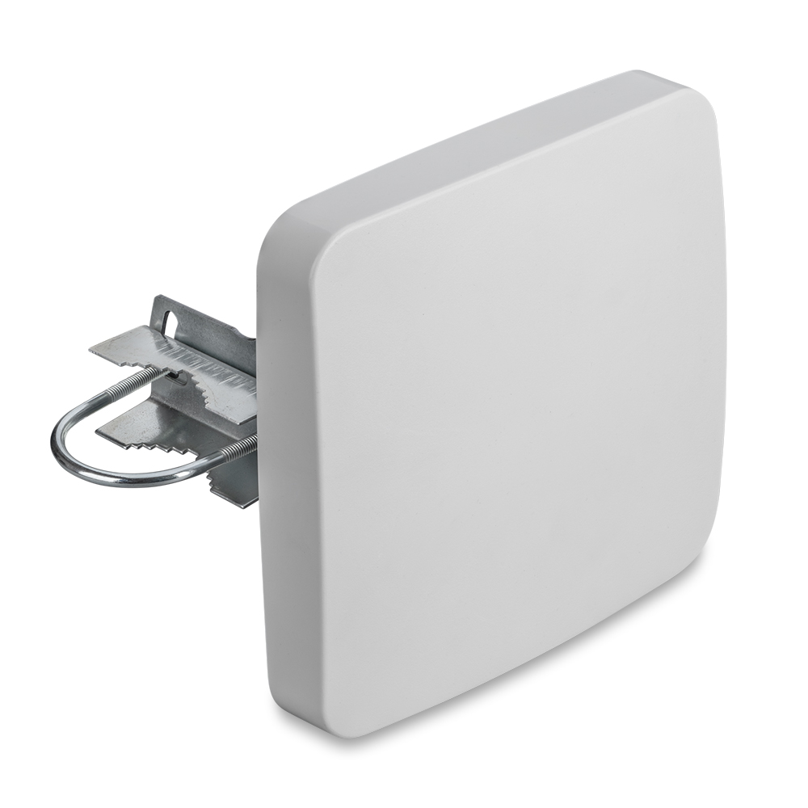
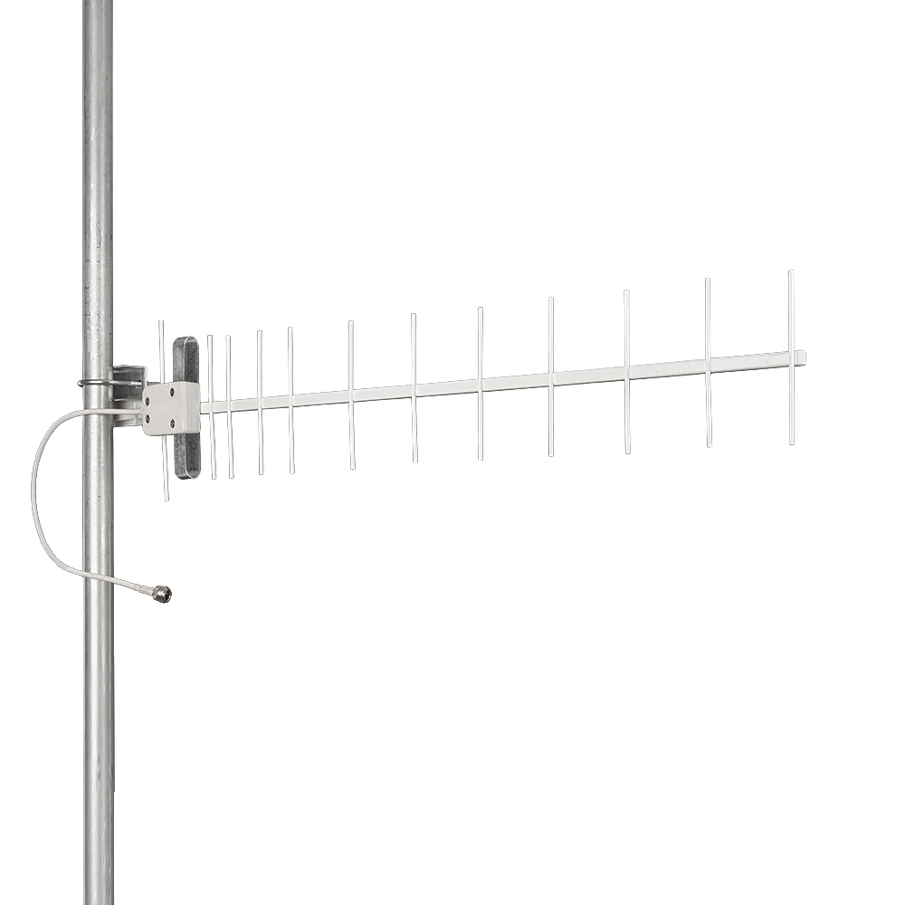
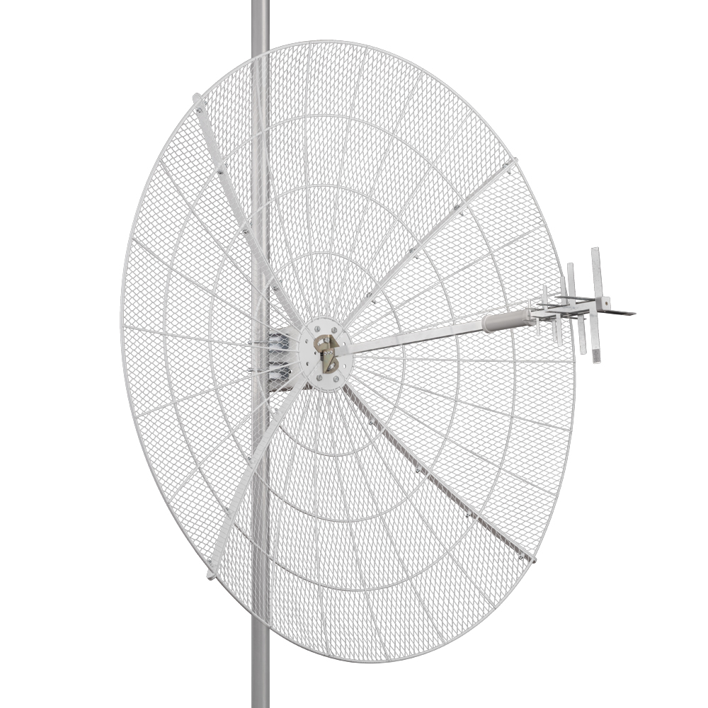
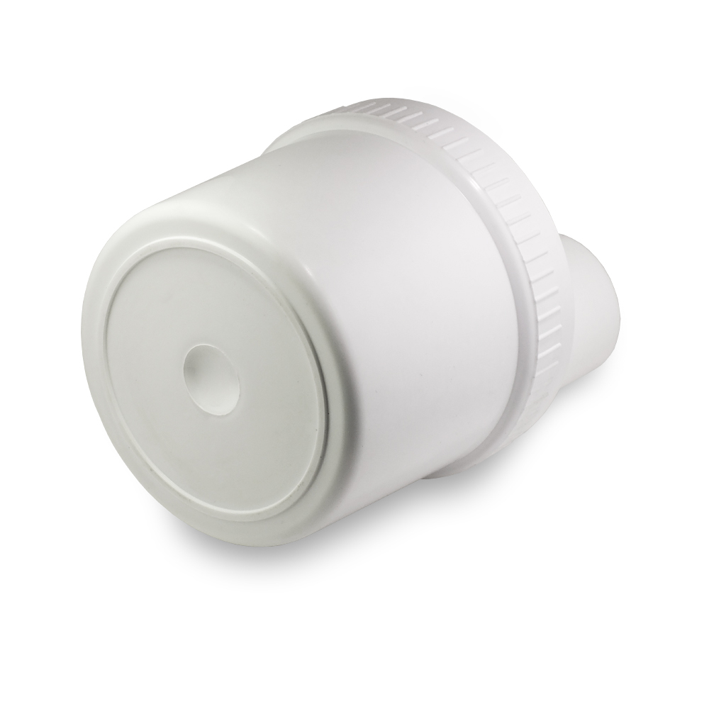
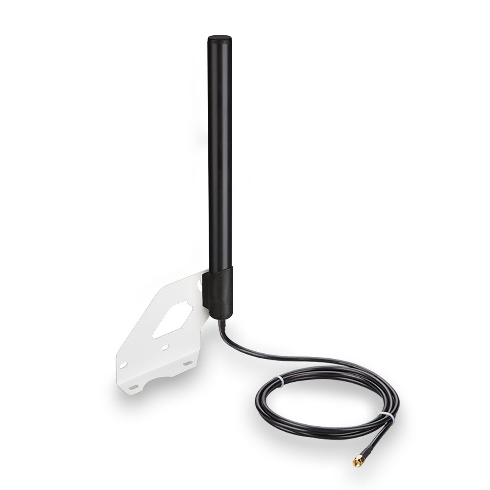
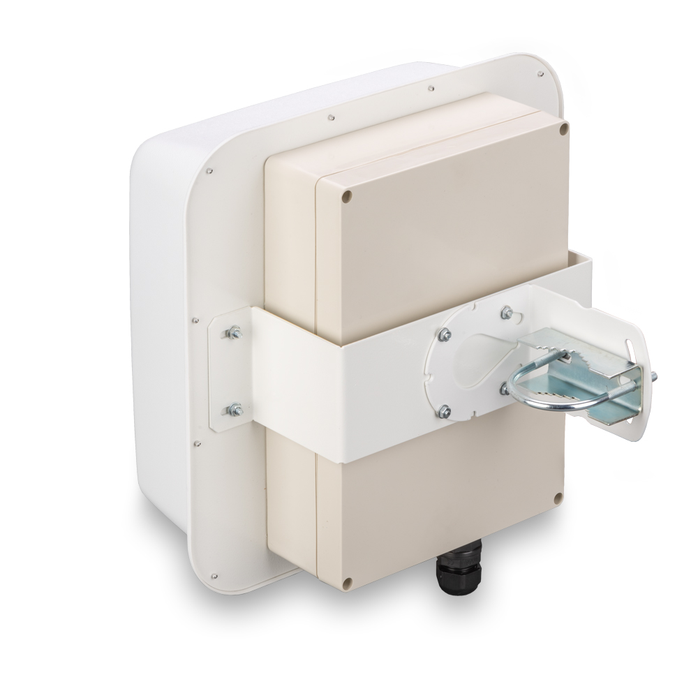

# Типы антенн

Антенна — это устройство, предназначенное для излучения или приема радиоволн. Она преобразует электрические сигналы в радиоволны и обратно. Антенны используются в различных областях, от телевизионного вещания и радио до мобильной связи и спутниковых систем.  
Антенны играют ключевую роль в беспроводной связи, позволяя передавать и принимать радиоволны.

## ***Основные типы антенн***

### ***Панельные антенны***

[Панельная антенна](https://kroks.ru/shop/antenny-gsm-3g-4g-wifi/?price_from=0&price_to=30000&property_5329%5B%5D=27198&filter=1&sorting=) - представляет собой плоскую прямоугольную или квадратную пластину, похожую на небольшую панель или экран.  
Такие антенны часто используются в мобильной связи или телевидении, чтобы обеспечить хорошее качество сигнала.

**Основные преимущества таких антенн:**  
* Компактность;  
* Легкость монтажа;  
* Панельные антенны позволяют направлять сигнал, чтобы он не рассеивался в разные стороны.

**Недостатки:**
* Меньшая дальность по сравнению с параболическими антеннами;  
* Ограничены в мощности передачи на большие расстояния;  
* Не подходят для широкого покрытия.

### ***Антенны типа "волновой канал"***

Антенны типа [волновой канал](https://kroks.ru/shop/antenny-gsm-3g-4g-wifi/?price_from=0&price_to=30000&property_5329%5B%5D=6259&filter=1&sorting=) состоят из металлических пластин, образующих канал, по которому распространяются радиоволны. Используются в основном для передачи *AM* и *FM* сигнала.

**Основные преимущества таких антенн:**  
* Высокая эффективность передачи сигнала, малые потери;  
* Позволяют передавать сигналы на большие расстояния;  
* Внутри канала волны движутся прямо, не рассеиваясь, что обеспечивает хорошее качество сигнала.

**Недостатки:**
* Только для специальных условий, чаще используются в научных или промышленных целях;  
* Сложные в установке;  
* Не подходят для стандартных бытовых нужд.

### ***Параболические антенны***

[Параболические антенны](https://kroks.ru/shop/antenny-gsm-3g-4g-wifi/?price_from=0&price_to=30000&property_5329%5B%5D=6261&filter=1&sorting=0) имеют форму параболического рефлектора, который фокусирует радиоволны в одну точку. Одна из самых популярных антенн для спутниковой связи.

**Основные преимущества таких антенн:**  
* Позволяют передавать сигнал на очень большие расстояния;  
* Сигнал фокусируется и направляется точно в нужную сторону, что делает связь очень устойчивой и качественной;  
* Хорошо ловят удаленные, слабые или поврежденные сигналы.

**Недостатки:**  
* Большие по размеру и тяжелые;  
* Требуют точной нацеленности и аккуратной настройки;  
* Дороже и сложнее в установке.

### ***Облучатели***

[Облучатели](https://kroks.ru/shop/antenny-gsm-3g-4g-wifi/?price_from=0&price_to=30000&property_5329%5B%5D=6377&filter=1&sorting=0) - это устройства, которые помогают усилить и направить сигнал, чтобы он лучше шел к спутнику и обратно. Внешне напоминают небольшой блок, который устанавливается внутри параболической антенны или спутниковой тарелки.

**Основные преимущества таких антенн:**  
* Сигнал не прерывается из-за плохой погоды или помех;  
* Улучшение качества сигнала, картинка становится более четкой, звук "чище";  
* Легкость установки.

**Недостатки:**  
* В случае с некачественными моделями или неправильной настройкой - могут плохо улавливать сигнал.

### ***Всенаправленные антенны***

[Всенаправленные антенны](https://kroks.ru/shop/antenny-gsm-3g-4g-wifi/?price_from=0&price_to=30000&property_5329%5B%5D=6260&filter=1&sorting=0) - это такие антенны, которые ловят и передают сигнал во всех направлениях сразу. Они отлично подходят для ситуаций, когда вам нужно поймать или раздать сигнал в разные стороны, например, в небольших домах, офисах, или при использовании в местах, где нет необходимости нацеливаться точно в один спутник или источник сигнала.

**Основные преимущества таких антенн:**  
* Легкость установки, не нужно точно наводить антенну, чтобы поймать сигнал;  
* Работают в любом направлении, поэтому подходят для работы по площади;  
* Подходят, когда нужен единый сигнал для всех устройств.

**Недостатки:**
* Слабая дальность и меньшая чувствительность;  
* Не подходят для задач, где важна точная и мощная связь на дальних расстояниях;  
* Меньше контроль над направленностью сигнала.

### ***Антенны с гермобоксом***

[Антенны со встроенным гермобоксом](https://kroks.ru/shop/antenny-gsm-3g-4g-wifi/?price_from=0&price_to=30000&property_5329%5B%5D=6429&filter=1&sorting=0) конструктивом могут относиться к любому из других типов антенн. Их отличительной особенностью является наличие в конструкции герметичного бокса для установки электронных компонентов - например, роутеров, конвертеров, усилителей и других компонентов. 

**Основные преимущества таких антенн:**  
* Благодаря гермобоксу электронное оборудование внутри служит дольше;
* Защита встроенного оборудования от плохой погоды, ветра, дождя, снега и сильных температур.

**Недостатки:**
* Немного больший размер из-за встроенного гермобокса;  
* Могут быть дороже из-за встроенного гермобокса и оборудования;
* В случае повреждения гермобокса - может быть сложнее отремонтировать.

## ***Итог***

Выбор антенны зависит от условий и целей использования. Для дальних дистанций лучше подходят - параболические, а для домашнего использования - всенаправленные.  
Каждая из антенн хороша в своих условиях, но имеет свои ограничения и минусы.  
Подробнее разобраться с выбором подходящей вам антенны поможет соответствующая [статья](/docs/antenny/kak-opredelitsya-s-viborom-antenni.md).
