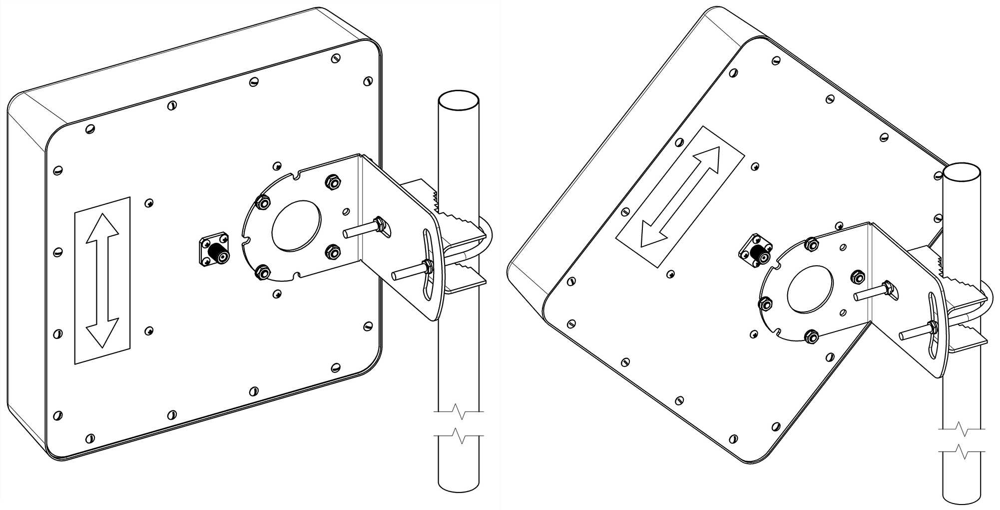
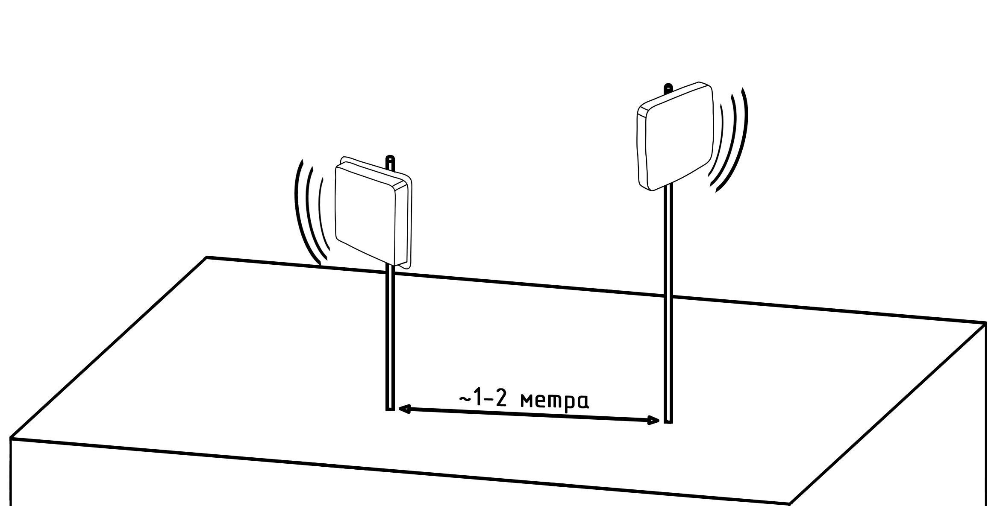
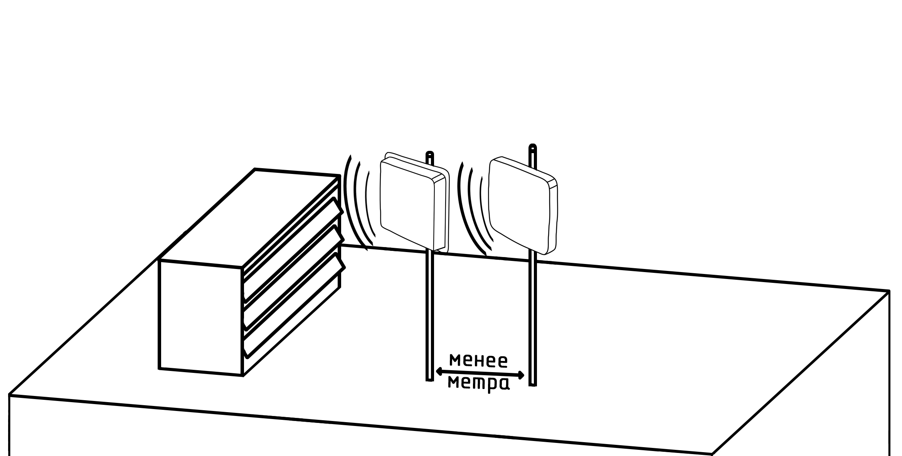

# Установка нескольких антенн рядом

Когда антенны расположены слишком близко друг к другу, они могут мешать друг другу, создавать помехи и резкое падение уровня сигнала. Для избежания подобных проблем учитывайте несколько простых рекомендаций.

1. Дистанция между антеннами.  
В большинстве случаев для Wi-Fi или 3G/4G антенн будет достаточно расстояния в 1-2 метра между ними. Но если вы хотите определить необходимое расстояние более точно, тогда следует исходить из длинны волны самой низкой рабочей частоты антенн. Расстояния в одну длину волны между антеннами будет достаточно.

2. Разнонаправленность.  
Если антенны функционируют в разных диапазонах и не работают одновременно (например, одна антенна 3G/4G, а вторая FM-радио), в таком случае проблемы сведутся к минимуму. Но если диапазоны, направления или задачи перекрываются, то антенны лучше отклонить друг от друга вертикально или горизонтально.  
Также хорошим решением будет размещение антенн на разной высоте.

3. Влияние металлических конструкций и земли.  
Не монтируйте антенны слишком близко к крупным металлическим поверхностям и не кладите их на крышу, если она из металла. Это плохо повлияет на качество сигнала.  
Идеальным размещением будет установка на мачту или кронштейн, выступающий за край крыши.

4. Кроссполяризация.  
Если это возможно - используйте антенны с разной поляризацией (одна вертикально, другая горизонтально). Также в некоторых регионах операторы используют Х-поляризацию. В этом случае необходимо повернуть кронштейн антенны на 45°.

## ***Примеры установки нескольких антенн***

### ***Правильная установка***  

Антенны размещаются на достаточном расстоянии между собой, в большинстве случаев 1-2 метра хватит, находятся на разной высоте и направленны в разные стороны.  
Ничего не мешает распространению сигнала.

### ***Неправильная установка***

Антенны находятся слишком близко друг к другу, на одной высоте и направлены в одну сторону. Кроме того вблизи от антенн установлен вентиляционный выход.  
Все перечисленные факторы в сумме крайне негативно сказываются на качестве сигнала.
