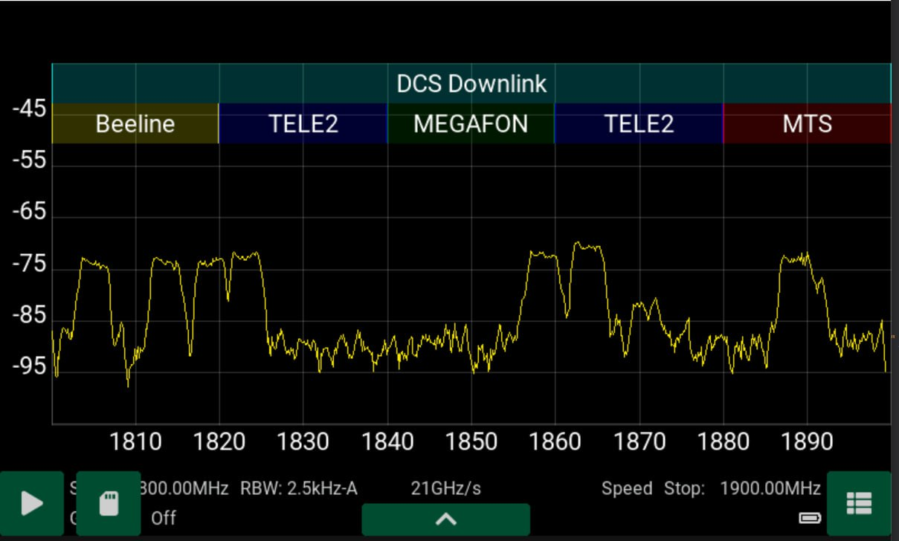

# Сохранение логов на microSD карту

* Вставить microSD карту стандарта SDHC с файловой системой FAT32 в слот устройства.
* Нажмите на клавишу паузы в левом нижнем углу экрана. Если вставленная карта памяти подходит для записи, появится клавиша с изображением SD карты. Нажмите на нее и введите имя для сохраняемого лога. После этого запись будет произведена по пути /SSA_RT_LOGS/<введенное имя>.

