# Анализаторы спектра ARINST SSA-TG R2, ARINST SSA R2, ARINST SSA-TG LC R2, ARINST SSA

В данном руководстве по эксплуатации изложена базовая информация, необходимая для проведения радиочастотных измерений с использованием анализаторов спектра Arinst. В документе подробно рассмотрены основные элементы управления прибором, приведены примеры калибровки и измерений.

В производственной линейке компании находятся несколько моделей анализаторов спектра в разных модификациях. Модели и их модификации проектируются с учетом потребностей различных групп потребителей.

Все анализаторы спектра Arinst могут управляться при помощи внешних устройств на базе операционной системы Android и Windows. Интерфейс программы управления прибором един для всех моделей анализаторов спектра Arinst.

Технические характеристики анализаторов спектра Arinst снятых с производства размещены в [ПРИЛОЖЕНИИ Б](#приложение-б) данного руководства по эксплуатации.

:::info
**Во избежание выхода из строя входной цепи усилителя анализатора спектра запрещается производить замер уровня сигнала вблизи источников сигнала мощностью свыше 1 Вт (базовые станции, мощные репитеры, ретрансляторы, Wi-Fi точки доступа).**

**Минимально допустимое расстояние от приемопередающих антенн источника сигнала до прибора должно быть не менее 30 метров.**

**При необходимости использования анализатора вблизи мощных источников сигналов необходимо использовать внешние аттенюаторы от 10 до 30 дБ.**

:::

## ***Назначение***

1. Портативные анализаторы спектра **Arinst SSA-TG R2**, **Arinst SSA Pro R2** и **Arinst SSA Lite R2** (далее анализатор, прибор) предназначены для отображения спектров сигналов в диапазоне частот 35-6200 МГц.

   Анализатор спектра **Arinst SSA TG LC R2** предназначен для отображения спектров сигналов в диапазоне частот 36-5990 МГц.

   Прибор отображает спектры сигналов всех распространенных технологий: Wi-Fi, 2G, 3G, 4G, LTE, CDMA, DCS, GSM, GPRS, ГЛОНАСС и т.п. Данный прибор предназначен для бытового применения, так как в нем используется математический метод подавления зеркального канала.
2. Прибор предназначен для определения амплитуды и частоты спектральных компонент входящих в состав сигнала.
3. Наличие встроенного генератора сигналов, в анализаторах **Arinst SSA-TG R2** и **Arinst SSA TG LC R2** позволяет производить замеры АЧХ активных/пассивных устройств (усилителей, репитеров, фильтров) и измерять коэффициент отражения, коэффициент стоячей волны (КСВ).
4. Прибор предназначен для работы в диапазоне температур окружающей среды от 0 до +50°С и относительной влажности воздуха не более 75%.
5. Анализатор не предназначен:

   • для работы на открытых площадках во время снегопада или дождя;

   • в местах с коррозионно или взрывоопасной средой (пыль, пар, газ);

   • для использования людьми (включая детей), у которых есть физические, нервные или психические отклонения или недостаток опыта и знаний, препятствующие безопасной эксплуатации прибора без надзора или обучения;

   • использования детьми для игр.

## ***Технические характеристики***

Технические характеристики анализаторов спектра **Arinst** приведены в таблицах 1 и 2.

Таблица 1 – Характеристики **Arinst SSA-TG R2**, **Arinst SSA Pro R2** и **Arinst SSA Lite R2**

| Наименование параметра | Arinst SSA TG R2 | Arinst SSA Pro R2 | Arinst SSA Lite R2 |
|----|:---:|:---:|:---:|
| Отображаемый диапазон частот | 35-6200 МГц | 35-6200 МГц | 35-6200 МГц |
| Изменяемый диапазон частот | 35-4500 МГц | 35-4500 МГц | 35-4500 МГц |
| Динамический диапазон для полосы 35-3000 МГц | 75 дБ | 75 дБ | 75 дБ |
| Динамический диапазон для полосы 3000-4500 МГц | 70 дБ | 70 дБ | 70 дБ |
| Максимальная полоса обзора | 6165 МГц | 6165 МГц | 6165 МГц |
| Полоса пропускания (ПЧ) фиксированная | 200 кГц | 200 кГц | 200 кГц |
| Скорость сканирования при полосеобзора более 100 МГц | 700 МГц/с | 700 МГц/с | 700 МГц/с |
| Время обзора в полосе 100 МГц | < 0.25 с | < 0.25 с | < 0.25 с |
| Мин. длительность обнаруживаемогосигнала при полосе сканирования 10 МГц | 20 мс | 20 мс | 20 мс |
| Полка шума в полосе до 3000 МГц | < -100 дБм | < -100 дБм | < -100 дБм |
| Полка шума в полосе 3000-4500 МГц | < -95 дБм | < -95 дБм | < -95 дБм |
| Полка шума в полосе 4500-6200 МГц | < -90 дБм | < -90 дБм | < -90 дБм |
| Волновое сопротивление  | 50 Ом | 50 Ом | 50 Ом |
| КСВ в рабочем диапазоне частот | < 1.5 | < 1.5 | < 1.5 |
| Внутренний аттенюатор | 0-30 дБ | 0-30 дБ | 0-30 дБ |
| Ошибка при аттенюации до 10 дБ | 2 дБ | 2дБ | 2дБ |
| Ошибка при аттенюации от 10 до 20 дБ | 5 дБ | 5 дБ | 5 дБ |
| Ошибка при аттенюации от 20 до 30 дБ | 8 дБ | 8 дБ | 8 дБ |
| Диапазон частот встроенноготрекинг-генератора | 35-6200 МГц | - | - |
| Выходная мощность трекинг-генератора | -15…-25 дБм | - | - |
| Точность отображения сигнала впределах динамического диапазона | 2 дБ | 2 дБ | 2 дБ |
| Максимальная входная мощность при аттенюаторе 0 дБ | + 10 дБм | + 10 дБм | + 10 дБм |
| Максимальная входная мощность при аттенюаторе > 20 дБ | + 20 дБм | + 20 дБм | + 20 дБм |
| Максимальный входной измеряемый сигнал | + 10 дБм | + 10 дБм | + 10 дБм |
| Максимальное постоянное напряжениена входе | 25 В | 25 В | 25 В |
| Максимальный потребляемый ток при работе от аккумулятора | 450 мА | 350 мА | 350 мА |
| Максимальный потребляемый токпри работе от USB (в режиме зарядки) | 500 мА | 500мА | 500 мА |
| Ёмкость аккумулятора | 2000 мА∙ч | 2000 мА∙ч | 2000 мА∙ч |
| Время непрерывной работы от аккумулятора | 3 ч | 4 ч  | 4 ч |
| Время заряда аккумулятора | \~5 ч  | \~5 ч | \~5 ч |
| Габаритные размеры (ДхШхВ) | 155х81х27 мм | 155х81х27 мм | 155х81х27 мм |
| Масса | 0.4 кг | 0.4 кг | 0.4 кг |

Таблица 2 – Характеристики **Arinst SSA-TG LC R2**

| Наименование параметра | Значения |
|----|:---:|
| Отображаемый диапазон частот | 36-5990 МГц |
| Измеряемый диапазон частот | 36-3000 МГц |
| Динамический диапазон для полосы 36-3000 МГц | 70 дБ |
| Максимальная полоса обзора | 5954 МГц |
| Полоса пропускания (ПЧ) фиксированная | 250 кГц |
| Время обзора в полосе 100 МГц | <0.1 с |
| Мин. длительность обнаруживаемого сигналапри полосе сканирования 10 МГц | 20 мс |
| Полка шума в полосе 36-3000 МГц | < -95 дБм |
| Волновое сопротивление | 50 Ом |
| КСВ в рабочем диапазоне частот | < 1.5 |
| Внутренний аттенюатор | 0-30 дБ |
| Ошибка про аттенюации до 10 дБ | 2 дБ |
| Ошибка при аттенюации от 10 до 20 дБ | 5 дБ |
| Ошибка при аттенюации от 20 до 30 дБ | 8 дБ |
| Диапазон частот встроенного трекинг-генератора  | 36-5990 МГц |
| Выходная мощность трекинг-генератора | -15…-25 дБм |
| Точность отображения сигнала в пределахдинамического диапазона | 2 дБ |
| Максимальная входная мощность при аттенюаторе 0 дБ | +10 дБм |
| Максимальная входная мощность при аттенюаторе > 20 дБ | +20 дБм |
| Максимальный входной измеряемый сигнал | +10 дБм |
| Максимальное постоянное напряжение на входе | 25 в |
| Максимальный потребляемый ток при работе от USB | 350 мА |
| Габаритные размеры (ДхШхВ) | 88х81х27 мм |
| Масса | 0.13 кг |

:::tip
Технические характеристики анализаторов спектра Arinst снятых с производства размещены в **[ПРИЛОЖЕНИИ Б](#приложение-б)** данного руководства по эксплуатации.

:::

## ***Комплектность***

Комплекты поставки приборов приведены в таблицах 3 и 4.

Таблица 3 – Комплект поставки **Arinst SSA-TG R2**, **Arinst SSA Pro R2** и **Arinst SSA Lite R2**

| Наименование | ArinstSSA-TG R2 | ArinstSSA Pro R2 | ArinstSSA Lite R2 |
|----|:---:|:---:|:---:|
| Анализатор спектра | 1 шт. | 1 шт. | 1 шт. |
| Переходник SMA (male) - SMA (female) | 2 шт. | 1 шт. | 1 шт. |
| Переходник SMA (male) - F (female) | - | 1 шт. | - |
| Переходник SMA (male) - N (female) | - | 1 шт. | - |
| Аттенюатор 30 дБ SMA-50-30-2 | - | 1 шт. | - |
| Кабель mini-USB - USB 2.0 | 1 шт. | 1 шт. | 1 шт. |
| Паспорт | 1 экз. | 1 экз. | 1 экз. |
| Упаковка | 1 шт. | 1 шт. | 1 шт. |

Таблица 4 – Комплект поставки **Arinst SSA-TG LC R2**

| Наименование | Количество |
|----|:---:|
| Анализатор спектра | 1 шт. |
| Переходник SMA (male) - SMA (female) | 2 шт. |
| Кабель mini-USB - USB 2.0 | 1 шт. |
| Паспорт | 1 экз. |
| Упаковка | 1 шт. |

:::tip
Комплекты поставки анализаторов спектра Arinst снятых с производства размещены в [ПРИЛОЖЕНИИ Б](#приложение-б) данного руководства по эксплуатации.

:::

:::info
В связи с постоянным совершенствованием конструкции и программного обеспечения, производитель оставляет за собой право вносить изменения в схему, технические характеристики и комплектность данного прибора.

:::

## ***Правила безопасности при работе с прибором***

### ***Общие требования к безопасности***

* К работе с прибором допускаются лица, ознакомившиеся с настоящим «Руководством по эксплуатации» и прошедшие инструктаж по правилам безопасной работы с электроприборами.
* Вероятность получения травмы возможна при подключении или отключении зарядного устройства в электрическую сеть. Пользуйтесь исправными розетками и зарядными устройствами.
* Во избежание повреждения проводов и разъёмов прибора, запрещается вешать что-либо на провода, закрашивать и заклеивать провода и разъемы, производить отсоединения проводов дергая за шнур.
* Лицам, пользующимся прибором, категорически запрещается: передавать прибор посторонним, разбирать и производить какой-либо не согласованный с производителем ремонт прибора, пользоваться прибором с поврежденным корпусом.
* Обнаружив неисправность, немедленно прекратите работу и выключите прибор.
* При необходимости отлучиться с рабочего места, отключите прибор и другие устройства. Не оставляйте работающий прибор без присмотра!
* Не используйте прибор в больницах. Использование прибора вблизи медицинского оборудования допускается, только с согласия медперсонала.

### ***Дополнительные требования безопасности***

* Используйте прибор только по назначению. Ознакомьтесь с назначением, устройством и техническими характеристиками прибора.
* Работая с прибором, сохраняйте равновесие и устойчивую позу. Двигайтесь медленно, не бегите.
* Избегайте работы на открытых пространствах во время снегопада или дождя. Повышенная влажность и все виды жидкости, попав внутрь прибора, могут вывести его из строя.
* Не подвергайте прибор воздействию очень низких и очень высоких температур, воздействие экстремальных температур могут привести к повреждению встроенного аккумулятора.
* Не используйте прибор в местах с коррозионно - и взрывоопасной средой. Агрессивные пары способны разрушать изоляцию, что может привести к выходу прибора из строя.
* Не переносите прибор за подключенные к нему кабели и провода, не отсоединяйте разъемы, дергая за кабель или шнур.
* Не прилагайте чрезмерных усилий к кнопкам управления и экрану прибора.
* Избегайте ударов и падений прибора. При падении прибор может быть поврежден.
* Не разбирайте и не модифицируйте прибор без согласования с производителем или вне описанных в данной инструкции действий. Некорректное самостоятельное вмешательство в прибор приведет к потере гарантии.
* Не разрешайте детям играть с прибором, поскольку они могут пораниться или поранить других, или вывести прибор из строя.
* Используйте зарядные устройства, шнуры, переходники и пр. принадлежности рекоменованные производителем.
* При подключении к прибору других устройств, внимательно ознакомьтесь с их назначением, техническими характеристиками и правилами безопасности в их руководствах по эксплуатации. Не подключайте несовместимые устройства.
* Техническое обслуживание и ремонт прибора должны выполняться только производителем или уполномоченным сервисным центром.

## ***Устройство прибора***

Устройство анализаторов спектра **Arinst SSA-TG R2**, **Arinst SSA Pro R2** и **Arinst SSA Lite R2** показано на рисунках 1 - 3.

 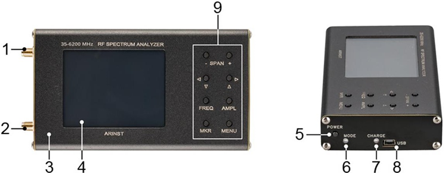

 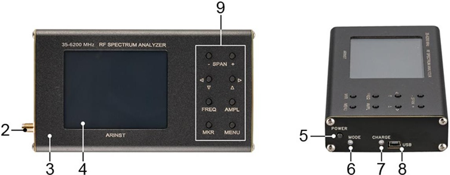

1. Выход генератора сигнала **TG OUT;**
2. Антенный вход **RF IN;**
3. Корпус;
4. Цветной резистивный экран 3,2'';
5. Кнопка включения/выключения прибора **POWER;**
6. Индикатор режима работы прибора **MODE;**
7. Индикатор зарядки аккумулятора **CHARGE;**
8. Разъем mini-USB;
9. Блок кнопок управления.

    Блок кнопок управления анализаторов спектра **Arinst SSA-TG R2**, A**rinst SSA Pro R2** и **Arinst SSA Lite R2** показан на рисунке 3.

    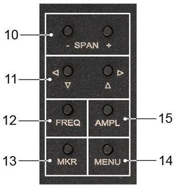

10. **«SPAN»** (диапазон частот обзора) - кнопками «-» и «+» производится изменение диапазона частот обзора анализируемого сигнала.
11. Кнопки перемещения масштабной сетки экрана и изменения частоты.
12. **«FREQ» -** вывод частотных параметров на экран. Длительное, (более 2 секунд) удержание кнопки, открывает меню установки диапазона частот обзора.
13. **«MKR»** - установка маркеров. Длительное, (более 2 секунд) удержание кнопки, открывает меню установки маркеров и пиковых значений анализируемого сигнала.
14. **«MENU»** - кнопка открывает главное меню прибора.
15. **«AMPL»** - вывод амплитудных параметров на экран. Длительное, (более 2 секунд) удержание кнопки, открывает меню установки амплитудных параметров.

Устройство анализатора спектра **Arinst SSA-TG LC R2** показано на рисунке 4.

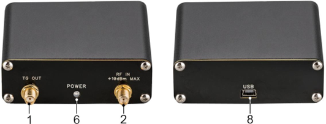

1. Выход генератора сигнала **TG OUT;**
2. Антенный вход **RF IN;**
3. Индикатор режима работы прибора **POWER;**
4. Разъем mini-USB.

:::info
Устройство и внешний вид анализаторов спектра снятых с производства приведено в [Приложении Б](#приложение-б) к настоящему руководству по эксплуатации.

:::

## ***Включение***

:::warning
Использование прибора на открытых пространствах во время снегопада или дождя запрещается. Если прибор внесен в зимнее время из холодного помещения, или с улицы в теплое помещение, не включайте его в течение времени, достаточного для испарения конденсата из прибора.

Соотносите напряжение и мощность входного сигнала с максимальными техническими характеристиками прибора указанными в таблицах 1 и 2.

:::

### ***Включение приборов***

* Убедитесь в том, что прибор не имеет внешних повреждений и аккумулятор заряжен. Разряженный аккумулятор зарядите перед использованием прибора, руководствуясь указаниями пункта [Зарядка аккумулятора](#зарядка-аккумулятора).
* Для включения **Arinst SSA-TG R2**, **Arinst SSA Pro R2** и **Arinst SSA Lite R2** нажмите и удерживайте кнопку (5) **«POWER»** в течение 1-2 секунд. Светодиодный индикатор режима работы (6) **«MODE»** будет мерцать сериям вспышек. Экран (4) включится, и на нем будет отображаться график спектра анализируемого сигнала.
* Анализатор спектра **Arinst SSA-TG LC R2** не имеет собственного автономного источника питания. Питание прибора осуществляется от источника питания (аккумулятора) смартфона или планшета к которому он подключен или от блока питания ПК или ноутбука.
* Прибор управляется смартфоном или планшетом под управлением ОС Android версии 4.1 и выше, поддерживающим стандарт USB OTG. Так как анализатор спектра не имеет собственного источника питания, питание прибора производится от источника питания (аккумулятора) смартфона или планшета к которому он подключен. Все измеренные прибором данные, в реальном времени передаются в смартфон или планшет через USB OTG кабель и отображаются на экране.
  * **Подключение анализатора спектра к смартфону или планшету**. Убедитесь в том, что ваш смартфон или планшет управляются операционной системой Android версии не ниже 4.1 и поддерживают стандарт USB OTG. Вам понадобится USB OTG кабель. Соедините USB OTG кабелем mini-USB разъем прибора с micro-USB разъемом вашего смартфона или планшета. Свечение индикатора режима работы прибора (6) **«POWER»** подтверждает подачу питания и включение анализатора.
* Прибор может управляться ПК или ноутбуком, работающим под ОС Windows 7 и выше. Питание, управление прибором и передача данных осуществляется по USB-кабелю.
  * **Подключение анализатора спектра к ПК или ноутбуку**. Подключите USB-кабелем из комплекта поставки mini-USB разъем прибора к USB разъему компьютера или ноутбука. Светодиодный индикатор режима работы (6) **«POWER»** загорится, анализатор включится.

:::info
Описание интерфейса программы управления прибором при помощи устройств на базе операционной системы Android и Windows размещено в разделе 8 настоящего руководства по эксплуатации. Подробный алгоритм подключения анализатора спектра к устройствам под управлением операционной системой Windows изложен в [Приложении А](#приложение-а) настоящего руководства по эксплуатации.

:::

### ***Выключение прибора***

* Для выключения **Arinst SSA-TG R2**, **Arinst SSA Pro R2** и **Arinst SSA Lite R2**, нажмите и удерживайте кнопку (5) **«POWER»** течение 1-2 секунд. Светодиодный индикатор режима работы (6) **«MODE»** и экран (4) погаснут. Прибор выключится.
* Сведения по установке автоматического отключения прибора, находятся в пункте **Меню управления прибором при помощи других устройств**. 6.2.3. Для выключения анализатора Arinst SSA-TG LC R2, отключите его от вашего смартфона или планшета (компьютера или ноутбука). Индикатор режима работы (6) «POWER» погаснет, при- бор выключится.

## ***Экран прибора***

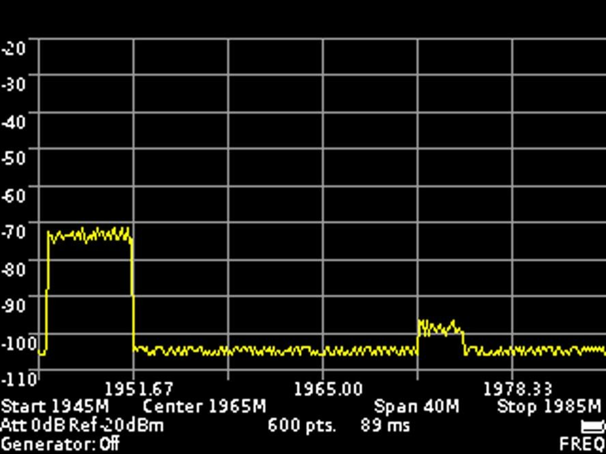

### ***Сетка экрана и информационная надпись***

* Экран прибора разграфлен масштабной сеткой, состоящей из горизонтальных и вертикальных линий. Горизонтальная ось калибруется по частоте, которая линейно увеличивается слева направо. Вертикальная ось калибруется по амплитуде. Устанавливается логарифмическая шкала, калиброванная либо в децибелах на милливатт (dBm), либо в децибелах на микровольт (dBuV).
* В нижней части экрана расположена информационная надпись, на которой отображаются текущие настройки прибора и параметры диапазона частот обзора, анализируемого сигнала.

  Например, на рисунке 5, начальная частота исследуемого сигнала **«Start»** составляет 1945 МГц, конечная частота **«Stop»** равна 1985 МГц. Диапазон обзора частот **«Span»** составляет 40 МГц, центральная частота **«Center»** составляет 1965 МГц. Внутренний аттенюатор **«Att»** установлен на значение 0 dB, максимальный уровень входного гармонического сигнала **«Ref»** установлен на уровне -20 dBm, встроенный генератор сигнала **«Generator»** отключен **(Off)**. Также на экране отображаются: число точек сканирования **«pts»** и время сканирования миллисекундах **«ms»**.

  В правом нижнем углу отображается степень разряда аккумулятора.
* Для перемещения масштабной сетки экрана вверх-вниз (по амплитуде), коротко нажмите кнопку (15) **«AMPL»** на блоке кнопок. В правом нижнем углу экрана появится надпись **«AMPL»**. Кнопами перемещения (11) переместите сетку экрана верх-вниз.
* Для перемещения масштабной сетки экрана влево-вправо (по частоте), коротко нажмите кнопку (12) **«FREQ»** на блоке кнопок. В правом нижнем углу экрана появится надпись **«FREQ»**. Кнопками перемещения (11) переместите сетку экрана влево-право.

:::info
При перемещении масштабной сетки влево-вправо (по частоте), заданный диапазон обзора частот **«Span»** не изменяется. Изменяются значения начальной **«Start»**, конечной **«Stop»** и центральной **«Center»** частот измеряемого сигнала.

:::

* Для перемещения маркеров (влево-вправо) по частоте, коротко нажмите кнопку (13) **«MKR»** на блоке кнопок. В правом нижнем углу экрана появится надпись **«МК 1»** (число – порядковый номер маркера). Кнопками перемещения (11) измените положение маркера. Если маркеров установлено более одного, то для переключения между ними коротко нажмите кнопку **«MKR»**. В правом нижнем углу экрана появится обозначение активного маркера **(МК 1 … МК 4)**. В верхнем левом углу экрана появится информация о мощности сигнала промаркированной частоты.

### ***Главное меню***

* Включите прибор в соответствии с разделом [Включение приборов](#включение-приборов) настоящего «Руководства». Для входа в главное меню, нажмите кнопку (14) **«MENU»** на блоке кнопок. На экране появится меню, как на рисунке 6.

 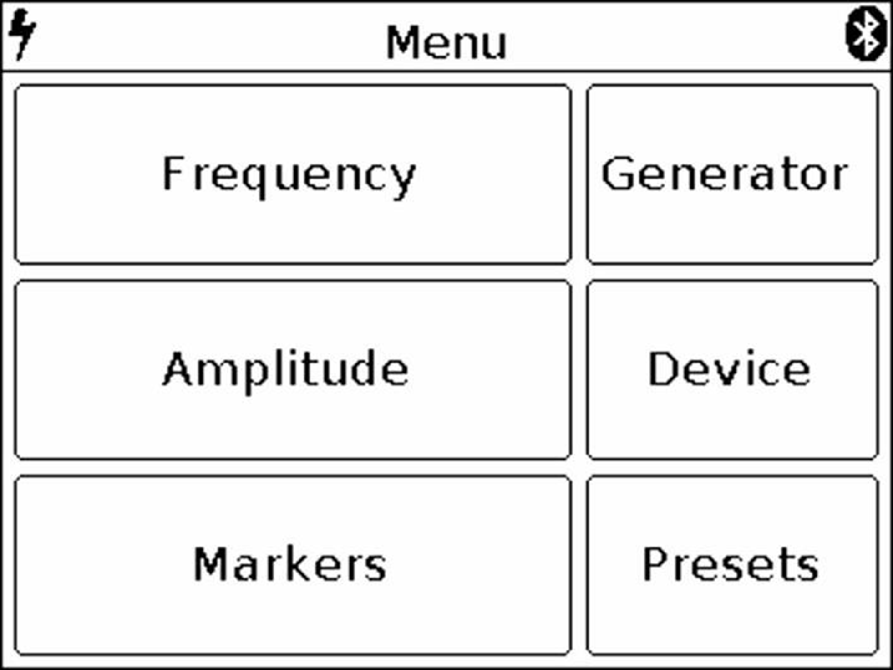

* Каждый из разделов главного меню имеет свое назначение:

  **Frequency** - подраздел меню, в котором устанавливается диапазон частот обзора анализируемого сигнала.

  **Amplitude** – подраздел меню, в котором производится установка амплитудных параметров (шаг и шкала экранной сетки, входное сопротивление, максимальный уровень входного гармонического сигнала).

  **Markers** – подменю, в котором устанавливаются визуальные маркеры амплитуды, на фиксированной частоте или по всему диапазону обзора частот исследуемого сигнала.

  **Generator** – меню включения генератора сигнала, установки мощности и частоты сигнала генератора. Также производятся измерение коэффициента стоячей волны (SWR) и снятие амплитудно-частотной характеристики тестируемого оборудования.

  **Device** - в данном меню устанавливается таймер отключения прибора, амплитудный и частотный сдвиг, указан серийный номер прибора, его версия и настройки подключения прибора через Bluetooth.

  **Presets** - меню для сохранения пользовательских предустановок.

* Для выхода из главного меню, нажмите кнопку (14) **«MENU»**.

### ***Установка диапазона частот обзора анализируемого сигнала***

* Для установки диапазона частот войдите в главное меню прибора (Рисунок 6), нажав кнопку (14) **«MENU»**. Выберите подраздел **Frequency**. На экране появится меню, как на рисунке 7.  
  :::info
  Для быстрого доступа к меню, нажмите и удерживайте около 2 секунд кнопку (12) **«FREQ»**.

  :::

* Каждая из опций подменю имеет свое назначение:

  **Center** – установка центральной частоты диапазона частот обзора анализируемого сигнала.

  **Span** – установка диапазона обзора частот.

  **Start** – установка начальной частоты измеряемого диапазона частот.

  **Stop** - установка конечной частоты измеряемого диапазона частот.

  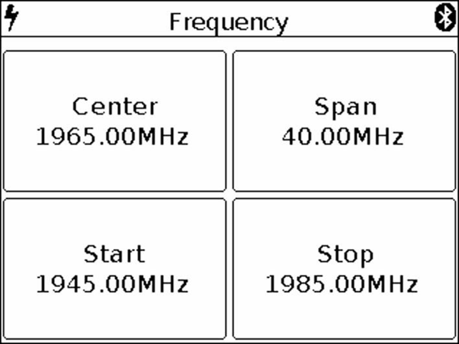

* Установка каждого из параметров производится вводом числового значения в открывшемся подменю, как на рисунке 8. Введите числовое значение частот и нажмите **Enter** (Ввод данных). Для удаления ошибочных или ранее введенных значений, нажмите **Del** (Удаление). Чтобы отказаться от ввода значения, нажмите **Cancel** (Отказ). *В нашем примере, на рисунке 8, установлен диапазон частот обзора шириной 40 МГц*.
* При анализе широких диапазонов частот **(Span)** более 40 МГц, для уменьшения времени анализа, сканирование по частоте производится с максимальным шагом. При этом погрешность измерения мощности сигнала может достигать 6 дБ. Данный режим служит для оперативного обнаружения сигналов и не предназначен для точных измерений мощности.

  Для повышения точности измерений до 3 дБ, необходимо уменьшить ширину диапазона частот обзора до значений менее 40 МГц. Дальнейшее уменьшение диапазона частот обзора приведет к уменьшению погрешности измерений.

 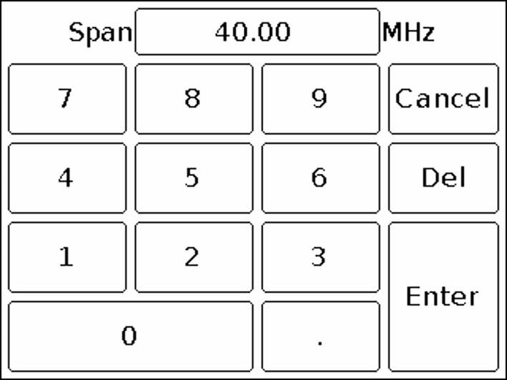

* Установка частотных параметров производится тремя способами:

  * Вводом начальной **Start** и конечной **Stop** частот, при этом центральная частота **Center** автоматически принимается равной их полусумме. Диапазон частот обзора **Span** автоматически принимается равной разности конечной и начальной частот.

  * Заданием центральной частоты **Center** и диапазона частот обзора **Span**. При этом начальная **Start** и конечная **Stop** частоты будут устанавливаться автоматически, как **Center ± Span / 2**.

  * Загрузкой пользовательских установок из меню Presets (см. п. [Меню пользовательских установок](#меню-пользовательских-установок)).

* Для выхода из меню установки диапазона частот в главное меню, нажмите кнопку (14) **«MENU»**.

### ***Установка основных параметров амплитуды анализируемого сигнала***

* Для установки амплитудных параметров исследуемых сигналов войдите в главное меню прибора (Рисунок 6), нажав кнопку (14) «MENU». Выберите подраздел Amplitude. На экране появится меню, как на рисунке 9.

:::info
Для быстрого доступа к меню, нажмите и удерживайте около 2 секунд кнопку (15) **«AMPL»**.

:::

 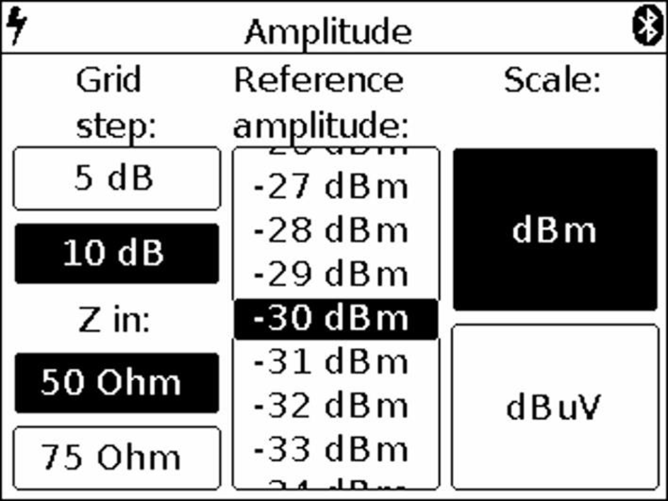

* В данном меню устанавливаются следующие параметры:

  **Grid step** – параметр, задающий шаг масштабной сетки экрана, по вертикальной оси. Возможна установка сетки с шагом 5 dB или 10 dB.

  **Z in** – параметр, определяющий входной/выходной импеданс. Используется при расчётах уровня входного сигнала приемника и выходного сигнала генератора (если он есть). При этом реальное значение импедансов составляет 50 Ом. Значение 50 или 75 Ом необходимо выбирать в зависимости от волнового сопротивления подключенной антенны/нагрузки.

  **Scale** – изменение градуировки вертикальной шкалы в величинах dBm или dBuV.

  **Reference amplitude** – параметр задающий максимальный уровень входного гармонического сигнала не вызывающего перегрузку приемника (максимальное отображаемое значение амплитуды). Устанавливается в зависимости от выбранного параметра калибровки вертикальной шкалы **Scale** в диапазоне от 10 до -75 dBm либо в диапазоне от 117 до 32 dBuV.
* Установка каждого параметра осуществляется нажатием на соответствующее значение меню, либо «прокруткой» значений до фиксированной выделенной области.
* Уровень ослабления входного сигнала (значение внутреннего аттенюатора) устанавливается автоматически, в зависимости от установленного значения **Reference amplitude**.

:::warning
При сильном превышении уровня входного сигнала над значением **Reference amplitude**. На экране устройства возникает предупреждающая надпись **Dynamic range exceeded**. В этом случае, корректное отображение уровня входного сигнала невозможно. В данном случае необходимо:

* увеличить значение **Reference amplitude** (произойдет включение внутреннего аттенюатора);
* использовать внешний аттенюатор.
* для выхода в главное меню нажмите кнопку (14) **«MENU»**.

:::

### ***Меню установки маркеров и пиковых значений сигнала***

* Для входа в меню установки маркеров и пиковых значений, войдите в главное меню прибора (Рисунок 6), нажав кнопку (14) **«MENU»**. Выберите подраздел **Markers**. На экране прибора появится меню, как на рисунке 10.

:::info
Для быстрого доступа к меню, нажмите и удерживайте около 2 секунд кнопку (13) **«MKR»**.

:::

 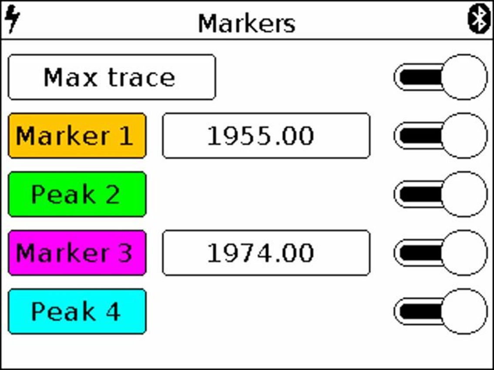

* В данном меню устанавливаются:

  **Max trace** – при включении этого режима, происходит отображение максимальных значений сигнала на экране и построение трассы красного цвета, по точкам максимальных значений. Для фиксации трассы включите паузу, коснувшись экрана прибора.

  **Min trace** – при включении этого режима, происходит отображение минимальных значений сигнала на экране и построение трассы зеленого цвета, по точкам минимальных значений. Для фиксации трассы включите паузу, коснувшись экрана прибора.

  При включении режима **Avg trace (Average)** произойдет построение трассы усредненных значений сигнала на экране. Количество измерений в данном режиме ограничено в диапазоне от 4 до 16. Для фиксации трассы включите паузу, коснувшись экрана прибора.

  В режиме **Waterfall**, под графиком спектра отображается частотно-временная диаграмма (ЧВД) сигнала. Частотно-временная диаграмма позволяет анализировать предысторию сигнала за некоторый интервал времени. За счет избирательности цветового восприятия человека, с помощью ЧВД возможно обнаружение сигналов на уровне шума.

 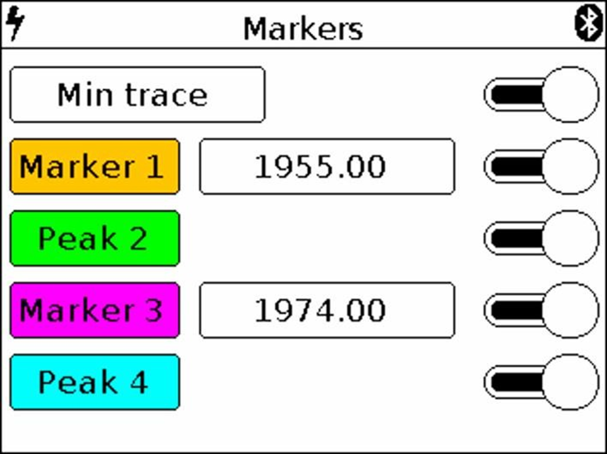

 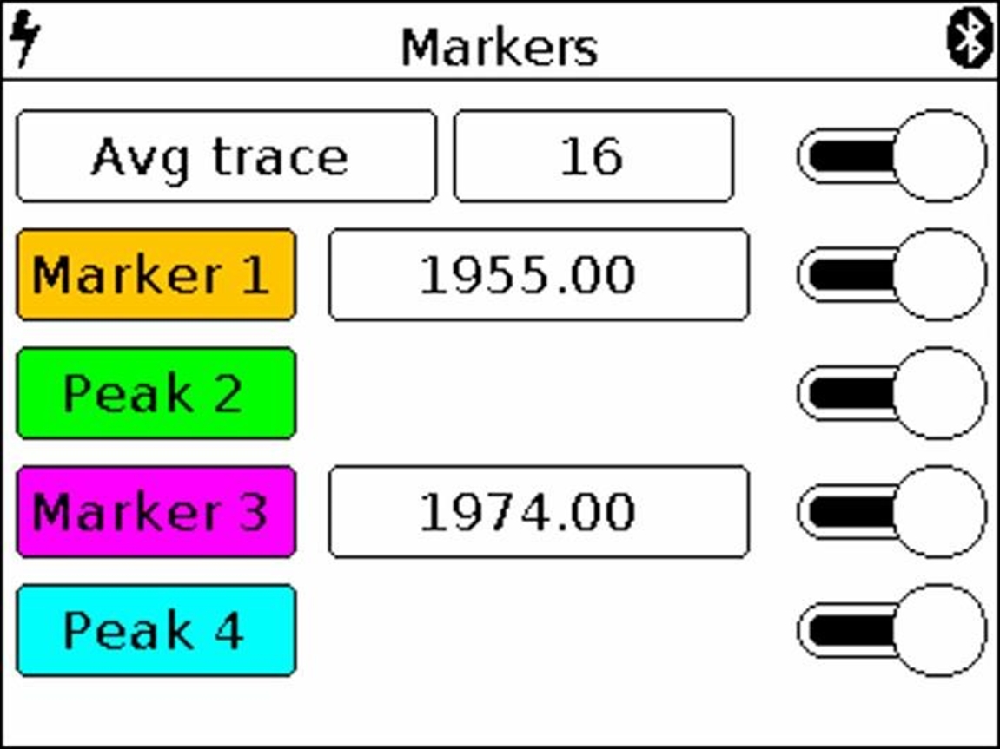

 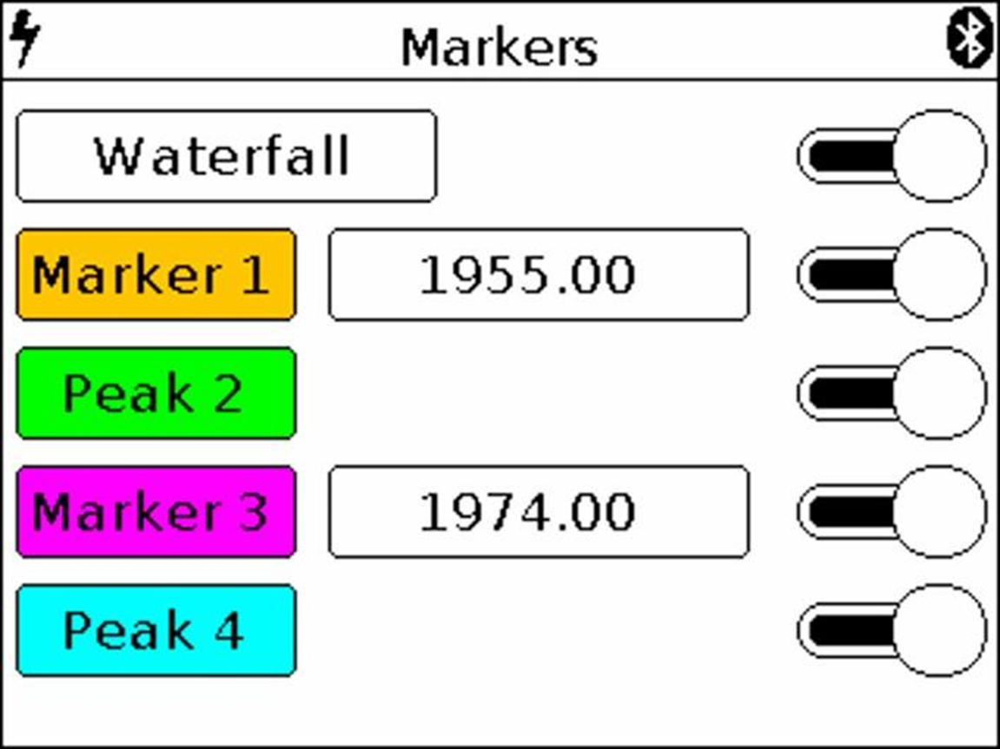

При включенном режиме **Waterfall**, на экране прибора под графиком спектра отображается частотно-временная диаграмма (Рисунок 11.1).

 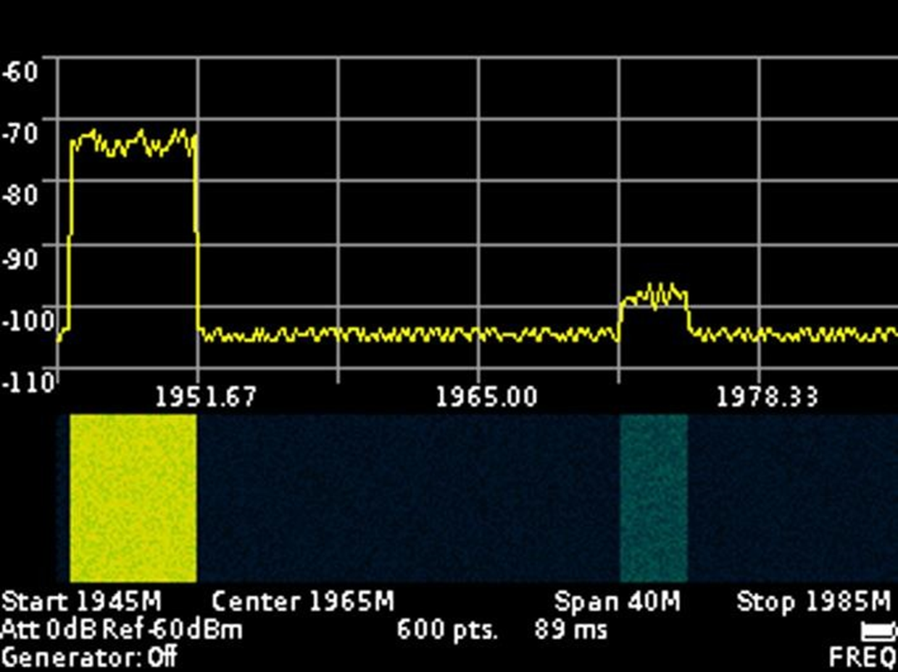

Включение или выключение режимов **Max trace**, **Min trace**, **Avg trace** и **Waterfall** производится перемещением выключателя вправо или влево напротив соответствующего режима.

**Marker** – визуальный индикатор амплитуды сигнала на заданной оператором частоте расположения маркера. Конструкция прибора, допускает использование до четырех разноцветных маркеров одновременно, для наблюдения за изменением амплитуд исследуемого сигнала на четырех заданных оператором частотах.

:::info
Также, маркер может быть переключен в режим отслеживания максимума сигнала (режим - **Peak**). До четырех пиков одновременного отслеживания на графике.

:::

**Peak** – визуальный индикатор максимальной величины амплитуды сигнала по всему диапазону обзора частот. Конструкция прибора допускает использование до четырех разноцветных пиковых индикаторов, для наблюдения за изменением амплитуд исследуемого сигнала по всему диапазону обзора заданного частотного диапазона.

* Установка заданной частоты маркера производится вводом числового значения в открывшемся подменю, как на рисунке 12. Введите числовое значение частоты и нажмите **Enter** (Ввод данных). Для удаления ошибочных или ранее введенных значений, нажмите **Del** (Удаление). Чтобы отказаться от ввода значения, нажмите **Cancel** (Отказ). В нашем примере, на рисунке 12, визуальный индикатор установлен на частоте 1960 МГц.
* Перемещение включенных маркеров по экрану в режиме реального времени, производите в соответствии с пунктом [Сетка экрана и информационная надпись](#сетка-экрана-и-информационная-надпись) настоящего «Руководства».
* При необходимости поиска и отслеживания максимальных (пиковых) значений амплитуды по всему диапазону исследуемого сигнала, необходимо переключить один или несколько индикаторов **Marker** на значение **Peak** нажав на кнопку маркера.

 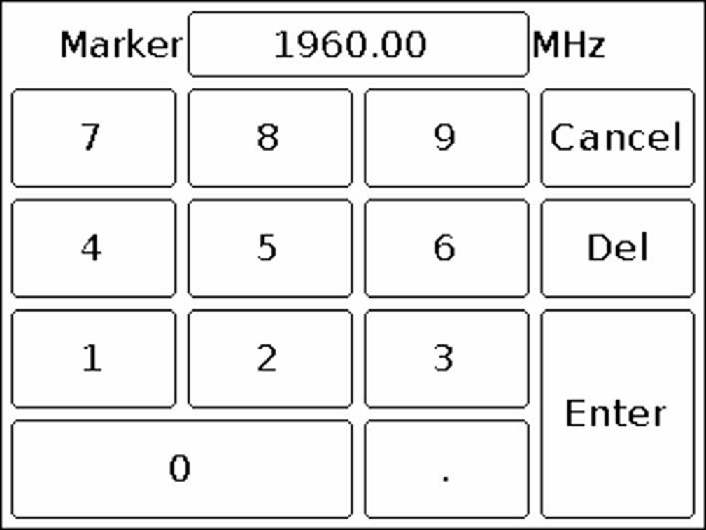

Включение или выключение режимов **Marker** и **Peak** производится перемещением выключателя вправо или влево напротив соответствующего режима.

* Для выхода из меню установки маркеров и пиковых значений сигнала, нажмите кнопку (14) **«MENU»**.

### ***Меню установки значений частоты и мощности выходного сигнала генератора***

* Для установки значений частоты и мощности выходного сигнала встроенного генератора, войдите в главное меню прибора (Рисунок 6), нажав кнопку (14) **«MENU»**. Выберите подраздел **Generator**, на экране появится меню как на рисунке 13.

 

* Для включения встроенного генератора выходного сигнала, передвиньте выключатель по экрану вправо. На экране откроются окна установки частоты **Frequency** и мощности **Power** выходного сигнала встроенного генератора, как на рисунке 14.

 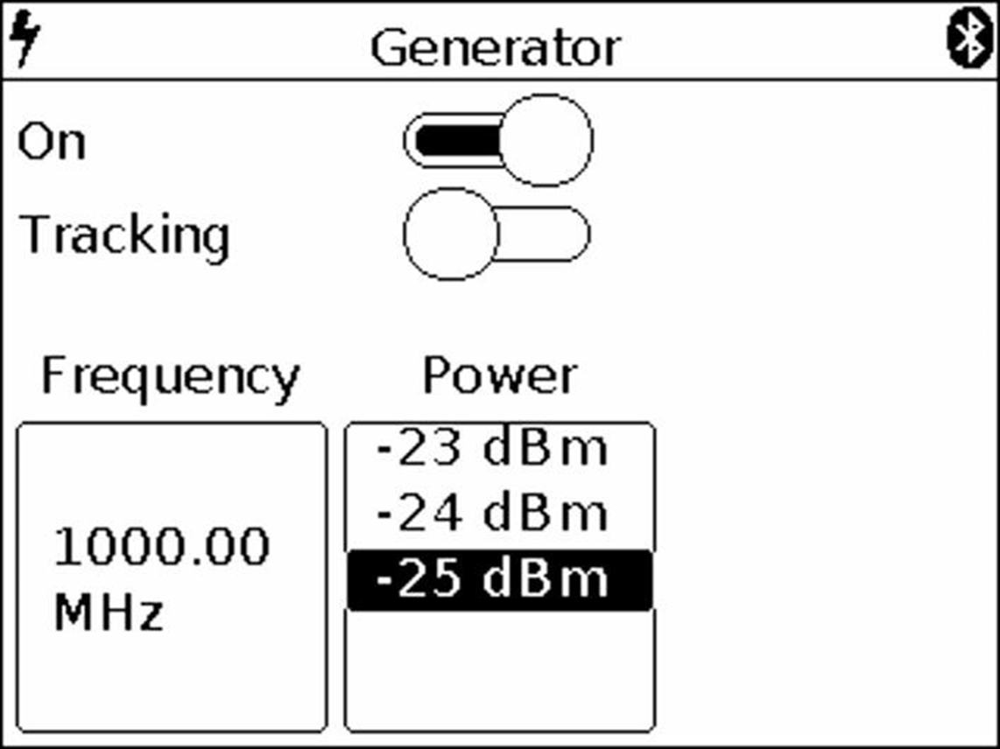

* Установка значения частоты выходного сигнала встроенного генератора **Frequency** производится вводом числового значения в открывшемся подменю, как на рисунке 15. Введите числовое значение частоты выходного сигнала генератора, в диапазоне от 35 до 6200 МГц и нажмите **Enter** (Ввод данных). Для удаления ошибочных или ранее введенных значений, нажмите **Del** (Удаление). Чтобы отказаться от ввода значения, нажмите **Cancel** (Отказ). В нашем примере, на рисунке 15 установлена частота выходного сигнала генератора равная 1000 МГц.

 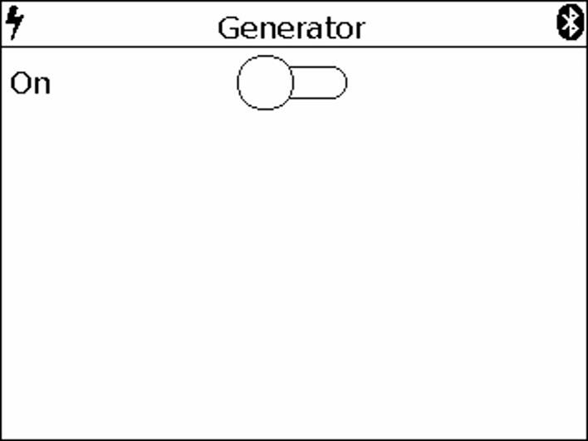

* В зависимости от оборудования, на которое подается выходной сигнал генератора, установите значение мощности сигнала в диапазоне от -15 до -25 dBm. Установка параметра, осуществляется «прокруткой» значений до фиксированной выделенной области (Рисунок 14).
* Для снятия амплитудно-частотной характеристики (АЧХ) и измерения коэффициента стоячей волны (КСВ) переместите выключатель вправо напротив параметра **Tracking** (Рисунок 14). На экране появится подменю установок, как на рисунке 16.

 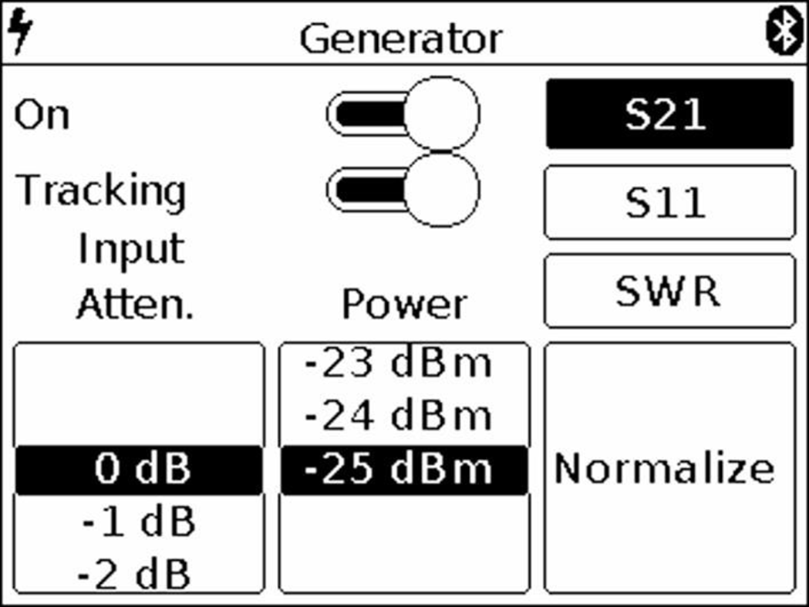

* Установите необходимый уровень ослабления сигнала входным аттенюатором **Input Atten**, в диапазоне от 0 до -30 dB. Установка параметра, осуществляется «прокруткой» значений до фиксированной выделенной области (Рисунок 16).

:::warning
**Использование малых значений входного аттенюатора требует особенной внимательности, так как сигнал мощностью превышающий 10 dBm, может привести к повреждению входной цепи прибора!**

:::

:::tip
При необходимости используйте внешние аттенюаторы.

:::

* Для снятия амплитудно-частотной характеристики тестируемого оборудования, выберите режим **S21**, как показано на рисунке 16. На экране под сеткой, в информационной надписи появится отображение режима **S21** и предупреждение **UNCAL** (не калибровано).

 

:::tip
При снятии АЧХ активных и пассивных устройств, рекомендуется использовать кабели с высоким коэффициентом экранирования. Этим будет обеспечена минимизация паразитного прохождения электромагнитной энергии с одного порта прибора на другой порт.

:::

Для снижения влияния соединительных проводов и разъемов, на результаты измерения, необходимо произвести нормализацию **Normalize** исследуемой цепи, без тестируемого оборудования. Для этого, следует соединить выход генератора сигналов (1) **TG OUT** с антенным входом (2) **RF IN** прибора между собой разъемами (кабелями), которые впоследствии будут использоваться для подключения к измеряемому устройству и нажать команду **Normalize**. По завершению этой операции, фон команды **Normalize** станет желтым, что будет подтверждать завершение операции нормализации. Для отмены нормализации, нажмите команду **Normalize** повторно. Фон команды вернется к первоначальному цвету фона меню.

На экране под сеткой в информационной надписи появится отображение режима **S21** и сообщение **Freq. Lock** (изменение частоты невозможно) (Рисунок 17).

:::tip
После проведения нормализации, установка диапазона частот исследуемого сигнала становится недоступной. Производите установку диапазона частот исследуемого сигнала до нормализации.

:::

Не выключая прибора, включите тестируемое оборудование в цепь. На экране прибора будет отображаться график амплитудно-частотной характеристики исследуемого оборудования в заданном диапазоне частот.

:::tip
При изменении элементов в цепи, к которой подключено тестируемое оборудование, следует провести нормализацию заново.

:::

**Измерение АЧХ активных устройств с известными мощностными характеристиками**.

Для измерения АЧХ активных устройств, таких как антенные усилители, с известными мощностными характеристиками, необходимо установить мощность сигнала генератора и уровень ослабления сигнала входным аттенюатором таким образом, чтобы уровень сигнала от внутреннего генератора устройства, до проведения операции нормализации находился на уровне -50-60 dBm.

:::tip
Более низкое значение уровня сигнала приведет к повышенной зашумленности и нелинейности измеряемого сигнала.  
После установки проведите нормализацию и снимите АЧХ активного устройства.

:::

**Измерение АЧХ активных устройств с неизвестными мощностными характеристиками**.

Установите минимальную выходную мощность внутреннего генератора и максимальное значение ослабления входного аттенюатора приемника прибора. При необходимости добавьте дополнительный внешний аттенюатор. Проведите операцию нормализации и подключите исследуемое устройство в цепь. При необходимости, снизьте уровень ослабления сигнала аттенюаторами. При изменении внешнего аттенюатора, проведите операцию нормализации заново.

:::warning
При сильном превышении уровня входного сигнала, на экране устройства возникает предупреждающая надпись **Dynamic range exceeded**. В этом случае, корректное отображение уровня входного сигнала невозможно. В данном случае необходимо увеличить уровень ослабления сигнала внешними аттенюаторами**.**

**Использование малых значений входного аттенюатора требует особенной внимательности, так как сигнал мощностью превышающий 10 dBm, может привести к повреждению входной цепи прибора!**

:::

* Для выхода из меню установки частоты и мощности выходного сигнала генератора, нажмите кнопку (14) **«MENU»**.

### ***Установка параметров и измерение коэффициента отражения S11***

:::warning
Прибор в режиме измерений параметра S11 использует скалярную SOL калибровку. Данные измерения не являются векторными, то есть обеспечивают компенсацию только амплитуды сигнала без учета фазы.

:::

Алгоритм скалярной калибровки следующий - S11corr = (S11open + S11short)/2;

S11 = S11measure - S11corr.

При этом минимальный уровень измеренного коэффициента S11 задается калибровкой S11load.

То есть S11min = S11load - S11corr;

Представленный ниже график коэффициента отражения как раз это подтверждает.

* Для измерения коэффициента отражения, необходимо выбрать режим S11 (Рисунок 18).

 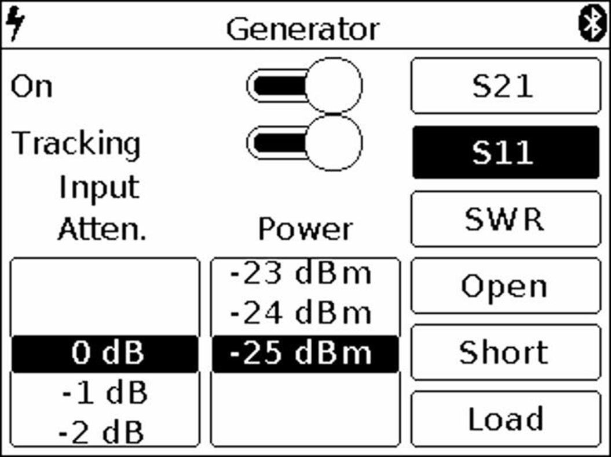

:::tip
Коэффициент отражения S11 будет отображен графиком в логарифмической сетке с вертикальной осью в dB. По горизонтальной оси отображается заданный диапазон частот сигнала.

:::

* Установите необходимый уровень ослабления сигнала входным аттенюатором   **Input Atten**. в диапазоне от 0 до -30 dB. Установка параметра, осуществляется «прокруткой» значений до фиксированной выделенной области.

:::warning
**Использование малых значений входного аттенюатора требует особенной внимательности, так как сигнал мощностью превышающий 10 dBm, может привести к повреждению входной цепи прибора!**

:::

:::tip
При необходимости используйте внешние аттенюаторы.

:::

* В зависимости от оборудования, на которое подается выходной сигнал генератора, установите значение мощности сигнала в диапазоне от -15 до -25 dBm. Установка параметра, осуществляется «прокруткой» значений до фиксированной выделенной области.

:::tip
Для измерения коэффициента отражения **S11**, необходимо использовать направленный ответвитель или измерительный мост на соответствующий диапазон частот (не входит в комплект поставки). В нашем примере на рисунке 19 используется измерительный мост **KROKS KSB 2700** специально разработанный для применения с анализаторами спектра ARINST.

:::

* Выберите режим **S11**, в котором необходимо произвести измерения, как показано на рисунке 18. На экране под сеткой, в информационной надписи появится отображение режима **S11** и предупреждение **UNCAL** (не калибровано).
* Для снижения влияния соединительных проводов и разъемов на результаты измерений, необходимо произвести калибровку.

:::tip
Допускается выполнять калибровку один раз для режимов **S11** и **SWR**, при условии, что разъемы и кабели исследуемой цепи не меняются.

:::

Подключите выход генератора сигналов (1) **TG OUT** прибора, к входу измерительного моста **TO TG OUT** согласно схеме подключения на рисунке 19.

где:

| TG OUT - Выход генератора сигнала | Open - Нагрузка хода |
|----|----|
| RF IN - Антенный вход анализатора | Short - Нагрузка короткого замыкания |
| TO TG OUT - Вход измерительного моста | Load - Согласованная нагрузка  |
| TO RF IN - Выход измерительного моста | DUT - Исследуемо устройство |
| TEST - Измерительный порт |    |

 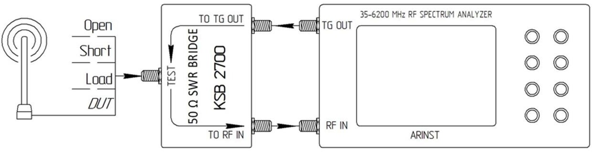

Выход отраженного сигнала от порта ответвителя **TO RF IN** подключите к антенному входу прибора (2) **RF IN**.

К входу **TEST** измерительного моста последовательно подключите нагрузки из стандартного набора калибровочных нагрузок (не входит в комплект поставки):

* холостого хода, и нажмите команду **Open** на экране;
* короткого замыкания, и нажмите команду **Short** на экране;
* согласованную нагрузку и нажмите команду **Load**.

После проведения калибровки, фон команд **Open**, **Short** и **Load** станет желтым. Для отмены калибровки, повторно нажмите на одну из команд **Open**, **Short** и **Load**. Желтый фон команды изменится на первоначальный цвет фона меню.

На экране под сеткой в информационной надписи появится отображение режима **S11** и сообщение **Freq. Lock** (изменение частоты невозможно) (Рисунок 20). Подключите исследуемое оборудование **(DUT)** к порту **TEST** измерительного моста и проведите измерения коэффициента отражения.

:::tip
После проведения калибровки, установка диапазона частот на котором исследуется коэффициент отражения, в режиме **S11** становится недоступной. Производите установку диапазона частот исследуемого сигнала до калибровки. При подключении других разъемов и кабелей, необходимо произвести калибровку повторно.

:::

 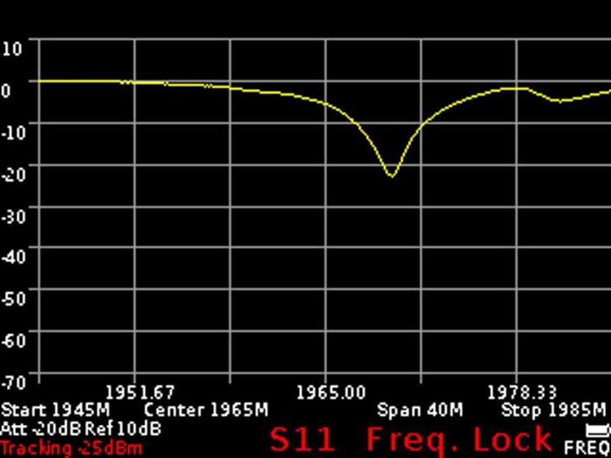

* Для выхода из меню измерений коэффициента отражения **S11**, нажмите кнопку (14) **«MENU»**.

### ***Установка параметров и измерение коэффициента стоячей волны SWR***

* Для измерения коэффициента стоячей волны, необходимо выбрать режим SWR (Рисунок 21). Коэффициент стоячей волны измеряется в режиме **SWR**. График будет отображен с вертикальной осью в виде числового коэффициента стоячей волны. По горизонтальной оси отображается заданный диапазон частот сигнала.

 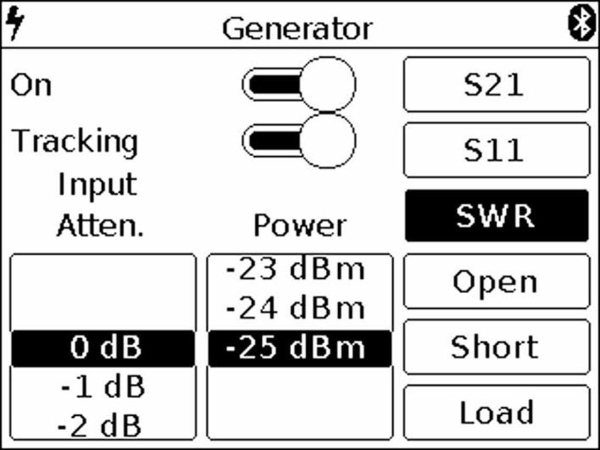

* Установите необходимый уровень ослабления сигнала входным аттенюатором **Input Atten**. в диапазоне от 0 до -30 dB. Установка параметра, осуществляется «прокруткой» значений до фиксированной выделенной области.

:::tip
При необходимости используйте внешние аттенюаторы.

:::

:::warning
**Использование малых значений входного аттенюатора требует особенной внимательности, так как сигнал мощностью превышающий 10 dBm, может привести к повреждению входной цепи прибора!**

:::

* В зависимости от оборудования, на которое подается выходной сигнал генератора, установите значение мощности сигнала в диапазоне от -15 до -25 dBm. Установка параметра, осуществляется «прокруткой» значений до фиксированной выделенной области.

:::tip
Для измерения коэффициента стоячей волны необходимо использовать направленный ответвитель или измерительный мост (не входит в комплект поставки). В нашем примере на рисунке 19 используется измерительный мост **KROKS KSB 2700** специально разработанный для применения с анализаторами спектра ARINST.

:::

* Выберите режим **SWR**, в котором необходимо произвести измерения, как показано на рисунке 21. На экране под сеткой, в информационной надписи появится отображение режима **SWR** и предупреждение **UNCAL** (не калибровано).
* Для снижения влияния соединительных проводов и разъемов на результаты измерений, необходимо произвести калибровку.

:::tip
Допускается выполнять калибровку один раз для режимов **SWR** и **S11**, при условии, что разъемы и кабели исследуемой цепи не меняются.

:::

Подключите выход генератора сигналов (1) **TG OUT** прибора, к входу измерительного моста **TO TG OUT** согласно схеме подключения на рисунке 19.

Выход отраженного сигнала от порта измерительного моста **TO RF IN** подключите к антенному входу прибора (2) **RF IN**. К входу измерительного моста **TEST** последовательно подключите нагрузки из стандартного набора калибровочных нагрузок (не входит в комплект поставки):

* холостого хода, и нажмите команду **Open** на экране;
* короткого замыкания, и нажмите команду **Short** на экране.
* согласованную нагрузку и нажмите команду **Load**.

После проведения калибровки, фон команд **Open**, **Short** и **Load** станет желтым. Для отмены калибровки, повторно нажмите на одну из команд **Open**, **Short** и **Load**. Желтый фон команды изменится на первоначальный цвет фона меню.

На экране под сеткой в информационной надписи появится отображение режима **SWR** и сообщение **Freq. Lock** (изменение частоты невозможно) (Рисунок 22). Подключите исследуемое оборудование **(DUT)** к порту **TEST** измерительного моста и проведите измерения коэффициента стоячей волны.

 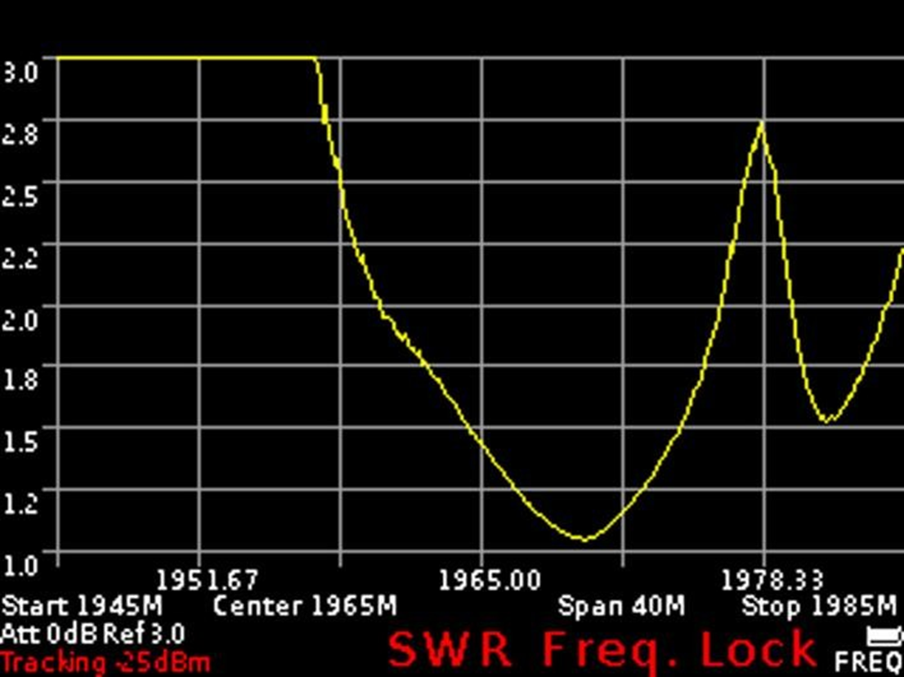

**Примечание**. После проведения калибровки, установка диапазона частот и значений амплитуды исследуемого сигнала в режиме **SWR** становится недоступной. Производите установку диапазона частот и значений амплитуды исследуемого сигнала до калибровки. При подключении других разъемов и кабелей, необходимо произвести калибровку повторно.

* Для выхода из меню измерений коэффициента стоячей волны **SWR**, нажмите кнопку (14) **«MENU»**.

### ***Меню управления прибором при помощи других устройств***

* Для подключения к прибору других устройств, войдите в главное меню (Рисунок 6), нажав кнопку (14) **«MENU»** и выберите подраздел **Device**. Появится меню установок, как на рисунке 23.

 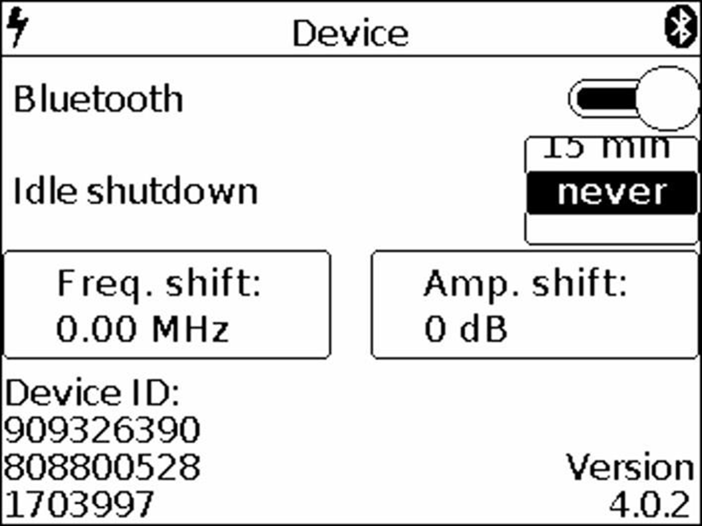

* Для управления прибором при помощи устройств, на базе Android (смартфон, планшетный ПК) используя протокол **Bluetooth**, необходимо передвинуть выключатель вправо.

:::tip
Для управления прибором, на вашем устройстве с операционной системой Android, должна быть установлена программа для управления анализатором спектра «Arinst SSA анализатор спектра». [Скачать программу "Arinst SSA" на Google Play](https://play.google.com/store/apps/details?id=com.arinst.ssa&pli=1). Для корректной работы с программой, операционная система Android вашего устройства должна быть не ниже версии 4.1 - 8.1. Связь между прибором и устройством под управлением операционной системы Android, будет осуществляться по протоколу Bluetooth, на расстоянии до 10 метров.

:::

* Для управления прибором при помощи компьютера или ноутбука под управлением операционной системы Windows, необходимо установить приложение «Arinst SSA». [Скачать программное обеспечение для управления анализатором спектра](https://arinst.ru/download-apk.php). Связь между прибором и ПК будет осуществляться через USB кабель или по протоколу Bluetooth.
* При использовании внешнего конвертера сигнала, для корректной индикации частоты входного сигнала, введите значение сдвига шкалы [Freq. shift](https://arinst.ru/download-apk.php). как показано на рисунке 24.

:::tip
Ввод значения сдвига частотной шкалы **Freq. shift** при включенном трекинг-генераторе прибора невозможен. Отключите трекинг-генератор перед вводом значения сдвига шкалы по частоте.

:::

 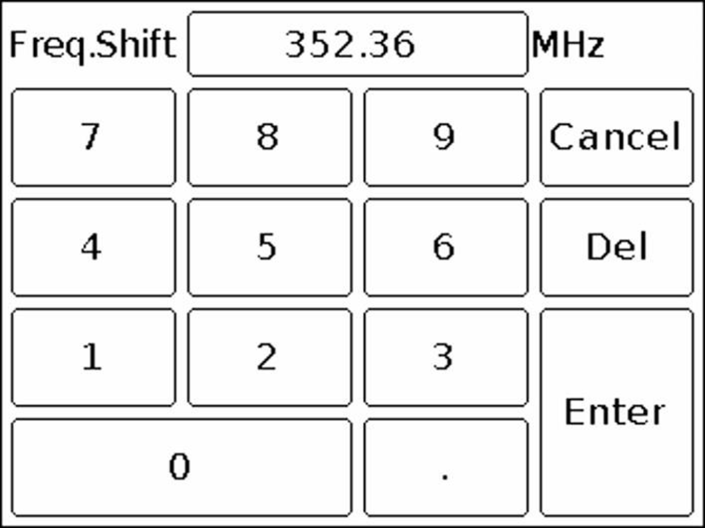

Установка значения сдвига шкалы входного сигнала по частоте **Freq. shift**, производится вводом числового значения в открывшемся подменю, как на рисунке 24. Введите числовое значение частоты и нажмите **Enter** (Ввод данных). Для удаления ошибочных или ранее введенных значений, нажмите **Del** (Удаление). Чтобы отказаться от ввода значения, нажмите **Cancel** (Отказ).

* При использовании внешних аттенюаторов или усилителей, для корректной индикации амплитуды входного сигнала, введите значение сдвига шкалы **Amp. shift** в dB, как показано на рисунке 25.

 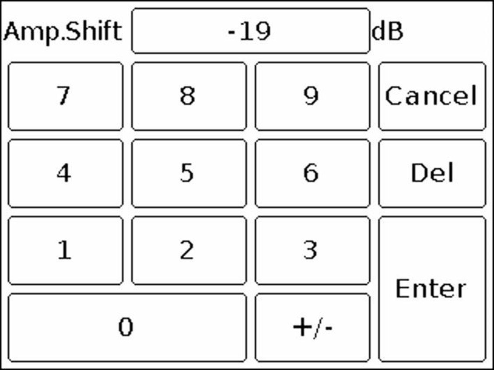

:::tip
Ввод значения сдвига амплитудной шкалы **Amp. shift** при включенном трекинг- генераторе прибора невозможен. Отключите трекинг-генератор перед вводом значения сдвига шкалы по амплитуде.

:::

Установка значения сдвига шкалы входного сигнала по амплитуде **Amp. shift**, производится вводом как положительного, так и отрицательного числового значения в dB, в открывшемся подменю, как на рисунке 25. Введите числовое значение аттенюации и нажмите **Enter** (Ввод данных). Для удаления ошибочных или ранее введенных значений, нажмите **Del** (Удаление). Чтобы отказаться от ввода значения, нажмите **Cancel** (Отказ).

:::tip
В зависимости от устройства преобразующего сигнал до входа приемника прибора, числовое значение аттенюации может вводиться как положительное, так и отрицательное (для удобства отображения реального графика сигнала, на логарифмической сетке прибора.).

:::

* При необходимости, установите таймер автоматического отключения прибора **Idle shutdown** в диапазоне от 3 до 15 минут с момента бездействия. Данная установка позволяет в значительной степени экономить заряд аккумулятора. Если нет необходимости в отключении прибора через определенный период времени бездействия, выберите параметр **never**. Установка времени бездействия прибора до момента автоматического отключения, производится «прокруткой» значений до фиксированной выделенной области.
* Для выхода в главное меню, нажмите кнопку (14) **«MENU»**.

### ***Меню пользовательских установок***

Для сохранения настроек сканирования спектра (диапазон частот, значение аттенюатора), настроек для тестирования оборудования (частота и мощность внутреннего генератора сигнала) и т.п., войдите в главное меню, нажав кнопку (14) **«MENU»** (Рисунок 6) и выберите подраздел **Presets**. На экране появится меню пользовательских установок, как на рисунке 26.

 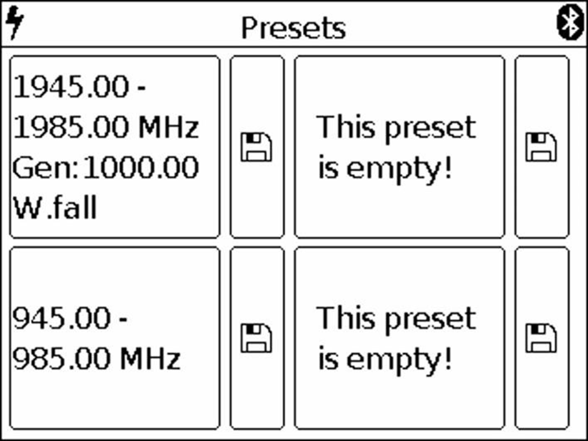

* Прибор позволяет сохранять в памяти до четырех пользовательских настроек. Для сохранения настроек, нажмите на изображение дискеты. В поле, слева от дискеты появится отображение ваших настроек (диапазон сканируемых частот, частота внутреннего генератора сигнала, настройки параметров измерения АЧХ и КСВ).
* Для сохранения новых настроек, нажмите на изображение дискеты, возле поля без настроек. В случае если все четыре поля заняты пользовательскими настройками, произведите перезапись, нажав на изображение дискеты возле устаревших или ненужных настроек.
* Чтобы активировать сохраненный режим с пользовательскими настройками, нажмите на поле с соответствующими характеристиками.
* Для выхода в главное меню, нажмите кнопку (14) **«MENU»**.

## ***Интерфейс программы управления прибором, при помощи устройств на базе операционной системы ANDROID***

### ***Требования к внешним устройствам***

* Для надежного и устойчивого соединения с прибором, устройства управляемые операционной системой Android должны соответствовать следующим требованиям:
  * операционная система Android версии 4.1 и выше;
  * установленное приложение «Arinst SSA анализатор спектра»;
  * наличие протокола обмена информацией Bluetooth 2.1 и выше.

### ***Подключение прибора к внешнему устройству***

* Включите ваше устройство, управляемое операционной системой Android (далее планшет/смартфон) и убедитесь, что на нем включена передача данных по протоколу Bluetooth.
* Запустите приложение «Arinst SSA анализатор спектра» (далее программа управления) на планшете/смартфоне. Если данная программа управления на планшете/смартфоне не установлено, необходимо ее скачать и установить. [Скачать программу "Arinst SSA" с Google Play](https://play.google.com/store/apps/details?id=com.arinst.ssa).
* Включите прибор, как указано в пункте [Включение прибора](#включение-приборов) настоящего «Руководства».
* Войдите в главное меню прибора, нажав кнопку (14) **«MENU»** (Рисунок 6) и выберите подраздел Device и включите передачу данных по протоколу Bluetooth, передвинув выключатель вправо, как указано в пункте [Меню управления прибором при помощи других устройств](#меню-управления-прибором-при-помощи-других-устройств) (Рисунок 23).
* В правом верхнем углу программы управления нажмите на символ Bluetooth. В появившемся окне программы, нажмите кнопку команду поиска устройств **Scan for devices**. Выберите в списке обнаруженных устройств ARINST_SSA и в открывшемся окне введите PIN-код 1234 и нажмите команду **ОК**, как показано на рисунке 27.

 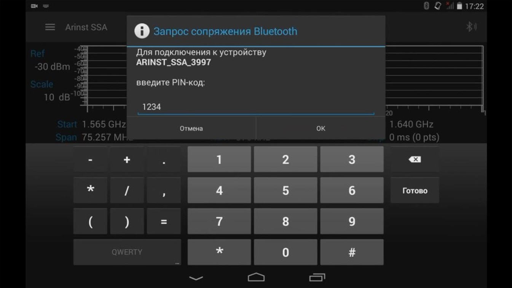

* Произойдет соединение прибора с планшетом/смартфоном, на экране появится график спектра сигнала и информационное сообщение о подключении к прибору **Connected to ARINST_SSA**, как на рисунке 28.

 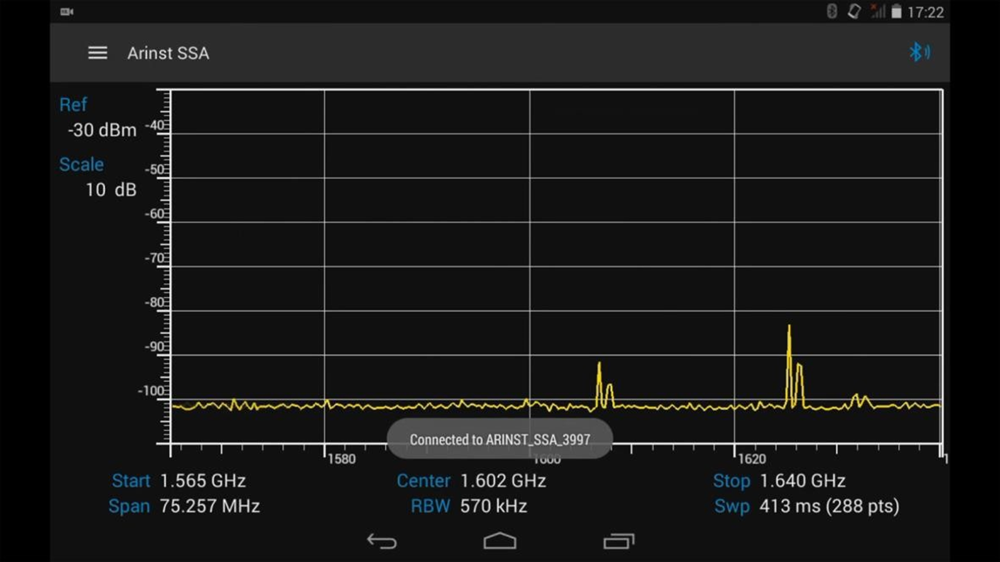

* Экран планшета/смартфона разграфлен масштабной сеткой, состоящей из горизонтальных и вертикальных линий. Горизонтальная ось калибруется по частоте, которая линейно увеличивается слева направо. Вертикальная ось калибруется по амплитуде. Устанавливается логарифмическая шкала, калиброванная в децибелах dB. Под сеткой отображаются значения начальной **Start** и конечной **Stop** частоты исследуемого сигнала, центральная частота **Center** и весь диапазон частот **Span** исследуемого сигнала. Отображается разрешение по частоте **RWB** и время сканирования заданного диапазона частот **Span** (количество точек (pts) за единицу времени в миллисекундах (ms)) **Swp**. Слева от сетки отображается шаг сетки **Scale** и верхняя граница логарифмической шкалы **Ref**.

### ***Главное меню программы управления***

* Для входа в главное меню, проведите пальцем слева направо от левого края экрана планшета/смартфона. Откроется главное меню программы управления, как на рисунке 29.

 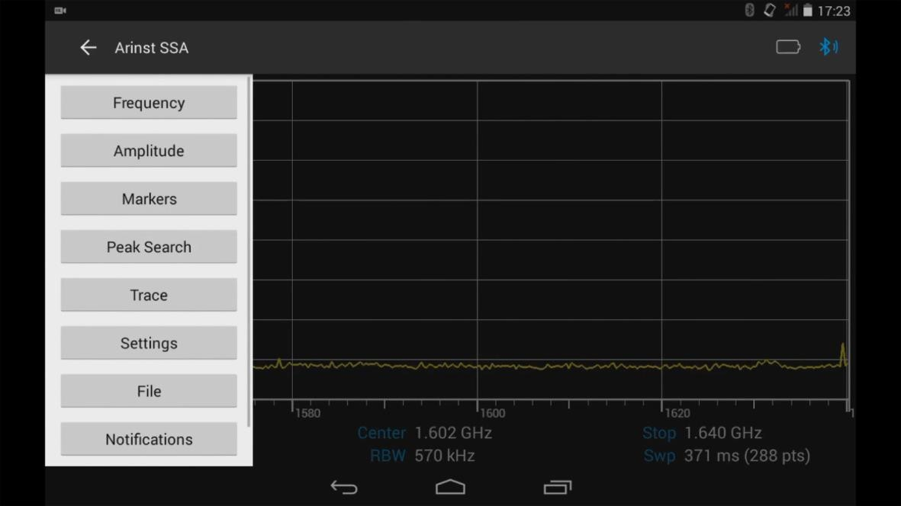

* Каждый раздел главного меню имеет свое назначение:

  **Frequency** – управление рабочим диапазоном частот обзора анализируемого сигнала;

  **Amplitude** – управление рабочим диапазоном амплитудных параметров;

  **Generator** – меню управления внутренним генератором сигнала, и проведения измерений АЧХ активных и пассивных устройств;

  **Markers** – меню выбора типа маркерных измерений;

  **Peak Search** – меню автоматического поиска и идентификации экстремальных значений анализируемого сигнала;

  **Trace** – меню статистической и математической обработки результатов измерений;

  **Settings** – меню выбора языковых настроек, параметров отображения и соединения;

  **File** – меню загрузки и сохранения результатов измерений;

  **Notifications** – меню адресных уведомлений от службы поддержки;

  **About** – меню, в котором отображается информация о версии управляющей программы, серийный номер прибора и версия его программного обеспечения.
* Для выхода из главного меню, нажмите на любую свободную точку экрана планшета/смартфона.

### ***Особенности управления***

* Для перемещения частотной шкалы, коснитесь ее пальцем на экране планшета/смартфона и перемещайте влево или вправо.
* Для изменения диапазона обзора, двумя пальцами коснитесь шкалы на экране планшета/смартфона и уменьшите или увеличьте диапазон обзора сигнала.
* Для перемещения логарифмической амплитудной шкалы, коснитесь ее пальцем на экране планшета/смартфона и перемещайте вверх-вниз.

### ***Меню управления рабочим диапазоном частот***

* Из главного меню управляющей программы войдите в меню управления рабочим диапазоном частот, нажав меню **Frequency** (Рисунок 30).

 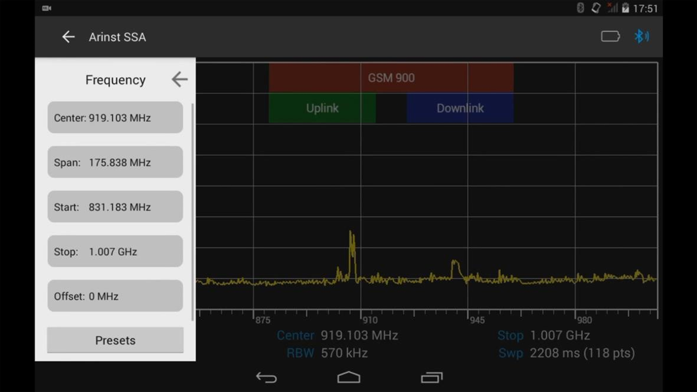

* Каждый из параметров меню управления рабочим диапазоном частот имеет свое назначение:

  **Center** – установка центральной частоты диапазона обзора сигнала;

  **Span** – установка диапазона обзора;

  **Start** – установка начальной частоты измеряемого диапазона частот;

  **Stop** – установка конечной частоты измеряемого диапазона частот;

  **Offset** – установка постоянного смещения частотной сетки, для расширения частотного диапазона прибора;

  **Presets** – загрузка пользовательских установок;

  **Regions** – вкладка для управления маркировкой диапазонов частот и присвоения им названий.
* Установка каждого из параметров производится вводом числового значения в открывшемся подменю, как на рисунке 31. Введите числовое значение частот и нажмите **Enter** (Ввод данных). Для удаления ошибочных или ранее введенных значений, нажмите **Del** (Удаление). Чтобы отказаться от ввода значения, нажмите на любую свободную точку экрана планшета/смартфона. *В нашем примере, на рисунке 31, производится установка конечного значения диапазона обзора частот*.
* При анализе широких диапазонов частот (**Span**) более 40 МГц, для уменьшения времени анализа, сканирование по частоте производится с максимальным шагом. При этом погрешность измерения мощности сигнала может достигать 6 дБ. Данный режим служит для оперативного обнаружения сигналов и не предназначен для точных измерений мощности.

  Для повышения точности измерений до 3 дБ, необходимо уменьшить ширину диапазона частот обзора до значений менее 40 МГц. Дальнейшее уменьшение диапазона частот обзора приведет к уменьшению погрешности измерений.

 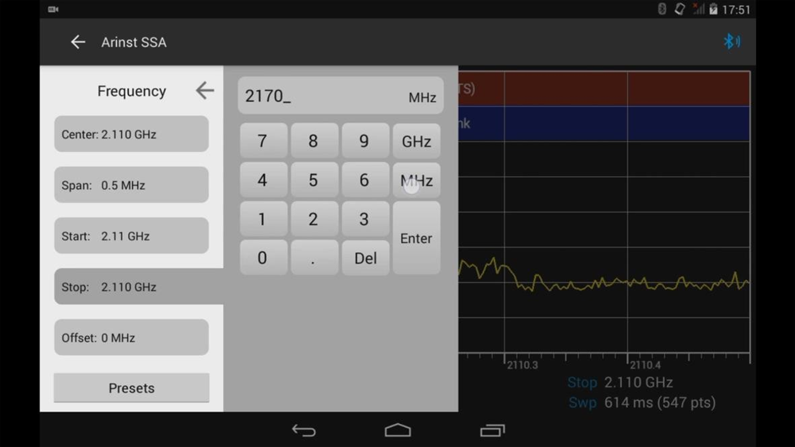

* Установка частотных параметров производится тремя способами:

  а) Вводом начальной **Start** и конечной **Stop** частот, при этом центральная частота **Center** автоматически принимается равной их полусумме. Диапазон частот обзора **Span** автоматически принимается равной разности конечной и начальной частот.

  б) Заданием центральной частоты **Center** и диапазона частот обзора **Span**. При этом начальная **Start** и конечная **Stop** частоты будут устанавливаться автоматически, как **Center ± Span / 2**.

  в) Загрузкой пользовательских установок из меню **Presets** (Рисунок 32).

 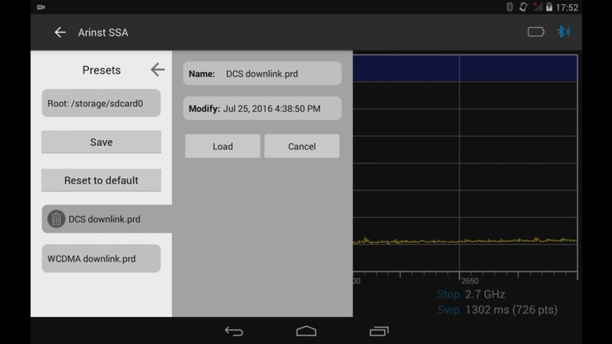

* Во вкладке **Presets** выберите предварительно сохраненную установку и нажмите **Load** (Загрузить). Для отказа от загрузки предварительной установки, нажмите **Cancel** (Отказ). Для сохранения новой установки, нажмите **Save** (Сохранить). Для удаления всех пользовательских установок, нажмите **Reset to default** (Возврат к заводским установкам).
* Для расширения частотного диапазона прибора, например при использовании внешнего конвертера, произведите установку смещения частотной сетки, войдя в меню **Offset**. Введите числовое значение постоянного смещения частотной сетки, как показано на рисунке 33.

 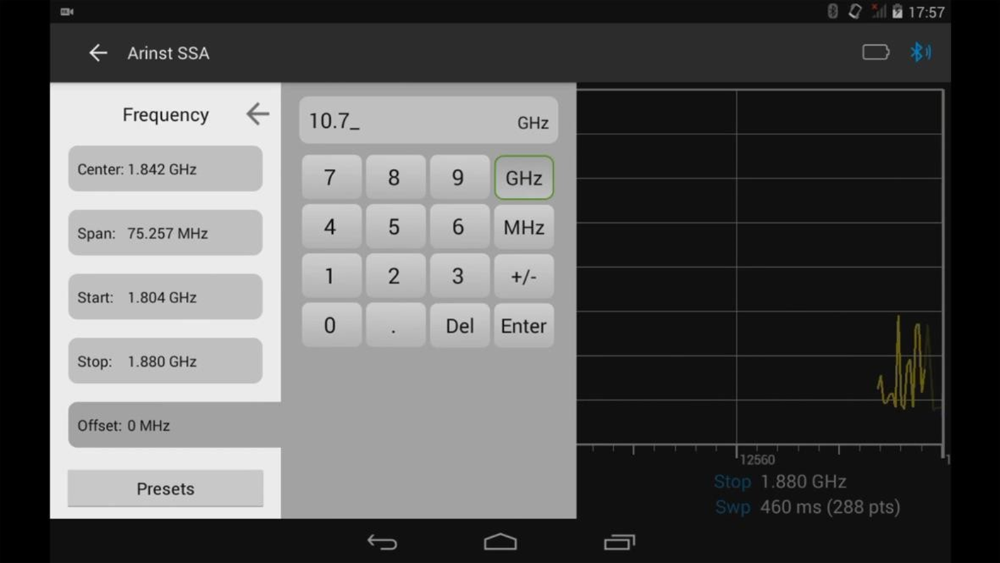

* Установка значения частоты производится вводом числового значения в открывшемся подменю, как на рисунке 33. Введите числовое значение, единицы измерения и нажмите **Enter** (Ввод данных). Для удаления ошибочных или ранее введенных значений, нажмите **Del** (Удаление). Чтобы отказаться от ввода значения, нажмите на любую свободную точку экрана планшета/смартфона.
* Для управления маркировкой диапазонов частот, войдите во вкладку **Regions** меню управления рабочим диапазоном частот **Frequency**, «прокрутив» меню вверх.

 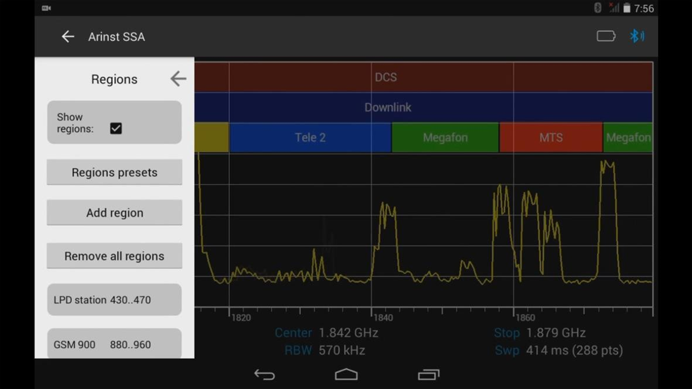

* В данном меню устанавливается:

  **Show regions** – управление отображением маркировок диапазонов и их названий;

  **Region presets** – пользовательские установки маркировок диапазонов частот;

  **Add region** – добавление маркировок диапазона частот;

  **Remove all regions** – удаление всех маркировок.
* На рисунке 35 показан пример отображения названия, цветовой маркировки и установленного диапазона частот. Для изменения названия, цветовой маркировки или диапазона частот, нажмите **Edit** (Редактировать), для отказа нажмите **Cancel** (Отказ).

 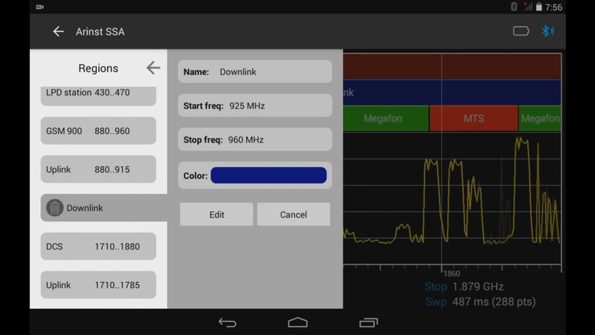

### ***Меню управления амплитудными параметрами***

* Из главного меню управляющей программы, войдите в меню управления амплитудными параметрами **Amplitude** (Рисунок 36).

 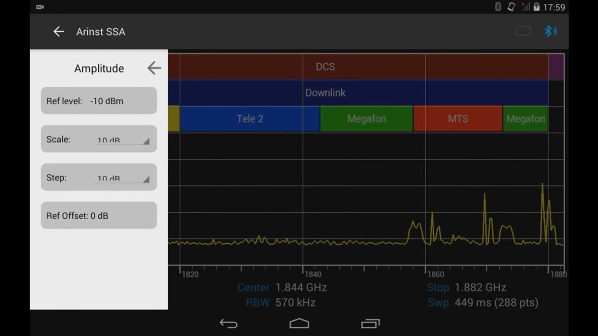

* Для управления вертикальной шкалой – шкалой амплитуд используются следующие параметры:

  **Ref level** – параметр задающий максимальное отображаемое на экране значение амплитуды сигнала;

  **Scale** – изменяет шаг шкалы (5 или 10 dB) горизонтальных линий сетки;

  **Step** – задает дискретность шага (1, 5, 10 dB) ручного изменения шкалы амплитуд;

  **Ref Offset** – сдвигает шкалу амплитуд для удобства отображения смещенного по уровню сигнала.
* Установка максимального отображаемого значения амплитуды **Ref level** производится вводом числового значения в открывшемся подменю, как на рисунке 37. Введите числовое значение и нажмите **Enter** (Ввод данных). Для удаления ошибочных или ранее введенных значений, нажмите **Del** (Удаление). Чтобы отказаться от ввода значения, нажмите на любую свободную точку экрана планшета/смартфона.

:::tip
При выборе данного параметра выше -30 dBm, автоматически будет включен внутренний аттенюатор **Att** прибора, значение которого будет отображаться слева от сетки.

:::

 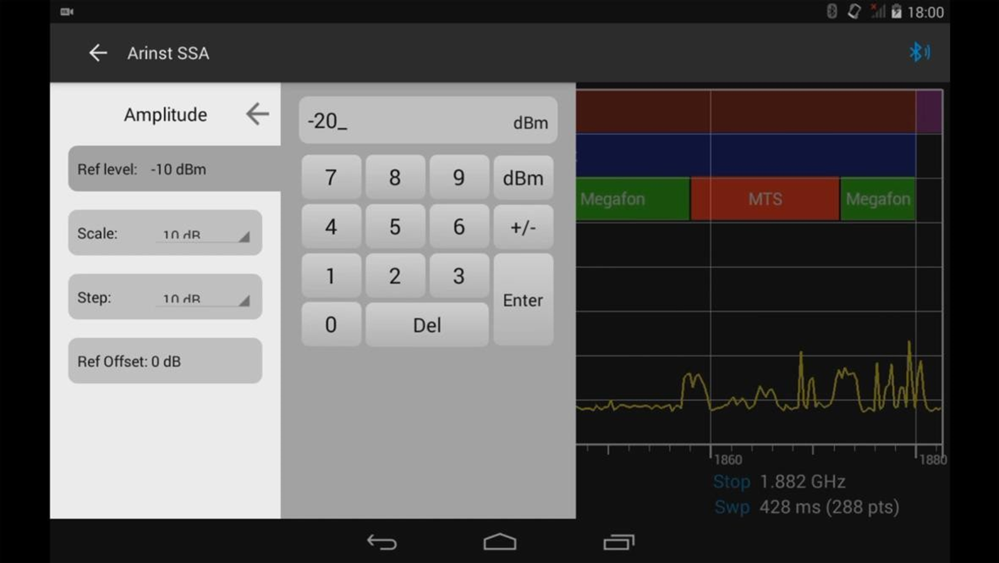

* Установка максимального отображаемого значения амплитуды, может производиться непосредственным перемещением шкалы амплитуд вверх-вниз, пальцем по экрану планшета/смартфона.
* При использовании внешнего аттенюатора или усилителя, возникает необходимость сместить шкалу амплитуд для удобства отображения, смещенного по уровню сигнала. Войдите в меню **Ref Offset** и введите числовое значение смещения шкалы амплитуд, как показано на рисунке 38. Введите числовое значение и нажмите **Enter** (Ввод данных). Для удаления ошибочных или ранее введенных значений, нажмите **Del** (Удаление). Чтобы отказаться от ввода значения, нажмите на любую свободную точку экрана планшета/смартфона.

 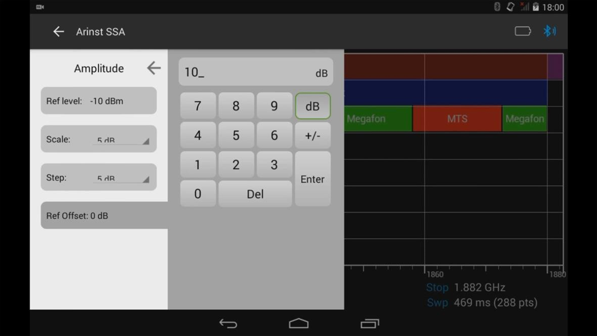

### ***Работа в меню маркерных измерений***

* Из главного меню управляющей программы войдите в меню выбора типа маркерных измерений **Markers** (Рисунок 39).

 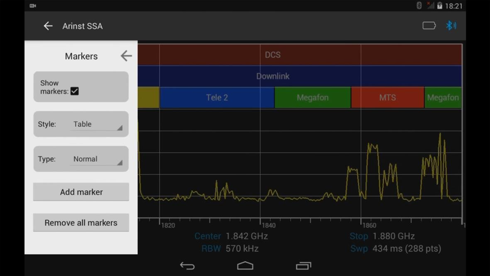

* В меню выбора маркерных измерений устанавливается:

  **Show markers** – управление отображением всех заданных маркеров;

  **Style** – выбор вида отображения параметров маркеров;

  **Type** – выбор типа маркерного измерения;

  **Add marker** – добавление нового маркера по заданной частоте;

  **Remove all markers** – удаление всех ранее установленных маркеров.
* Для точной установки новых визуальных индикаторов амплитуды сигнала (маркеров), по фиксированной частоте, войдите в меню **Add marker**, как показано на рисунке 40. Введите числовое значение фиксированный частоты маркера и нажмите **Enter** (Ввод данных). Для удаления ошибочных или ранее введенных значений, нажмите **Del** (Удаление). Чтобы отказаться от ввода значения, нажмите на любую свободную точку экрана планшета/смартфона.

:::tip
Введенное значение фиксированной частоты маркера будет сохранено во вкладке **Markers** с порядковым номером маркера и его частотой. В нашем примере отображается маркер с именем *«Mkr1:1.842 GHz»*.

:::

 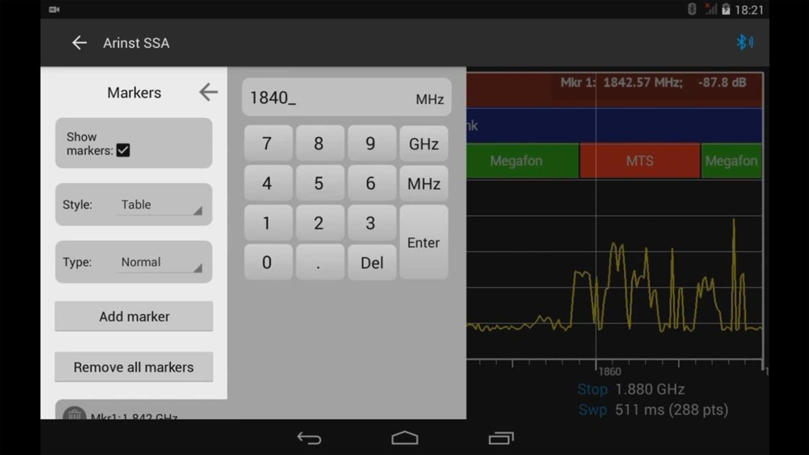

* Если точное задание частоты маркера не требуется, можно установить маркер посредством двойного клика на экране планшета/смартфона. Для изменения положения маркера, необходимо нажать на него, выждать около секунды и переместить его по экрану планшета/смартфона изменив его фиксированную частоту.
* Для установки вида обозначения на экране планшета/смартфона маркеров, войдите в меню Style и выберите одно из значений отображения маркеров **Label** (Ярлык) или **Table** (Таблица), как показано на рисунке 41.

 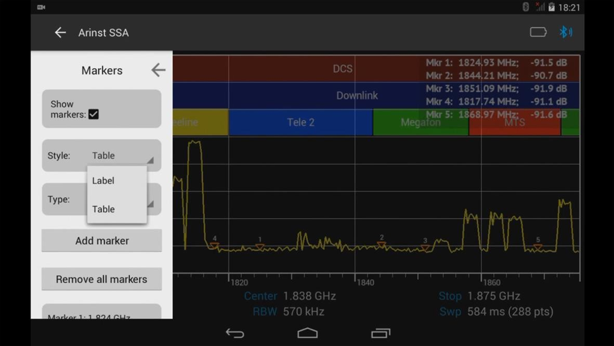

* В зависимости от выбранного вида обозначения, маркеры будут обозначены ярлыками, на которых будет указана частота и уровень сигнала (Рисунок 42),

 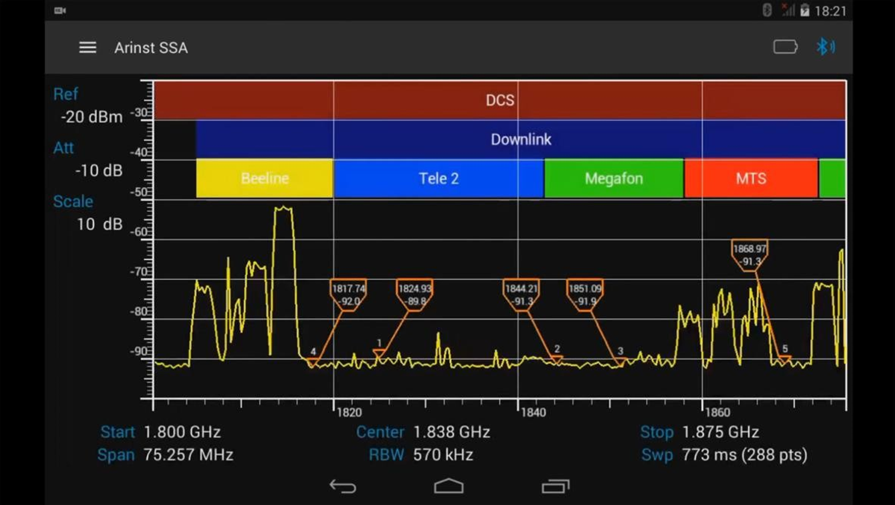

или информация о частотах и значения сигналов установленных маркеров, будет размещена в виде таблицы в правом верхнем углу экрана планшета/смартфона (Рисунок 43).

 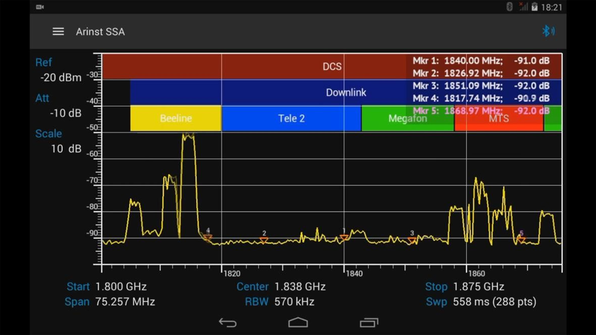

* Чтобы выбрать один из четырех типов маркерных измерений сигнала, войдите в меню **Type**. Выберите один из типов измерения сигнала, как показано на рисунке 44.

 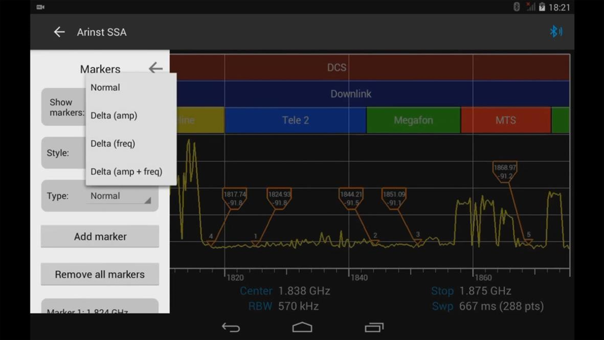

**Normal** – измерение абсолютной величины амплитуд;

**Delta (amp)** – измерение относительного перепада амплитуды между двумя маркерами – базовым и дополнительным;

**Delta (freq)** – измерение относительной разницы частоты, между двумя маркерами – базовым и дополнительным;

**Delta (amp + freq)** – измерение относительной разницы частот и амплитуды, между двумя маркерами – базовым и дополнительным.

### ***Меню автоматических измерений экстремальных значений сигнала***

* Из главного меню управляющей программы, войдите в меню измерений экстремальных значений сигнала **Peak Search**, как показано на рисунке 45. Рассмотрим более подробно это меню.

 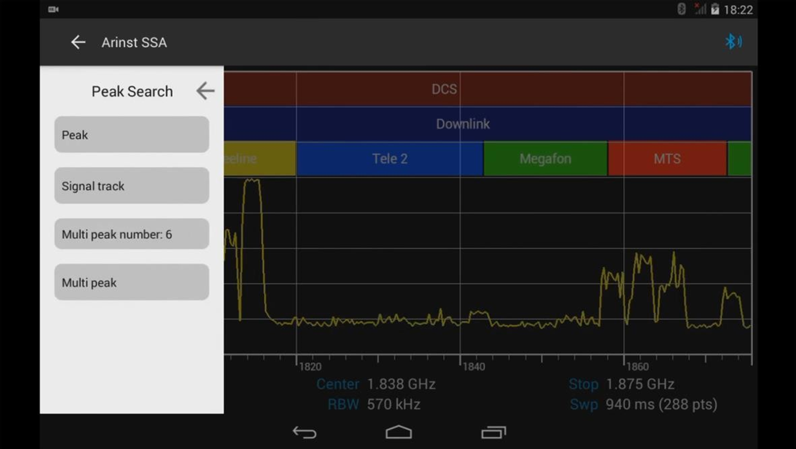

* Войдите в подменю **Peak** и нажмите команду **Search**, как показано на рисунке 46. Маркер автоматически установится на максимальное значение сигнала.

 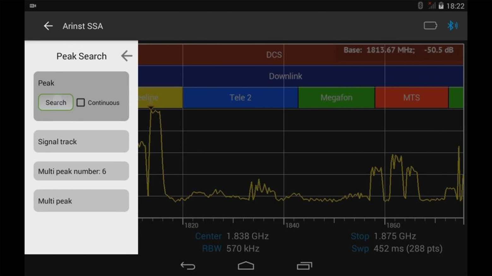

* Если необходимо отслеживать уровень и частоту максимального значения сигнала, включите опцию циклического повторения поиска максимального значения сигнала **Continuous**, как показано на рисунке 47. В этом случае маркер, будет автоматически следовать за максимальным значением сигнала.

 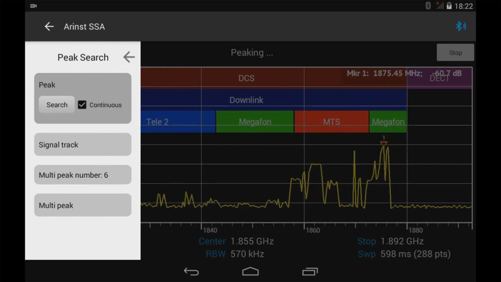

* Для автоматической установки маркера максимального уровня сигнала в центр экрана планшета/смартфона, войдите в подменю **Signal track** и нажмите команду **Track**, как показано на рисунке 48. Маркер максимального уровня сигнала автоматически установится в центре экрана планшета/смартфона.

 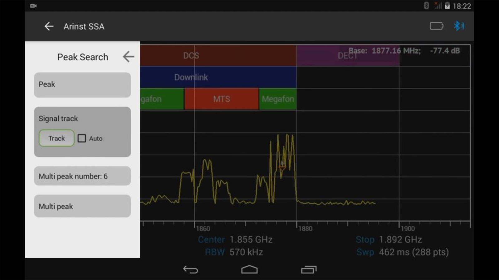

* Если возникает необходимость в отслеживании сигнала с изменяющейся частотой, включите опцию **Auto**, как показано на рисунке 49. В данном случае, маркер максимального уровня сигнала будет постоянно автоматически размещаться в центре экрана планшета/смартфона.

 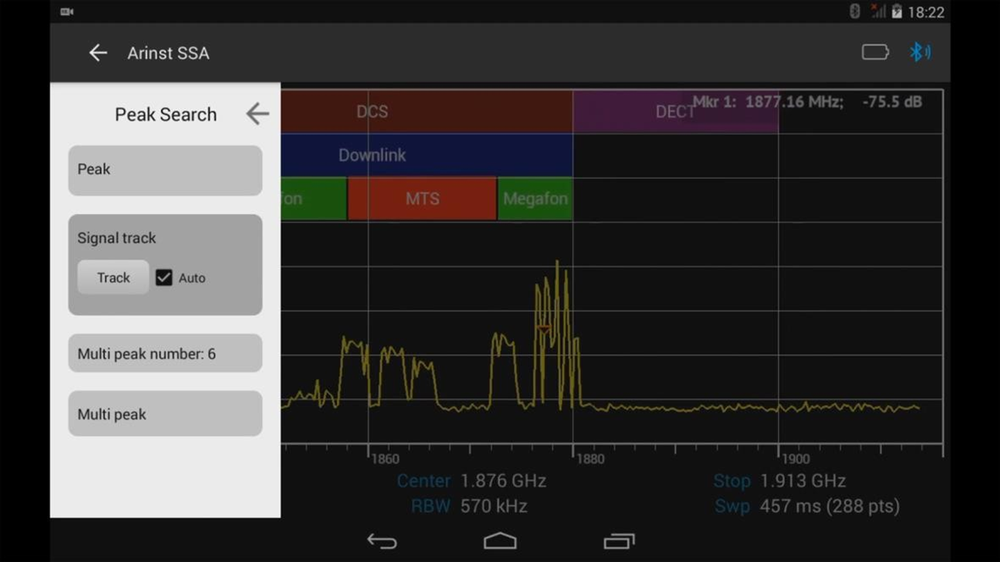

* Для автоматической установки нескольких маркеров на максимальных уровнях сигналов, по мере убывания их амплитуд, войдите в меню **Multi peak number**, и нажимая кнопки **«-»** и **«+»** установите необходимое количество (в пределах от 1 до 10) маркеров, рисунок 50.

 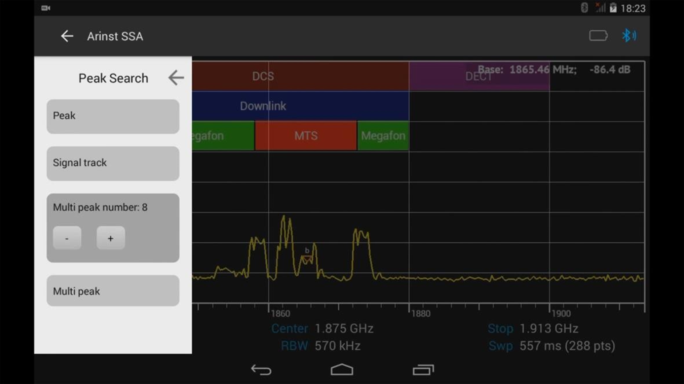

* После установки необходимого количества маркеров, перейдите в меню **Multi peak** и нажмите команду **Run**, как показано на рисунке 51. При необходимости используйте опцию циклического повтора **Repeat**.

 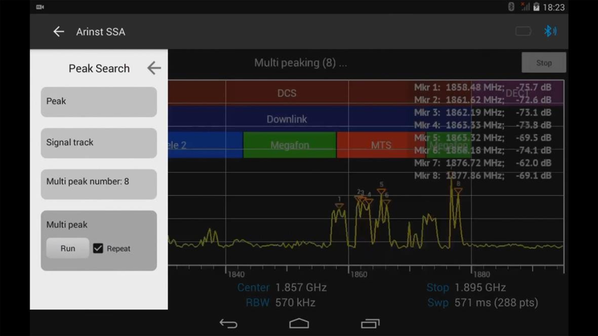

* Для отмены циклического отслеживания пиковых значений сигнала, нажмите кнопку **Stop**, расположенную в правом верхнем углу экрана планшета/смартфона, рисунок 52.

 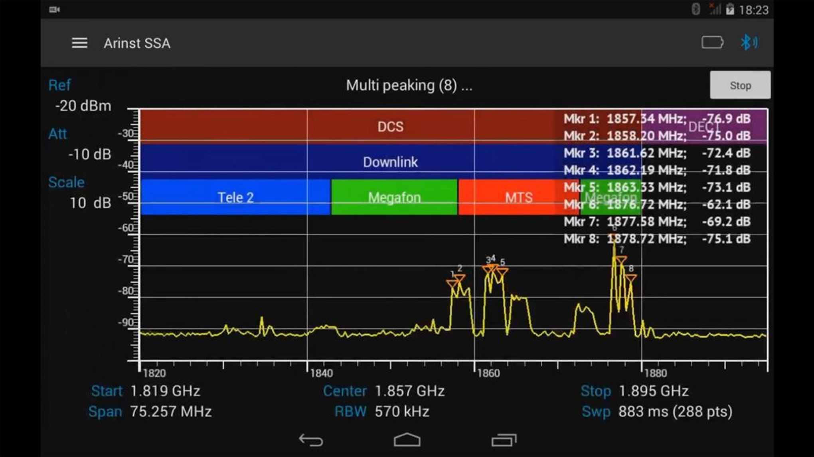

### ***Обработка отображаемых результатов измерений***

* Из главного меню управляющей программы, войдите в меню статистической и математической обработки отображаемых данных **Trace**, как показано на рисунке 53.

 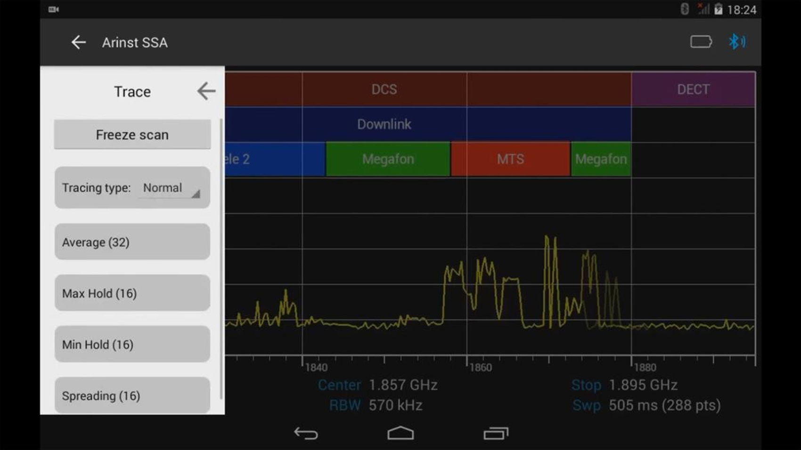

* В режиме Trace отображаются результаты математической обработки измерений. Математическая обработка заданного количества измерений, позволяет получить больше информации об исследуемом сигнале.
* Для остановки циклического сканирования спектра нажмите кнопку **Freeze scan**. Сканирование спектра сигнала будет приостановлено (заморожено), рисунок 54. Нажатие кнопки **Scan** обновляет график спектра, кнопка **Unfreeze** запускает приостановленное сканирование.

 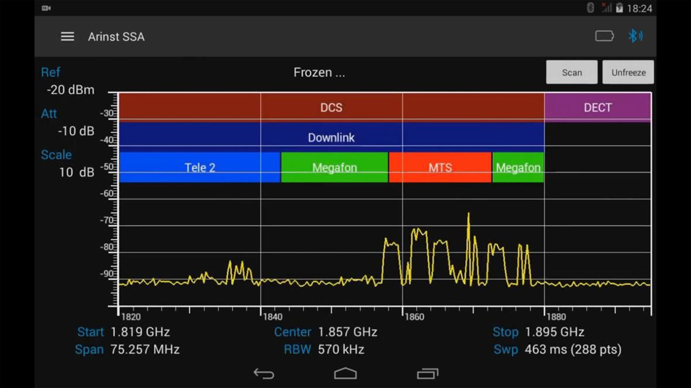

* Предварительно, необходимо выбрать тип накопления измерений, как на рисунке 55

  **Normal** – режим однократного накопления данных в соответствии, с заданным числом сканирований;

  **Sliding** – режим скользящего накопления данных.

 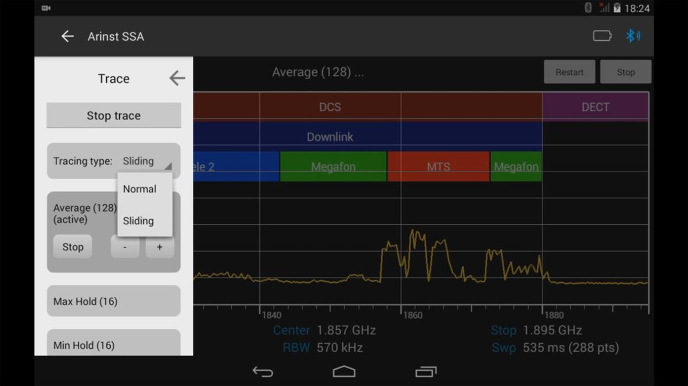

* Для усреднения результатов измерений, войдите в меню **Average**, как показано на рисунке 55 и кнопками **«-»** и **«+»** установите необходимое количество измерений в диапазоне от 4 до 128.

 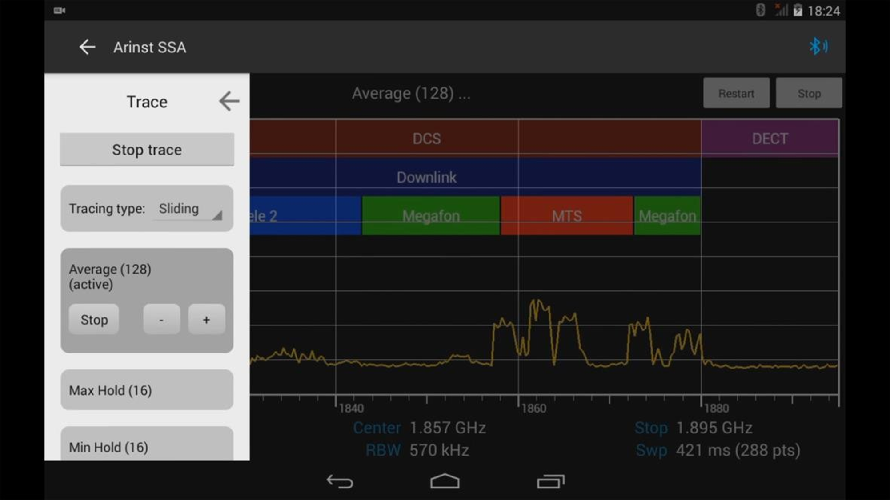

Для перезапуска сканирования нажмите кнопку **Restart**, для остановки сканирования, нажмите кнопку **Stop**, в правом верхнем углу экрана планшета/смартфона, рисунок 57.

 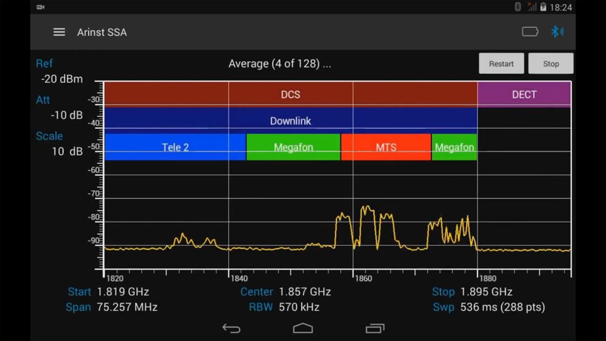

* Режим **Max Hold** позволяет отобразить максимальные результаты измерений по нескольким сканированиям. Кнопками **«-»** и **«+»** установите необходимое количество сканирований (в диапазоне от 4 до ∞) и нажмите команду запуска **Run**, рисунок 58. Максимальный усредненный результат измерений будет отображаться на экране планшета/смартфона красным графиком.

 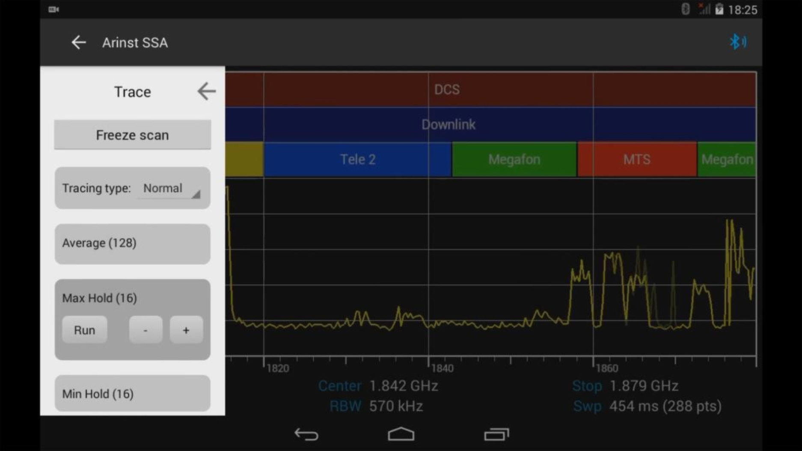

* Режим **Min Hold** позволяет отобразить минимальные результаты измерений по нескольким сканированиям. Кнопками **«-»** и **«+»** установите необходимое количество сканирований (в диапазоне от 4 до ∞) и нажмите команду запуска **Run**, рисунок 59. Минимальный усредненный результат измерений будет отображаться на экране планшета/смартфона зеленым графиком.

 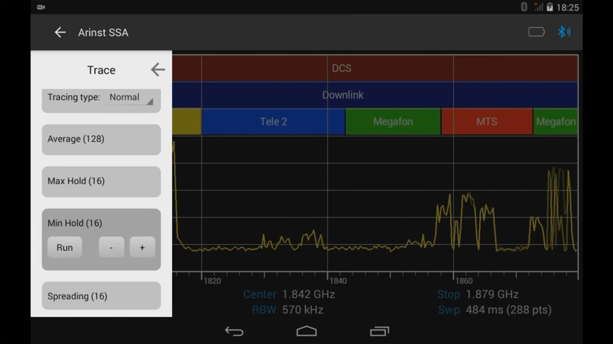

* Для отображения максимального и минимального результата измерений по нескольким сканированиям, войдите в меню **Spreading**, как показано на рисунке 60. Кнопками **«-»** и **«+»** установите необходимое количество сканирований (в диапазоне от 4 до ∞) и нажмите кнопку **Run**.

 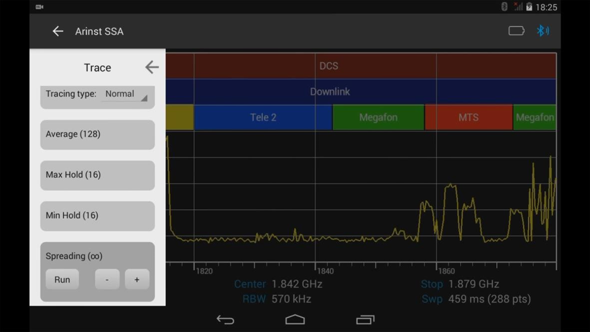

На рисунке 61, показана работа в режиме отображения максимального и минимального результата измерений. Красным графиком, отображается максимальный усредненный результат измерений. Минимальный усредненный результат измерений отображается зеленым графиком. Для перезапуска сканирования, нажмите кнопку **Restart**, для остановки сканирования, нажмите кнопку **Stop** в правом верхнем углу экрана планшета/смартфона.

 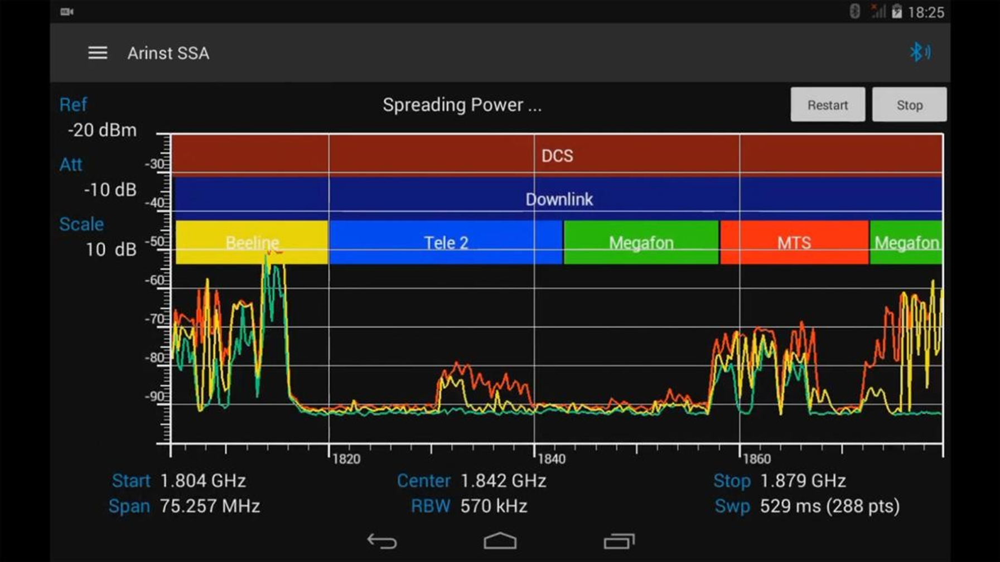

### ***Меню настроек***

* Из главного меню управляющей программы, войдите в меню настроек **Settings**, как показано на рисунке 62.

 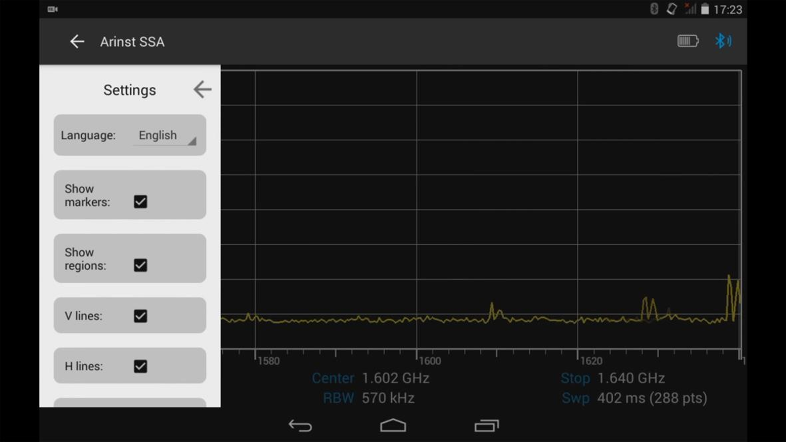

* Для установки языка интерфейса, нажмите на кнопку **Language**, и в появившемся окне выберите язык интерфейса управляющей программы, рисунок 63.

 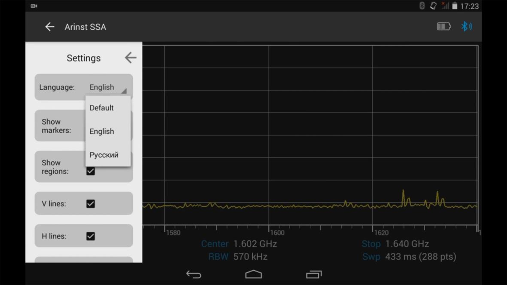

* Помимо выбора языка интерфейса, можно по своему желанию изменить настройки отображения:

  **Show markers** – опция включает или выключает отображение маркеров;

  **Show regions** – отображаются на экране или отключены предустановленные и обозначенные частотные диапазоны;

  **V lines** и **H lines** – управление отображением вертикальных и горизонтальных линий сетки;

  **Rendering** – отрисовка данных на экране в виде линий или точками;

  **StandBy in** – опция устанавливает временной промежуток, спустя который, устройство переходит в дежурный (энергосберегающий) режим.

### ***Меню загрузки и сохранения данных***

* Из главного меню управляющей программы, войдите в меню загрузки и сохранения данных **File**. Как показано на рисунке 64. В меню **File** можно сохранять **Save** файлы с данными, частотными диапазонами и т.п., производить загрузку частотных диапазонов и данных с карты памяти вашего планшета/смартфона.

 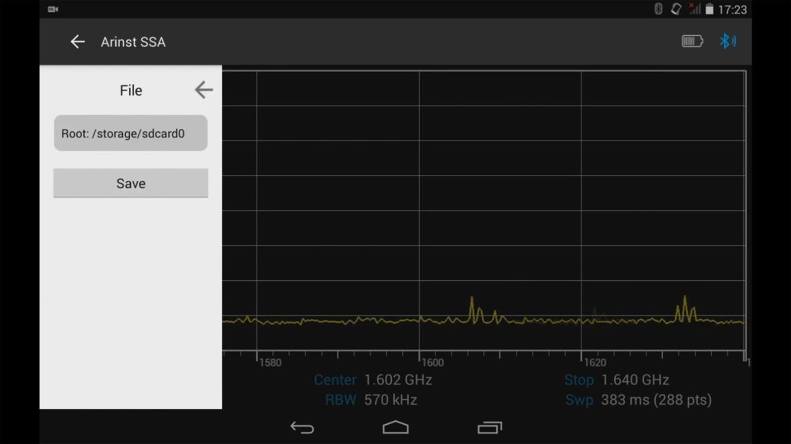

### ***Меню уведомлений***

* Из главного меню управляющей программы, войдите в меню адресных уведомлений от службы поддержки **Notifications**, как показано на рисунке 65. Для обновления версии программного обеспечения прибора, нажмите кнопку **Refresh**.

 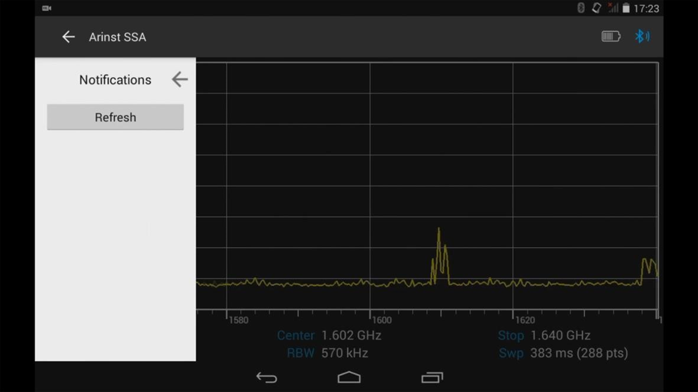

### ***Информация об управляющей программе***

* Из главного меню управляющей программы, войдите в меню **About**, в котором находится информация о версии программы, версии программного обеспечения прибора и номер прибора, рисунок 66. Для проверки наличия новой версии программного обеспечения прибора, нажмите кнопку **Check for update**. Если вышла новая версия программного обеспечения прибора, появится возможность обновления программного обеспечения прибора.

 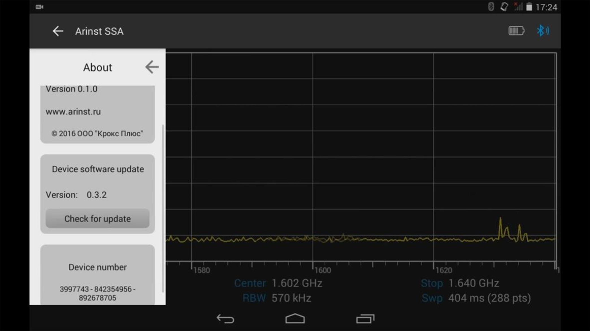

Своевременное обновление программного обеспечения гарантирует, что вы будете использовать наиболее актуальную версию программного обеспечения с устраненными ошибками и добавленными новыми возможностями.

## ***Примеры применения прибора***

### ***Установка частоты и мощности выходного сигнала внутреннего генератора***

* Из главного меню управляющей программы войдите в меню **Generator**, как показано на рисунке 67.

 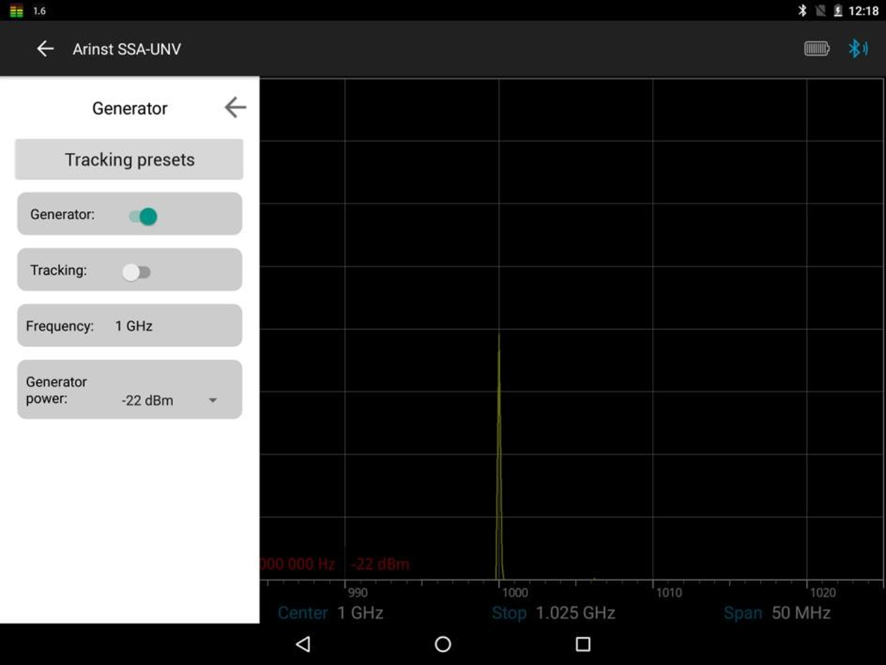

* Соедините между собой выход генератора (1) **TG OUT** прибора и антенный вход (2) **RF IN**. В зависимости от характеристик исследуемого устройства, установите значение частоты генератора в диапазоне от 35 до 6200 МГц, например 1000 МГц, и значение мощности генератора **Generator Power** в диапазоне от -15 до -25 dBm. *В нашем примере значение мощности генератора -22 dBm*.

  При необходимости, в меню амплитудных установок **Amplitude**, установите максимальное значение вертикальной шкалы **Ref level** в диапазоне от 10 до -20 dBm.
* В меню установки частотных характеристик **Frequency** установите диапазон частот обзора **Span** и центральную частоту **Center**.
* На экране вашего планшета/смартфона, будет отображаться график спектра, установленного выходного сигнала внутреннего генератора прибора, рисунок 68.

 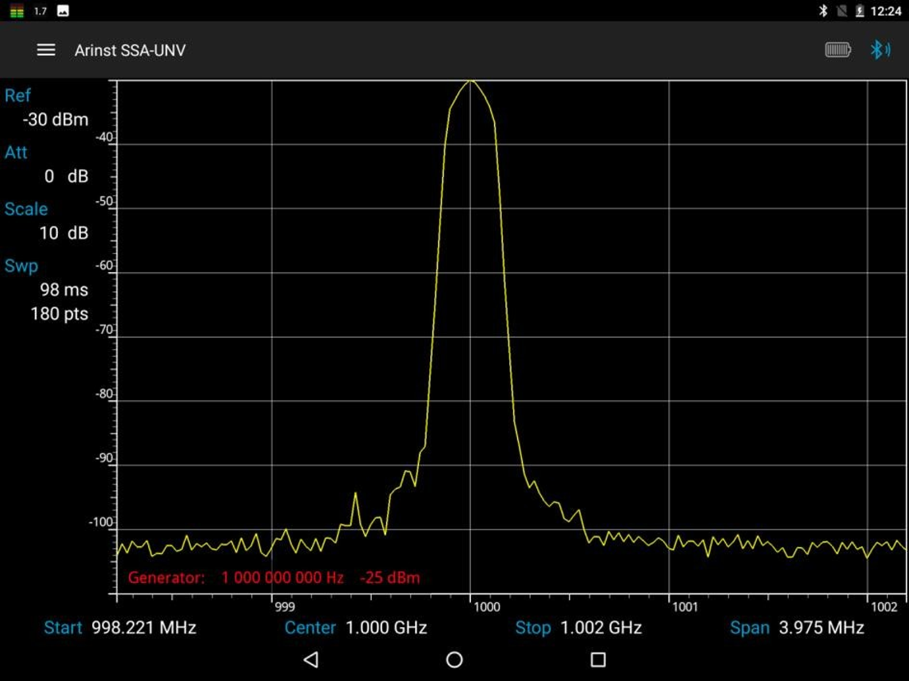

### ***Снятие амплитудно-частотной характеристики***

:::warning
**Если выходная мощность измеряемого устройства не известна, всегда устанавливайте максимальное значение внутреннего аттенюатора прибора!**

:::

* В меню **Generator** включите режим **Tracking** и установите значение мощности генератора **Generator Power** в диапазоне от -15 до -25 dBm, в зависимости от исследуемого оборудования. Установите необходимый уровень ослабления сигнала входным аттенюатором **Input attenuator** в диапазоне от 0 до -30 dB, рисунок 69.

 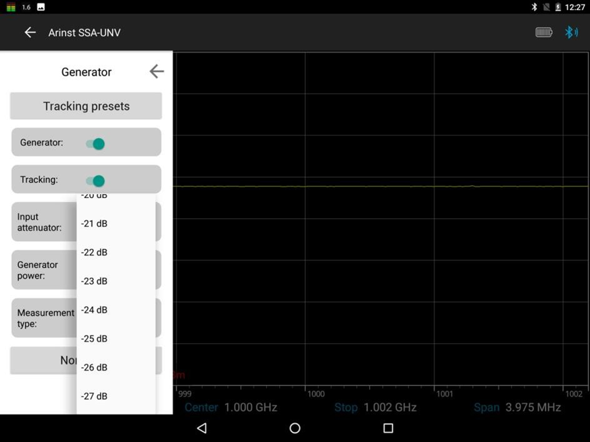

:::warning
**Использование малых значений входного аттенюатора требует особенной внимательности, так как сигнал, превышающий 10 dBm, может привести к повреждению входной цепи прибора!**

:::

:::tip
При необходимости используйте внешние аттенюаторы.

:::

* В меню установки частотных характеристик **Frequency** установите диапазон частот обзора **Span** и центральную частоту **Center**.

:::tip
При снятии АЧХ активных и пассивных устройств, рекомендуется использовать кабели с высоким коэффициентом экранирования. Этим будет обеспечена минимизация паразитного прохождения электромагнитной энергии с одного порта прибора на другой порт.

:::

* Для снятия амплитудно-частотной характеристики тестируемого оборудования, выберите режим **S21** в меню выбора типа измерения **Measurement type**. Соедините между собой выход генератора (1) **TG OUT** прибора и антенный вход (2) **RF IN** и проведите нормализацию **Normalize**, рисунок 70.

:::tip
Нормализация необходима для устранения влияния соединительных проводов и разъемов исследуемой цепи на результаты измерения АЧХ тестируемого оборудования. Для отмены нормализации, нажмите команду **Reset normalize**.

:::

 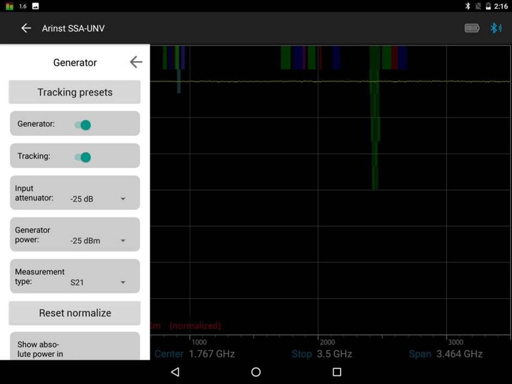

* На экране под сеткой в информационной надписи появится отображение режима **S21**.

:::tip
После проведения нормализации, установка диапазона частот исследуемого сигнала становится недоступной. Производите установку диапазона частот исследуемого сигнала до нормализации.

:::

* Не выключая прибора, включите тестируемое оборудование в цепь. На экране прибора будет отображаться график амплитудно-частотной характеристики исследуемого оборудования в заданном диапазоне частот, рисунок 71.

  **Измерение АЧХ активных устройств с известными мощностными характеристиками**.

  Для измерения АЧХ активных устройств, таких как антенные усилители, с известными мощностными характеристиками, необходимо установить мощность сигнала генератора и уровень ослабления сигнала входным аттенюатором таким образом, чтобы уровень сигнала от внутреннего генератора устройства, до проведения операции нормализации находился на уровне -50 -60 dBm.

:::tip
Более низкое значение уровня сигнала приведет к повышенной зашумленности и нелинейности измеряемого сигнала.

После установки проведите нормализацию и снимите АЧХ активного устройства.

:::

**Измерение АЧХ активных устройств с неизвестными мощностными характеристиками**.

Установите минимальную выходную мощность внутреннего генератора и максимальное значение ослабления входного аттенюатора приемника прибора. При необходимости добавьте дополнительный внешний аттенюатор. Проведите операцию нормализации и подключите исследуемое устройство в цепь. При необходимости, снизьте уровень ослабления сигнала аттенюаторами.

:::tip
При изменении внешнего аттенюатора, проведите операцию нормализации заново.

:::

:::warning
При сильном превышении уровня входного сигнала, на экране устройства возникает предупреждающая надпись **Dynamic range exceeded**. В этом случае, корректное отображение уровня входного сигнала невозможно. В данном случае необходимо увеличить уровень ослабления сигнала внешними аттенюаторами.

**Использование малых значений входного аттенюатора требует особенной внимательности, так как сигнал, превышающий 10 dBm, может привести к повреждению входной цепи прибора!**

:::

 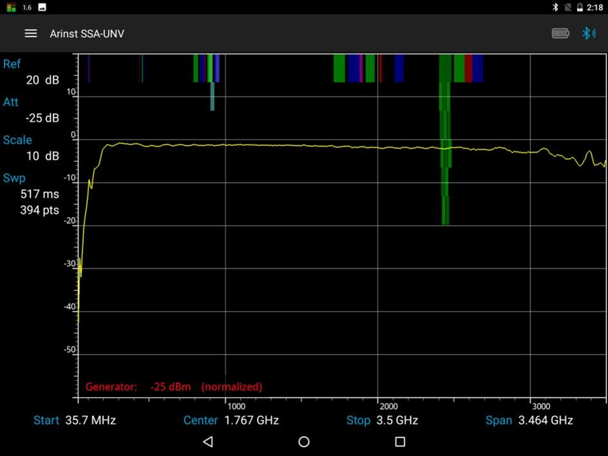

### ***Измерение коэффициента отражения***

* В меню **Generator** включите режим **Tracking** и установите значение мощности генератора **Generator Power** в диапазоне от -15 до -25 dBm, в зависимости от исследуемого оборудования. Установите необходимый уровень ослабления сигнала входным аттенюатором **Input attenuator** в диапазоне от 0 до -30 dB, рисунок 69.

:::warning
**Использование малых значений входного аттенюатора требует особенной внимательности, так как сигнал, превышающий 10 dBm, может привести к повреждению входной цепи прибора!**

:::

:::tip
**Примечание**. При необходимости используйте внешние аттенюаторы.

:::

* В меню установки частотных характеристик **Frequency** установите диапазон частот обзора **Span** и центральную частоту **Center**.

  Выберите режим **S11** в меню выбора типа измерения **Measurement type**, как показано на рисунке 72.

 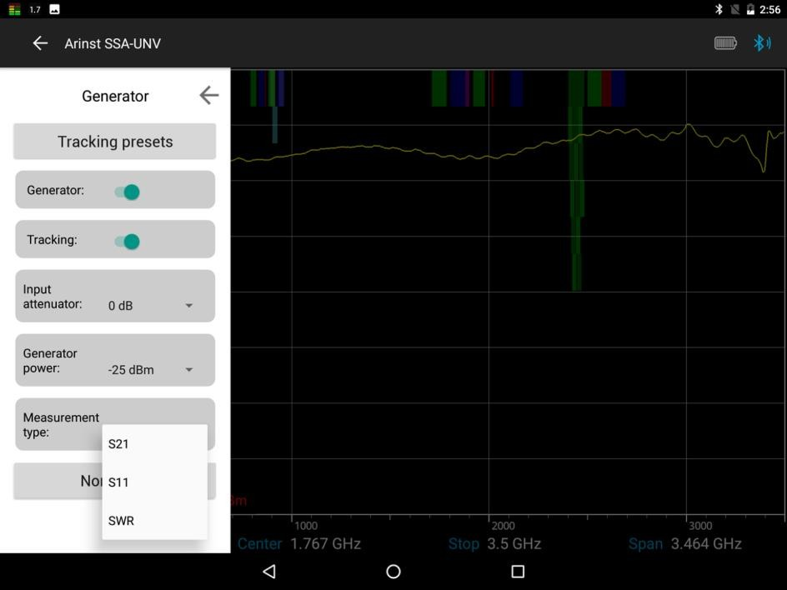

* Для снижения влияния соединительных проводов и разъемов на результаты измерений, необходимо произвести калибровку.

:::tip
Допускается выполнять калибровку один раз для режимов **S11** и **SWR**, при условии, что разъемы и кабели исследуемой цепи не меняются.

Для измерения коэффициента отражения **S11**, необходимо использовать направленный ответвитель или измерительный мост (не входит в комплект поставки). В нашем примере на рисунке 19 используется измерительный мост **KROKS KSB 2700** специально разработанный для применения с анализаторами спектра ARINST.

:::

* Подключите выход генератора сигналов (1) **TG OUT** прибора, к входу измерительного моста **TO TG** **OUT** согласно схеме подключения на рисунке 19. Выход отраженного сигнала от порта измерительного моста **TO RF IN** подключите к антенному входу прибора (2) **RF IN**.
* К входу измерительного моста **TEST** последовательно подключите нагрузки из стандартного набора калибровочных нагрузок (не входит в комплект поставки):
  * холостого хода, и нажмите команду **Open calibration** на экране;
  * короткого замыкания, и нажмите команду **Short calibration** на экране;
  * согласованную нагрузку и нажмите команду **Load calibration**. После проведения калибровки, команды **Open calibration**, **Short calibration** и **Load calibration** изменятся на команды отмены: **Reset open calibration**; **Reset short calibration** и **Reset load calibration**, рисунок 73.

 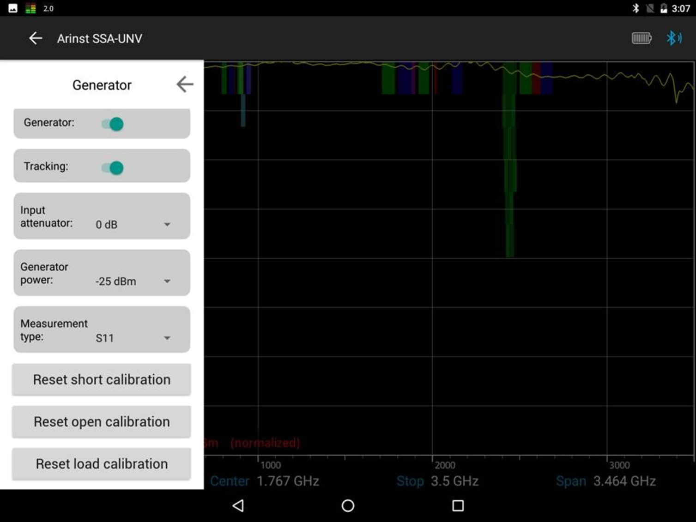

Подключите исследуемое оборудование **(DUT)** к порту **TEST** измерительного моста и проведите измерения коэффициента отражения.

:::tip
Коэффициент отражения **S11** будет отображен графиком в логарифмической сетке с вертикальной осью в dB. По горизонтальной оси отображается заданный диапазон частот сигнала, рисунок 74.

:::

 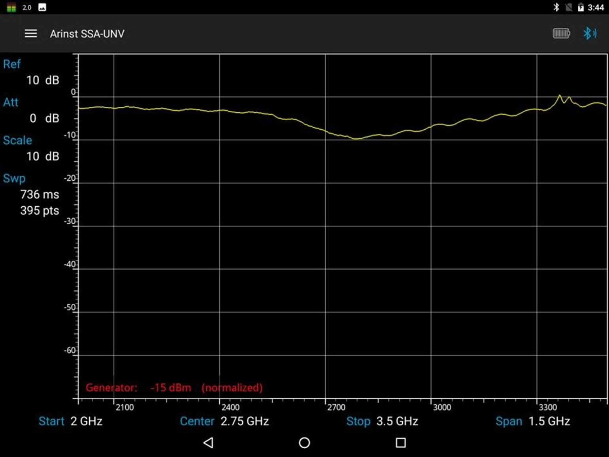

### ***Измерение коэффициента стоячей волны (КСВ)***

* В меню **Generator** включите режим **Tracking** и установите значение мощности генератора **Generator Power** в диапазоне от -15 до -25 dBm, в зависимости от исследуемого оборудования. Установите необходимый уровень ослабления сигнала входным аттенюатором **Input attenuator** в диапазоне от 0 до -30 dB, рисунок 69.

:::warning
**Использование малых значений входного аттенюатора требует особенной внимательности, так как сигнал, превышающий 10 dBm, может привести к повреждению входной цепи прибора!**

:::

:::tip
При необходимости используйте внешние аттенюаторы.

:::

* В меню установки частотных характеристик **Frequency** установите диапазон частот обзора **Span** и центральную частоту **Center**.
* Выберите режим **SWR** в меню выбора типа измерения **Measurement type**, как показано на рисунке 75.

 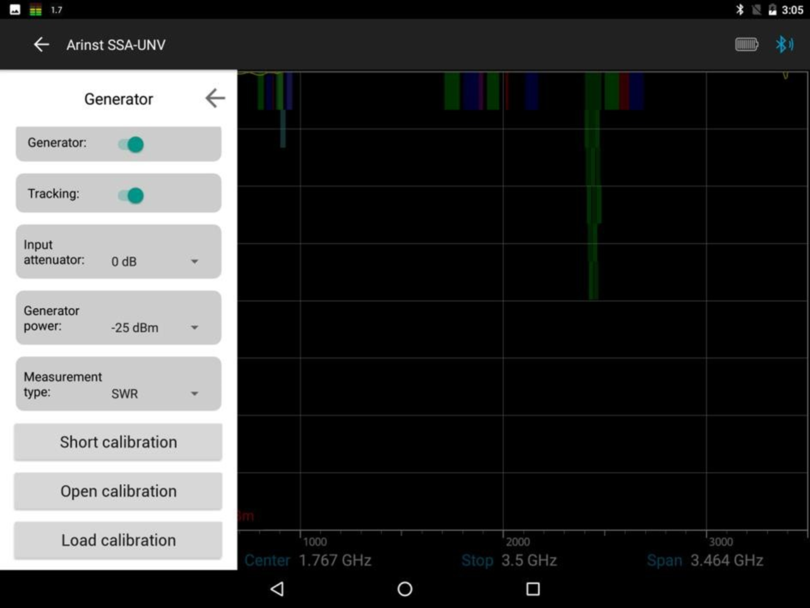

* Для компенсации влияния соединительных проводов и разъемов на результаты измерений, необходимо произвести калибровку.

:::tip
Допускается выполнять калибровку один раз для режимов **SWR** и **S11**, при условии, что разъемы и кабели исследуемой цепи не меняются.

Для измерения коэффициента стоячей волны **SWR**, необходимо использовать направленный ответвитель или измерительный мост (не входит в комплект поставки). В нашем примере на рисунке 19 используется измерительный мост **KROKS KSB 2700** специально разработанный для применения с анализаторами спектра ARINST.

:::

* Подключите выход генератора сигналов (1) **TG OUT** прибора, к входу измерительного моста **TO TG** **OUT** согласно схеме подключения на рисунке 19. Выход отраженного сигнала от порта измерительного моста **TO RF IN** подключите к антенному входу прибора (2) **RF IN**.
* К входу измерительного моста **TEST** последовательно подключите нагрузки из стандартного набора калибровочных нагрузок (не входит в комплект поставки):
  * холостого хода, и нажмите команду **Open calibration** на экране;
  * короткого замыкания, и нажмите команду **Short calibration** на экране;
  * согласованную нагрузку и нажмите команду **Load calibration**, рисунок 76.

 

После проведения калибровки, команды **Open calibration**, **Short calibration** и **Load calibration** изменятся на команды отмены: **Reset open calibration**; **Reset short calibration** и **Reset load calibration**. Подключите исследуемое оборудование **(DUT)** к порту **TEST** измерительного моста и проведите измерения коэффициента стоячей волны.

**Примечание**. Коэффициент стоячей волны измеряется в режиме **SWR**. График будет отображен с вертикальной осью в виде числового коэффициента стоячей волны. По горизонтальной оси отображается заданный диапазон частот сигнала рисунок 77.

 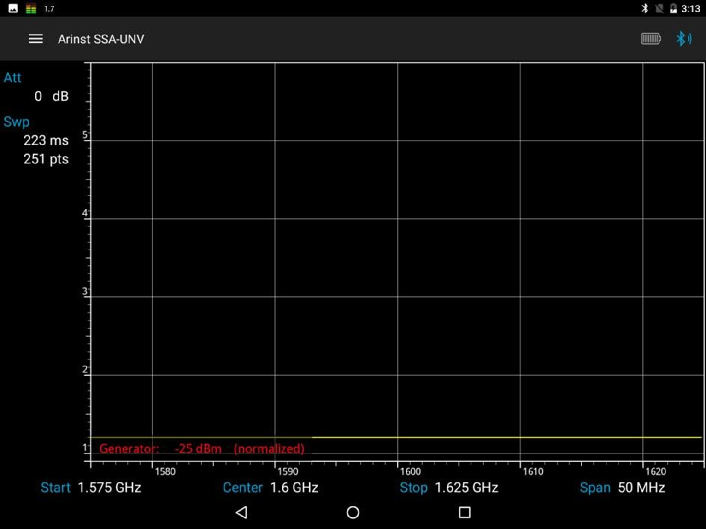

### ***Отображение нескольких диапазонов частот сигналов***

Для одновременного отображения нескольких частотных диапазонов на экране планшета/смартфона, войдите в меню управления рабочим диапазоном частот **Frequency**, и выберите вкладку **Frequency merges**, рисунок 78.

 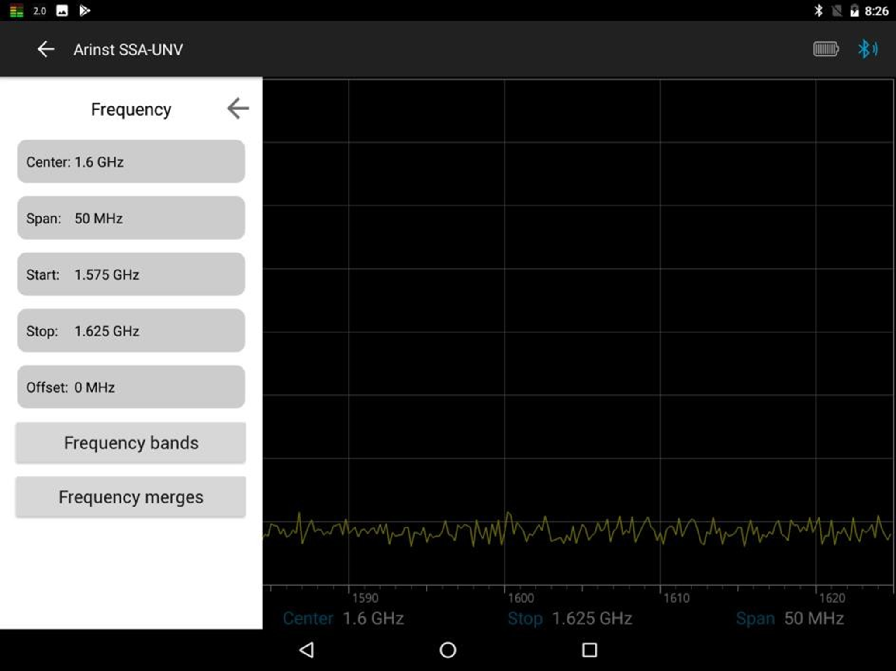

* Создайте новый список одновременно рассматриваемых частотных диапазонов, нажав кнопку **Create**, как показано на рисунке 79.

 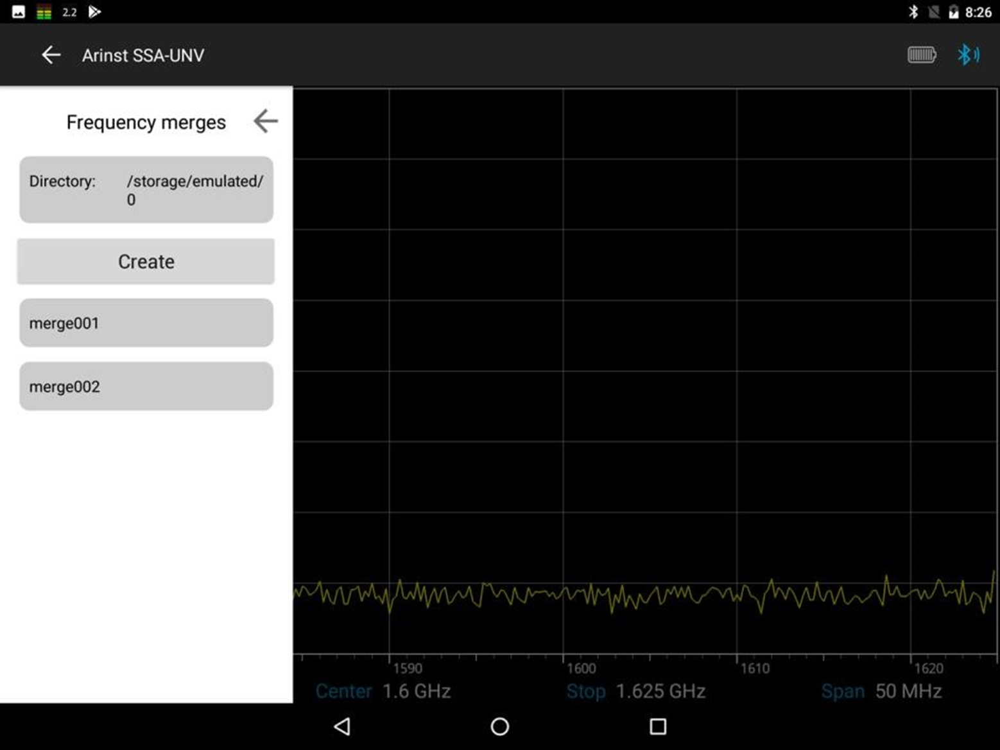

* В поле **Name** введите название нового списка диапазонов, например **Downlink**, как показано на рисунке 80.

  **Примечание**. По умолчанию, новым спискам частотных диапазонов автоматически присваивается название **merge** с указанием порядкового номера. Например, merge003.

 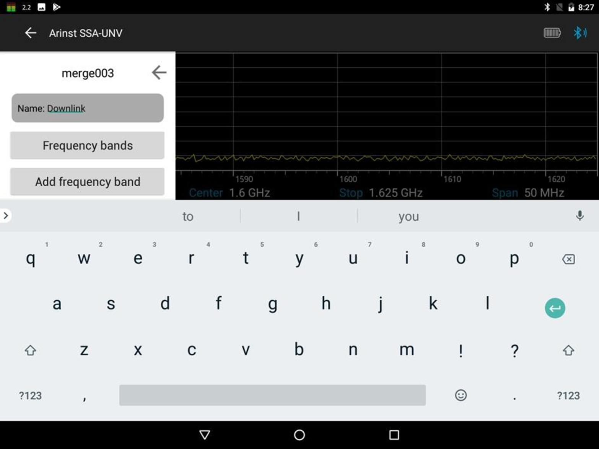

* Задайте диапазоны частот, которые будут входить в новый список (*в нашем примере Downlink*). Диапазоны частот можно задать двумя способами:

  а) Нажав на кнопку **Frequency bands** (рисунок 80), выберите желаемые диапазоны из списка предустановленных диапазонов, как показано на рисунке 81. *В нашем примере выбраны диапазоны GSM Downlink, DCS Downlink и CDMA 450 Downlink*.

 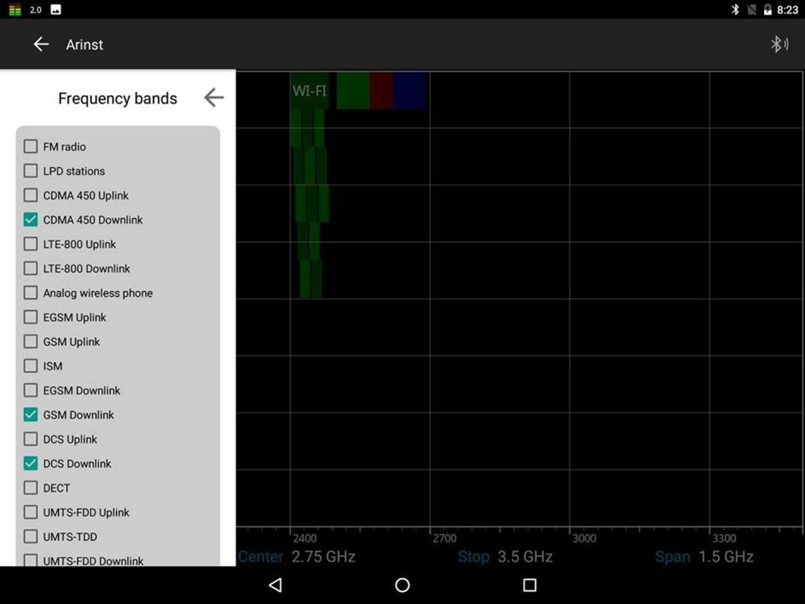

б) Непосредственно введя частоты диапазона. Для этого нажмите **Add frequency band** (рисунок 80), и в открывшемся меню введите начальную **Start** и конечную **Stop** частоту диапазона, как показано на рисунке 82. *В нашем примере введен диапазон частот UMTS-FDD Downlink. Для внесения в список диапазона введенных частот,* нажмите **Add**.

 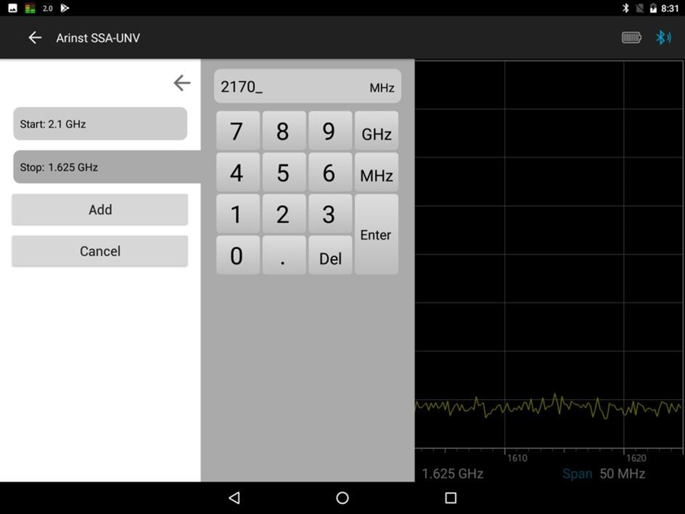

* Вернитесь в раздел меню **Frequency merges** и выберите созданный список диапазонов, как показано на рисунке 83. В нашем примере список **Downlink**. В открывшейся вкладке помимо названия списка, отображается перечень частотных диапазонов.

 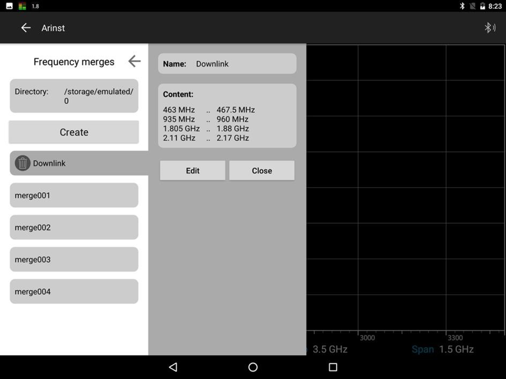

Для редактирования списка частотных диапазонов (добавления новых диапазонов или удаления имеющихся), нажмите **Edit**, для закрытия вкладки нажмите **Close**. Для отображения на экране планшета/смартфона графиков частот из созданного списка диапазонов, нажмите **Load**.

 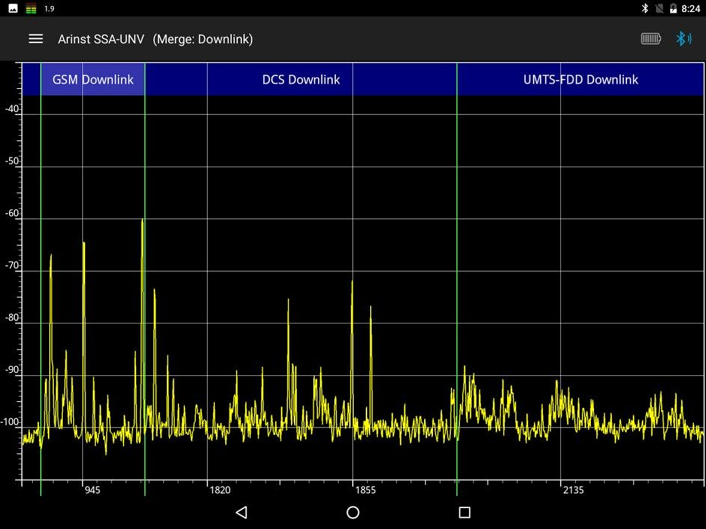

* Для выхода из режима отображения списка диапазонов, проведите пальцем слева направо от края экрана планшета/смартфона и в открывшемся меню **Frequency merges** в активной вкладке списка диапазонов нажмите **Unload**, рисунок 85.

 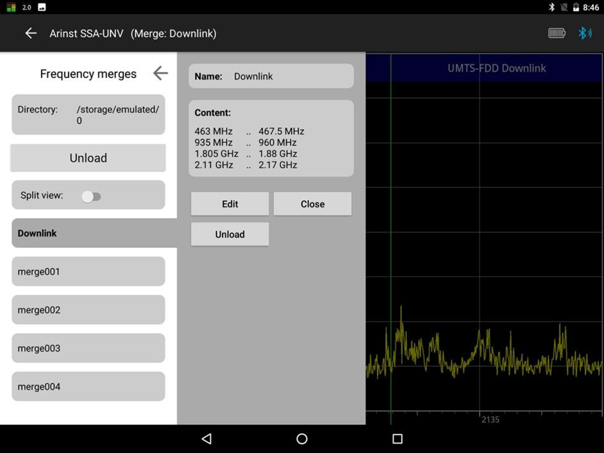

* Для отображения каждого диапазона в отдельном окне, включите опцию **Split view** (Рисунок 85). Экран вашего планшета/смартфона будет разбит на отдельные графики частотных диапазонов, как на рисунке 86.

 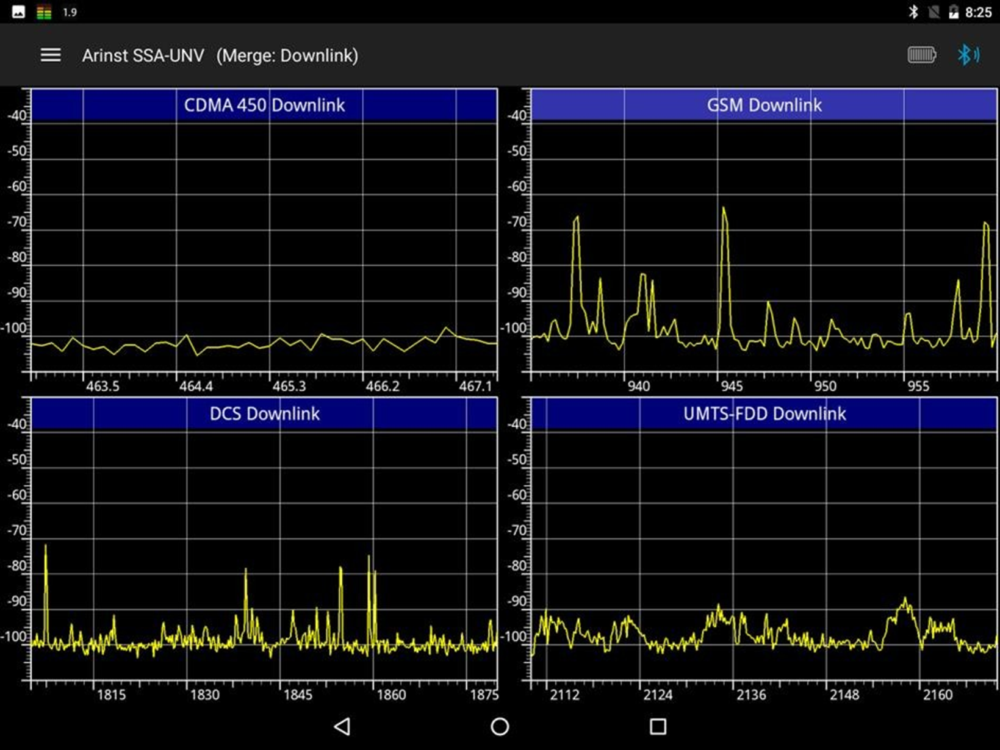

### ***Наведение антенн с использованием прибора***

* В процессе установки антенн с высоким коэффициентом усиления, необходимо уделять повышенное внимание точности наведения антенны на базовую станцию. Настройка угла и направления антенны с помощью модема, часто бывает затруднена, из-за низкой скорости обновления данных и низкой точности измерения уровня мощности сигнала модемом. Точное наведение антенны на базовую станцию за минимальное время, возможно с применением анализатора спектра.
* Установите антенну на ее крепление. Произведите предварительную настройку угла и направления антенны на базовую станцию. Закрепите антенну в этом положении, но крепления не затягивайте, обеспечив, таким образом, возможность перемещения антенны для точной настройки.
* Подключите антенну к антенному входу **RF IN** прибора. Включите прибор, подключите к прибору планшет/смартфон. Запустите программу управления и войдите в меню установки диапазона частот **Frequency** и установите диапазон частот. Диапазон частот устанавливается либо выбором из предустановленных диапазонов в меню **Frequency bands** (рисунок 87),

 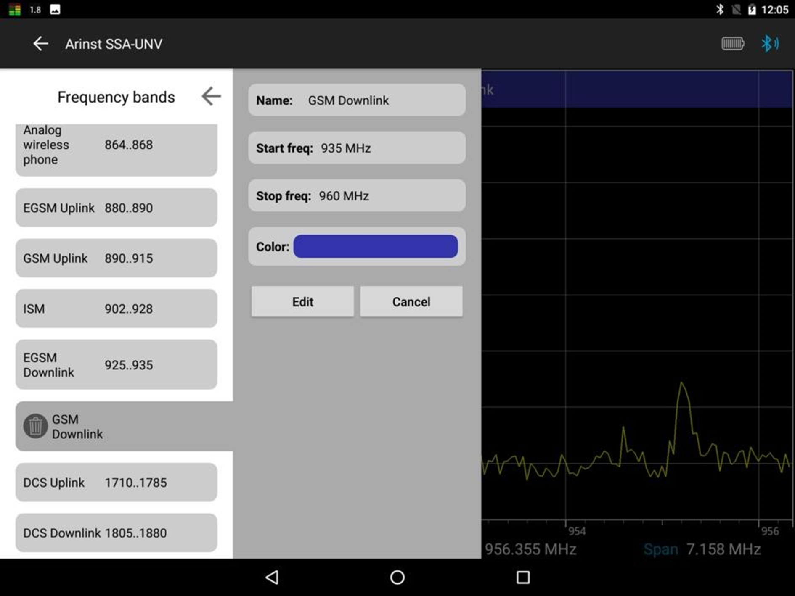

либо путем ввода начальной Start и конечной Stop частот диапазона, как на рисунке 88.

 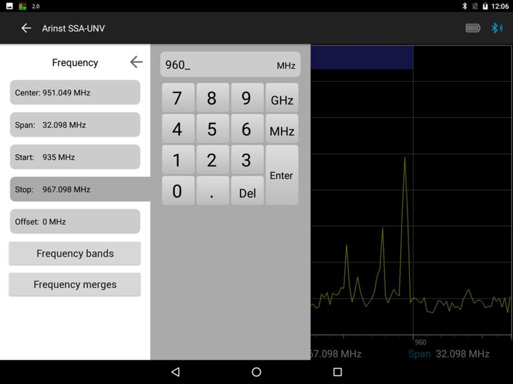

* Войдите в меню статистической и математической обработки отображаемых данных **Trace**, установите режим **Max Hold** для отображения усредненных максимальных измерений как показано на рисунке 89. Кнопками **«-»** и **«+»** установите бесконечное (∞) число сканирований и нажмите кнопку запуска **Run**.

 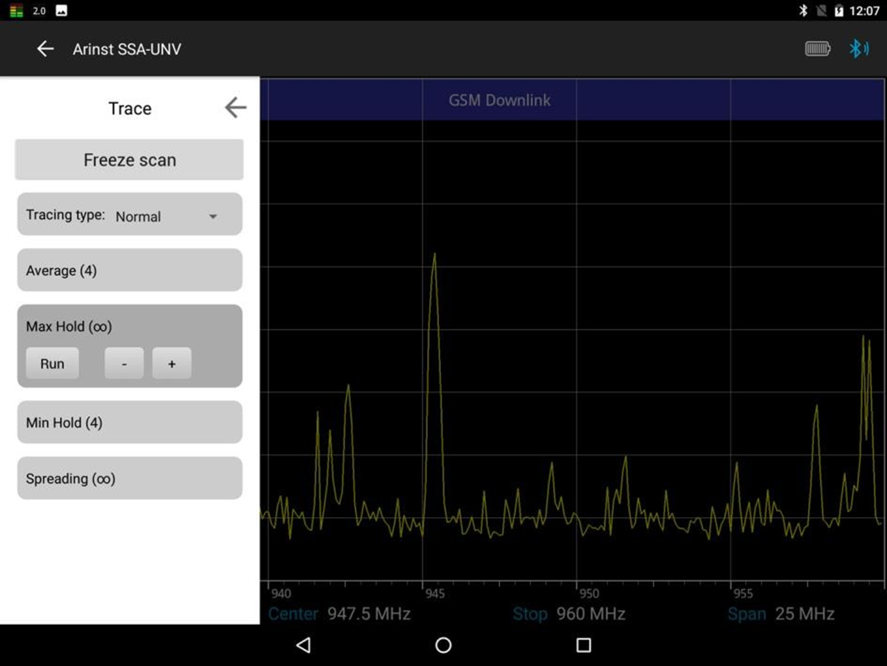

* На экране планшета/смартфона красным цветом будет отображаться усредненный максимальный уровень сигнала, рисунок 90.

 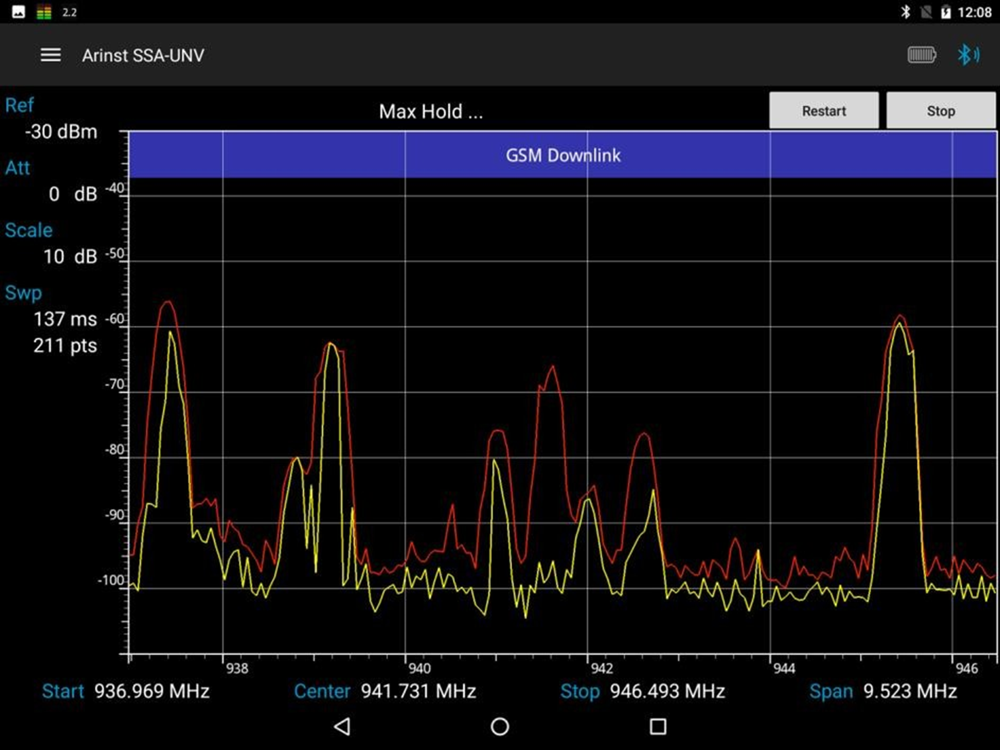

* Перемещайте антенну, наблюдая за изменением максимального значения сигнала (красная линия на графике). Наведение антенны будет завершено, когда красная линия на графике перестанет увеличивать свое значение. Зафиксируйте антенну, затянув элементы крепления.

## ***Уход и обслуживание***

### ***Общий уход за прибором***

* При проведении работ с прибором, используйте переходники из комплекта поставки, для защиты высокочастотных разъемов прибора от излишнего износа.
* Производя измерения АЧХ активных устройств (усилителей, репитеров, ретрансляторов, конвертеров) используйте внешние аттенюаторы (не входят в комплект поставки), для предотвращения повреждения входной цепи прибора.
* При проведении работ, не допускайте попадания в прибор влаги и пыли.
* По окончании работ с прибором, выключите прибор, отсоедините от него все подключенные кабели и разъемы. Протрите прибор чистой ветошью. Сильные загрязнения удалите ветошью смоченной в мыльном растворе. Для очистки прибора рекомендуется использовать влажные салфетки бытового назначения. Не используйте для очистки экрана и корпуса прибора растворители на основе спирта или нефтепродуктов! Эти жидкости могут повредить внешнее покрытие экрана и корпуса изделия.
* Зарядите аккумулятор прибора согласно следующему далее пункту.

### ***Зарядка аккумулятора***

* Для зарядки прибора, рекомендуется применять стабилизированный блок питания с выходным напряжением 5 В и током не менее 500 мА. При невозможности использования такого источника питания, произведите зарядку аккумулятора прибора от компьютера или ноутбука.
* Подключите сетевой кабель из комплекта поставки к разъему mini-USB (8) прибора. Второй конец кабеля подключите к USB разъему блока питания или USB разъему компьютера (ноутбука).
* Включение светодиодного индикатора (7) **«CHARGE»**, информирует о начале процесса зарядки аккумулятора. Процесс зарядки аккумулятора займет около 5 часов.

:::tip
Допускается работа прибора во время зарядки аккумулятора. При подключении прибора, при помощи USB кабеля к компьютеру или другому устройству (ноутбуку, планшету), зарядка аккумулятора начнется автоматически.

:::

* По окончанию зарядки, светодиодный индикатор (7) **«CHARGE»** погаснет, информируя о завершении процесса зарядки.

:::tip
В зависимости от индивидуальных параметров контроллера встроенного в прибор аккумулятора, по окончанию зарядки светодиодный индикатор (7) **«CHARGE»** может не гаснуть, а продолжать светиться вполнакала или мигать.

:::

### ***Замена аккумулятора***

* По истечении определенного периода, емкость Li-Ion аккумулятора снижается, и длительное использование прибора без подзарядки становится затруднительным.
* Замена аккумулятора необходима при наличии следующих проявлений неисправности:
  * аккумулятор очень быстро заряжается и очень быстро разряжается;
  * аккумулятор очень долго заряжается (более 8 часов);
  * аккумулятор не принимает заряд;
  * прибор не включается в автономном режиме (с отключенным шнуром зарядного устройства).
* Для замены, необходимо приобрести новый Li-Ion аккумулятор с рабочим напряжением 3,7 В, ёмкостью не менее 2000 мА и габаритными размерами не более: высота 4 мм, длина 80 мм, ширина 50 мм (рисунок 91).

:::tip
Приобретая и устанавливая аккумулятор ёмкостью, отличной от ёмкости установленного на заводе, следует принять во внимание тот факт, что время зарядки аккумулятора, тоже изменится в большую или меньшую сторону.

:::

 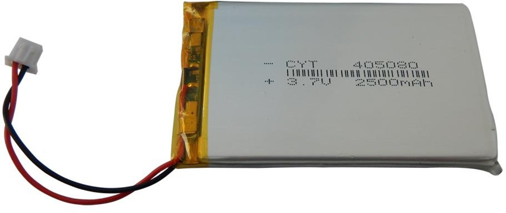

:::warning
**Для замены аккумулятора, потребуется разборка прибора. Убедитесь в наличии инструмента, знаний и квалификации, достаточных для проведения самостоятельного ремонта прибора. При недостатке опыта и квалификации, обратитесь к специалистам с соответствующей квалификацией.**

:::

* Вывинтите 4 винта (16) передней крышки (17) прибора. Затем вывинтите 2 верхних винта (16) задней крышки (18) прибора. (Рисунок 92).

 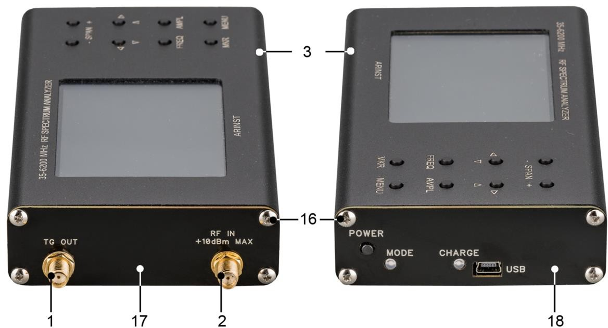

* Осторожно снимите верхнюю часть корпуса (3) прибора. Выдвиньте по направляющим пазам из нижней части корпуса (3), в сторону высокочастотных разъемов (1) и (2) шасси прибора в сборе с печатной платой и модулями (экрана и кнопок управления).
* Аккумулятор (20) находится на шасси под модулем экрана и закреплен двухсторонним скотчем. Осторожно отсоедините разъем (19) аккумулятора от разъема, который расположен на печатной плате, под модулем кнопок управления (Рисунок 93). Извлеките старый аккумулятор (20) и удалите старый двусторонний скотч, которым он был прикреплен к шасси.

 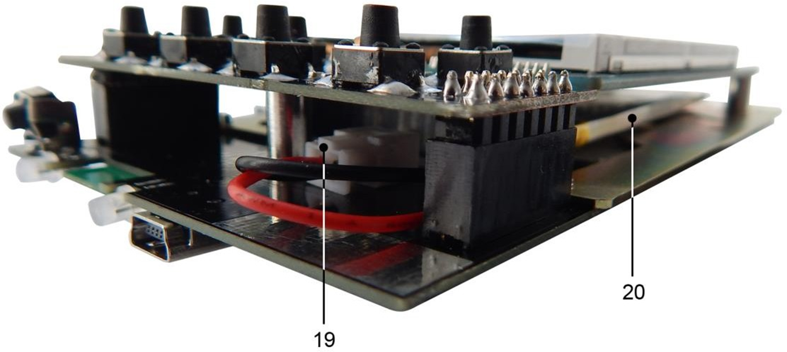

* Нанесите новый двусторонний скотч и надежно приклейте к нему новый аккумулятор (20). Подсоедините разъем (19) аккумулятора к разъему на плате. Произведите сборку прибора в обратной последовательности.
* После сборки прибора, произведите зарядку аккумулятора в соответствии с п. 10.2. настоящего «Руководства».

### ***Хранение и транспортировка***

* Храните прибор в сухом помещении при положительной температуре и относительной влажности воздуха не превышающей 75%.
* Перед сдачей прибора на хранение, зарядите аккумулятор.
* При длительном хранении, раз в 3 месяца производите подзарядку аккумулятора прибора. Температура окружающего воздуха, при которой хранится прибор, может оказывать существенное влияние на скорость саморазряда аккумулятора.
* Храните прибор и принадлежности к нему, в недоступном для детей месте.
* При транспортировке прибор должен быть надежно закреплен. Тряска, удары и падения могут привести к выходу прибора из строя.

### ***Критерий предельного состояния***

* Критерием предельного состояния прибора является признак, или совокупность признаков, при достижении которых:
  * дальнейшая эксплуатация прибора недопустима;
  * восстановление до работоспособного состояния невозможно или экономически нецелесообразно.
* По достижении предельного состояния, прибор должен быть снят с эксплуатации и утилизирован.

### ***Утилизация***

* Прибор, аккумулятор, шнуры и кабели, вышедшие из строя, должны быть переданы в специальные приемные пункты по утилизации электронных устройств. Не выбрасывайте вышедшие из строя приборы, аккумуляторы, кабели в бытовые отходы!

## ***Возможные неисправности и методы их устранения***

При возникновении неисправностей в работе прибора, проверьте возможные причины неисправности в таблице 5.

Таблица 5. Проявление неисправности

| Проявление неисправности | Возможная причина | Способ устранения |
|----|----|----|
| 1. Прибор не включается | Разряжен аккумулятор | Зарядите аккумулятор |
|    | Неисправна кнопка выключателя**POWER** | Обратитесь в сервисный центрдля ремонта |
| 2. Прибор не включается в автономном режиме | Неисправен аккумулятор | Замените аккумулятор |
| 3. Мало время автономной работы прибора | Прибор эксплуатируется при чрезмерно низких температурахокружающего воздуха | Эксплуатируйте прибор при температуре окружающеговоздуха от 0 до + 50 °С |
|    | Разряжен аккумулятор | Зарядите аккумулятор |
|    | Неисправен аккумулятор | Замените аккумулятор |
| 4. Экран прибора не реагируетна прикосновения или реагируетс задержкой | Прибор эксплуатируется при чрезмерно низких температурахокружающего воздуха | Эксплуатируйте прибор притемпературе окружающеговоздуха от 0 до + 50 °С |
|    | Неисправен экранный модуль прибора | Обратитесь в сервисный центрдля ремонта |
| 5. Экран прибора не светится индикатор режима работы **MODE мерцает** | Неисправен экранный модуль прибора | Обратитесь в сервисный центрдля ремонта |
| 6. Прибор не поддерживает соединение с внешними устройствами по Bluetooth | Не включена передача данных по Bluetooth на внешнемустройстве | Включите передачу данных всоответствии с пунктом [Меню управления прибором](#меню-управления-прибором-при-помощи-других-устройств)[при помощи других устройств](#меню-управления-прибором-при-помощи-других-устройств) |
|    | Не включена передача данных по Bluetooth на внешнемустройстве | Подключите внешнее устройство в соответствии пункту [Подключение прибора](#подключение-прибора-к-внешнему-устройству)[к внешнему устройству](#подключение-прибора-к-внешнему-устройству) |
|    | Устаревшее программное обеспечение и/или операционнаясистема внешнего устройства | Обновите ПО и ОС внешнего устройства. Убедитесь, что конфигурация внешнего устройства соответствует [Требованиям к внешнему](#требования-к-внешним-устройствам)[устройству](#требования-к-внешним-устройствам) |
| 7. К антенному входу **RF IN** прибора подключено оборудование/устройство, а наэкране прибора нет отображения сигнала | Выбран неверный режимизмерения или задан неверныйдиапазон частот исследуемогосигнала | Установите правильный режимизмерений или задайтеправильный диапазон исследуемых частот сигнала |
|    | Нет контакта между кабелем оборудования и разъёмом антенного входа **RF IN** прибора | Обеспечьте надежный контакткабелей исследуемого оборудования с разъемамиприбора |
|    | Неисправна входная цепьприбора | Обратитесь в сервисный центрдля ремонта |
| 8. Низкая или полностью исчезнувшая чувствительностьприбора | Неисправна входная цепь прибора вследствие превышениямаксимальной допустимоймощности сигнала на входе **RF IN** | Обратитесь в сервисный центрдля ремонта |

## ***Гарантийные обязательства***

Производитель гарантирует соответствие данного изделия техническим характеристикам, указанным в настоящем документе.

Гарантийный срок эксплуатации составляет 12 месяцев с даты продажи. В течение этого срока предприятие-изготовитель обеспечивает бесплатное гарантийное обслуживание.

Гарантийные обязательства не распространяются на следующие случаи:

\- гарантийный срок изделия со дня продажи истек;

\- изделие, предназначенное для личных нужд, использовалось для осуществления коммерческой деятельности, а также в иных целях, не соответствующих его прямому назначению;

\- нарушения правил и условий эксплуатации, изложенных в Руководстве пользователя и другой документации, передаваемой Покупателю в комплекте с изделием;

\- при наличии в Товаре следов неквалифицированного ремонта или попыток вскрытия вне авторизованного сервисного центра, а также по причине несанкционированного вмешательства в программное обеспечение;

\- повреждения (недостатки) Товара вызваны воздействием вирусных программ, вмешательством в программное обеспечение, или использованием программного обеспечения третьих лиц (неоригинального);

\- дефект вызван действием непреодолимых сил (например, землетрясение, пожар, удар молнии, нестабильность в электрической сети), несчастными случаями, умышленными, или неосторожными действиями потребителя или третьих лиц;

\- механические повреждения (трещины, сколы, отверстия), возникшие после передачи изделия Покупателю;

\- повреждения, вызванные воздействием влаги, высоких или низких температур, коррозией, окислением, попаданием внутрь изделия посторонних предметов, веществ, жидкостей, насекомых;

\- дефект возник из-за подачи на входные разъемы, клеммы, корпус сигнала, превышающего допустимые для данного Товара значения;

\- дефект вызван естественным износом Товара (например, но не ограничиваясь: естественный износ разъемов из-за частого подключения/отключения переходников).

Гарантийные обязательства распространяются только на дефекты, возникшие по вине предприятия-изготовителя. Гарантийное обслуживание выполняется предприятием-изготовителем.

## ***Приложение А***

### ***Подключение анализатора спектра Arinst SSA к устройствам под управлением операционной системы WINDOWS***

#### ***Требования*** *к устройствам*

* Для надежного и устойчивого соединения с анализатором спектра, устройства управляемые операционной системой Windows должны соответствовать следующим требованиям:
  * Операционная система Windows 7 или выше.
  * Полная аппаратная поддержка видеокартой спецификации OpenGL версии 2.1 и выше.
  * Установлена последняя версия Java Virtual Machine. Скачать последнюю версию можно на официальном сайте корпорации ORACLE.
  * Установленный, подключенный и настроенный Bluetooth-адаптер (для беспроводного управления анализатором спектра через протокол обмена информацией Bluetooth).

#### ***Установка приложения на ПК для управления анализатором спектра***

* Зайдите на официальный сайт ARINST, введя в адресной строке вашего браузера адрес [www.arinst.ru](http://www.arinst.ru). Перейдите в раздел **СКАЧАТЬ** и кликните по актуальной рекомендуемой версии ПО для управления анализатором спектра при помощи компьютеров под управлением ОС семейства Window (Рисунок А1).

 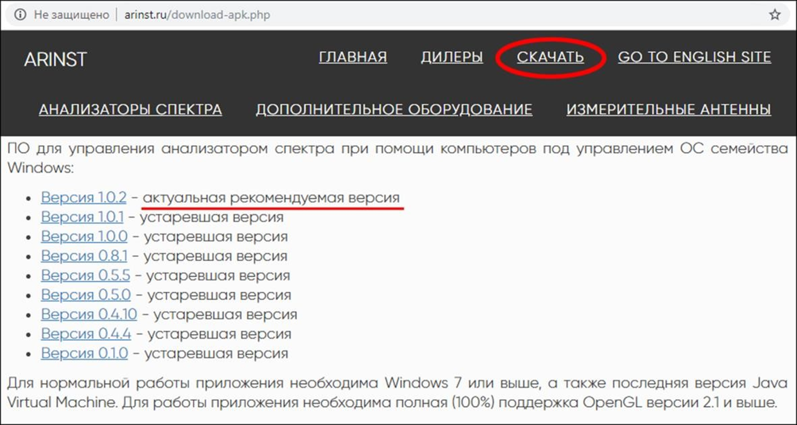

* Укажите путь, куда должен быть загружен сжатый (архивный) файл с приложением и нажмите кнопку **Сохранить** (Рисунок А2).

  *В нашем примере загружается архивный файл «ArinstSSADesktopClientInstaller v1.0.2» с по- следней актуальной версией ПО на момент написания настоящего Приложения.*

 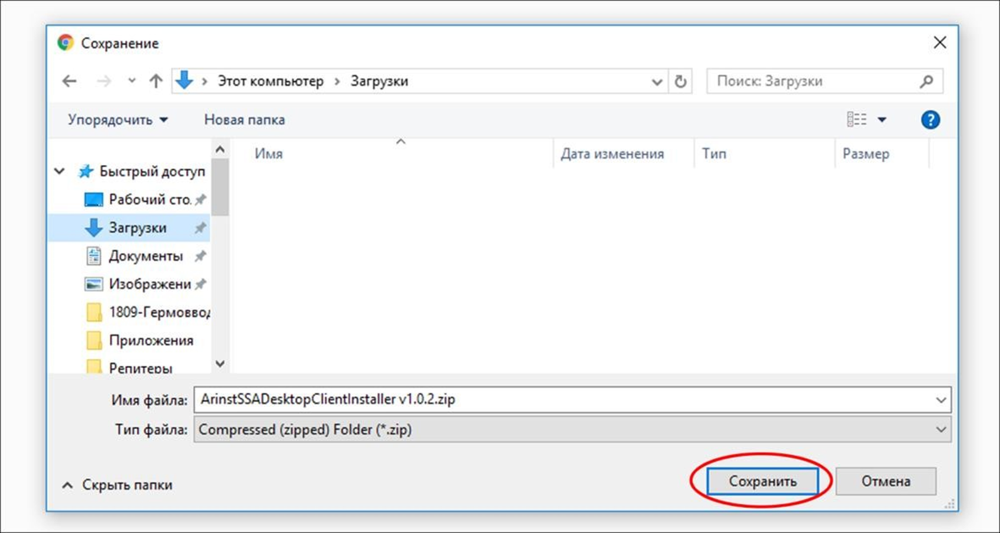

* Войдите в директорию, в которую был загружен сжатый (архивный) файл и разархивируйте его при помощи программ-архиваторов (Рисунок А3).

  В разархивированном файле *«ArinstSSADesktopClientInstaller v1.0.2»* находятся 2 объекта:
  * Папка с драйверами для создания виртуального порта virtual_com_port_driver_pc.
  * Установочный   файл   приложения   для управления анализатором при помощи ПК ArinstSSADesktopClientInstaller.exe.

 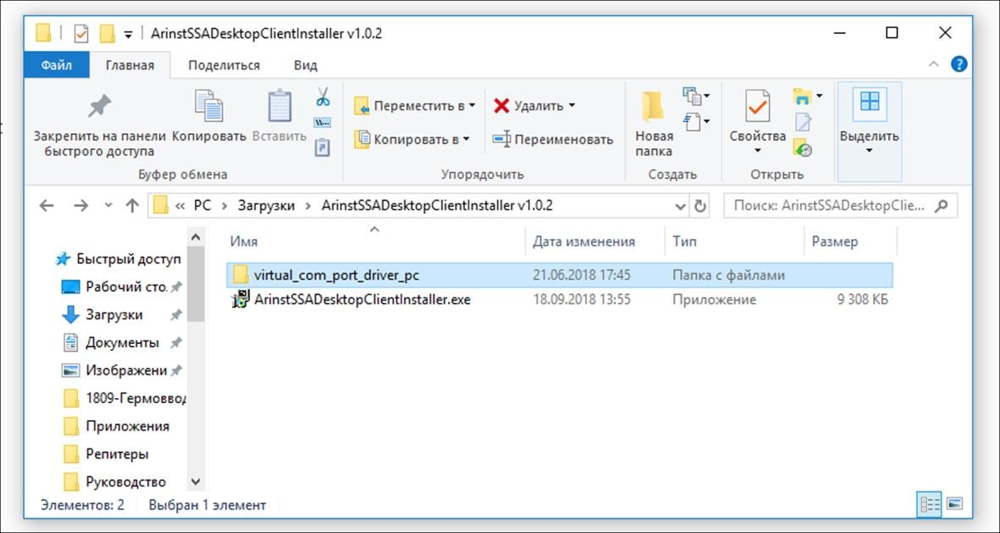

* Произведите установку приложения Arinst SSA для управления анализатором спектра при помощи ПК. Для этого дважды кликните по установочному файлу приложения ArinstSSADesktopClientInstaller.exe.

  В диалоговом окне установки, при необходимости укажите путь к директории, в которой должно быть установлено приложение, нажав кнопку **Browse**. Выбрав место установки приложения, нажмите кнопку **Install** (Рисунок А4).

 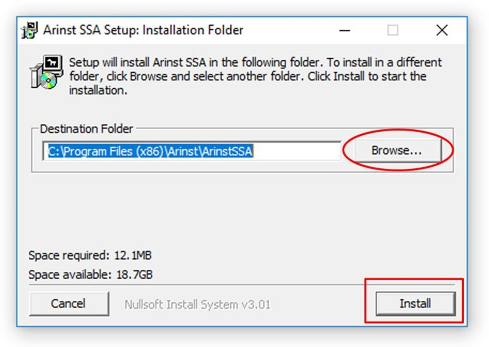

* По окончании установки закройте диалоговое окно, нажав кнопку **Close**. На рабочем столе вашего ПК появится ярлык запуска приложения Arinst SSA.
* Войдите в папку с драйверами для создания виртуального порта virtual_com_port_driver_pc (рисунок А5). В папке находятся драйвера для 32-разрядных и 64-разрядных операционных систем Windows.

:::tip
Чтобы определить, какая операционная система Windows (32-разрядная или 64-разрядная) установлена на вашем ПК, выполните:

:::

**Для Windows 7:**

\- Нажмите кнопку **Пуск**, кликните правой кнопкой мыши **Компьютер**, а затем выберите **Свойства**.

\- В разделе **Система** посмотрите, какой тип системы указан.

Для **Windows 8.1** и **Windows 10**:

\- Нажмите кнопку **Пуск** и выберите: **Параметры → Система → О системе**.

\- В разделе **Характеристики устройства** посмотрите, какой указан **Тип системы**.

 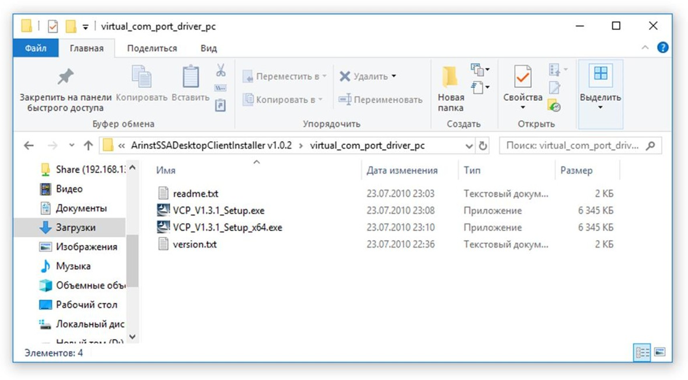

* Дважды кликните по файлу драйвера, соответствующему вашей операционной системе Windows. Запустится мастер установки драйверов устройств (Рисунок А6). Для продолжения установки нажмите кнопку **Далее** (Next). Для отказа от установки нажмите кнопку **Отмена** (Cancel).

 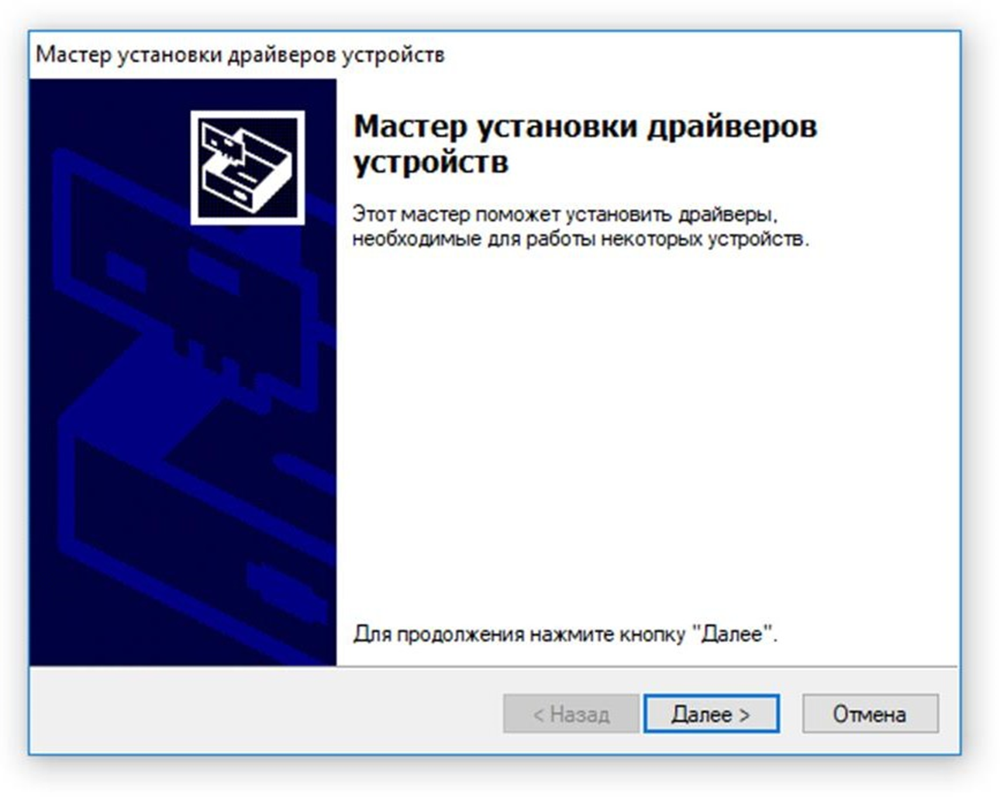

* Дождитесь завершения работы мастера установки драйверов устройств. В окне будет приведено имя драйвера (**STMicroelectronics Virtual COM Port**) и его состояние. Нажмите кнопку **Готово** для выхода из мастера установки драйверов устройств.

### ***Подключение анализатора спектра к ПК через USB кабель***

* Подключите анализатор спектра к вашему ПК под управлением операционной системы Windows, используя кабель USB 2.0 – mini-USB. Включите анализатор спектра, нажав кнопку (5) **POWER**.
* Запустите приложение Arinst SSA, дважды кликнув по ярлыку расположенному на рабочем столе вашего ПК.

 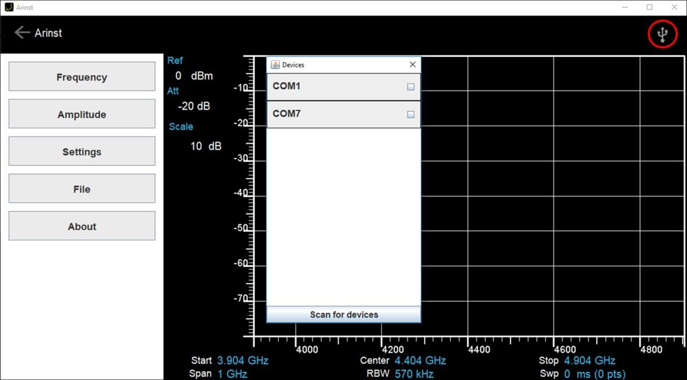

* В открывшемся окне приложения Arinst SSA кликните по символу USB соединения, расположенному в правом верхнем углу. В появившемся окне **Devices** выберите созданный виртуальный порт для подключения вашего прибора (Рисунок А7). Обзор портов ПК производится кнопкой **Scan for devices**.

:::tip
Чтобы определить созданный виртуальный порт, к которому должен быть подключен анализатор спектра, выполните:

:::

**Для Windows 7**:

\- Нажмите кнопку **Пуск**, кликните правой кнопкой мыши **Компьютер**, а затем выберите **Управление.**

**-** В открывшемся меню выберите **Диспетчер устройств** и развернув строку **Порты (СОМ и LPT)** посмотрите номер порта с именем **STMicroelectronics Virtual COM Port.**

Для **Windows 8.1** и **Windows 10**:

\- Наведите курсор на кнопку **Пуск** и кликните по ней правой кнопкой мыши, а затем выберите.

**Диспетчер устройств.**

\- Разверните строку **Порты (СОМ и LPT)** и посмотрите номер порта с именем **STMicroelec- tronics Virtual COM Port.**

*В нашем примере на рисунке А8 созданный виртуальный порт с именем* **STMicroelectronics Virtual COM Port** *обозначен как СОМ 7*.

 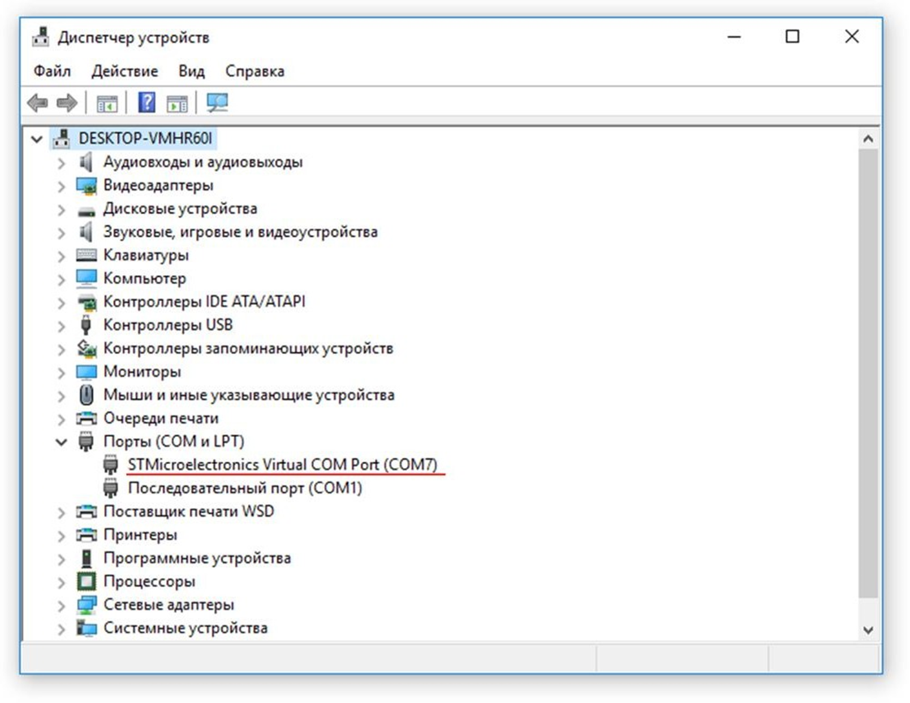

* Нажав на номер порта соответствующий созданному виртуальному порту с именем **STMicroelectronics Virtual COM Port** (*в нашем примере обозначенному как СОМ 7*) закройте окно **Devices**. Произойдет соединение по USB кабелю прибора с ПК. На мониторе ПК в приложении Arinst SSA появится график исследуемого сигнала (Рисунок А9), экран (4) анализатора спектра для экономии заряда аккумулятора погаснет. Интерфейс программы управления анализатором спектра аналогичен интерфейсу, описанному в разделе 8 настоящего Руководства по эксплуатации.
* Для отсоединения анализатора спектра от ПК, в окне приложения Arinst SSA кликните по символу USB соединения, расположенному в правом верхнем углу. В появившемся окне **Devices** нажмите на созданный виртуальный порт для подключения вашего прибора. Закройте окно **Devices**. Анализатор спектра будет отключен от ПК и его экран (4) включится.
* По окончании работы отключите анализатор спектра, нажав кнопку (5) **POWER**. Отсоедините USB кабель от анализатора спектра и от ПК.

 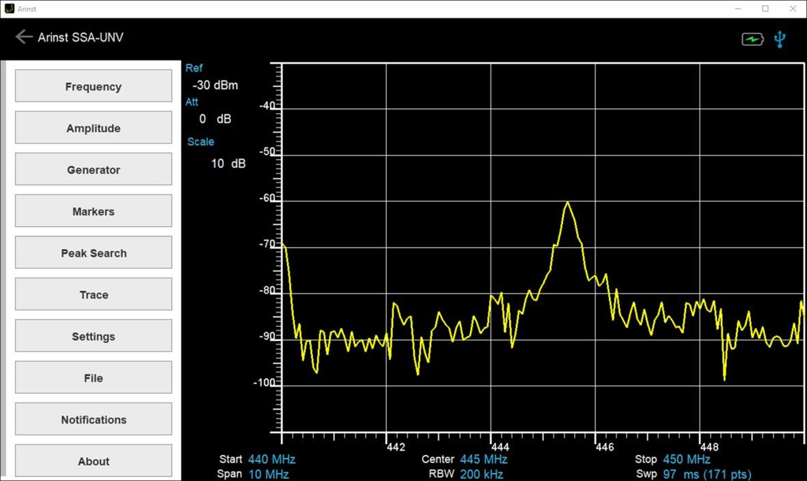

### ***Подключение анализатора спектра к ПК через Bluetooth***

:::warning
**Перед подключением анализатора спектра к ПК через беспроводное соединение Bluetooth убедитесь в том, что ваш ПК оснащен Bluetooth адаптером.**

:::

* Включите анализатор спектра, нажав кнопку (5) **POWER**. Зайдя в меню прибора, включите беспроводную передачу данных по протоколу Bluetooth согласно пункту [Меню управления прибором при помощи других устройств](#меню-управления-прибором-при-помощи-других-устройств).

 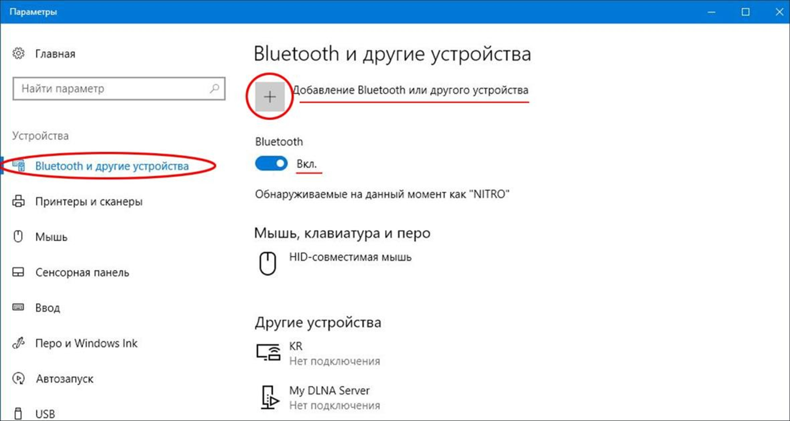

* Включите Bluetooth на вашем ПК. Для этого нажмите кнопку **Пуск** и выберите **Параметры** → **Устройства**.

  Переведите слайдер включения установленных на ПК устройств Bluetooth в положение **Вкл**. (Включено). Затем нажмите **Добавление Bluetooth или другого устройства** (Рисунок А10).
* Выберите тип устройства, которое необходимо добавить к списку устройств, которые могут быть подключены к вашему ПК (Рисунок А11).

 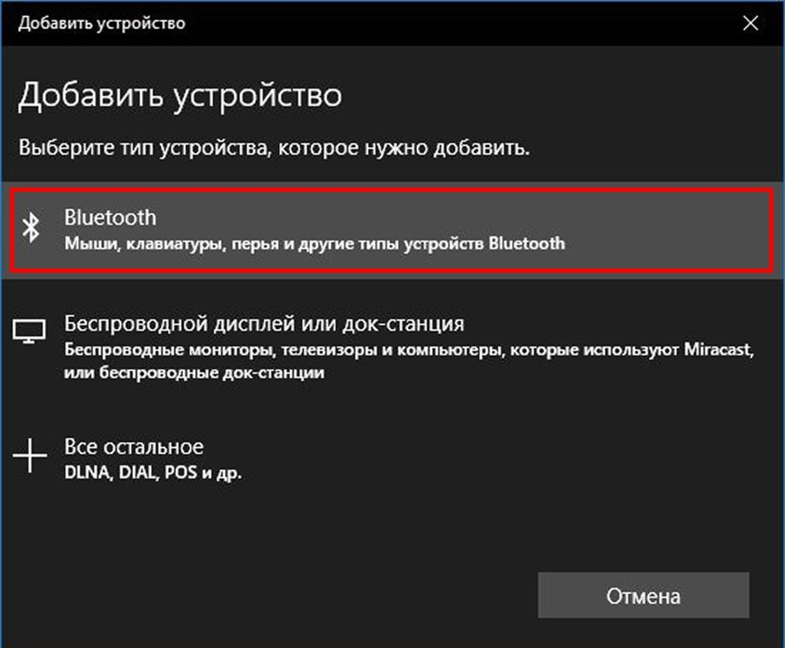

* Операционная система ПК проведёт поиск всех активных Bluetooth устройств. Доступные для подключения устройства будут отображены в списке (Рисунок А12).

 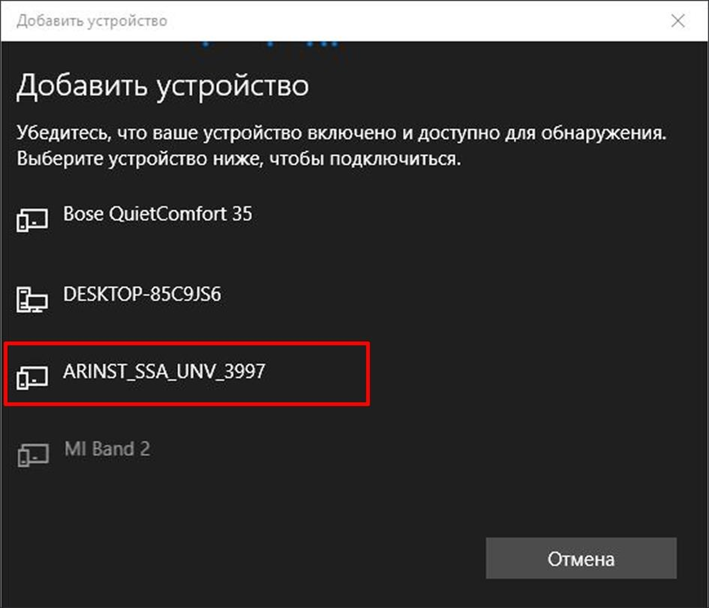

* Кликните по названию вашего устройства, которое необходимо подключить к ПК используя протокол обмена данными Bluetooth. Введите PIN-код (1234) и нажмите кнопку **Подключиться** (Рисунок А13). Анализатор спектра будет сопряжен с вашим ПК.

  *В нашем примере на рисунке А13, к ПК подключается анализатор спектра отображаемый как **ARINST_SSA_UNV_3997***.

 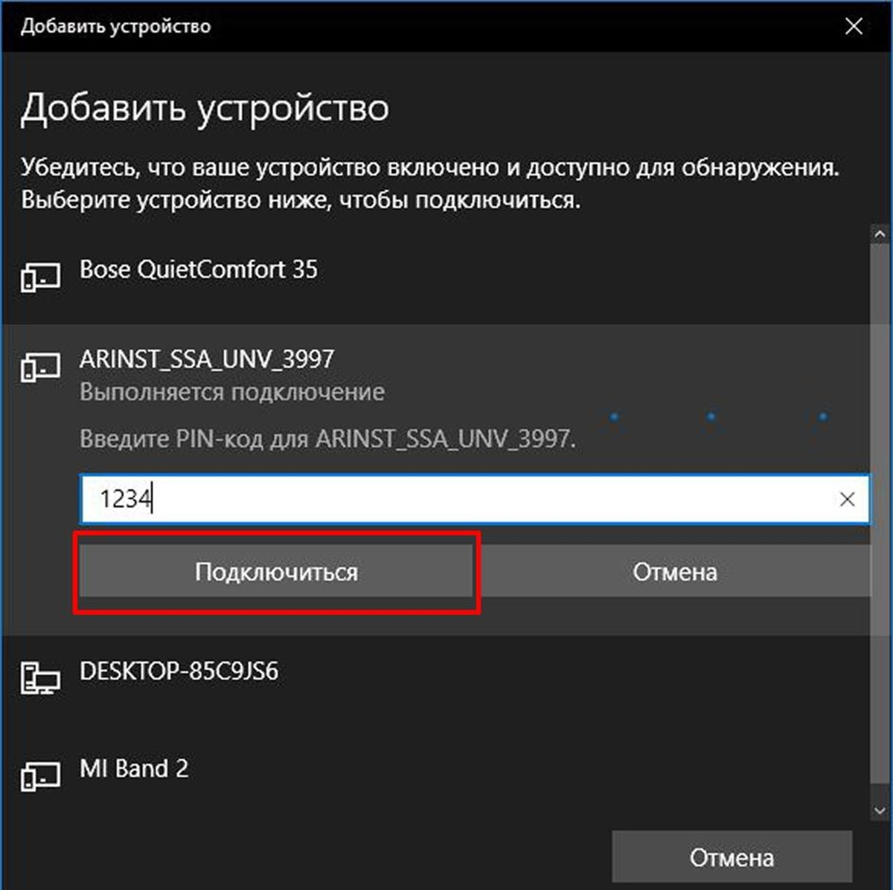

Запустите приложение Arinst SSA, дважды кликнув по ярлыку расположенному на рабочем столе вашего ПК. В открывшемся окне приложения Arinst SSA кликните по символу Bluetooth соединения, расположенному в правом верхнем углу. В появившемся окне **Devices** выберите название вашего анализатора спектра (Рисунок А14). Помимо названия прибора, в окне отображается его МАС-адрес. Обзор приборов ARINST, которые подключались к ПК через Bluetooth производится кнопкой **Scan for devices**.

 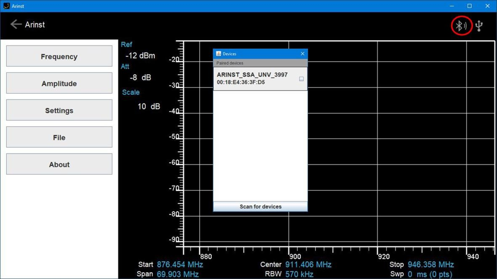

* Нажав на имя подключаемого к приложению анализатора спектра (*в нашем примере это **ARINST_SSA_UNV_3997***) закройте окно **Devices**. Произойдет соединение прибора с ПК по протоколу передачи данных Bluetooth. На мониторе ПК в приложении Arinst SSA появится график исследуемого сигнала (Рисунок А15), экран (4) анализатора спектра для экономии заряда аккумулятора погаснет. Интерфейс программы управления анализатором спектра аналогичен интерфейсу, описанному в разделе 8 настоящего Руководства по эксплуатации.

 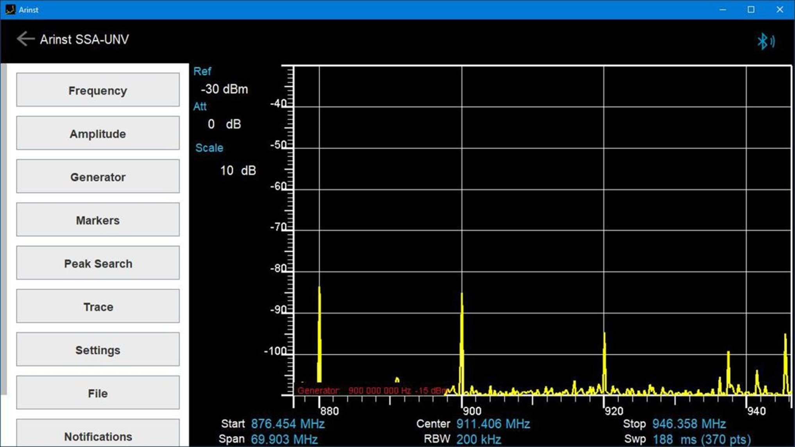

* Для отсоединения анализатора спектра от ПК, в окне приложения Arinst SSA кликните по символу Bluetooth соединения, расположенному в правом верхнем углу. В появившемся окне **Devices** нажмите на имя вашего прибора. Закройте окно **Devices**. Анализатор спектра будет отключен от ПК и его экран (4) включится.
* По окончании работы отключите анализатор спектра, нажав кнопку (5) **POWER**. Отключите Bluetooth на вашем ПК.

## ***Приложение Б***

### ***Технические характеристики анализаторов спектра Arinst снятых с производства***

#### ***Анализаторы спектра Arinst SSA TG и Arinst SSA***

* Портативный панорамный анализатор спектра со встроенным трекинг-генератором модели **Arinst SSA-TG** и портативный панорамный анализатор спектра без трекинг генератора **Arinst SSA** (далее анализатор, прибор) предназначен для:
  * отображения спектров сигналов в диапазоне частот от 36 до 5990 МГц;
  * определения амплитуды и частоты спектральных компонент, входящих в состав сигналов и измерения мощности сигнала в диапазоне частот от 36 до 3000 МГц;
  * проведения замеров АЧХ активных и пассивных устройств;
  * определение КСВ и модуля обратных потерь (коэффициента отражения).
* Прибор предназначен для работы под управлением внешних устройств:
  * смартфонов и планшетов под управлением ОС Android версии 4.1 и выше и поддерживающих стандарт USB OTG;
  * компьютеров и ноутбуков с ОС Windows 7 и выше.

**Примечание**. Описание интерфейса программы управления прибором при помощи устройств на базе операционной системы Android и Windows размещено в разделе 8 настоящего руководства по эксплуатации. Подробный алгоритм подключения анализатора спектра к устройствам под управлением операционной системой Windows изложен в [Приложении А](#приложение-а) настоящего руководства по эксплуатации.

На рисунке Б1 показан анализатор спектра **Arinst SSA TG** со встроенным трекинг генератором. Анализатор спектра **Arinst SSA** отличается отсутствием встроенного генератора сигнала и отсутствием высокочастотного разъёма **TG OUT**.

 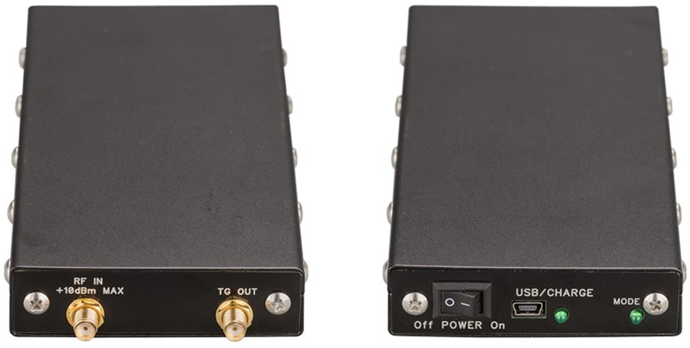

**RF IN** – Антенный вход

**USB** – Разъем mini-USB

**TG OUT** – Выход генератора сигналов

**CHARGE** – Индикатор зарядки аккумулятора

**POWER** – Выключатель прибора

**MODE** – Индикатор режима работы прибора

Таблица Б1 - Технические характеристики анализаторов спектра **Arinst SSA TG** и **Arinst SSA**

| Наименование параметра | Arinst SSA TG | Arinst SSA |
|----|:---:|:---:|
| Отображаемый диапазон частот | 36-5990 МГц | 36-5990 МГц |
| Измеряемый диапазон частот | 36-3000 МГц | 36-3000 МГц |
| Динамический диапазон для полосы36-3000 МГц | 70 дБ | 70 дБ |
| Максимальная полоса обзора | 1000 МГц | 1000 МГц |
| Полоса пропускания (ПЧ) фиксированная | 250 кГц | 250 кГц |
| Скорость сканирования при полосе обзораболее 100 МГц | 350 МГц/с | 350 МГц/с |
| Время обзора в полосе 100 МГц | < 0,3 с | < 0,3 с |
| Мин. длительность обнаруживаемого сигналапри полосе сканирования 10 МГц | 20 мс | 20 мс |
| Полка шума в полосе 36-3000 МГц | < -85 дБм | < -85 дБм |
| Волновое сопротивление  | 50 Ом | 50 Ом |
| КСВ в рабочем диапазоне частот | < 1,5 | < 1,5 |
| Внутренний аттенюатор | 0-30 дБ | 0-30 дБ |
| Ошибка при аттенюации до 10 дБ | 2 дБ | 2 дБ |
| Ошибка при аттенюации от 10 до 20 дБ | 5 дБ | 5 дБ |
| Ошибка при аттенюации от 20 до 30 дБ | 8 дБ | 8 дБ |
| Диапазон частот встроенного трекинг-генератора | 36-5990 МГц | - |
| Выходная мощность трекинг-генератора | -15…-25 дБм | - |
| Точность отображения сигнала в пределахдинамического диапазона | 2 дБ | 2 дБ |
| Максимальная мощность при аттенюаторе 0 дБ | + 10 дБм | + 10 дБм |
| Максимальная мощность при аттенюаторе > 20 дБ | + 20 дБм | + 20 дБм |
| Максимальный выходной измеряемый сигнал | + 10 дБм | + 10 дБм |
| Максимальное постоянное напряжение на входе | 25 В | 25 В |
| Максимальный потребляемый ток при работе от аккумулятора | 400 мА | 400 мА |
| Максимальный потребляемый ток при работе от USB (в режиме зарядки) | 500 мА | 500 мА |
| Ёмкость аккумулятора | 2000 мА∙ч | 2000 мА∙ч |
| Время непрерывной работы от аккумулятора | 2 ч | 2 ч |
| Время заряда аккумулятора | \~ 7 ч | \~ 7 ч |
| Габаритные размеры (ДхШхВ) | 170х80х22 мм | 170х80х22 мм |
| Масса | 0,4 кг | 0,4 кг |

Таблица Б2 – Комплект поставки **Arinst SSA TG** и **Arinst SSA**

| Наименование | Arinst SSA TG | Arinst SSA |
|----|:---:|:---:|
| Анализатор спектра | 1 шт. | 1 шт. |
| Переходник SMA(male) - SMA(female) | 2 шт. | 1 шт. |
| Кабель mini-USB - USB 2.0 | 1 шт. | 1 шт. |
| USB OTG кабель mini-USB - micro-USB | 1 шт. | 1 шт. |
| Паспорт | 1 экз. | 1 экз. |
| Упаковка | 1 шт. | 1 шт. |

#### ***Анализаторы спектра Arinst SSA TG LC и Arinst SSA LC***

* Портативный панорамный анализатор спектра со встроенным трекинг-генератором **Arinst SSA-TG LC** и портативный панорамный анализатор спектра без трекинг-генератора **Arinst SSA LC** (далее - анализатор, прибор) предназначены для:
  * отображения спектров сигналов в диапазоне частот от 36 до 5990 МГц;
  * определения амплитуды и частоты спектральных компонентов, входящих в состав сигналов и измерения мощности сигнала в диапазоне частот от 36 до 3000 МГц;
  * проведения замеров АЧХ активных и пассивных устройств, определение КСВ и модуля обратных потерь (коэффициента отражения) - только для Arinst SSA-TG LC.
* Прибор предназначен для работы под управлением внешних устройств:
  * смартфонов и планшетов под управлением ОС Android версии 4.1 и выше и поддерживающих стандарт USB OTG;
  * компьютеров и ноутбуков с ОС Windows 7 и выше.
* Прибор управляется смартфоном или планшетом под управлением ОС Android версии 4.1 и выше, поддерживающим стандарт USB OTG. Так как анализатор спектра не имеет собственного источника питания, питание прибора производится от источника питания (аккумулятора) смартфона или планшета к которому он подключен. Все измеренные прибором данные, в реальном времени передаются в смартфон или планшет через USB OTG кабель.
* Прибор может управляться ПК или ноутбуком, работающим под ОС Windows 7 и выше. Питание, управление прибором и передача данных осуществляется по USB-кабелю.

:::tip
Описание интерфейса программы управления прибором при помощи устройств на базе операционной системы Android и Windows размещено в разделе 8 настоящего руководства по эксплуатации. Подробный алгоритм подключения анализатора спектра к устройствам под управлением операционной системой Windows изложен в [Приложении А](#приложение-а) настоящего руководства по эксплуатации.

:::

На рисунке Б2 показан анализатор спектра **Arinst SSA TG LC** со встроенным трекинг генератором. Анализатор спектра **Arinst SSA LC** отличается отсутствием встроенного генератора сигнала и отсутствием высокочастотного разъёма **TG OUT**.

 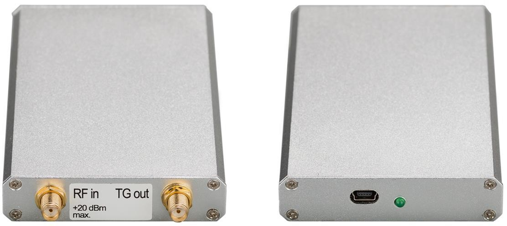

**RF IN** – Антенный вход

**TG OUT** – Выход генератора сигналов

Таблица Б3 - Технические характеристики анализаторов спектра **Arinst SSA TG LC** и **Arinst SSA LC**

| Наименование параметра | Arinst SSA TG LC | Arinst SSA LC |
|----|:---:|:---:|
| Отображаемый диапазон частот | 36-5990 МГц | 36-5990 МГц |
| Измеряемый диапазон частот | 36-3000 МГц | 36-3000 МГц |
| Динамический диапазон для полосы 36-3000 МГц | 70 дБ | 70 дБ |
| Максимальная полоса обзора | 1000 МГц | 1000 МГц |
| Полоса пропускания (ПЧ) фиксированная | 250 кГц | 250 кГц |
| Время обзора в полосе 100 МГц | < 0,3 с | < 0,3 с |
| Мин. длительность обнаруживаемого сигнала приполосе сканирования 10 МГц | 20 мс | 20 мс |
| Полка шума в полосе до 3000 МГц | < -85 дБм | < -85 дБм |
| Волновое сопротивление  | 50 Ом | 50 Ом |
| КСВ в рабочем диапазоне частот | < 1,5 | < 1,5 |
| Внутренний аттенюатор | 0-30 дБ | 0-30 дБ |
| Ошибка при аттенюации до 10 дБ | 2 дБ | 2 дБ |
| Ошибка при аттенюации от 10 до 20 дБ | 5 дБ | 5 дБ |
| Ошибка при аттенюации от 20 до 30 дБ | 8 дБ | 8 дБ |
| Диапазон частот встроенного трекинг-генератора | 36-5990 МГц | - |
| Выходная мощность трекинг-генератора | -15…-25 дБм | - |
| Точность отображения сигнала в пределахдинамического диапазона | 2 дБ | 2 дБ |
| Максимальная выходная мощность при аттенюаторе 0 дБ | + 10 дБм | + 10 дБм |
| Максимальная выходная мощностьпри аттенюаторе > 20 дБ | + 20 дБм | + 20 дБм |
| Максимальной выходной измеряемый сигнал | + 10 дБм | + 10 дБм |
| Максимальное постоянное напряжение на входе | 25 В | 25 В |
| Максимальный потребляемый ток | 350 мА | 350 мА |
| Габаритные размеры (ДхШхВ) | 122х67х16 мм | 122х67х16 мм |
| Масса | 0,2 кг | 0,2 кг |

Таблица Б4 – Комплект поставки Arinst SSA TG LC и Arinst SSA LC

| Наименование | Arinst SSA TG LC | Arinst SSA LC |
|----|:---:|:---:|
| Анализ спектра | 1 шт. | 1 шт. |
| Переходник SMA(male) - SMA (female) | 2 шт. | 1 шт. |
| Кабель mini-USB - USB 2.0 | 1 шт. | 1 шт. |
| USB OTG кабель mini-USB - micro-USB | 1 шт. | 1 шт. |
| Паспорт | 1 экз. | 1 экз. |
| Упаковка | 1 шт. | 1 шт. |
