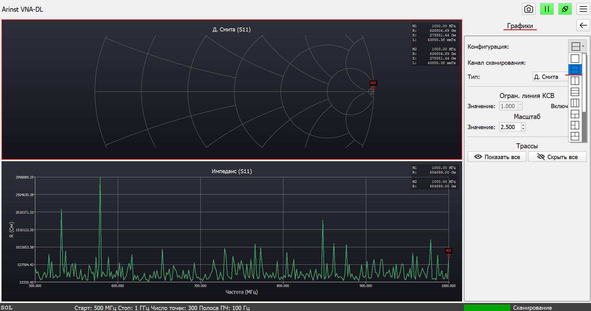
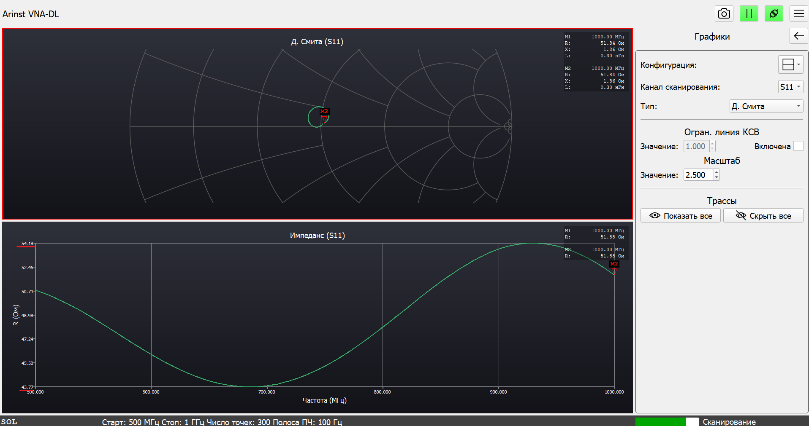
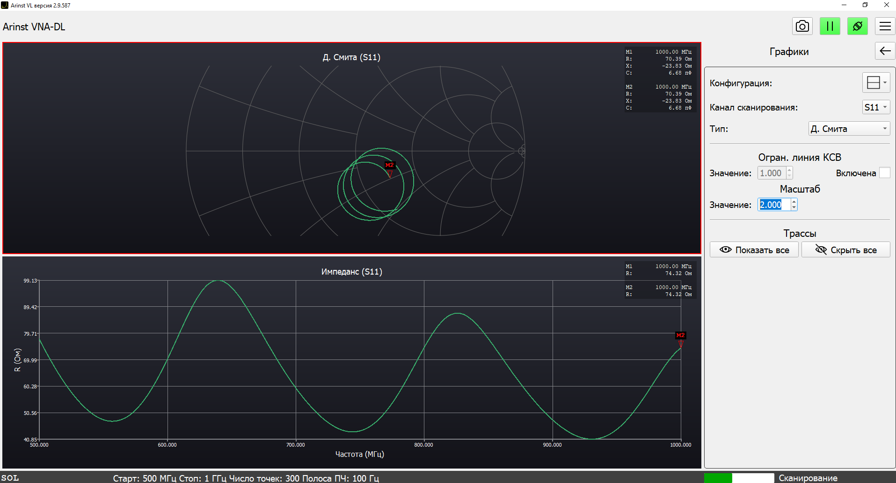
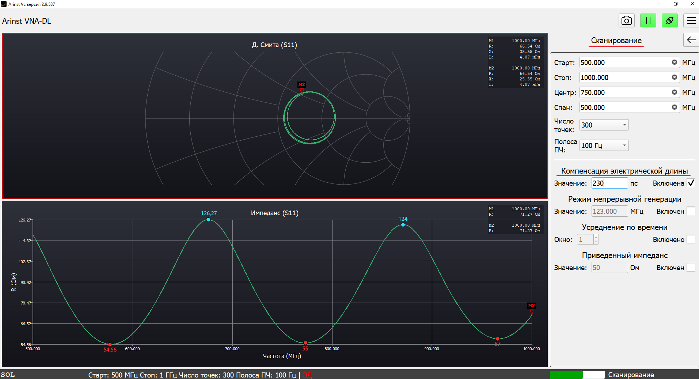

# Измерение импеданса кабеля с помощью прибора Arinst VNA-DL

Бывают такие моменты, когда в процессе работы вы можете столкнуться с "неизвестным" кабелем. Иначе говоря, кабелем характеристики которого вы частично или полностью не знаете. Решить эту проблему вам поможет векторный анализатор цепей **Arinst VNA-DL**. И конкретно в этой статье речь пойдёт о том, каким образом можно узнать импеданс "неизвестного" кабеля.

:::info
Для измерения нам понадобятся: заранее откалиброванный и подготовленный к работе анализатор, согласованная нагрузка (в нашем примере будет использоваться нагрузка 50 Ом) и сам "неизвестный" кабель.

:::

1. Первым шагом необходимо во вкладке "Сканирование" установить диапазон частот в котором будут проводиться измерения, для упрощения ориентирования в полученных результатах и большей наглядности мы выставляем диапазон частот от 500 до 1000 МГц.

    

    :::tip
    Вам рекомендуем выставлять диапазон частот в котором планируется работать с тестируемым кабелем, либо таким образом чтобы в полученный график укладывалось несколько длин волн.

    :::

2. Далее во вкладке "Графики" мы выбираем конфигурацию, при которой одновременно отображаются два графика. В данной инструкции мы будем использовать диаграмму Смита и график импеданса.

    

3. Теперь мы подключаем наш "неизвестный" кабель с установленной на нём согласованной нагрузкой и получаем необходимые графики.

    

   В случае тестируемого кабеля диаграмма Смита не нуждается в какой-либо компенсации. Поэтому мы можем используя максимальное и минимальное значения на графике импеданса узнать импеданс тестируемого кабеля. Для этого воспользуемся простой формулой:

   $$Z_к = \sqrt{Z_{min} \cdot Z_{max}} = \sqrt{54,18 \cdot 43,77}=48,70$$

   где $Z_к$ - искомая величина, импеданс "неизвестного кабеля"

   $Z_{min}$ и $Z_{max}$ - максимальное и минимальное значение на полученном графике импеданса.

   Полученное значение сопоставимо тестируемому кабелю с импедансом в **50 Ом**.

4. В виду многих погрешностей, будь то используемые в процессе измерения разъёмы или переходники, длинна или качество тестируемого кабеля, полученные графики могут нуждаться в дополнительной компенсации для более точного результата измерений.

5. Возьмем другой кабель и проведем аналогичные измерения с ним.

    

   Полученные графики обладают меньшей точностью, чем в предыдущем опыте, но мы можем скорректировать их с помощью пункта "Компенсация электрической длины" во вкладке "Сканирование".

   Для этого необходимо менять значение компенсации до того момента пока графики не примут наиболее "собранный" и "ровный" вид.

    

   После проведенной компенсации мы можем провести аналогичные предыдущему пункту вычисления:

   $$\sqrt{\frac{\color{turquoise}{126,27+124}}{2} \cdot \frac{\color{red}{54,56+55+57}}{3}}=82,18 \quad ОМ$$

    :::tip
    В данном случае на графике импеданса помещается более одной волны, для большей точности вычислений, можно использовать средние значения их минимумов и максимумов.

    :::

Полученное значение сопоставимо тестируемому кабелю с импедансом в 75 Ом.

Различие в результатах с предыдущем опытом заключается в описанных выше возможных причинах погрешности, но результат измерений тем не менее достаточен для определения импеданса тестируемого кабеля.
