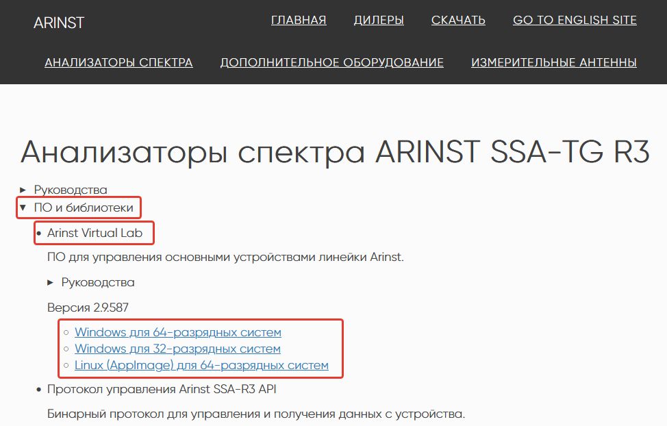
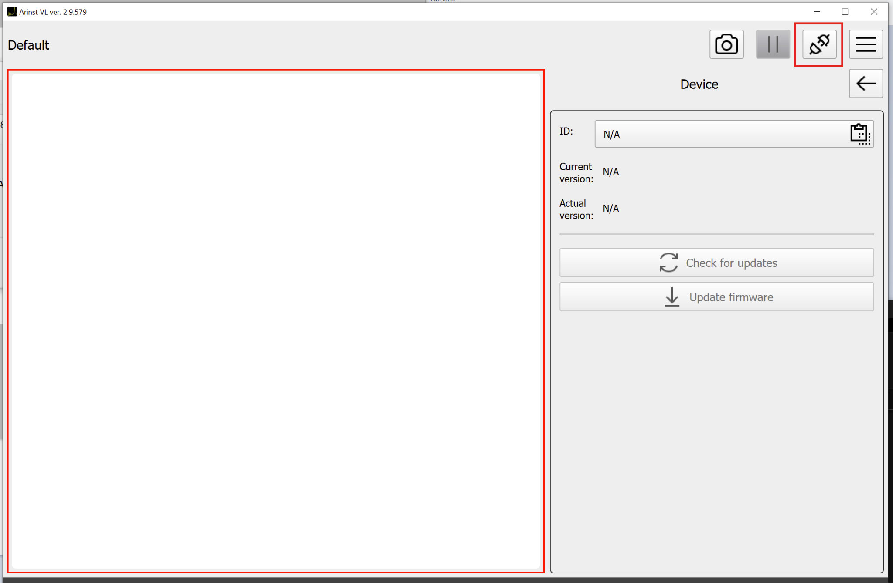
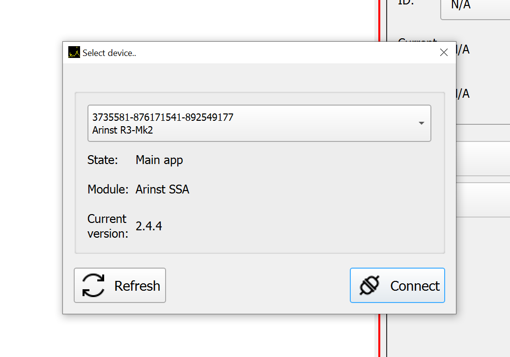
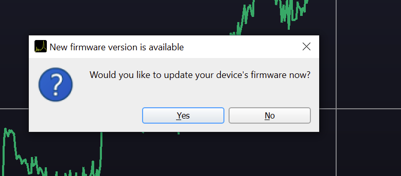
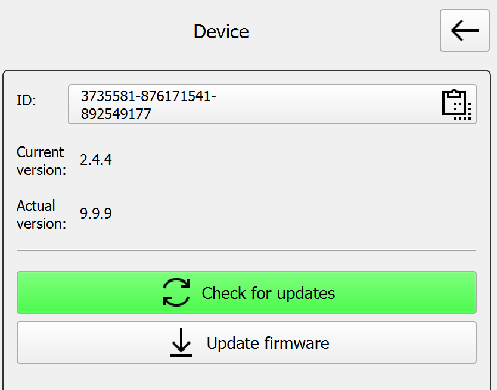
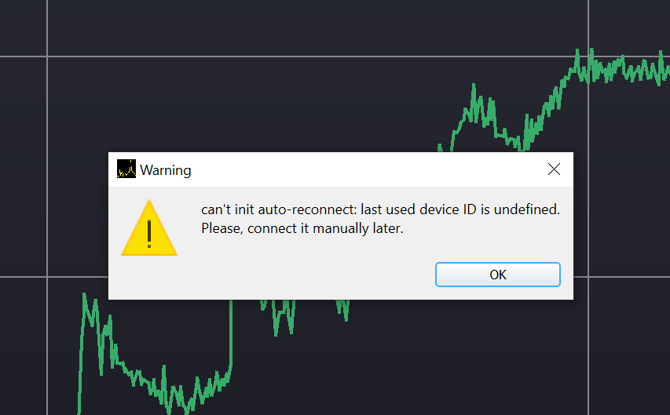

# Обновление прошивки приборов Arinst

**Инструкция применима к следующим приборам:**

* Arinst VR 23-6200
* Arinst VR 1-6200
* Arinst VNA-PR1
* Arinst VNA-PR1-M
* Arinst VNA-DL
* Arinst SDR Dreamkit V1D
* Arinst SDR Dreamkit V2D
* Arinst ArSiG-R
* Arinst ArSiG-S
* Arinst SSA R3 (TG, LC, PRO, и пр.)
* Arinst BugHunter
* Arinst Signal Hunter
* Arinst SSA R2S

1. Скачайте и установите Arinst Virtual Lab с [сайта](https://arinst.ru/download-apk.php). Подключите устройство во включенном состоянии по USB.  
  

2. На главной странице ПО Arinst Virtual Lab нажмите кнопку подключения.  
  

3. В появившемся окне выберите устройство из списка.  
  

4. Если для устройства есть обновление и компьютер подключен к интернету, то обновиться можно согласившись во всплывшем окне.  
 

4.1 Вручную проверить обновления и начать процесс можно на странице Device в меню приложения.  
 

::: danger
Если в процессе обновления появилось окно, как на примере ниже, то для продолжения процесса необходимо снова нажать на клавишу подключения и выбрать устройство.  
  

:::
