# Руководство по работе с Arinst SSA-TG R3

**Анализатор спектра со встроенным трекинг-генератором Arinst SSA TG R3**  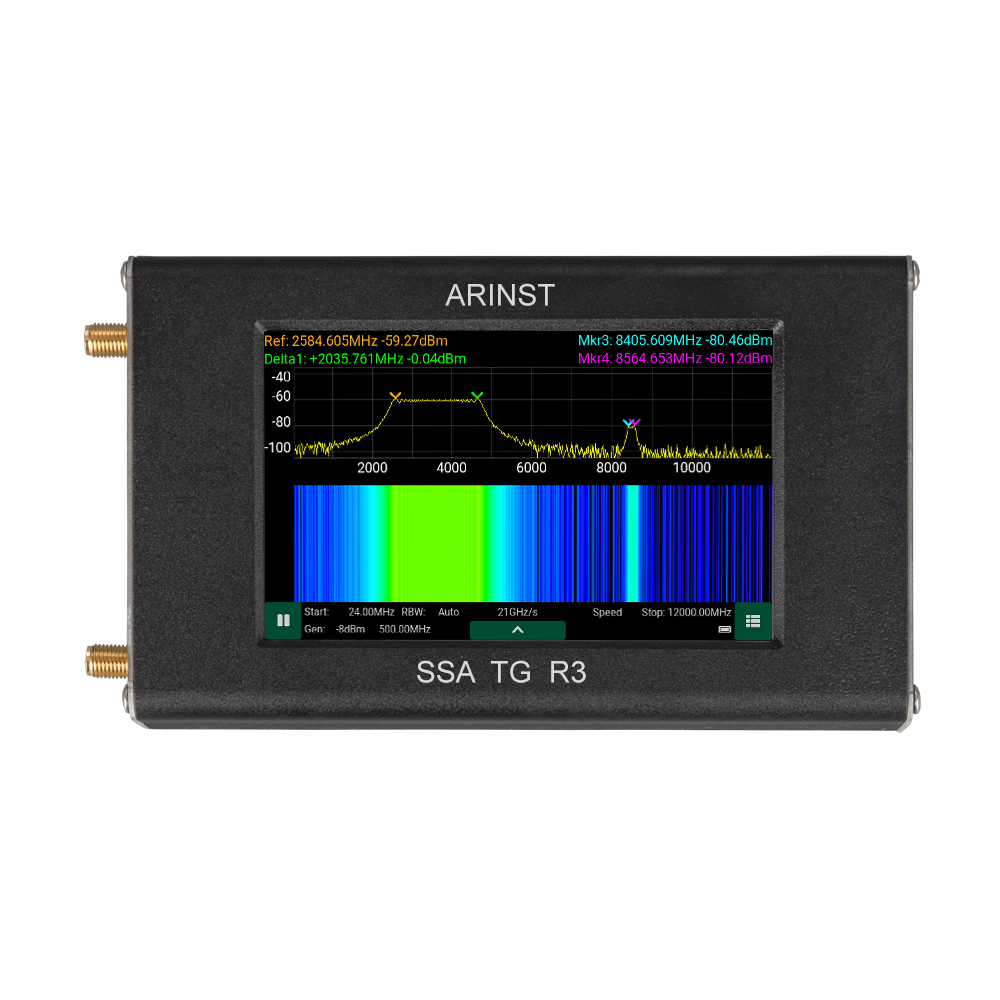

## ***Назначение***

Arinst SSA-TG R3 – это портативный панорамный анализатор спектра со встроенным трекинг-генератором и демодулятором, предназначен для отображения спектральных составляющих сигналов в диапазоне частот от 24 МГц до 12 ГГц. Высокая скорость сканирования дает возможность обнаруживать импульсные сигналы цифровых стандартов связи: Wi-Fi, 2G, 3G, 4G, LTE, CDMA, DCS, GSM, GPRS, ГЛОНАСС и т.д. Встроенный следящий генератор позволяет проводить измерения АЧХ пассивных или активных устройств, например, фильтров, усилителей. Программный демодулятор ШЧМ/ЧМ/АМ сигналов предназначен для прослушивания эфира и настройки аналоговых радиопередатчиков. Для удобства работы встроенное МПО прибора позволяет подписывать и выделять цветом на экране частотные диапазоны. Например, подписать названия радиостанций, каналы WiFi или диапазоны частот мобильных операторов.

## ***Технические характеристики***

| Частотный диапазон |    |
|----|----|
| Отображаемый диапазон частот1 | 24 МГц-12 ГГц |
| Измеряемый диапазон частот | 24 МГц -9 ГГц |
| Максимальная полоса обзора | \~12 ГГц |
| Опорный генератор TXCO GPS | 26 МГц |
| Разрешение по частоте | 25, 10, 5, 2.5 кГц |
| Полка шума2 |    |
| в полосе 24 МГц - 6.2 ГГц | -110 дБм |
| в полосе 6.2 ГГц - 9 ГГц | -100…-70 дБм |
| в полосе 9 ГГц – 12 ГГц | -70 дБм |
| Параметры сканирования3 |    |
| Максимальная скорость сканирования | 20 ГГц/с |
| Минимальное время обзора полной полосы частот 12 ГГц | 0.6 с |
| РЧ вход |    |
| Усиление при включенном аттенюаторе | -15 дБ |
| Усиление при включенном малошумящем усилителе | +15 дБ |
| Волновое сопротивление | 50 Ом |
| КСВ в рабочем диапазоне частот | < 2.0 |
| Максимальная входная мощность при выключенном аттенюаторе и МШУ | 0 дБм |
| Максимальная входная мощность при  включенном аттенюаторе | +15 дБм |
| Максимальная входная мощность при  включенном МШУ | -15 дБм |
| Максимальное постоянное напряжение на входе | 25 В |
| Трекинг-генератор |    |
| Режимы измерений4 | фикс., S21 |
| Нормированный уровень выходной мощности в полосе 24-6200 МГц | -8 дБм : - 29 дБм |
| Нормированный уровень выходной мощности в полосе 6200-12000 МГц | -14 дБм |
| Глубина регулировки мощности в полосе 24-6200 МГц | 21 дБ |
| Шаг регулировки мощности в полосе 24-6200 МГц | 3 дБ |
| Демодулятор |    |
| Типы демодуляции | ШЧМ, ЧМ, АМ |
| Функции | АРУ, S-метр, пороговый шумоподавитель |
| Полосы для ШЧМ | 400, 300, 200, 100 кГц |
| Полосы для ЧМ, АМ | 20, 10, 8, 6, 4 кГц |
| Аудио выход | Динамик 2 Вт, наушники |
| Отображение |    |
| Тип экрана | сенсорный резистивный, IPS |
| Разрешение экрана | 800×480 |
| Графики | спектр, водопад, S21 |
| Питание |    |
| Ёмкость встроенного аккумулятора | 5000 мАч |
| Время непрерывной работы от аккумулятора | \~ 4 ч |
| Время заряда аккумулятора5 | \~ 3.5 ч |
| Интерфейс подключения к ПК | USB |
| Внешний блок питания | 7-24 В, 2 А. |
| Рабочий диапазон температур | 0 … +40°С |
| Габаритные размеры (Д×Ш×В) | 145x81x27 мм |
| Масса | 0,4 кг |

* В диапазоне отображения не гарантируются точностные параметры сигналов;
* Уровень шумовой полки измеряется при включенном МШУ и спектральном разрешении 2.5 кГц;
* Измерения проводятся при режиме работы «Скорость» и спектральном разрешении 25 кГц;
* Режим измерений скалярный – без учета фазы;
* Источник должен обеспечивать мощность не менее 7 Вт.

## ***Комплектность***

* Анализатор спектра ARINST SSA-TG R3;
* Аккумулятор (установлен в приборе);
* ВЧ переходник для защиты разъемов от износа (2 шт.);
* Кабель USB type-c – USB 2.0;
* Паспорт;
* Упаковка.

## ***Устройство прибора***

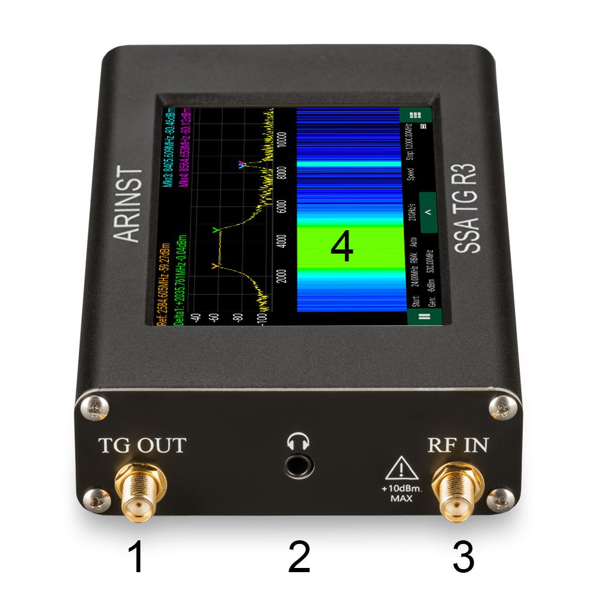

* 1 - Выход трекинг-генератора;
* 2 - Выход для наушников;
* 3 - Вход анализатора спектра;
* 4 - Сенсорный экран;  
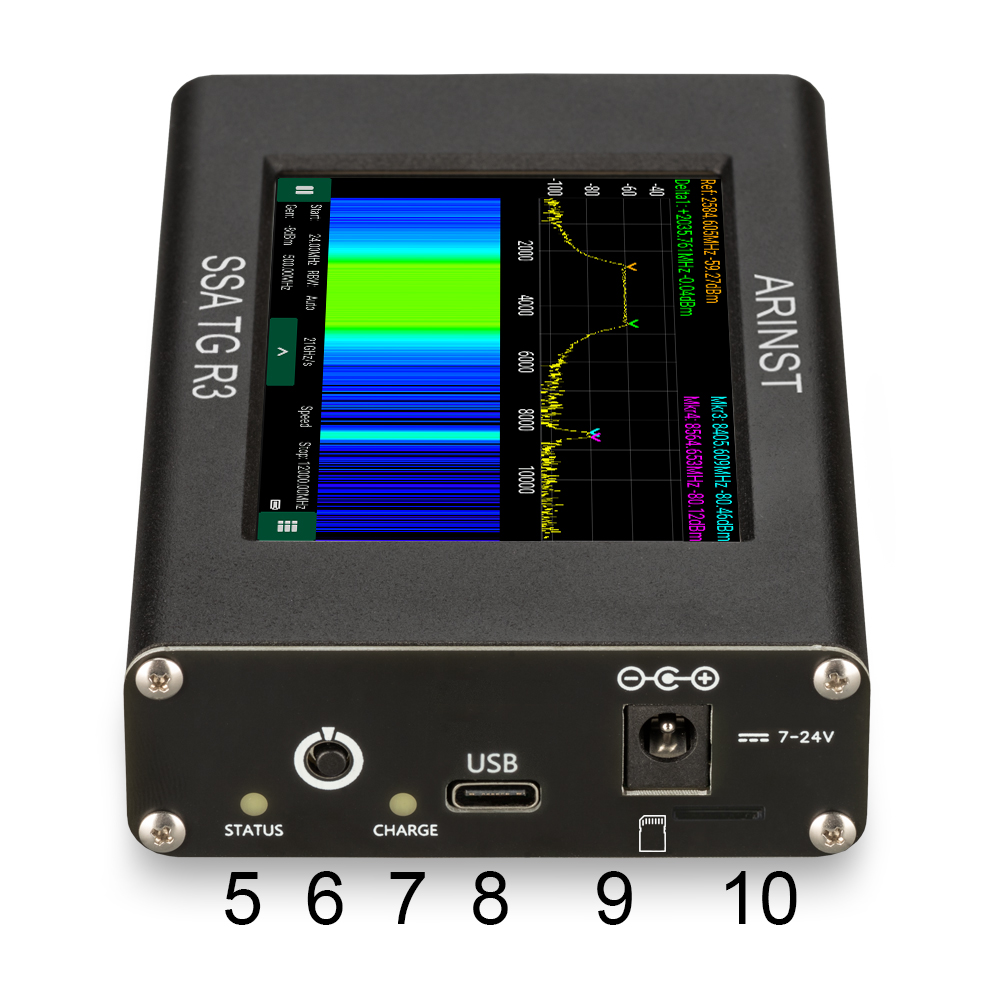

* 5 - Светодиод статуса;
* 6 - Кнопка включения;
* 7 - Светодиод заряда;
* 8 - Разъем для подключения к ПК и зарядки;
* 9 - Разъем для подключения внешнего блока питания;  
* 10 - Разъем для подключения MicroSD карты;  
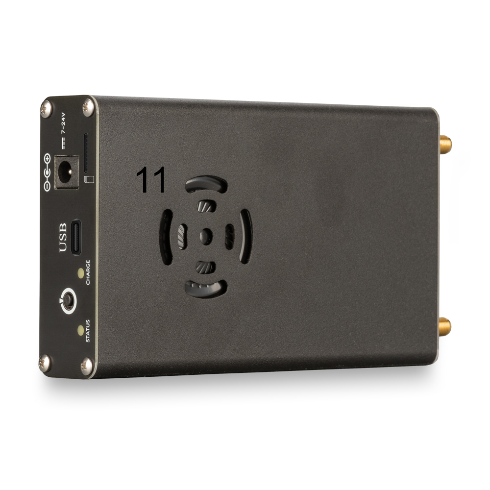
* 11 - Динамик.

## ***Работа с прибором***

Внимание!

Не осуществляйте коммутацию входного ВЧ разъема при подключенном зарядном устройстве или USB соединении с ПК. При несоблюдении данных рекомендаций возможен выход прибора из строя.

Использование прибора под открытым небом во время снегопада или дождя запрещается. Если анализатор внесён в холодное время года из холодного помещения или с улицы в тёплое помещение, не включайте его в течение времени достаточного для испарения конденсата.

Соотносите мощность сигнала и напряжение, подаваемые на Входной разъем RF IN с максимальными значениями, указанными в технических характеристиках.

### ***Включение***

1. Убедитесь в том, что анализатор не имеет внешних повреждений и аккумулятор заряжен. Разряженный аккумулятор зарядите с помощью подключения к порту USB или к внешнему блоку питания.
2. Нажмите на кнопку включения и удерживайте нажатой несколько секунд.
3. На экране должен появиться загрузочный режим с таблицей диагностических параметров.
4. После завершения диагностики на дисплее отобразится главный экран прибора.

 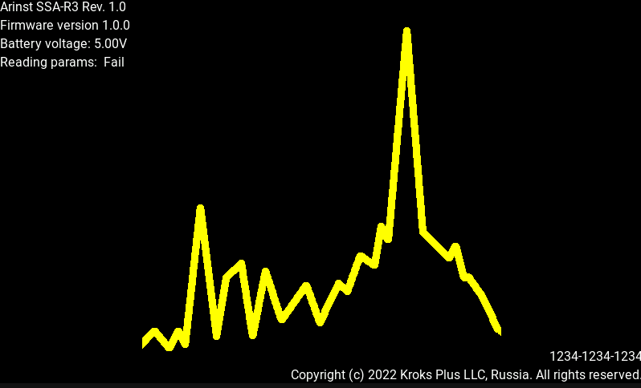

### ***Главный экран прибора***

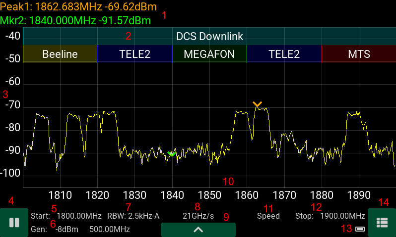

#### ***Описание элементов отображения***

 1. Поле маркеров - до 4 штук;
 2. Поле частотных диапазонов;
 3. Ось амплитуд в дБм;
 4. Кнопка паузы;
 5. Начальная частота сканирования в МГц;
 6. Параметры встроенного генератора;
 7. Разрешение по частоте;
 8. Скорость сканирования;
 9. Кнопка вызова дополнительного меню;
10. Ось частот в МГц;
11. Тип режима работы;
12. Конечная частота сканирования;
13. Индикатор заряда встроенного аккумулятора;
14. Кнопка вызова главного меню.

#### ***Дополнительное меню***

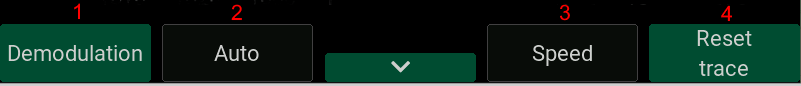

Для перехода в дополнительное меню нажмите на кнопку 8 на главном экране.

1. Переход в режим демодуляции;
2. Выбор разрешения по частоте;
3. Выбор режима сканирования;
4. Кнопка сброса накопленных значений для трассы (максимум, минимум, среднее).

#### ***Настройка графиков***

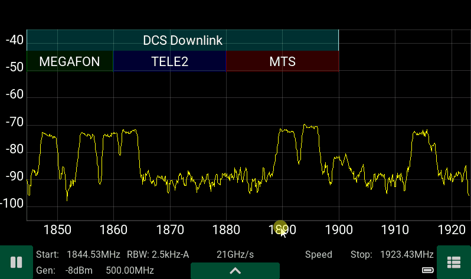

Смещение сетки графика по частоте и амплитуде можно менять перетаскиванием шкалы, для изменения масштаба необходимо зажать шкалу около ее центра до момента как она станет красного цвета и, не отпуская, перетягивать.

### ***Экран демодулятора***

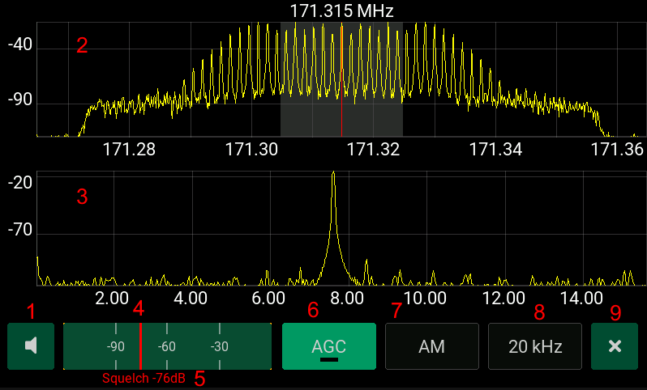

Для перехода в режим демодуляции нажмите на кнопку дополнительного меню. Центральная частота для демодуляции выбирается по установленному 1 маркеру либо по максимуму сигнала в спектре при отсутствии маркера.

Параметры демодулятора:

 1. Меню регулировки громкости;
 2. Спектр сигнала в полосе демодуляции;
 3. Спектр демодулированного сигнала;
 4. Индикатор S-метра;
 5. Уровень порогового шумоподавителя (Squelch);
 6. Кнопка включения/выключения АРУ;
 7. Выбор типа демодулятора;
 8. Выбор полосы демодулятора;
 9. Кнопка выхода из режима демодуляции;
10. Центральная частота демодуляции.

Примечания: Пороговый шумоподавитель - отключает аудиовыход при уровне S-метра ниже уровня шумоподавителя, изображенного красной риской на S-метре. Автоматическая регулировка усиления доступна только в режимах FM/AM.

#### ***Автоматическая регулировка усиления***

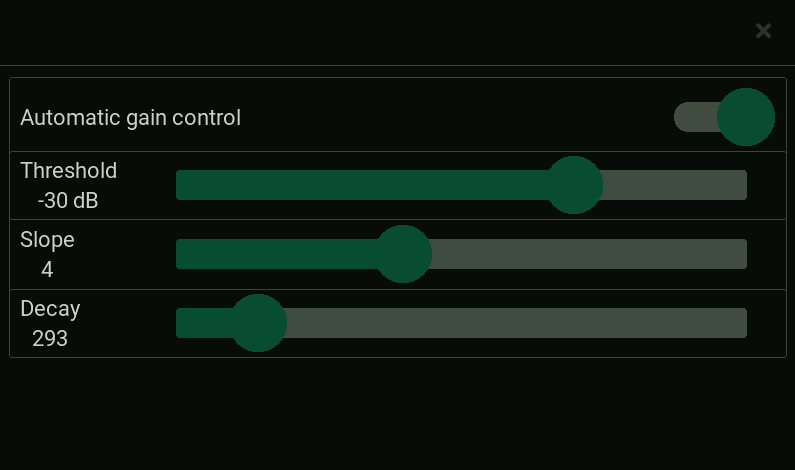

Параметры :

* Threshold - пороговый уровень АРУ в дБ;
* Slope - наклон АРУ в дБ в режиме насыщения;
* Decay - время установления АРУ в мс. Основная регулировка заключается в подборе порогового уровня для наиболее качественного звука. Параметр Decay подбирается в зависимости от типа жанра аудио - для музыки желательно ставить минимальные значения, для прерывистой речи максимальные. Параметр Slope подбирается по минимальным искажениям сигнала.

#### ***Настройка параметров демодулятора***

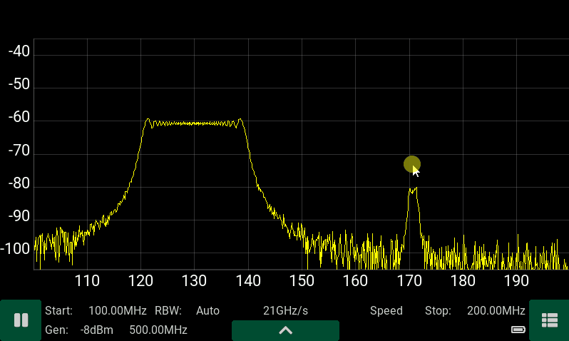

### ***Интерфейс прибора***

 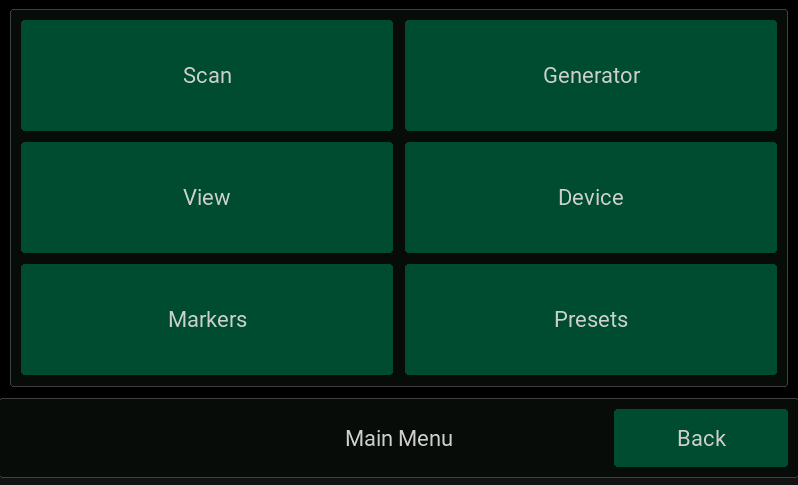

Основные вкладки:

1. Scan - параметры сканирования;
2. View - параметры отображения;
3. Markers - параметры отображения маркеров;
4. Generator - параметры трекинг генератора;
5. Device - серийный номер устройства, ориентация экрана и др;
6. Presets - менеджер предустановок. Переход в основное меню осуществляется через однократное нажатие на кнопку питания либо нажатием на кнопку вызова меню 14 на экране.

#### ***Scan***

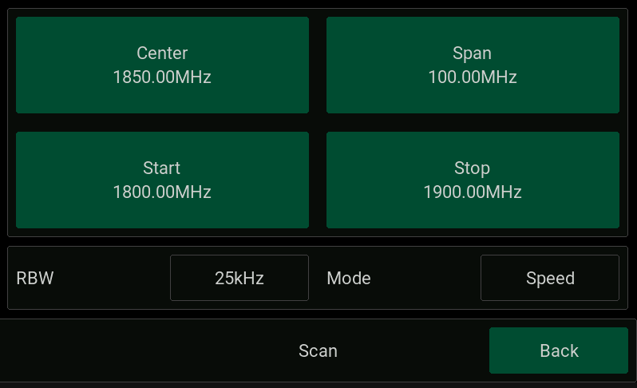

Параметры сканирования:

1. Center - центральная частота диапазона сканирования;
2. Span - диапазон сканирования;
3. Start - начальная частота сканирования;
4. Stop - конечная частота сканирования;
5. RBW - разрешение по частоте при сканировании;
6. Mode - режим сканирования.

**RBW** - (resolution bandwidth) разрешение по частоте. Определяет минимальную частоту между двумя сигналами, чтобы их можно было различить. Так же определяет точность вычисления частоты сигнала по маркеру. Задается из списка:

1. Auto;
2. 2.5 кГц;
3. 5.0 кГц;
4. 10 кГц;
5. 25 кГц.

В режиме Auto в зависимости от диапазона сканирования разрешение выставляется автоматически. На экране прибора выбранное значение отображается с суффиксом -A (2.5 kHz-A). Так же в зависимости от частотного разрешения будет изменяться полка шума и скорость сканирования. Полка шума является минимальной для минимального частотного разрешения в 2.5 кГц и максимальной для 25 кГц (отличается на 10 дБ). Скорость сканирования, наоборот, будем максимальной для разрешения 25 кГц и минимальной для 2.5 кГц. Реальная скорость сканирования отображается на главном экране прибора.

Режим **Mode** - определяет режим сканирования - Speed(быстрый) или Presicion(точный). В анализаторе применяется программный алгоритм подавления зеркального канала, который может работать в двух режимах - в режиме Speed - алгоритм обладает максимальной скоростью сканирования, но при определенных соотношениях параметров входных сигналов возможно появление в спектре фантомных составляющих. А в режиме Precision алгоритм работает в 2 раза медленнее, но вероятность появления фантомных сигналов значительно ниже.

Для точных работ с медленноменяющимися сигналами следует выбирать минимальное разрешение по частоте 2.5 кГц и режим Presicion, для поиска импульсных сигналов следует выбирать максимальное разрешение 25 кГц и режим Speed.

#### ***Меню установки частоты***

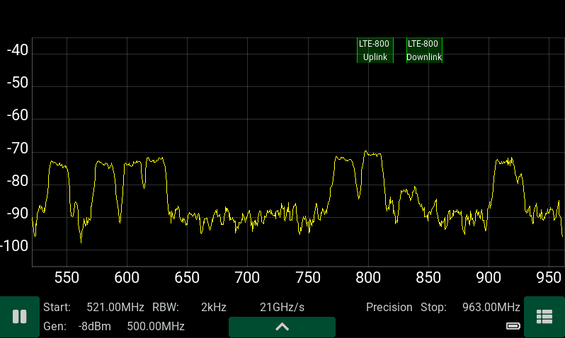

:::tip
При вводе частоты с клавиатуры предыдущее значение будет удалено, так же для полного удаления ранее введенного значения зажмите клавишу удаления на 1 секунду. При смещении курсора ввода старое значение не будет удалено и можно изменить лишь необходимые разряды. При выходе за рамки ограничений частотного диапазона будет выдано сообщение об ошибке.

:::

#### ***View***

Установка режимов отображения.  
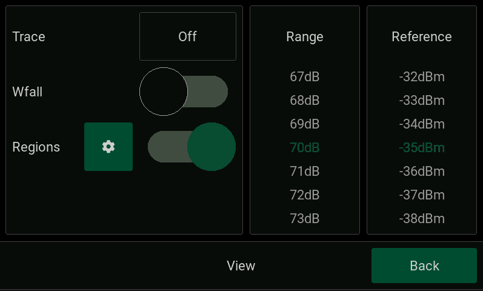

**Trace** - выбор режима отображения трассы:

1. Выключено;
2. Трасса минимальных значений;
3. Трасса максимальных значений;
4. Трасса средних значений с окном 5 отсчетов;
5. Трасса средних значений с окном 10 отсчетов;
6. Трасса средних значений с окном 20 отсчетов.

* **Wfall** - включение/выключение режима водопад (частотно-временная диаграмма);
* **Regions** - меню для задания названия частотного диапазона отображаемого на главном экране;
* **Range** - диапазон отображения амплитуды на графике спектра в дБ;
* **Reference** - верхний уровень шкалы амплитуды на графике в дБм.

#### ***Regions***

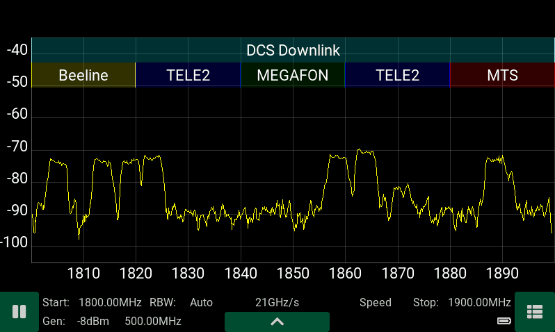

Для удобства работы встроенное ПО прибора позволяет подписывать и выделять цветом на экране частотные диапазоны. Можно задать название частотного диапазона и его полосу частот, а так же цвет из палитры. Максимальное количество частотных диапазонов - 32.

#### ***Markers***

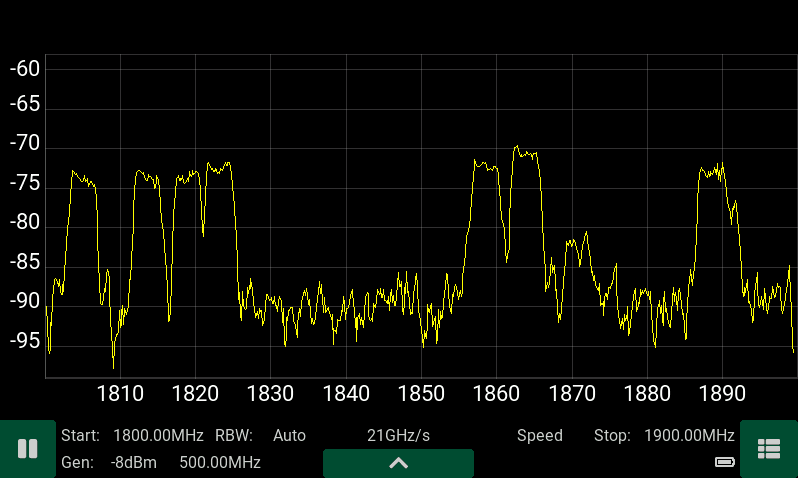

Маркеры позволяют точно определить значение амплитуды и частоты сигнала. Установка маркеров - удержание стилуса вблизи интересующей области спектра. Удаление маркера - по нажатию и удержанию маркера. Для перемещения маркера по графику - необходимо его перетащить в нужную область.

Маркеры могут работать в нескольких режимах: Независимый режим:

* Point - маркер зафиксирован на определенной частоте и выдает значение амплитуды;
* Peak - маркер ищет пиковый сигнал и выдает его значение. Зависимый режим: 1 маркер;
* Ref;
* Ref/peak 2,3,4 маркеры;
* Delta;
* Delta/peak В режиме Ref - опорный маркер отображает значение амплитуды и частоты в выбранной точке. В режиме Ref/peak- опорный маркер отображает значение амплитуды и частоты в точке с максимальной амплитудой. В режиме Delta - ведомые маркеры отображают значение амплитуды и частоты относительно опорного маркера. В режиме Delta/peak- ведомые маркеры отображают значение амплитуды и частоты относительно опорного маркера в других точках с максимальным уровнем сигнала.

#### ***Generator***

Режим Point  
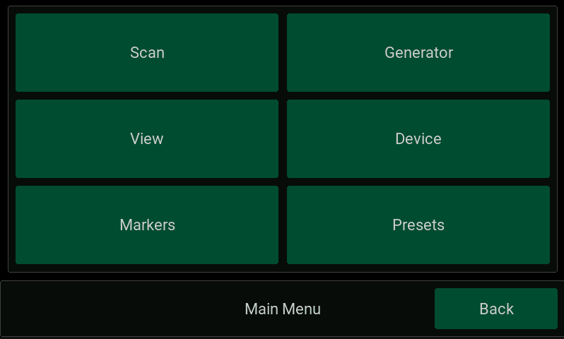

Выходная мощность генератора зависит от частотного диапазона работы - для диапазона 24-6200 МГц мощность может быть установлена в пределах -8...-29 дБм, для диапазона 6200-12000 МГц мощность фиксирована значением -14 дБм.

Режим Tracking S21

Для измерения амплитудно-частотной характеристики исследуемого устройства, установите частотный диапазон в меню Scan, установите выходную мощность генератора. Соедините перемычкой кабели и нажмите на кнопку Througth для калибровки прибора. Вместо перемычки подключите исследуемое устройство.

#### ***Device***

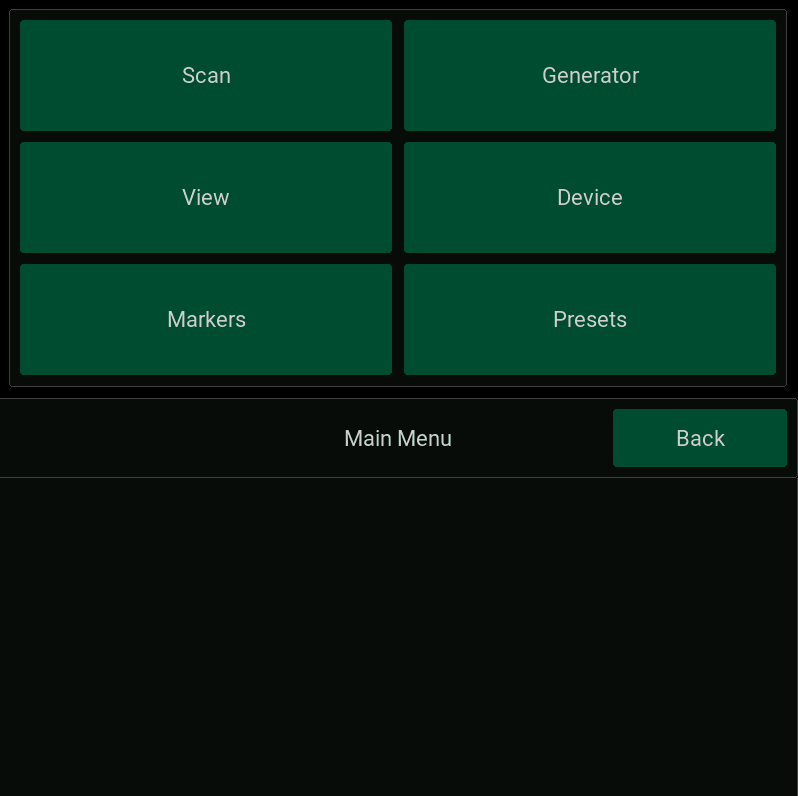

* Language - выбор языка Eng Рус;
* RF input (выбор входа) - аттенюатор (-15 dB), прямой вход (0 dB), малошумящий усилитель (+15 dB);
* Theme - тема отображения экранов;
* Rotate screen - кнопка поворота ориентации экрана - вертикальная / горизонтальная;
* About - информация об устройстве - версия прошивки, серийный номер.

#### ***Presets***

Меню для сохранения и загрузки пресетов - до 12 пресетов. В параметры пресета сохраняются все настройки прибора.

## ***Дополнительные возможности***

### ***Выход на основной экран***

Для быстрого выхода из любого меню следует однократно нажать на кнопку питания.

### ***Измерение сигналов с высоким разрешением***

Если требуются измерения сигнала с разрешением по частоте меньше чем 2.5 кГц, установите маркер на исследуемый сигнала и перейдите в режим демодуляции. Спектр после цифрового переноса, который будет отображаться вверху экрана для режима WFM будет иметь разрешение 122Гц, а режима FM - 8 Гц.

### ***Вертикальная ориентация экрана***

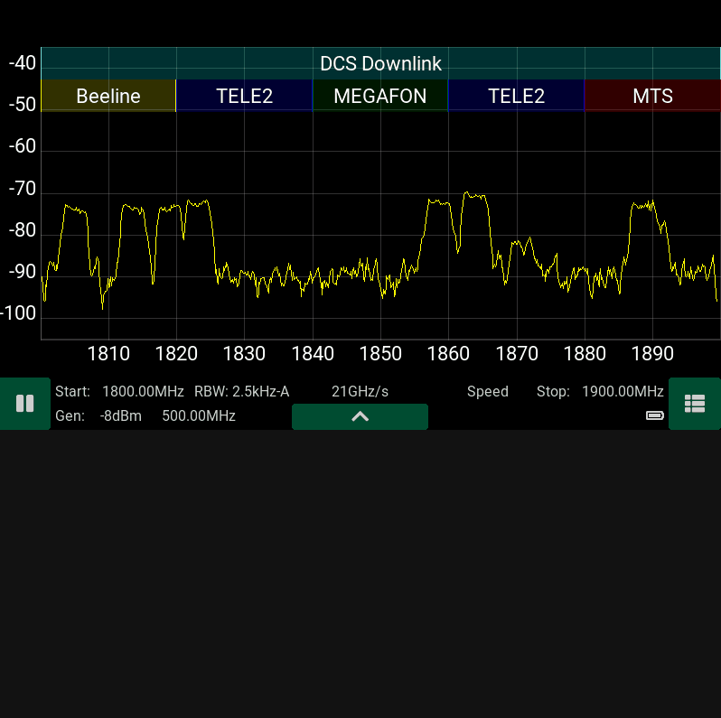
