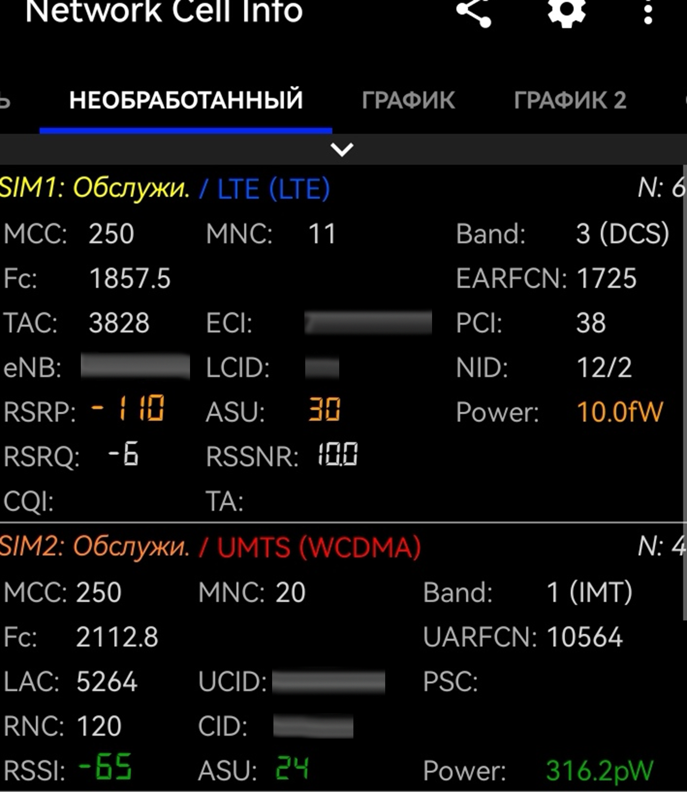
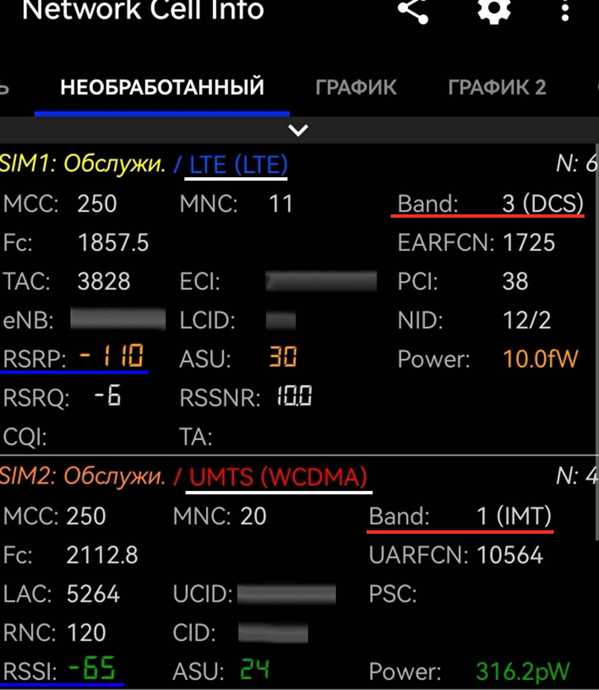

# Как проверить частоты оператора на смартфоне и выбрать подходящий комплект

## ***Частотные диапазоны в репитерах KROKS***

Мобильные устройства могут работать в различных частотных диапазонах поэтому важно перед приобретением выбрать нужный комплект на подходящую частоту работы и усиление.

Существуют четыре наиболее распространенных частотных диапазонов работы у мобильных телефонов, перечислим их ниже, отметив особенности.

| Номер| Частота | Название | Диапазон работы |
|----|:---:|:---:|:---:|
| 1 | 900 МГц | GSM | 880-915; 925-960 МГц |
| 2 | 1800 МГц | DCS | 1710-1785; 1805-1880 МГц |
| 3 | 2100 МГц | 3G | 1920-1980; 2110-2170 МГц |
| 4 | 2600 МГц | LTE | 2500-2570; 2620-2690 МГц |

Первый диапазон **GSM 900** имеет наибольшую дальность покрытия сотовой вышки и наилучшую способность проникновения сигналов через препятствия. Обратите внимание, что в этом диапазоне передается только голосовая связь **без интернета**, в отличии от последующих диапазонов.  
Если устройством используется этот диапазон, то обычно отображается значок **G** или **E** на панели задач.

Второй диапазон **1800 DCS** считается наиболее массовым и распространенным. В этом диапазоне используется как устаревшая технология **GSM 1800**, так и более современные LTE диапазоны. Используется и в городах и за их пределами, дальность и проникающая способность хорошие.

Третий диапазон **3G 2100 МГц**. Дальность покрытия от сотовой вышки не слишком большая.  
В настоящее время выводится из обращения и частоты используются под более современные стандарты **LTE 2100 МГц**.

Четвертый это **LTE 2600** имеет распространение только в городах в местах высокой плотности населения, имеет небольшую зону покрытия и не очень высокую проникающую способность.

**Из этой информации можно сделать следующий вывод:**  
* Для использования в пределах города стоит выбирать комплект с одним или несколькими диапазонами. Если ограничиваться одним диапазоном, то рекомендуется выбрать репитеры с рабочим диапазоном **1800 МГц**, в ином случае рекомендуем **1800-2100** и более диапазонов.  
* Для использования за пределами города стоит выбирать диапазон **900 МГц** в случае покупки одно диапазонного репитера, или **900-1800 МГц** и более диапазонов в иных случаях.

## ***Как определить какой диапазон смартфон использует ваш смартфон в предполагаемом месте установки системы усиления***

Наиболее простым способом является установка дополнительного программного обеспечения из магазина приложений на вашем устройстве.  
Вот несколько подходящих приложений, которыми вы можете воспользоваться:
* **OpenSignal**  
* **Network Cell Info**  
* **Сотовые вышки. Локатор**  
* **Cellmapper**

В качестве примера воспользуемся приложением **Network Cell Info**.

В месте предполагаемой установки внешней антенны (на уровне крыши или выше) открываем приложение.  
Далее делаем скриншоты из приложения во вкладке **НЕОБРАБОТАННЫЙ**.

Нас интересуют такие показатели как:  
* **Тип сети** - в примерах это **LTE** и **UMTS(WCDMA)**, подчеркнуты белым цветом;  
* **Band** - диапазон рабочих частот, подчеркнуты красным цветом. Подробнее о бэндах вы можете узнать в [этой статье](/docs/repitery/standarty-i-diapazony-chastot-mobilnyh-operatorov.md);  
* **RSRP** и **RSSI** - показатели уровня сигнала, подчеркнуты синим цветом. Чем их значение ближе к 0, тем лучше, также эти показатели имеют цветовую индикацию (зеленый шрифт - хороший уровень, желтый - средний уровень, красный - плохой уровень принимаемого сигнала).

Также есть вкладка **MAP** с примерным расположением сотовой вышки, по ее расположению можно определить наиболее подходящее направление для антенны.

## ***Усиление репитера***

Репитеры KROKS кроме рабочих диапазонов также отличаются и коэффициентом усиления. Для того чтобы определиться с выбором подходящего коэффициента усиления нам также понадобятся показатели определенные выше.  
Если уровень сигнала (значения **RSRP** и **RSSI**) находятся в красно-желтом диапазоне, то в таком случае рекомендуем выбрать модель с большим коэффициентом усиления **60-70 дБ**. При хорошем уровне сигнала (зеленый диапазон) вам подойдет репитер с усилением **50-55 дБ**.

Теперь у вас имеется вся необходимая информация для того чтобы вы смогли определиться с выбором репитера под ваши цели и задачи.  
Но не забудьте следующее:

:::warning  
Эксплуатация репитеров сотовой связи разрешена только операторами связи или их аккредитованными организациями. Самовольная установка и использование таких устройств запрещены (ФЗ «О связи» № 126-ФЗ, Постановление Правительства № 1800) и влекут штрафы (ст. 13.4 КоАП РФ).  
Ретрансляторы должны работать только в зоне действия базовых станций оператора.

Перед использованием необходимо обратиться к оператору связи для получения разрешения и профессиональной установки.

:::
