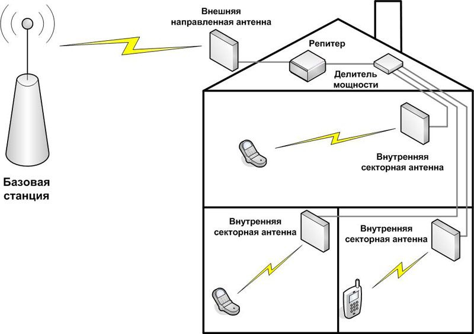
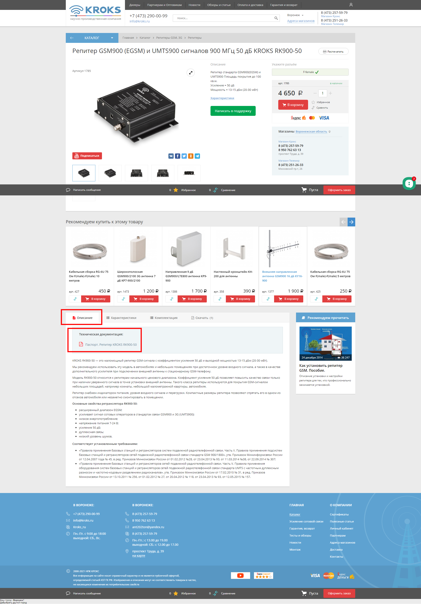

# Усиление сотовой связи с помощью репитера

В данной статье, насколько это возможно подробно, будет разобран вопрос выбора оборудования для усиления сигнала оператора сотовой связи как для голосовых вызовов, так и для интернета.

Несмотря на то, что выбор подобного оборудования подразумевает наличие определенного багажа знаний в профильных технических сферах, эта статья будет ориентирована, прежде всего, на людей не обладающих глубокими знаниями в этих областях.

## ***Репитеры***

**Основной задачей репитеров является усиление сигнала для голосовых вызовов и мобильного интернета**.

[Репитер](https://kroks.ru/shop/repeaters/repeater/), по своей сути, является усилителем, ко входу и выходу которого подключаются внешняя и внутренняя направленные антенны.

Внешняя антенна должна быть направлена на базовую станцию оператора, внутренняя должна находиться в помещении, где требуется усилить сигнал. В некоторых случаях уместно использование нескольких внутренних антенн, подключенных через [делитель](https://kroks.ru/shop/power-splitters/).

Например, как на схеме ниже:

Выбор репитера подразумевает и выбор антенн. Это можно сделать [самостоятельно](https://kroks.ru/shop/antenny-gsm-3g-4g-wifi/), подобрав её тип, частоту, коэффициент усиления, разъем и пр. Но более предпочтительным вариантом может быть приобретение [готового комплекта усиления](https://kroks.ru/shop/repeaters/ready-made-kits/). Вам достаточно [выбрать необходимую частоту](https://kroks.ru/useful-articles/stati/strengthening-of-mobile-communications-and-mobile-internet-in-the-country/) и требуемый коэффициент усиления.

При выборе и установке репитера рекомендуется руководствоваться паспортом, который есть на странице оборудования во вкладке "Скачать", как на изображении ниже, [схемой установки](https://kroks.ru/useful-articles/stati/the-scheme-of-installation-of-repeater-mobile-signal/) и [пособием](https://kroks.ru/useful-articles/stati/how-to-install-a-repeater-gsm/) по установке и настройке репитера.

:::warning
Эксплуатация репитеров сотовой связи разрешена только операторами связи или их аккредитованными организациями.  

Самовольная установка и использование таких устройств запрещены (ФЗ «О связи» № 126-ФЗ, Постановление Правительства № 1800) и влекут штрафы (ст. 13.4 КоАП РФ).  

Ретрансляторы должны работать только в зоне действия базовых станций оператора.  

Перед использованием необходимо обратиться к оператору связи для получения разрешения и профессиональной установки.

:::

