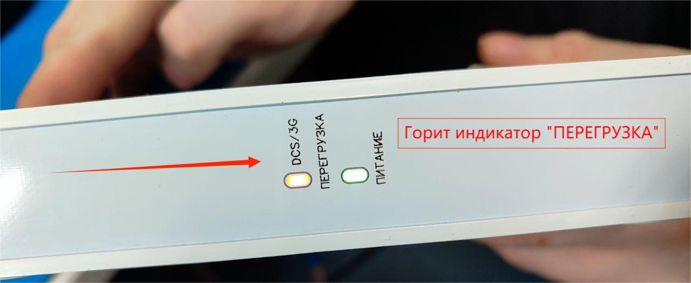
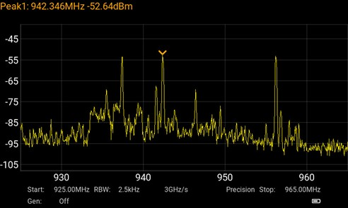
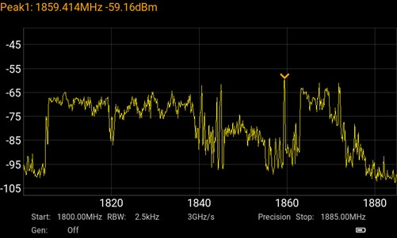

# Устранение распространенных проблем

## ***Постоянно горит индикатор ПЕРЕГРУЗКА***

Пример того как выглядит дефект

Существует две основные причины, которые могут вызвать свечение индикатора перегрузки. Рассмотрим подробнее варианты выявления и устранения дефекта.

### ***Закольцованность сигнала***

Данная проблема может возникунуть из-за недостаточной экранировки между внутренней и внешней антенной. В этом случае индикатор перегрузки горит постоянно, а усиление сигнала не происходит, что может привести к отсутствию связи (например, недоступности вызовов или передачи данных) или даже выходу устройства из строя.  
Чтобы проверить, является ли это причиной перегрузки, выполните следующие шаги:  
* Отключите устройство и отсоедините ВЧ-кабель от внутренней антенны, оставив его подключенным к репитеру. Внешняя антенна и кабель должны оставаться подключенным к репитеру.  
* Подайте питание на устройство и проверьте индикатор. Если индикатор перегрузки больше не горит, это подтверждает, что причина в недостаточной экранировке.  
* В случае подтверждения проблемы, отключите устройство от сети и постарайтесь увеличить расстояние между антеннами и(или) расположите антенны в разные стороны.

### ***Высокий уровень нисходящего сигнала от базовых станций (БС) оператора***

#### ***Диагностика проблемы***

Определяется тем, что индикатор «ПЕРЕГРУЗКА» продолжает гореть при открученном кабеле от внутренней антенны.  
Эта причина часто встречается в густо застроенных городских районах, особенно в диапазонах частот 1800, 2100, 2600 МГц, так как весь доступный спектр в этих частотных диапазонах практически полностью занят. В этих диапазонах частот спектр, доступный операторам сотовой связи, достаточно широкий, и в основном используется для технологий 4G (LTE). В таких системах применяется широкополосный сигнал с полосой пропускания 15–20 МГц на каждого оператора. Это приводит к тому, что весь доступный спектр в этих частотных диапазонах практически полностью занят, что в свою очередь вызывает высокую мощность спектральную плотность сигнала, поступающего на вход репитера, и может привести к его перегрузке раньше чем если бы это было в диапазоне связи второго поколения.  

:::warning
Обратите внимание, продолжение свечения индикатора при открученной антенне не исключает так же и закольцовки сигнала.  
В случае если после решения проблемы с высоким уровнем исходящего сигнала свечение индикатора при открученной антенне продолжается, то рекомендуется провести диагностику закольцованности сигнала.
:::

Перечисленные параметры помогают косвенно убедиться в причине нестабильной работы репитера. Так же вы можете проверить это наверняка, при наличии у вас анализатора спектра. На изображениях далее приведены примеры:  
Диапазон 900 МГц, низкая плотность сигналов.

Диапазон 1800 МГц, высокая плотность сигналов.

#### ***Варианты решения***

Для решения этой проблемы необходимо ослабить входящий сигнал, что можно сделать несколькими способами:

* **Изменение положения внешней антенны**.  
Можно ослабить сигнал, изменив угол направления внешней антенны, направив ее немного в сторону, чтобы уменьшить направленность на базовую станцию (БС) сотовой связи и ослабить получаемый сигнал.

* **Использование системы автоматической регулировки усиления (АРУ)**.  
В устройствах с системой АРУ ослабление сигнала выполняет микропрограмма устройства, которая автоматически регулирует усиление репитера, балансируя между максимальной мощностью сигнала и перегрузкой. При этом индикатор сигнала может циклично менять свое состояние с нормального на перегрузку. Чтобы избежать постоянного перерегулирования, можно добавить необходимую аттенюацию с помощью переключателя ручной аттенюации. Это не отключит автоматический режим работы устройства, а только добавит дополнительное ослабление сигнала, пока индикатор не стабилизируется в нормальном положении.

::: info
**Для устройств без системы АРУ (например, модели 900-1800-2100-55)**.  
У репитеров KROKS RK900-1800-2100-55 с датой производства позже 11.03.2025 (дата производства на этикетке) работа индикации светодиода “ПЕРЕГРУЗКА” немного отличается. Если светодиод не светится, а моргает - такой режим работы является допустимым. Если светодиод светится постоянно, это может вызвать помехи в эфире и со временем выход устройства из строя. Эксплуатация устройства в таком режиме недопустима.

:::

* **Добавление аттенюатора на вход внешней антенны**.  
Один из самых простых способов ослабить сигнал — это установить аттенюатор (ослабление сигнала) с номиналом 3-6 дБ. Аттенюатором подключается между портом внешней антенны усилителя и кабелем, идущем к антенне.

:::warning
Номинал аттенюатора подбирается индивидуально в каждом случае.
:::

## ***Мерцают все индикаторы***

Есть несколько случаев, при которых также происходит мерцание остальных индикаторов, совместно с индикатором "Перегрузка".  
Это может быть следствием того что блок питания "уходит в защиту" при работе в перегрузке, но так же это может быть и из-за неисправности репитера или блока питания.

Для локализации проблемы вы можете на короткий промежуток времени (примерно 5 секунд) запустить репитер **без подключенных к нему ВЧ кабелей**.  
Если не мерцание не прекратилось значит присутствует неисправность репитера или блока питания. В этом случае вы можете включить репитер с другим блоком питания (новый блок питания должен иметь напряжение 12V и ток 1A или более).  
Продолжение мерцания индикаторов при питании устройства от другого БП сигнализирует о том что неисправность кроется непосредственно в репитере.
