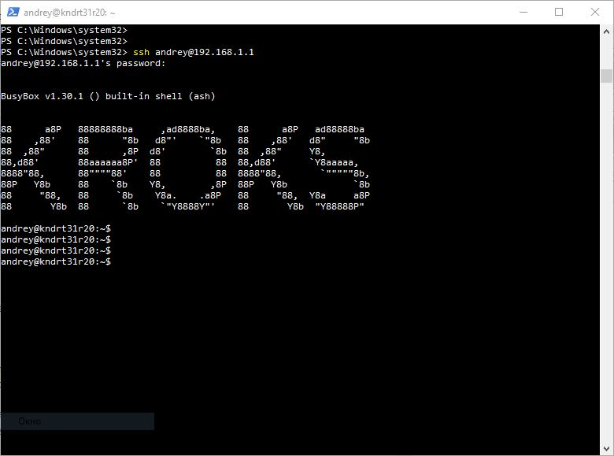

# Добавление пользователя в операционную систему роутера Крокс

## ***Обновляем репозитории, устанавливаем пакет shadow-useradd, добавляем пользователя***

```bash
opkg update
opkg install shadow-useradd
useradd andrey
```

## ***Указываем пароль пользователя, создаем домашний каталог, редактируем права доступа***

```bash
passwd andrey
mkdir /home
mkdir /home/andrey
chown andrey /home/andrey
```

## ***Добавляем оболочку /bin/ash для пользователя andrey***

```bash
nano /etc/passwd
andrey:x:1000:1000:andrey:/home/andrey:/bin/ash 
```

## ***Проверяем. Работает***


