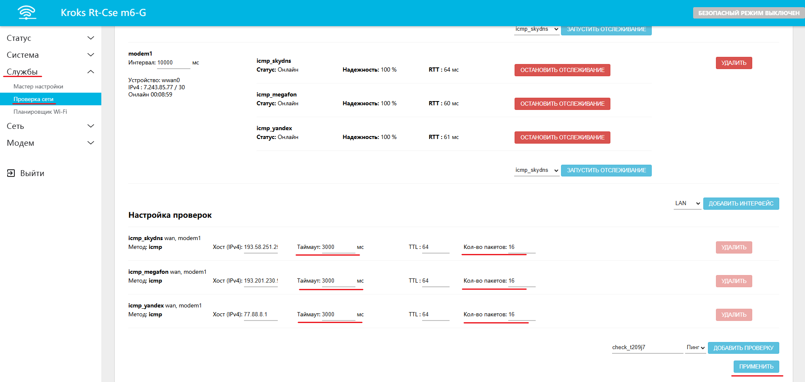
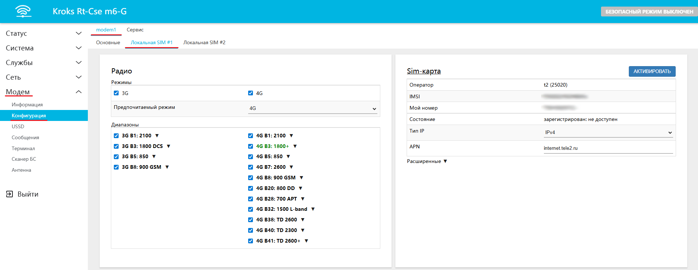
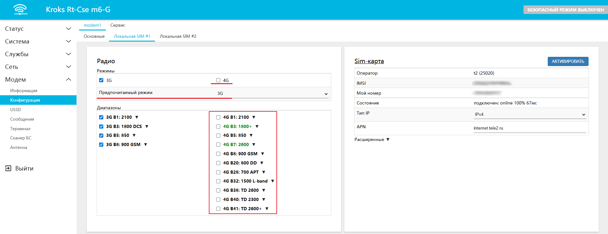
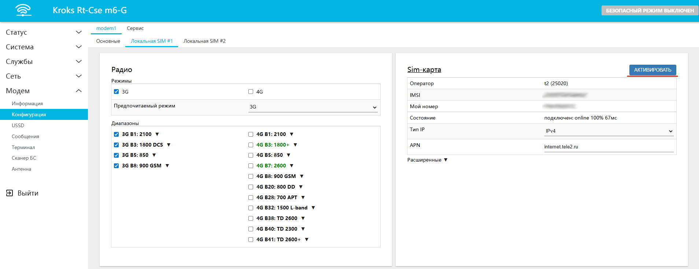

# Доступ к мобильной сети при локальных ограничениях оператора

В настоящее время распространенной проблемой является локальное отсутствие мобильного интернета. В ряде случаев, эти ограничения можно обойти и получить доступ к базовым услугам (банки, такси, государственные мессенджеры).

Такое решение подойдет, например, для автомобильных комплектов с роутерами KROKS. Так как оно заключается в том, что пользователь выезжает за пределы блокировки сигнала и подключается к местной вышке сотовой связи с активным интернет соединением.  
После чего остается только сохранять это подключение, избегая мест с полным отсутсвием связи.

Давайте в качестве примера разберем ситуацию при которой мобильный интернет отсутствует в городской местности, но при этом работает за городом.

:::warning
Данный материал не гарантирует 100% работоспособности и требует наличия стабильного интернета за городом в момент работы ограничений.

:::

## ***Процесс настройки***

В первую очередь от вас потребуется выехать за пределы места ограничения сигнала. После того как у вас заработает мобильный интернет можно будет приступать к настройке в веб-интерфейсе вашего роутера.

Для того чтобы снизить количество ложных срабатываний службы проверки сети. [Откройте веб-интерфейс](/docs/routery/chasto-zadavaemye-voprosy/vhod-v-web-interface.md) вашего роутера и перейдите во вкладку *Службы* -> *Проверка сети*.  
В разделе *Настройка проверок* измените значения строк *Таймаут* и *Кол-во пакетов* соответственно *3000* и *16*. После чего нажмите кнопку *ПРИМЕНИТЬ*.

Для достижения более стабильного подключения откройте вкладку *Модем* -> *Конфигурация* -> *modem1*. После чего выберите используемую для доступа в интернет SIM-карту, в примере это будет вкладка *Локальная SIM #1*.

Здесь вам необходимо убрать "галочку" в строке 4G, после чего *Предпочитаемый режим* автоматически сменится на 3G и исчезнут все "галочки" с 4G диапазонов. Если это не произошло, уберите их вручную. 

:::tip
Не забудьте нажать кнопку *ПРИМЕНИТЬ* в конце настройки.

:::

Чтобы произошло переподключение к вышке с доступом в интернет, вам остается только нажать кнопку *АКТИВИРОВАТЬ* в разделе *Sim-карта* на этой же вкладке.  

После успешной настройки проверьте работоспособность интернета за городом, в месте отсутствия активных ограничений, и в случае успеха можете возвращаться в зону с активными ограничениями. Ваше подключение сохранится, главное не допустить переподключения модема. Для этого не перезагружайте роутер и старайтесь избегать мест с нестабильным интернет соединением воизбежание автоматического переподключения модема.

:::tip
При повторном подключении производить настройку не требуется.  
Необходимо только выехать за пределы места ограничения сигнала и в веб-интерфейсе роутера нажать кнопку *АКТИВИРОВАТЬ* в разделе *Sim-карта* для переподключения соединения к вышке с доступом в интернет.

:::
