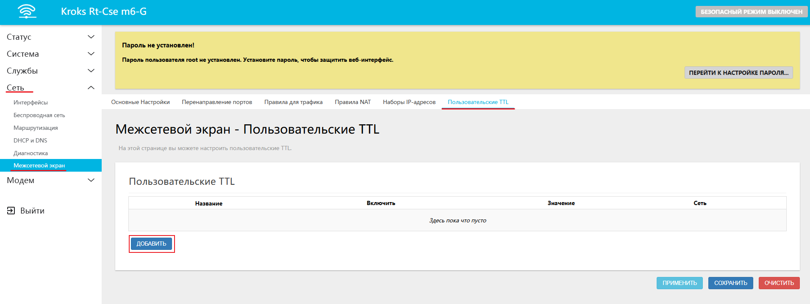
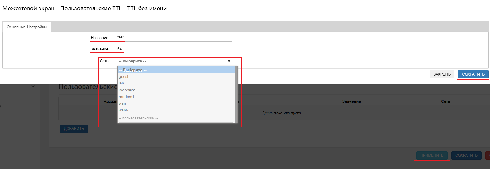

# Настройка TTL в роутере

## ***Введение в TTL***

TTL (**T**ime **t**o **L**ive) — это поле в заголовке пакета, которое определяет максимально допустимое число маршрутизаторов, через которые проходит пакет.  
Каждый маршрутизатор при обработке пакета уменьшает значение **TTL** на единицу. При достяжении нулевого значения, пакет отбрасывается и более не обрабатывается.

Это служит двум основным целям:  
* Предотвращать бесконечное циркулирование пакетов в случае ошибок маршрутизации;  
* Управлять временем распространения трафика, что важно для диагностики сетевых проблем и повышения безопасности.

:::tip
**Типичные значения TTL по умолчанию:**  
* Windows: 128;  
* Linux/macOS: 64;  
* Android/iOS (при использовании мобильного интернета): 64.

:::

## ***TTL в веб-интерфейсе роутеров KROKS***

Для создания нового или просмотра существующих правил TTL вам необходимо [войти в веб-интерфейс](/docs/routery/chasto-zadavaemye-voprosy/vhod-v-web-interface.md) роутера, перейти на вкладку **Сеть** -> **Межсетевой экран** -> **Пользовательские TTL** и нажать кнопку **ДОБАВИТЬ**.

Откроется окно, где необходимо ввести следующие параметры:  
* **Название** - в этой строке указывается название для создаваемой конфигурации (в примере **test**);  
* **Значение** - здесь указывается количество пересылок пакета, до его уничтожения (в примере **64**);  
* **Сеть** - в открывшемся селекторе вы можете выбрать интерфейс, для которого TTL всех пакетов будет равен введенному ранее значению.

В конце настройки не забудьте нажать кнопки **СОХРАНИТЬ** и **ПРИМЕНИТЬ**. Настройка заработает после того, как роутер снова станет доступен.

## Риски

Обратите внимание, неправильная настройка TTL может привести к проблемам с доступом к некоторым веб-ресурсам или сервисам, так как пакеты могут быть отброшены до достижения цели.
