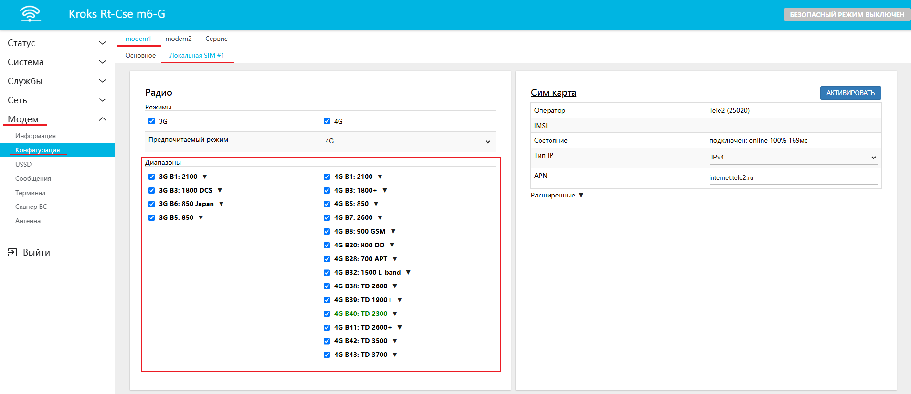
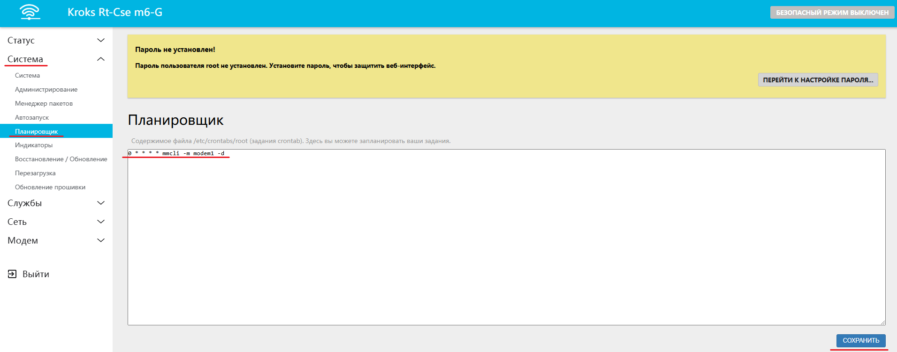
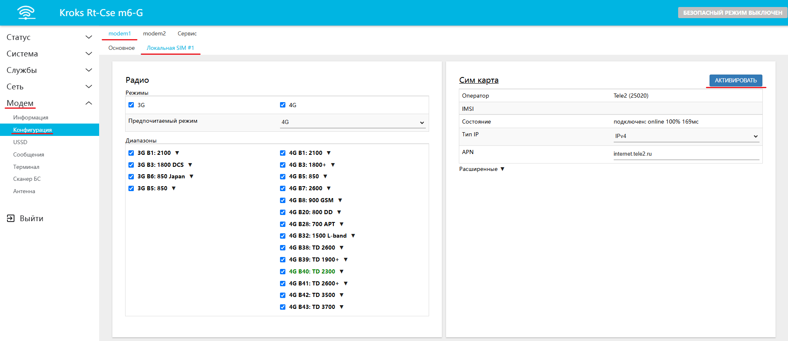

# Не приходят или не отправляются СМС

В устройствах со встроенными модемами моделей **EC200T и EC200A** пользователь может столкнуться с ошибкой, которая блокирует возможность приёма и отправки СМС.

:::warning
Перед выполнением следующих далее действий, убедитесь что в вашем устройстве установлен подходящий модем. Сделать это можно через веб-интерфейс устройства, на вкладке "Модем" → "Информация".

:::

Для решения возникшей ошибки необходимо последовательно выполнить 4 шага.

## ***ШАГ №1. Обновление прошивки роутера***

Обновите прошивку роутера, следуя инструкциям [по обновлению с помощью файла с сайта](/docs/routery/obnovlenie-proshivki/obnovlenie-proshivki-failom-s-saita.md) или [с помощью встроенного апдейтера](/docs/routery/obnovlenie-proshivki/obnovlenie-proshivki-vstroennim-apdeiterom.md).

## ***ШАГ №2. Обновление прошивки модема***

Обновите прошивку модема, следуя инструкции на [этой странице](/docs/routery/obnovlenie-proshivki/obnovlenie-proshivki-modema.md).

## ***ШАГ №3. Активация диапазонов***

Следующим шагом вам необходимо проверить какие диапазоны частот использует ваш модем. Для этого переходим на вкладку "Модем" → "Конфигурация" → "Локальная SIM #1" (в примере SIM карта установлена в слоте №1).

Здесь проследите чтобы в окне "Диапазоны" была установлена галочка напротив каждого из них.



## ***ШАГ №4. Перезагрузка регистрации модема***

Есть два варианта исполнения этого шага.

### ***Автоматический вариант***

Вы можете настроить автоматическую процедуру, в таком случае обновление будет происходить по заданному промежутку времени (в примере каждый час).

Для этого необходимо перейти на вкладку "Система" → "Планировщик" и в открывшемся окне ввести следующую команду:

```bash
0 * * * * mmcli -m modem1 -d
```



После чего остаётся нажать кнопку "СОХРАНИТЬ".

### ***Ручной вариант***

После настройки автоматической перезагрузки регистрации модема, СМС могут приходить с задержкой, непосредственно после обновления.

Если же вам необходимо срочно проверить СМС, то вы можете произвести перезагрузку вручную. Для этого необходимо снова перейти на вкладку "Модем" → "Конфигурация" → "Локальная SIM #1" и в блоке **Сим карта** нажать кнопку "АКТИВИРОВАТЬ".



После этого использование СМС снова станет доступно.

:::info
При желании вы также можете совмещать оба варианта, например, настроить автоматическую перезагрузку из варианта **А** и по необходимости вручную использовать вариант **Б**.

:::
