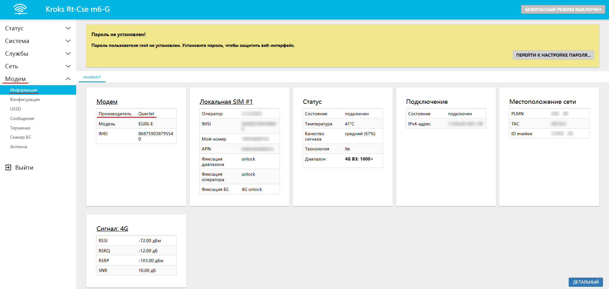
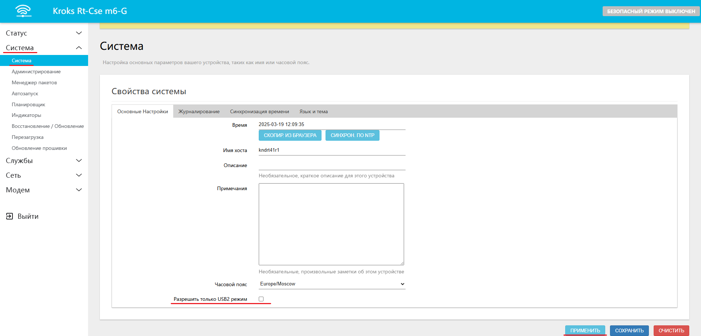

# Нет подключения или нестабильное подключение к сети Интернет

## ***Общие рекомендации***

Для подключения роутера к интернету нет необходимости прописывать настройки, если это не оговорено оператором, статус модема должен быть connected, если он периодически становится отличным от connected, то вам следует убедиться:

* sim-карта должна быть с тарифом для роутеров и модемов (если покупали не лично в салоне оператора сотовой связи - свяжитесь с оператором);  
  * ВНИМАНИЕ! ЕСЛИ ТАРИФ СИМКАРТЫ НЕ ДЛЯ РОУТЕРОВ И МОДЕМОВ, ОНА \[симкарта\] МОЖЕТ НЕКОТОРОЕ ВРЕМЯ ДАВАТЬ ИНТЕРНЕТ В РОУТЕРЕ, ПОКА ОПЕРАТОР НЕ ЗАБЛОКИРУЕТ ЭТУ ВОЗМОЖНОСТЬ (либо пока не закончится объем раздаваемого трафика в этом месяце). Оператор видит разницу между телефоном и роутером: ставите симкарту в телефон - интернет есть, ставите в роутер - интернета нет. Вы должны быть абсолютно уверены в тарифе симкарты!  
* на sim-карте должен быть оплачен и активен интернет (проверяйте в личном кабинете оператора);  
* для стабильной работы антенна должна быть корректно наведена на базовую станцию(см выше в инструкции) Если статус модема все время connected и тариф на sim-карте оплачен и активен, а интернета все равно нет, то переходим пункт меню **Сеть** подпункт **Диагностика**, заменяем kroks.ru на 8.8.8.8 и нажимаем кнопку **IPV4 ПИНГ-ЗАПРОС**.  
     
   

Если количество "packets transmitted" равняется количеству "packets received", а "packet loss" равно 0%, то ваше устройство установило соединение с сетью провайдера, но он не даёт вам интернет, и причина в одном из пунктов выше. В случае когда значение "packet loss" меньше 100%, но больше 0% - это говорит о нестабильном приеме сигнала - внимательней выполните рекомендации статьи: [Наведение антенны с помощью роутера Крокс](/docs/routery/upravlenie-modemom/navedenie-antenny.md).

В случае если не удается добиться уверенного приема сигнала, есть вероятность наличия значительных помех в радиоэфире. Для проверки рекомендуем переместиться в центр ближайшего густонаселенного пункта и перепроверить там. Если связь будет стабильной, рекомендуем обраться к специализированным монтажникам для проведения инспекции радиоэфира и условий монтажа в проблемном месте.

:::info
Кроме того вы можете ознакомиться с более подробными статьями о первом включении [домашнего роутера](/docs/routery/pervoe-znakomstvo/pervoe-vklyuchenie-routera/domashniy-variant.md), [уличного](/docs/routery/pervoe-znakomstvo/pervoe-vklyuchenie-routera/ulichnyy-variant.md) или [SIM-инджектора подключенного к роутеру](/docs/routery/pervoe-znakomstvo/pervoe-vklyuchenie-routera/sim-inzhektor.md).

:::

## ***Частные случаи***

Одним из возможных вариантов отсутствия подключения к сети или его нестабильности могут послужить особенности в работе определенных модемов.  
Эта проблема может возникнуть у модемов *Quectel* категорий 6, 12 и 18.  
Проверить производителя установленного у вас модема в можете через веб интерфейс, во вкладке "Модем" -> "Информация".

После того, как вы убедитесь в том что у вас установлен модем *Quectel*. Вам необходимо перейти на вкладку "Система" -> "Система" и поставить галочку напротив пункта **Разрешить только USB2 режим**.  
Нажать кнопку "ПРИМЕНИТЬ".

После того как роутер снова станет доступен перезагрузите его.
