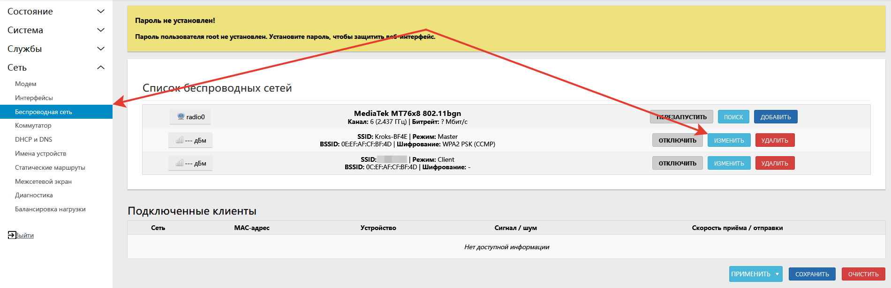
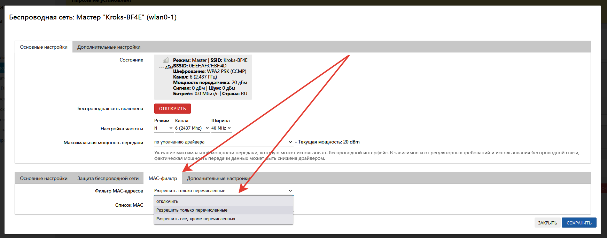
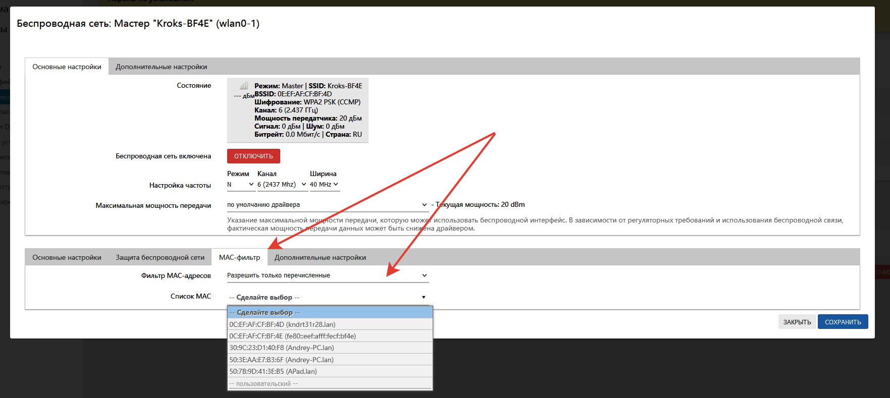

# Ограничение доступа для клиентов

Рассмотрим способы фильтрации клиентов роутера по MAC-адресам. Для проводного подключения и Wi-Fi это будут разные способы.

## ***Wi-Fi***

Настройка выполняется через веб-интерфейс. Детали на скриншотах ниже.

  
  


## ***Проводное соединение***

Подключитесь к роутеру по SSH и отредактируйте файл.

```bash
nano /etc/firewall.user
```

Вставьте в конец файла правило, как на примере ниже.

```bash
mac_filter() {
  iptables -A INPUT -m mac --mac-source 50:7B:9D:41:3E:B5 -j DROP
}
mac_filter
```

В нашем примере это значит:

* -A (append) - добавить правило в конец указанной цепочки.
* INPUT - указывает цепочку, для которой это правило будет применяться.
* -m mac --mac-source XX:XX:XX:XX:XX:XX - устанавливает соответствие MAC-адреса для выполнения условия.
* -j DROP (jump DROP) - когда правило подошло — выполнить указанное действие, т.е. DROP - отбросить пакеты.

Т.е. это правило запрещает все входящие подключения от клиента с указанным в правиле MAC-адресом. Описание команды iptables есть [здесь](https://man7.org/linux/man-pages/man8/iptables.8.html).

Сохраните изменения и перезапустите firewall.

```bash
uci commit firewall && /etc/init.d/firewall reload
```
