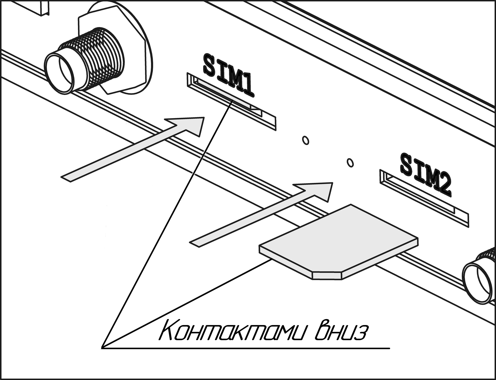
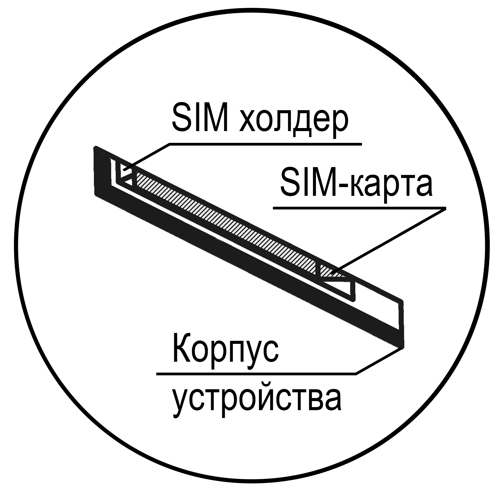

# Особенности установки SIM-карт разного формата

## ***Установка Micro SIM-карты***

SIM-карта формата Micro устанавливается контактами вниз, уголком от устройства.

## ***Установка Nano и Mini SIM карт***

SIM-карты форматов Mini и Nano устанавливаются одинаковым образом - контактами вниз и уголком к устройству.

## ***ВАЖНО***

::: tip
Обратите внимание, установку SIM-карты в слот необходимо производить с небольшим усилием, дальше плоскости передней панели, до характерного щелчка.  

:::

::: warning
**Не допускается использование острых предметов(игла, пинцет и т.д.) для установки SIM-карты ввиду возможной деформации разъёма**
:::