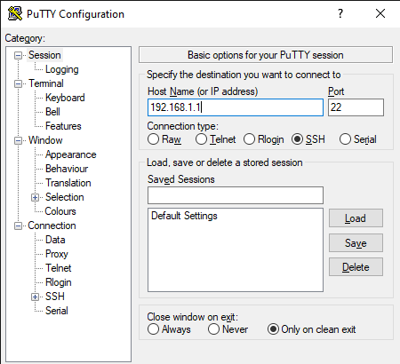
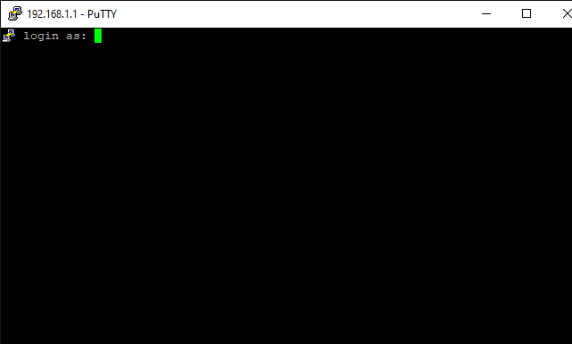
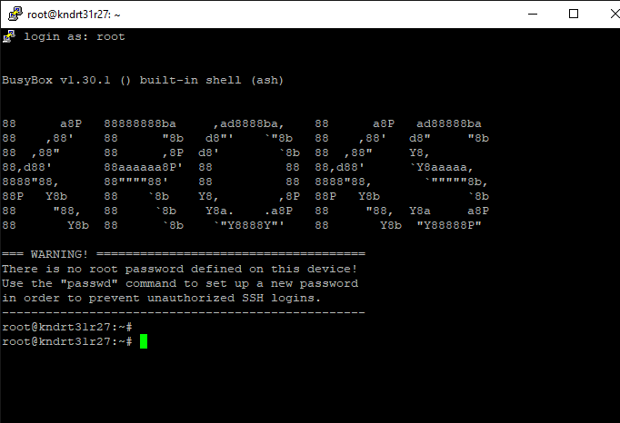

# Подключение по ssh

SSH - это протокол, позволяющий устанавливать защищенное соединение и управлять роутером. Более подробно о принципе и работе протокола можете прочитать [здесь](https://ru.wikipedia.org/wiki/SSH). Возможности протокола охватывают гораздо больше простого подключения и управления с помощью команд, но в данной статье мы будем рассматривать пока только эту возможность. Соединение с роутером при этом может быть установлено как через сетевой кабель UTP (витая пара), Wi-Fi, так и с помощью виртуального подключения (туннелей).

## ***Как подключиться***

Одним из самых простых и доступных способов подключиться по SSH к роутеру является использование программы Putty. Скачать вы её можете с [официального сайта](https://www.chiark.greenend.org.uk/~sgtatham/putty/latest.html). После установки во вкладке "Session" вам необходимо ввести IP-адрес роутера, например 192.168.1.1, оставить "Connection type" - SSH и нажать "Open".

При стандартных настройках сетевой карты, межсетевых экранов роутера и ПК вы увидите окно терминала с предложением ввести логин и пароль для подключения к роутеру (по умолчанию логин - root, пароля нет).

После ввода логина и пароля (опционально) вы увидите следующее окно:

Это означает, что подключение прошло успешно и вы можете продолжать работу уже в терминале, используя SSH.
