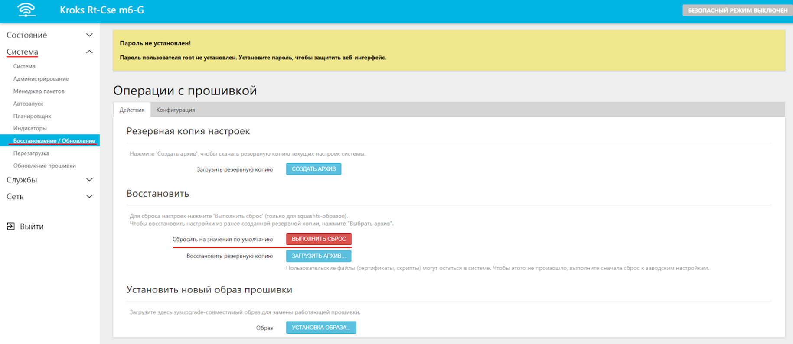
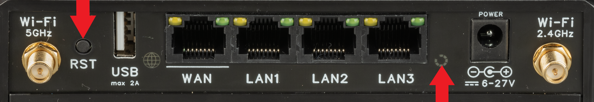

# Сброс устройства на заводские настройки

Для сброса роутера ***KROKS*** на заводские настройки можете воспользоваться одним из предложенных ниже вариантов:

## ***Через WEB-интерфейс***

Зайдите во вкладку "Система" → "Восстановление/Обновление".

Нажмите на кнопку "ВЫПОЛНИТЬ СБРОС".

Дождитесь пока WEB-интерфейс станет снова доступен.

## ***Кнопкой***

Включите роутер и дождитесь его полной загрузки (не менее нескольких минут).

Зажмите кнопку **Reset(RST)** (стрелка сверху вниз) на корпусе роутера на 5-10 секунд. Отпустите, когда индикатор Статус (стрелка снизу вверх) заморгает непрерывно.

Дождитесь пока WEB-интерфейс вновь станет доступен.

