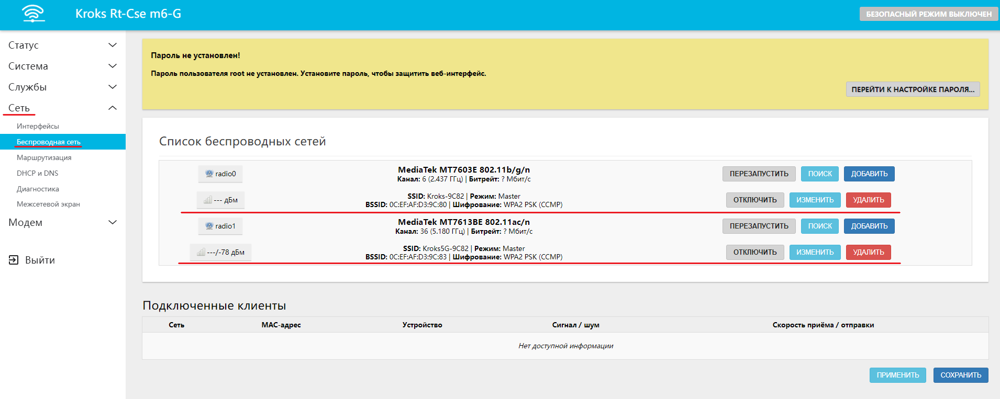
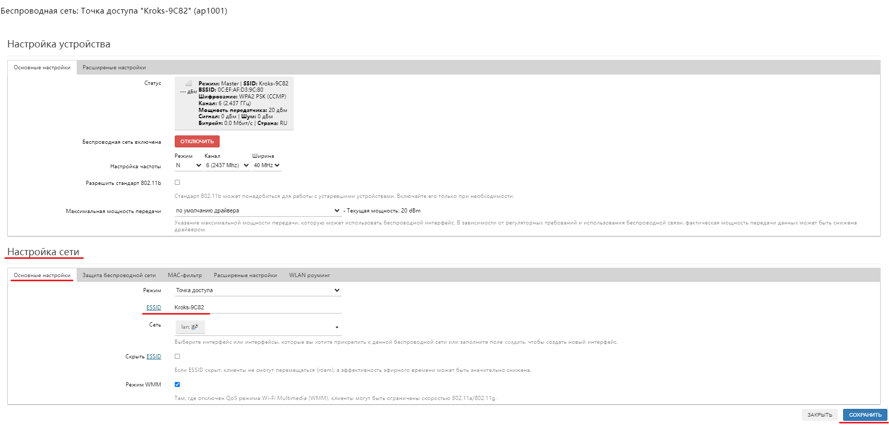

# Смена имени точки доступа (Wi-Fi)

Чтобы сменить имя Wi-Fi-сети, под которым она будет отображаться в поиске, необходимо зайти в веб-интерфейс роутера и в боковом меню открыть вкладку "Сеть" -> "Беспроводная сеть". Если ваш роутер поддерживает два диапазона Wi-Fi сетей (2,4 и 5 ГГц), то для каждой из них имя нужно будет устанавливать отдельно.

Для этого нужно выбрать необходимую сеть из списка и нажать кнопку "ИЗМЕНИТЬ". В открывшемся окне перейдите на вкладку "Основные настройки" блока "Настройки сети". В поле ESSID вы можете установить желаемое имя для вашей сети.

:::tip
Обратите внимание, при создании ESSID допускается использовать только латинский алфавит.
:::

Не будьте нажать кнопку "СОХРАНИТЬ", после ввода выбранного вами **ESSID**.
