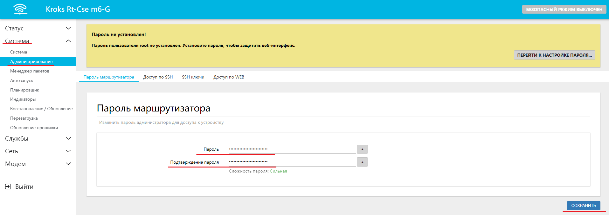

# Смена пароля администратора

Для того чтобы сменить пароль администратора, достаточно открыть веб-интерфейс и в боковом меню перейти на вкладку "Система" -> "Администрирование".

Там вы увидите поля где необходимо ввести желаемый пароль и подтвердить его.

:::tip
Несколько рекомендаций для создания надёжного пароля.

* Длина **пароля**. **Пароль** должен содержать не менее 8 символов, а лучше – 10 и более;
* Наличие цифр и букв верхнего и нижнего регистров, идущих не подряд – AAaaBBbb;
* Наличие специальных знаков – «@», «$», «&» и т. д;
* Обязательно сохраните или запомните созданный вами пароль. Понадобится вводить его каждый раз при входе в веб интерфейс.

:::

После ввода необходимого пароля, не забудьте нажать кнопку "СОХРАНИТЬ" внизу экрана, для применения настроек.
