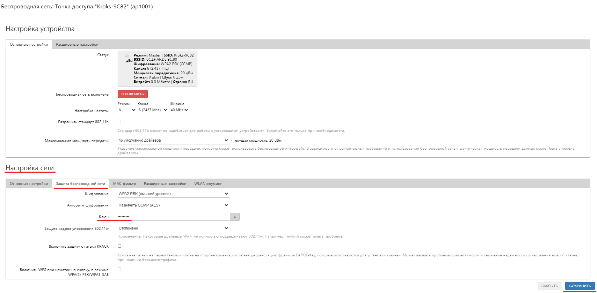

# Смена пароля точки доступа (Wi-Fi)

Чтобы сменить пароль для доступа к Wi-Fi-сети, необходимо зайти в веб-интерфейс роутера и в боковом меню открыть вкладку "Сеть" -> "Беспроводная сеть". Если ваш роутер поддерживает два диапазона Wi-Fi сетей (2,4 и 5 ГГц), то для каждой из них пароль нужно будет устанавливать отдельно.

Для этого нужно выбрать необходимую сеть из списка и нажать кнопку "ИЗМЕНИТЬ". В открывшемся окне перейдите на вкладку "Защита беспроводной сети" блока "Настройка сети". В поле Пароль (ключ) вы можете установить желаемый код доступа к вашей сети. После чего нажмите кнопку "СОХРАНИТЬ".

Обязательно запомните его, потому что этот код доступа нужно будет вводить на всех устройствах для подключения к вашей сети.
