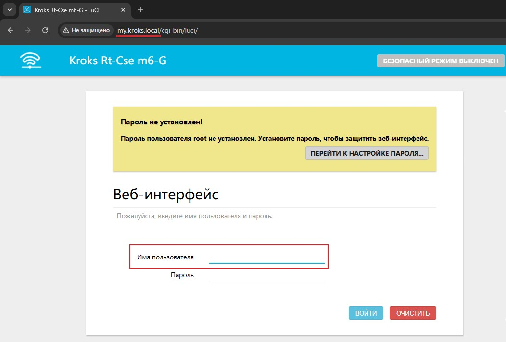
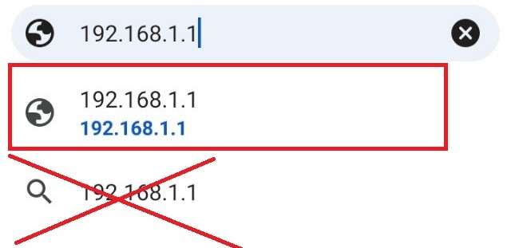
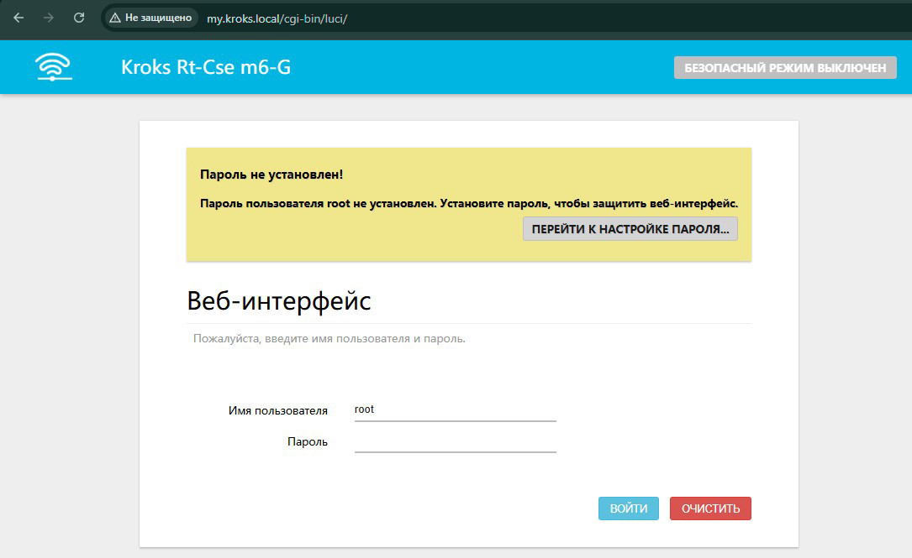
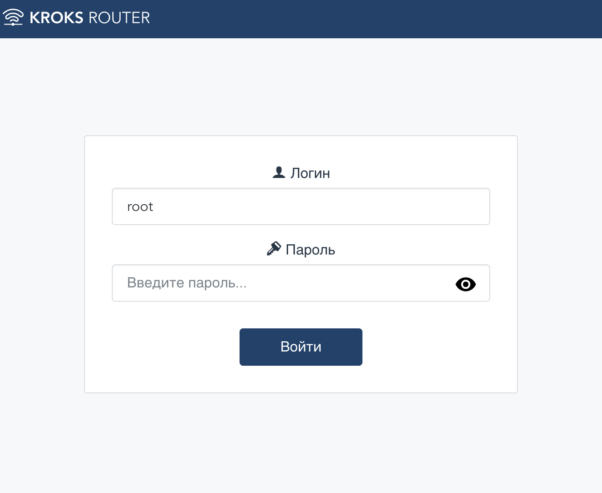
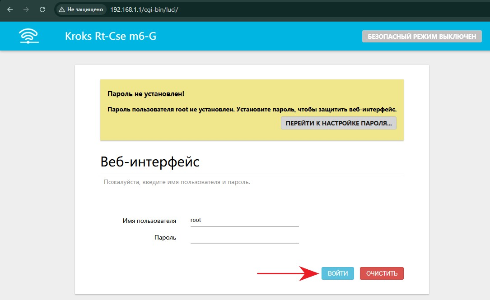

# Вход в web-интерфейс

Зайдите на страницу WEB-интерфейса роутера, через страницу в браузере (Яндекс, Chrome и тд.). В адресную строку необходимо вписать:  
*my.kroks.local*  

Обратите внимание, что в таком случае поле **Имя пользователя** не заполнится автоматически.  
Вам будет необходимо сначала заполнить это поле (по умолчанию **root**), после чего нажать кнопку **ВОЙТИ**.

Также вы можете попапасть в веб-интерфейс, если введете в строку бразуера ip-адрес вашего роутера:  
*192.168.1.1*  

Интерфейс должен выглядеть, как на скриншоте ниже.  

Если интерфейс выглядит следующим образом:  

Тогда в адресную строку необходимо вписать:  
*192.168.1.1/cgi-bin/luci/*

Заходим в веб интерфейс кнопкой **«ВОЙТИ»**. По умолчанию пароль не установлен.  

