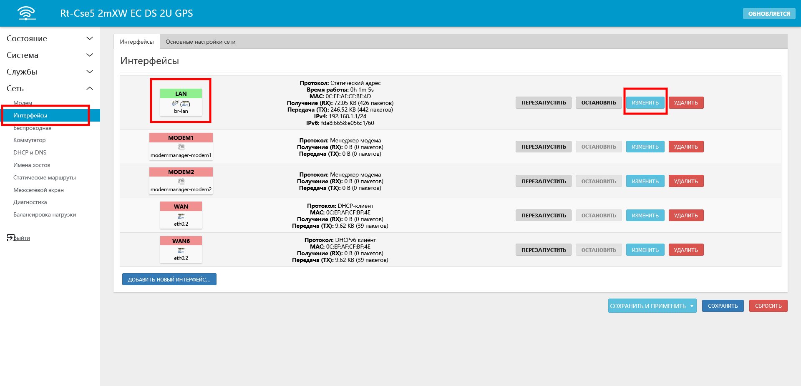
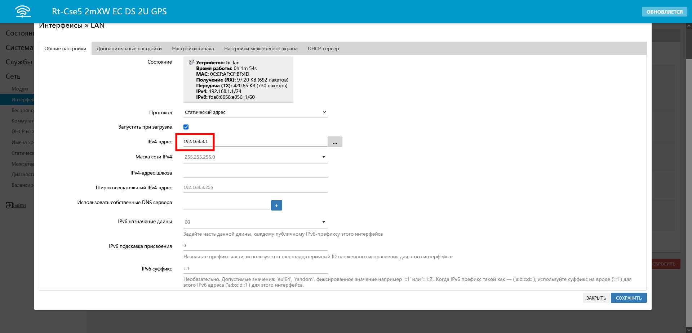
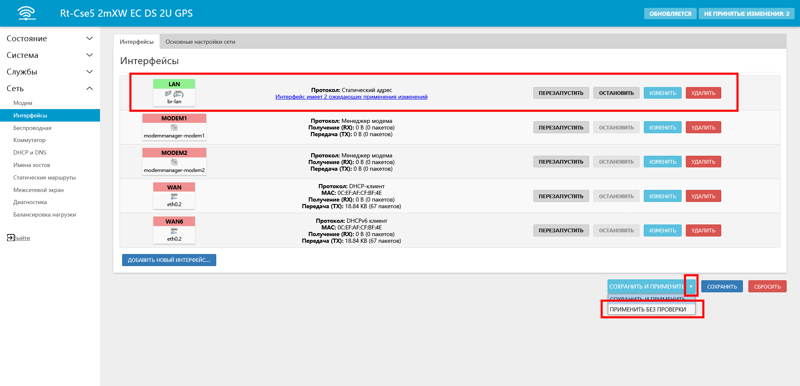
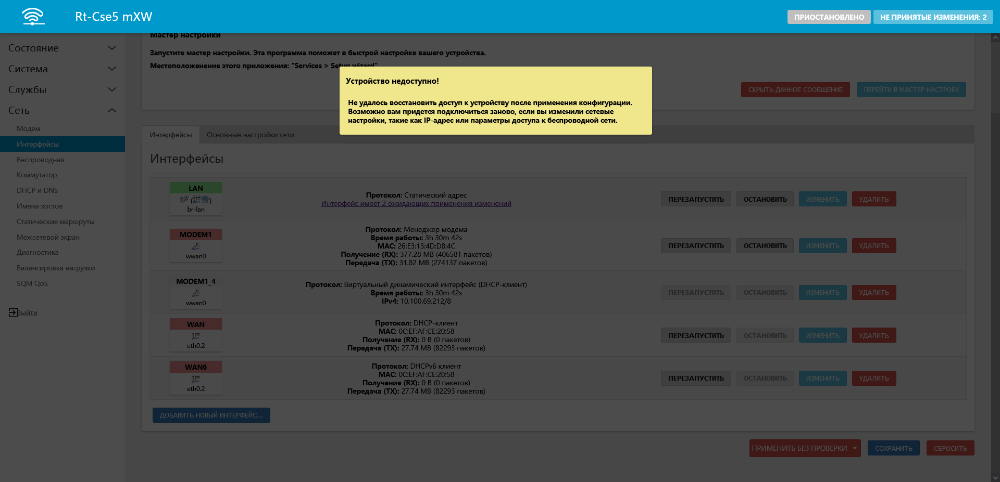

# Изменение подсети роутера

По умолчанию роутеры Крокс имеют адрес 192.168.1.1 и маску подсети 255.255.255.0. Это значит, что устройства подключаемые к роутеру в порты LAN1, LAN2, LAN3 и т.д., а также по Wi-Fi будут получать IP-адреса в диапазоне от 192.168.1.2 до 192.168.1.254.

Существует ряд ситуаций в которых вам может понадобиться сменить подсеть вашего роутера, например:  
* Если в вашей сети имеются две и более точек, которые работают как **отдельные** маршрутизаторы. В таком случае им нельзя назначать одну и ту же подсеть, иначе оба роутера могу выдавать одинакоые IP-адреса, что привидет к конфликтам устройств.  
* Если вы хотите изолировать какие-либо устройства от других. Например, создать гостевую сеть, чтобы устройствам из неё не было доступа к устройствам из домашней сети.  
* Если вы подключаете один роутер к другому как обычное устройство по WAN - он работает как отдельная сеть. В этом случае роутерам назначаются разные подсети.  
* Если перед вами стоит задача по созданию сложных сетей, часто используется сегментация сети для управления доступом, скоростью, безопасностью.

Для того чтобы изменить подсеть роутера (и диапазон раздаваемых роутером IP-адресов) необходимо [зайти](/docs/routery/chasto-zadavaemye-voprosy/vhod-v-web-interface.md) в веб-интерфейс роутера во вкладку "Сеть - Интерфейса - LAN - Изменить"  

Измените подсеть роутера.

:::tip
**Подсеть** - это третье число в графе IP адрес. Чтобы изменить его, выделите число (по умолчанию это **1**), и установите туда любое другое в диапазоне от 1 до 254 включительно (в примере **3**).
:::

В выпадающем меню кнопки "СОХРАНИТЬ И ПРИМЕНИТЬ" выберите "ПРИМЕНИТЬ БЕЗ ПРОВЕРКИ", после чего нажмите на кнопку "ПРИМЕНИТЬ БЕЗ ПРОВЕРКИ".

Настройки нового IP-адреса будут корректно сохранены.  

Сообщение, как на скриншоте ниже означает, что роутер по старому адресу (192.168.1.1) недоступен, и вам необходимо перейти на новый (в нашем случае 192.168.3.1).  

