# Мастер настройки

## ****Введение****

Для упрощения использования роутеров ***KROKS*** существует Мастер настройки. С его помощью можно в несколько простых шагов настроить ваш роутер для домашнего использования.

Мастер настройки также может помочь вам создать целую сеть связанных между собой роутеров для более качественного и надёжного соединения с сетью Интернет на большой площади.

В меню Мастера настройки можно попасть через web-интерфейс роутера. Существует два варианта как это сделать:

* Во вкладке "Состояние" → "Обзор" нажмите кнопку "Запустить" на карточке Мастер настройки.  
   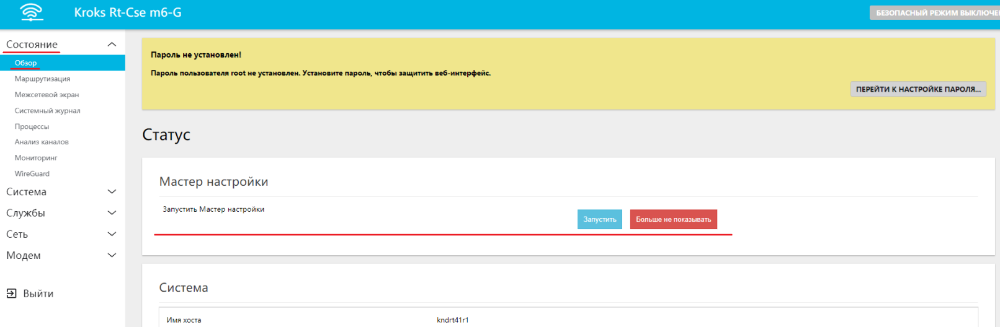
* Во вкладке "Службы" → "Мастер настройки".  
   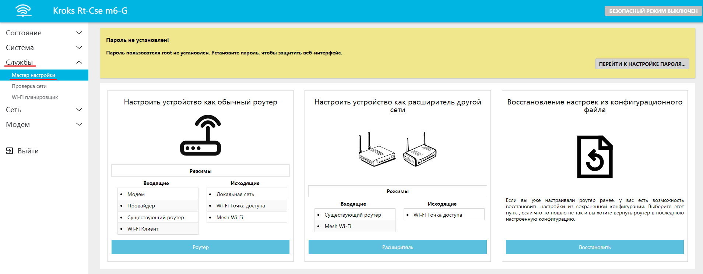

## ***Меню Мастера настройки***

Открыв Мастер настройки, можно увидеть три пункта:

1. Настроить устройство как обычный роутер.  
   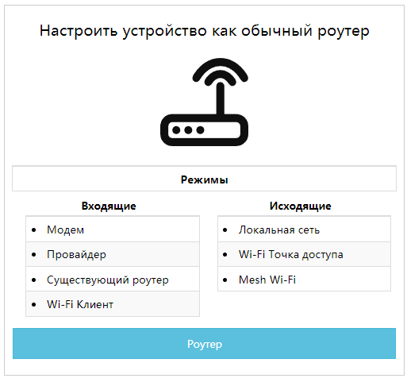

    :::info
    * Модем — вариант подключения, при котором устройство осуществляет подключение к сети Интернет через встроенный модем.
    * Провайдер — вариант подключения, при котором устройство осуществляет подключение к сети Интернет через кабель "витая пара", предоставленный вашим провайдером.
    * Существующий роутер — вариант подключения, при котором устройство осуществляет подключение к сети Интернет через кабель "витая пара" от другого уже настроенного роутера.
    * Wi-Fi клиент — вариант подключения, при котором устройство осуществляет подключение к сети Интернет через беспроводное соединение от другого уже настроенного роутера.
    * Локальная сеть — вариант подключения, который позволяет нескольким устройствам работать вместе в определенной области.
    * Wi-Fi точка доступа — вариант подключения, при котором устройство предоставляет доступ к сети Интернет для других пользователей через беспроводное соединение.
    * MESH Wi-Fi — вариант подключения, при котором устройство настраивается как главная точка MESH сети.
    :::

2. Настроить устройство как расширитель другой сети.  
  Выберите этот вариант, если у вас уже есть сеть дома, и вы хотите расширить зону её действия с помощью другого роутера (подключив его по проводу или с помощью технологии MESH).  
  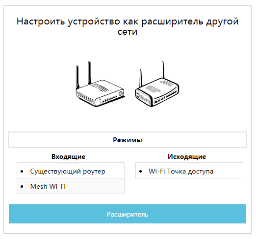

    :::info
    * Существующий роутер — вариант подключения, при котором объединение роутеров в одну сеть происходит путём соединения их кабелем "витая пара" через порты LAN.
    * MESH Wi-Fi — вариант подключения, при котором объединение устройств в одну сеть происходит с помощью беспроводной технологии MESH. Этот вариант подходит только для настройки **точки доступа** MESH.
    * Wi-Fi Точка доступа — вариант подключения, при котором устройство ретранслирует доступ к сети Интернет от уже настроенного роутера.
    :::

3. Восстановление из конфигурационного файла.  
  Если вы уже настраивали роутер ранее **при помощи Мастера настройки**, то у вас есть возможность восстановить последнюю настроенную конфигурацию.  
  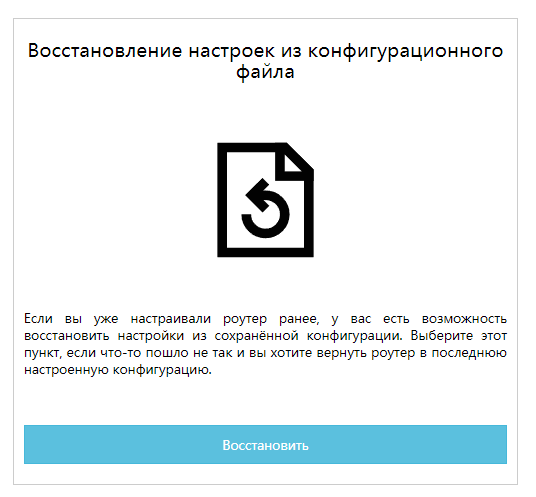

## ***Настройка устройства как обычного роутера***

После выбора данного пункта, Мастер настройки предложит вам создать подключение к сети Интернет одним из нескольких возможных вариантов.  
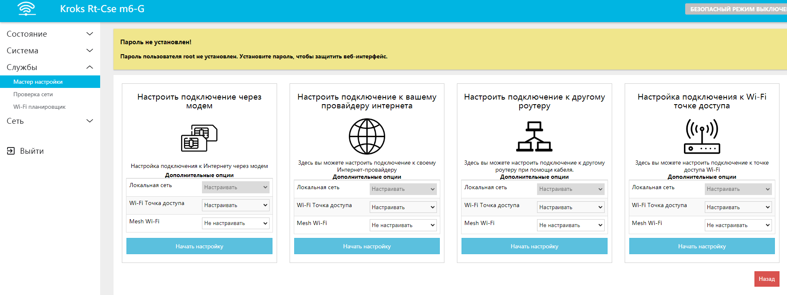

* [Настройка подключения через модем](#настройка-подключения-через-модем)
* [Настройка подключения через провайдера](#настройка-подключения-через-провайдера)
* [Настройка проводного подключения через другой роутер](#настройка-проводного-подключения-через-другой-роутер)
* [Настройка беспроводного подключения через другой роутер](#настройка-беспроводного-подключения-через-другой-роутер)

Также в окне выбора основного подключения есть несколько селекторов, где можно по необходимости включить или выключить **[дополнительные настройки](#дополнительные-настройки)**:

**[Wi-Fi точка доступа](#настройка-wi-fi-точек-доступа)** — данный пункт необходимо настроить, если вы хотите подключать к своему роутеру устройства с помощью беспроводного соединения Wi-Fi;

**[MESH Wi-Fi](#настройка-wi-fi-mesh-в-режиме-главной-точки)** — данный пункт необходимо настроить, если вы планируете создать MESH сеть, и настраиваемый роутер будет в ней **главной точкой.**

После того как вы определились с желаемым типом подключения и дополнительными настройками для него нажмите кнопку "Начать настройку".

### ***Настройка подключения через модем***

В появившемся окне пользователю предоставляется возможность выбрать SIM-карту в верхнем селекторе, после чего настроить её во вкладке ниже. Обратите внимание, следует вводить только данные, полученные от провайдера (**Тип IP**, **Имя пользователя**, **Пароль и т.д.**), либо установленные собственноручно, например, **PIN-код**. В случае если у вас нет дополнительной информации о вашем подключении рекомендуем оставить настройки по умолчанию.  
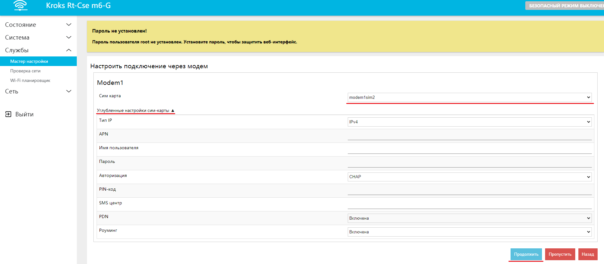

Для продолжения настройки нажмите "Продолжить" после чего вас перенесёт на этап настройки **[локальной сети](#настройка-локальной-сети)**.

### ***Настройка подключения через провайдера***

Чтобы настроить подключение от вашего провайдера интернета, нужно выбрать протокол и ввести необходимые данные, которые указаны в договоре об оказании услуг. Если там ничего нет, оставьте режим "Simple".

Далее нужно ввести данные вашего подключения к сети Интернет, которые вам сообщил провайдер.

Если ваш провайдер указал IP адрес, с которым нужно подключиться, выберите режим "Static" и введите данные, указанные вашим провайдером интернета.  
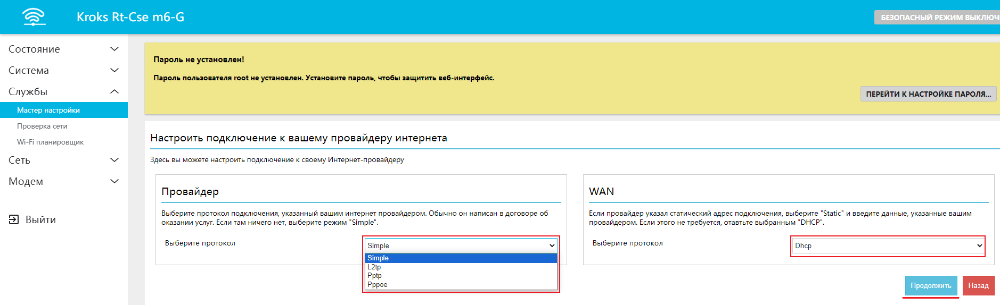

Нажмите "Продолжить", после чего вас перенесёт на этап настройки **[локальной сети](#настройка-локальной-сети)**.

### ***Настройка проводного подключения через другой роутер***

В появившемся окне необходимо выбрать нужный протокол соединения, в случае если это **Static** понадобится ещё дополнительно ввести **IP адрес**, **Маску** **сети** и **Шлюз**.  
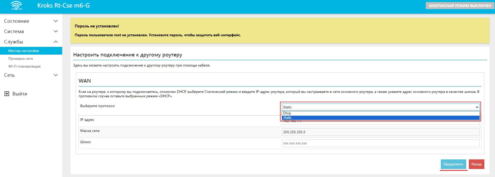

Нажмите "Продолжить", после чего вас перенесёт на этап настройки **[локальной сети](#настройка-локальной-сети)**.

### ***Настройка беспроводного подключения через другой роутер***

Что бы настроить подключение к другому роутеру через технологию Wi-Fi нажмите кнопку "Начать сканирование". Когда процесс сканирования будет окончен, появится возможность открыть селектор со списком обнаруженных точек доступа. Выберите подходящую, в случае необходимости введите пароль.  
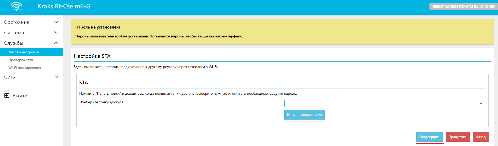

Нажмите "Продолжить", после чего вас перенесёт на этап настройки **[локальной сети](#настройка-локальной-сети)**.

### ***Дополнительные настройки***

#### ***Настройка локальной сети***

Если у вас настроено подключение от другого роутера [проводное](#настройка-подключения-к-другому-роутеру-через-кабель) или [беспроводное](#настройка-беспроводного-подключения-через-другой-роутер), вам необходимо установить подсеть, отличающуюся от подсети основного роутера.

:::tip
**Подсеть** - это третье число в графе IP адрес. Чтобы изменить его, выделите число (по умолчанию это **1**), и установите туда любое другое в диапазоне от 1 до 254 включительно.
:::

В ином случае оставьте настройки без изменений. Нажмите кнопку "Продолжить".  
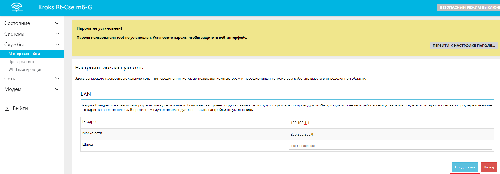

#### ***Настройка Wi-Fi точек доступа***

Для того чтобы у вас была возможность подключать к роутеру устройства по технологии Wi-Fi - вам необходимо настроить Wi-Fi точку доступа. Обратите внимание, если ваш роутер поддерживает сеть 5 ГГц, то вы можете выбрать как одну из возможных точек (2,4 и 5 ГГц), так и активировать обе одновременно.  
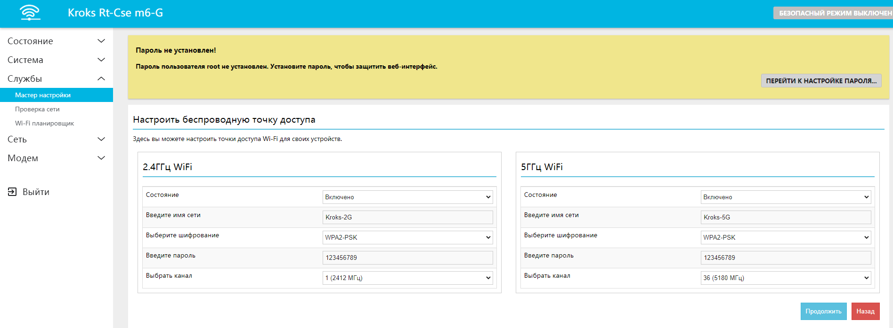

Чтобы настроить беспроводную точку доступа:

* В селекторе **Состояние** выберите "Включено".
* Введите имя вашей точки доступа.
* Придумайте и установите сложный пароль. Обязательно запомните его, так как вам необходимо будет вводить пароль от вашей точки доступа в подключаемых устройствах.
* Выберите "Шифрование", если вам это требуется, либо оставьте настройку без изменений.
* Если это необходимо, в графе **Выбрать канал** укажите нужный вам канал. Нажмите "Подтвердить".
  * Для того чтобы определить наименее загруженный канал, выберите во вкладке "Состояние" пункт "Анализ каналов". Дождитесь окончания сканирования и выберите канал с минимальным уровнем сигнала использующих его точек доступа.  
    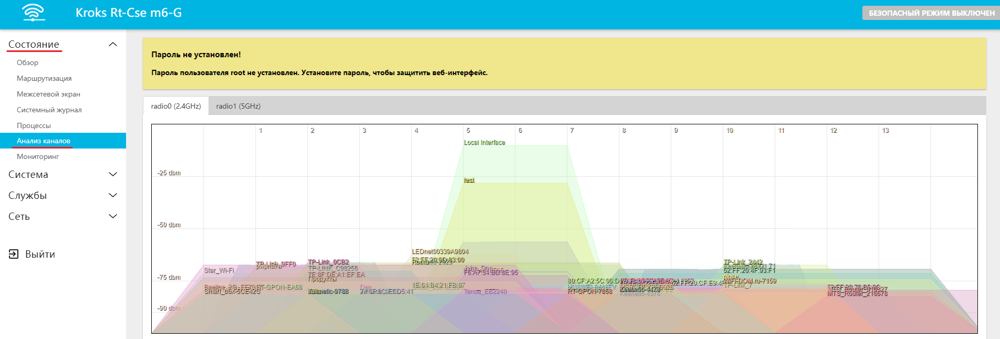

#### ***Настройка Wi-Fi MESH в режиме главной точки***

:::tip
MESH сеть - это домашняя Wi-Fi система, созданная для устранения зон со слабым сигналом и обеспечения непрерывного покрытия Wi-Fi во всём доме.
:::

Чтобы настроить MESH, задайте ID точки доступа (Имя).

ID должен быть уникальным и не пересекаться с другими точками доступа.

Придумайте сложный пароль, который нужно будет ввести на подключаемых роутерах.

Выберите желаемый диапазон 2G или 5G, а также желаемый канал.

После чего нажмите кнопку "Продолжить".  
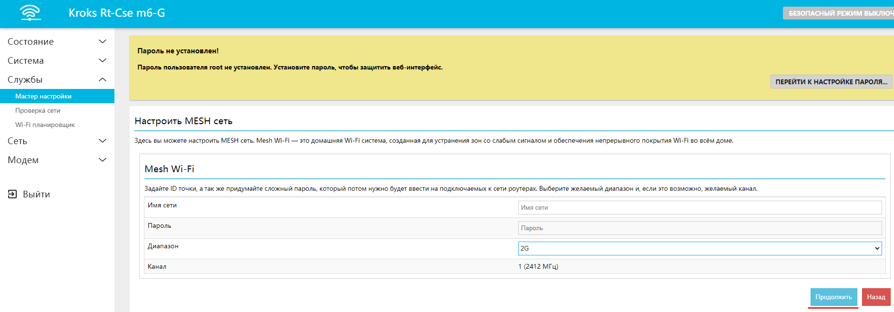

В конце настройки перед вами откроется окно с финальной конфигурацией, в котором вы можете проверить введенные вами данные, после чего подтвердить их, либо вернуться назад для исправления.

## ***Режим расширителя***

Также вы можете несколькими способами настроить свой роутер таким образом, чтобы увеличить покрытие уже существующей сети.

В этом режиме в качестве дополнительной настройки можно создать только [Wi-Fi точку доступа](#настройка-wi-fi-точек-доступа), настройка которой происходит аналогичным образом.

Обратите внимание, что при настройке роутера в режиме расширителя, его порт **WAN** становится идентичным порту **LAN**.  
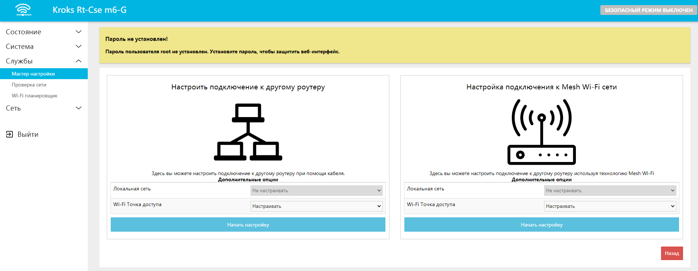

:::info
После настройки роутера в режиме расширителя и выборе протокола DHCP, подключение по старому адресу утрачивает свою актуальность. Если вам требуется продолжить настройку устройства, то необходимо выполнить подключение через "главный" роутер в соответствии с присвоеным ему ip-адресом.  
В случае назначения статического ip-адреса, дальнейшее взаимодействие с устройством, осуществляется с его использованием.
:::

### ***Настройка подключения к другому роутеру через кабель***

Для того чтобы увеличить зону покрытия сети с помощью проводного подключения, выберите режим "Настроить подключение к другому роутеру".

В селекторе выберите протокол "DHCP". Если вам необходимо подключиться к роутеру, на котором отключена служба "DHCP", выберите режим "static" и введите нужный IP-адрес.

Нажмите "Продолжить".  
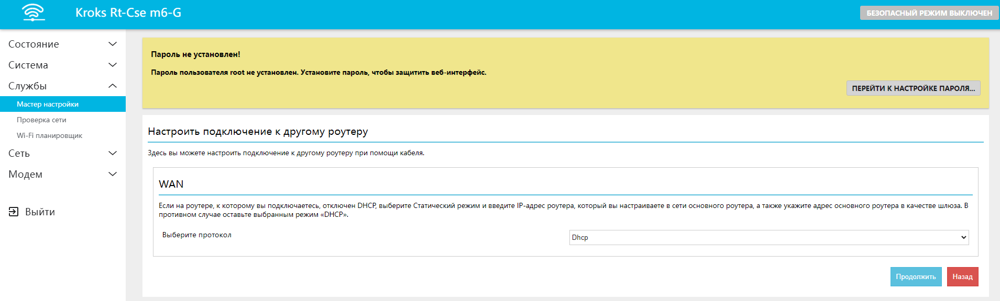

### ***Настройка MESH в режиме точки доступа***

Для того чтобы настроить подключение к другому роутеру через технологию Wi-Fi MESH, выберите режим "Настройка подключения к MESH Wi-Fi сети".

Нажмите на кнопку "Начать поиск" и дождитесь, когда закончится сканирование. Выберите в селекторе нужную точку доступа и, если это необходимо, введите пароль.

Нажмите "Продолжить".  
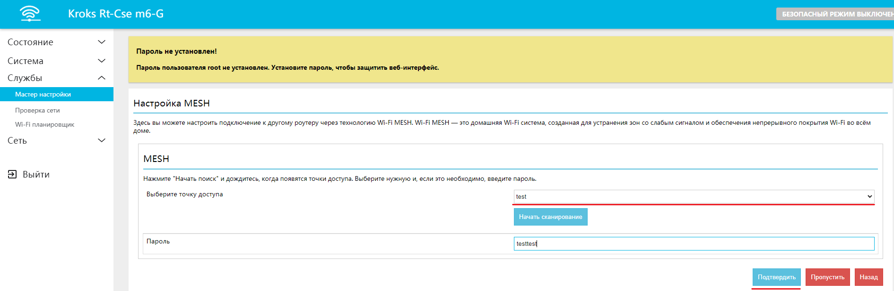

В конце настройки перед вами откроется окно с финальной конфигурацией, в котором вы можете проверить введенные вами данные, после чего подтвердить их, либо вернуться назад для исправления.

## ***Восстановление предыдущих настроек***

Если вы уже настраивали роутер ранее, используя Мастер настройки, у вас есть возможность восстановить данные из сохраненной конфигурации.

Нажмите кнопку "Восстановить" в пункте "Восстановление настроек из конфигурационного файла".  

В открывшемся окне проверьте правильность конфигурации и нажмите кнопку "Подтвердить".  
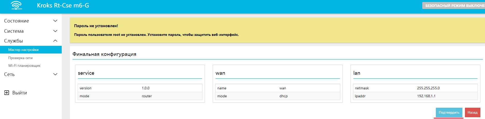
