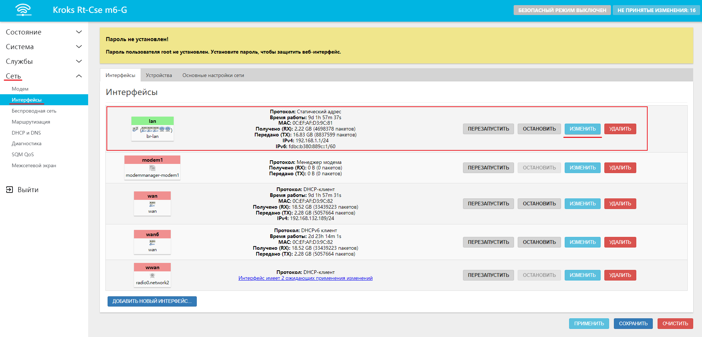
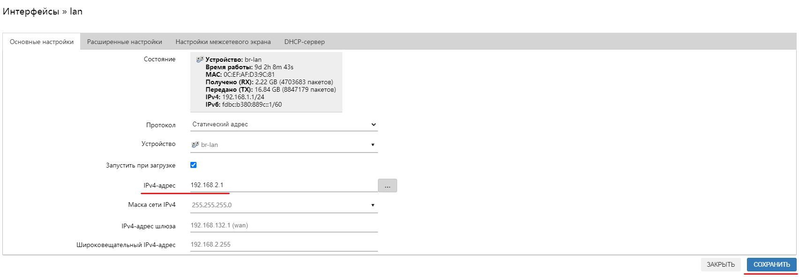
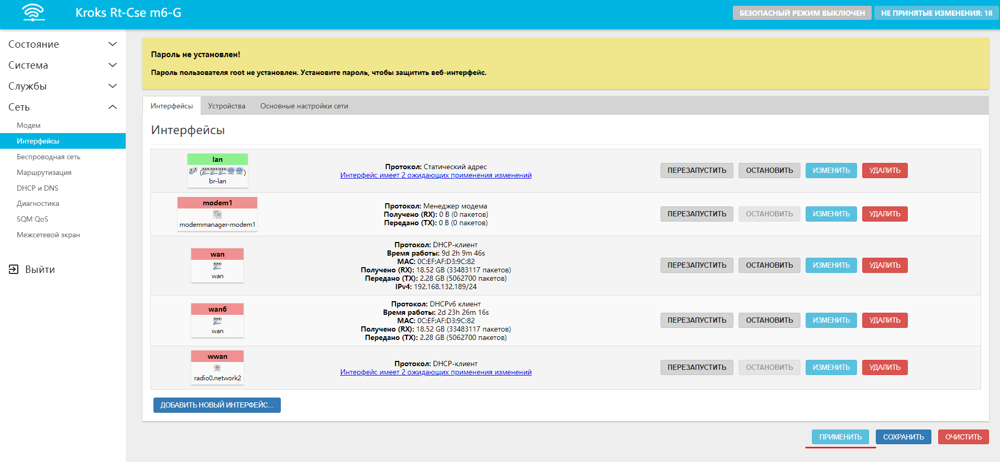
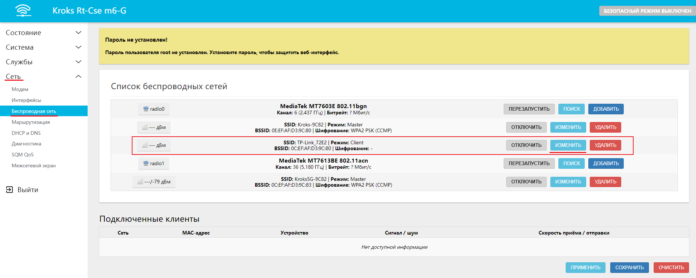

# Настройка беспроводного подключения

Для начала нам необходимо войти в веб-интерфейс роутера.

Следующим шагом перейти во вкладку "Сеть" → "Беспроводная сеть".

:::tip
Если ваш роутер поддерживает и 2,4 и 5 ГГц Wi-Fi, то сначала нужно определиться, на какой частоте работает необходимая Wi-Fi точка доступа. Сделать это можно двумя способами. Либо зайти в веб интерфейс роутера и проверить там, либо, косвенно можно понять по имени Wi-Fi сети.

Например, если Имя сети содержит подпись **2G** либо не имеет никакой дополнительной подписи вообще, то, скорее всего, сеть расположена на частоте 2,4 ГГц. Соответственно, если в конце имени есть подпись **5G**, то это сеть с частотой 5 ГГц.
:::

Выбрав нужно частоту, нажмите кнопку "ПОИСК" (в примере это 2,4 ГГц точка доступа).  

Дождитесь окончания сканирования.  

В появившемся списке выберите искомую точку доступа и нажмите кнопку "ПОДКЛЮЧЕНИЕ К СЕТИ".

Введите пароль от точки доступа, остальные настройки рекомендуется оставить по умолчанию после чего нажмите на кнопку "ПРИМЕНИТЬ".  

В открывшемся окне оставьте все без изменений и нажмите на кнопку "СОХРАНИТЬ".  

Далее перейдите во вкладку "Сеть" → "Интерфейс".

Найдите интерфейс LAN, отмеченный зеленым цветом и нажмите кнопку "Изменить".  

В строке **IPv4-адрес** введите адрес, подсеть которого отличается от основного роутера и нажмите кнопку "СОХРАНИТЬ".

:::info
Подсеть это третье число в IP адресе, например, если у основного роутера IP-адрес равен 192.168.**1**.1, то введите IP адрес 192.168.**2**.1 (в качестве подсети можно выбрать любое число от 1 до 254 включительно).
:::

Нажмите кнопку "Применить".  

Готово, теперь ваш роутер подключен к главному по Wi-Fi.

Если этого не случилось, проверьте правильность введенного пароля. Для этого перейдите во вкладку "Сеть" → "Беспроводная сеть".

Найдите вашу точку доступа, к которой происходило подключение.

Нажмите кнопку "ИЗМЕНИТЬ".  

В пункте **Настройка сети** выберите вкладку **Защита беспроводной сети** и нажмите на звездочку напротив строки **Пароль (ключ)**. Теперь вы сможете увидеть введенный ранее пароль и по необходимости его изменить, после чего нужно нажать на кнопку "СОХРАНИТЬ".  

:::tip
Обратите внимание, что при такой настройке у второго роутера сохраняется функция DHCP-сервера и соответственно он будет находиться в отдельной локальной сети.  
**Устройства из разных сетей не смогут взаимодействовать друг с другом**.
:::
