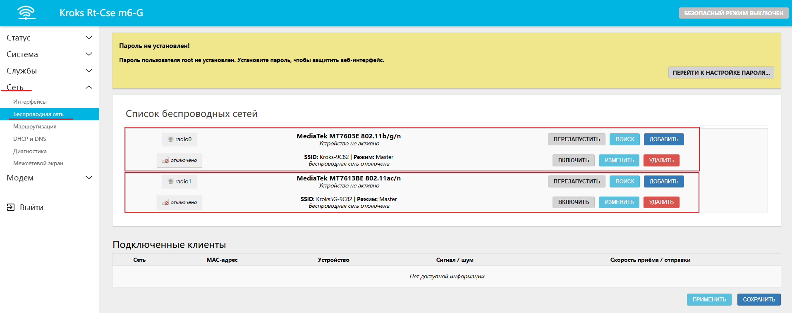
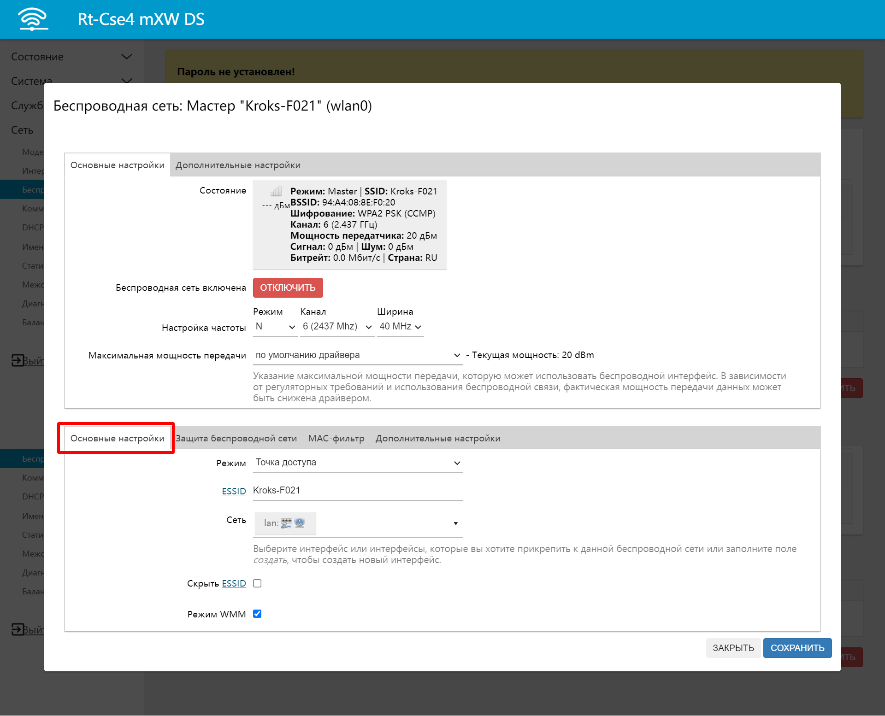
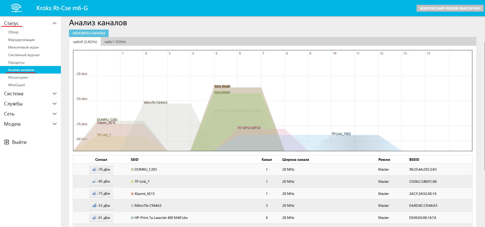
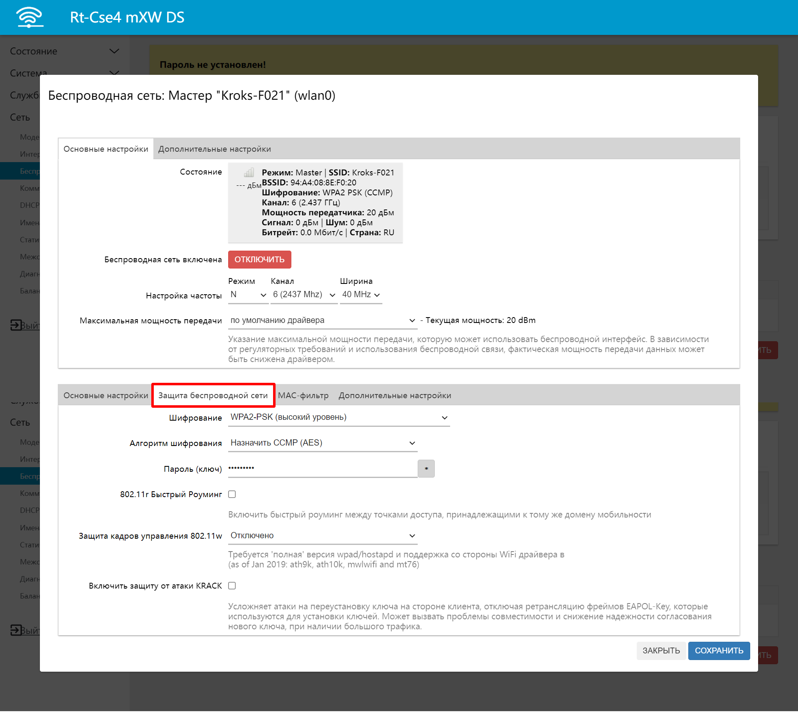

# Настройка беспроводной сети

В статье рассмотрим базовую настройку Wi-Fi в роутерах производства Kroks. В частности смена имени сети Wi-Fi, пароля, настроек безопасности, частоты и мощности беспроводного сигнала.

Зайдём в веб-интерфейс во вкладку Сеть - Беспроводная сеть.  

На скриншоте выше, в списке беспроводных сетей есть строки **MediaTek MT7603E 802.11b/g/n** и **MediaTek MT7613BE 802.11ac/n**, это означает что ваш роутер поддерживает Wi-Fi 5 ГГц, в ином случае в этой вкладке будет отображаться лишь одна строка с подобным названием.

Это беспроводной модуль, встроенный в SoC (основной чип роутера, ЦП).

**ПЕРЕЗАПУСТИТЬ** - перезапускает беспроводной модуль и перезагружает все созданные в роутере сети Wi-Fi.

**ПОИСК** - сканирует эфир на наличие всех возможных доступных сетей Wi-Fi.

**ДОБАВИТЬ** - позволяет добавить дополнительные беспроводные сети с индивидуальными параметрами.

Ниже есть строки с уже существующими по умолчанию сетями Wi-Fi **Kroks-9C82** в диапазоне 2,4 ГГц и **Kroks5G-9C82** в диапазоне 5 ГГц соответственно.

**Обратите внимание, каждую из сетей необходимо настраивать отдельно.**

Для этого нажмём кнопку **ИЗМЕНИТЬ** напротив нужной вам сети.  

## ***Настройка частоты***

### ***Режим***

**N** - подходит для большинства случаев.

**Legacy** - для работы с устаревшими устройствами, не поддерживающих стандарт 802.11n.

Для большинства случаев рекомендуем оставить **N**.

### ***Канал***

Это важный параметр при создании или настройке сети Wi-Fi.

Если вкратце, то частотный диапазон, выделенный для сетей Wi-Fi поделён на небольшие каналы, шириной 20 или 40 МГц. И каждая сеть Wi-Fi использует свой канал.

В общественных местах, многоквартирных домах из-за большого количества соседствующих друг с другом сетей Wi-Fi может возникнуть ситуация, когда определённый канал (или каналы) могут быть заняты слишком большим количеством сетей Wi-Fi что может привести как к медленной работе Wi-Fi, так и к периодическим отключениям клиентских устройств от Wi-Fi сети роутера из-за перегрузки беспроводного модуля роутера.

Для сканирования эфира на наличие других сетей можете использовать ПО, например, [InSSIDer](https://inssider.ru.uptodown.com/windows).

Также загруженность эфира можно узнать через веб-интерфейс. Для этого необходимо зайти во вкладку Статус - Анализ каналов, после чего автоматически запустится сканирование.

Если соседствующих с вами сетей Wi-Fi мало, и используемый вами канал свободен, то можете оставить его без изменений.

В противном случае выберите наименее загруженный канал.

### ***Ширина***

В зависимости от предыдущей настройки. Для большинства ситуация подходит 20 МГц.

### ***Максимальная мощность передачи***

По умолчанию выбран режим максимальной мощности. Для большинства случаев этого достаточно.

В исключительных случаях можно его понизить.

### ***Режим работы***

**По умолчанию** - Точка доступа. Меняйте его только тогда, когда вы понимаете зачем вы это делаете. В большинстве случаев рекомендуем оставить как есть.

### ***ESSID***

Собственно, это и есть имя сети Wi-Fi.

### ***Сеть***

Указывает интерфейс, который принадлежит к сети Wi-Fi. По умолчанию - lan.

На этом с базовыми настройками можно закончить. Перейдём на вкладку **Защита беспроводной сети**.  

### ***Шифрование***

Позволяет выбрать режим шифрования. Рекомендуем использовать WPA2-PSK (высокий уровень).

Изменение режима может потребоваться для подключения устаревших устройств, [создания MESH-сети](/docs/routery/prodvinutaya-nastroyka/Mesh-set.md), и т.д.

### ***Пароль (ключ)***

Пароль на Wi-Fi. Не менее восьми символов.
