# Настройка двух сетей на одном роутере

В данной статье вы узнаете как можно создать две беспроводных сети на одном роутере.  
Следуя инструкции ниже, вы сможете, например, разделить созданные сети по используемым источникам интернета.  
Также вы можете настроить одну из созданных сетей, как гостевую или частную, либо иным образом в зависимости от ваших целей и необходимостей.

## ***СБРОС УСТРОЙСТВА НА ЗАВОДСКИЕ НАСТРОЙКИ***

:::tip
Первый шаг необязателен, но позволяет уберечь себя от отладки предлагаемой конфигурации.

:::

Подробнее узнать о том как произвести сброс устройства вы можете в [этой](/docs/routery/chasto-zadavaemye-voprosy/sbros-ustroystva-na-zavodskie-nastroyki.md) статье.

## ***НАСТРОЙКА ЗОН МЕЖСЕТЕВОГО ЭКРАНА***

Открываем вкладку "Сеть" → "Межсетевой экран".

В нижней части окна найдите раздел "Зоны". Здесь нужно нажать кнопку "ДОБАВИТЬ".  
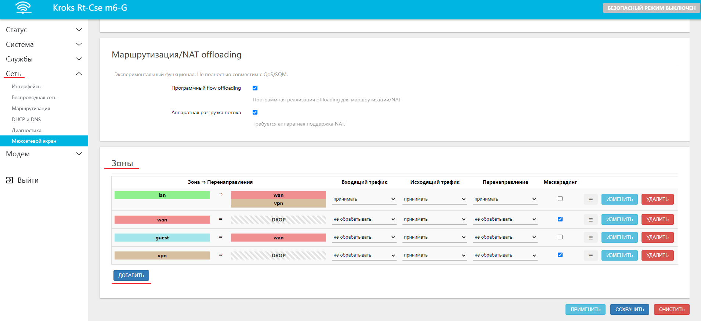

Теперь необходимо последовательно создать 4 зоны: cначала wan1 и wan2, потом lan1 и lan2  (Названия из примера, вы можете выбрать любые).

:::info
Обратите внимание, для зон **wan1** и **wan2** необходимо включить опцию **Маскарадинг**. Другие настройки рекомендуется оставить по умолчанию. После чего нажать кнопку "СОХРАНИТЬ".  
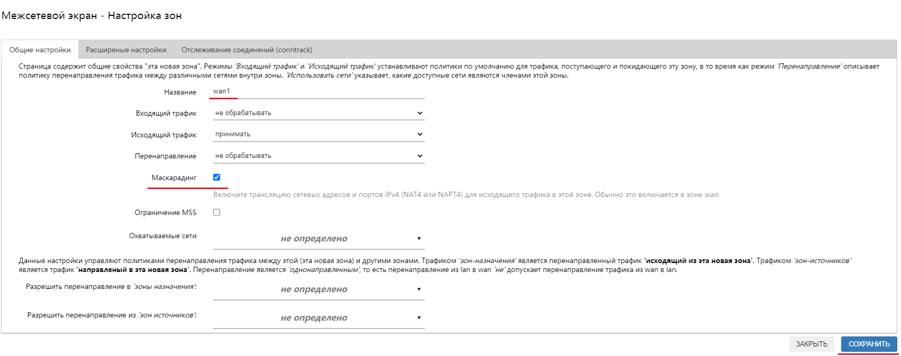

:::

:::info
Для зон **lan1** и **lan2** необходимо выставить значение **Принимать** в селекторах для пунктов **Входящий трафик** и **Перенаправление**, а так же в список **Разрешить перенаправление в *'зоны назначения'*** добавляем **wan1** и **wan2** (если это **lan1**) и только **wan1** (если это **lan2**).  
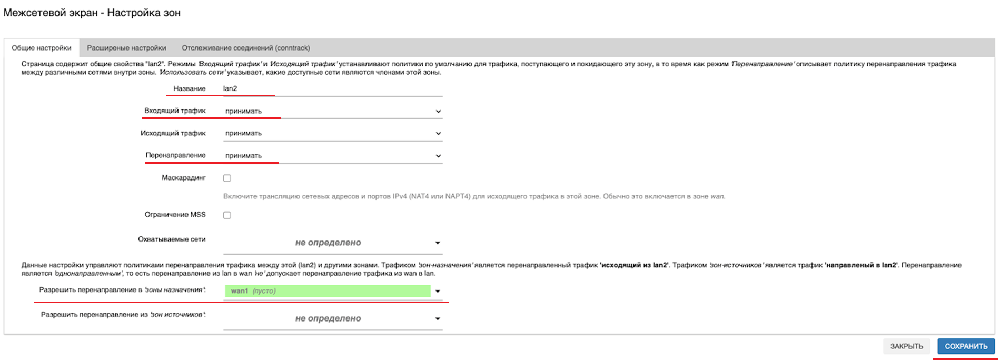  
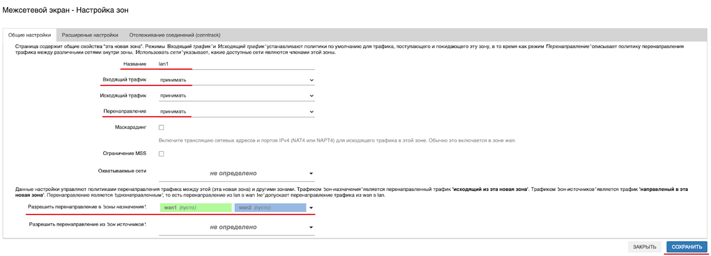

:::

После чего остаётся только нажать кнопку "ПРИМЕНИТЬ" внизу страницы.

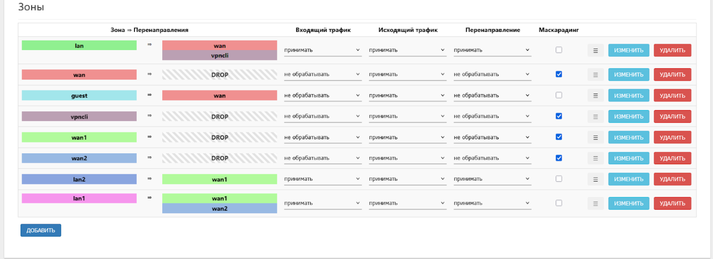

## ***НАСТРОЙКА ИНТЕРФЕЙСОВ***

Следующим шагом будет создание интерфейсов будущих сетей. Для этого необходимо перейти на вкладку "Сеть" → "Интерфейсы". Здесь нужно создать новый интерфейс, для этого нажмите кнопку "ДОБАВИТЬ НОВЫЙ ИНТЕРФЕЙС…".  
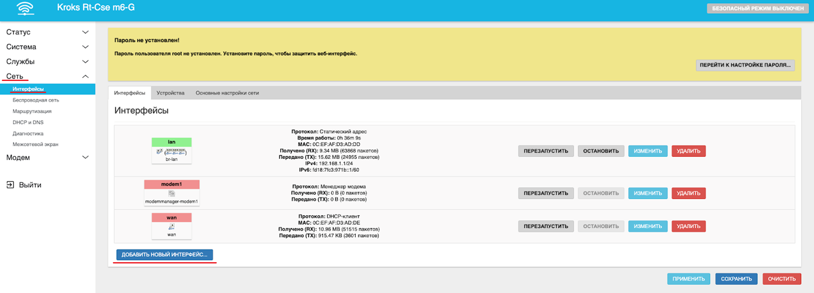

Появившееся окно заполняем следующим образом:

**Имя** - **lan1**;

**Протокол** - **Статический адрес**;

Поле **Устройство** оставьте пустым;

Нажмите кнопку "СОЗДАТЬ ИНТЕРФЕЙС".  
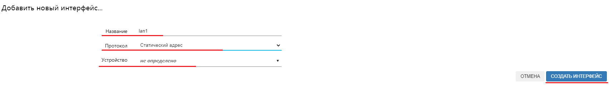

Далее указываем для нового интерфейса такие настройки.

В разделе **Общие настройки**:

**IP-адрес** в примере возьмём - **192.168.10.1** (это и будет адресом первой частной сети);

**Маска IPv4** - **255.255.255.0.**

Другие настройки рекомендуется оставить без изменений.  
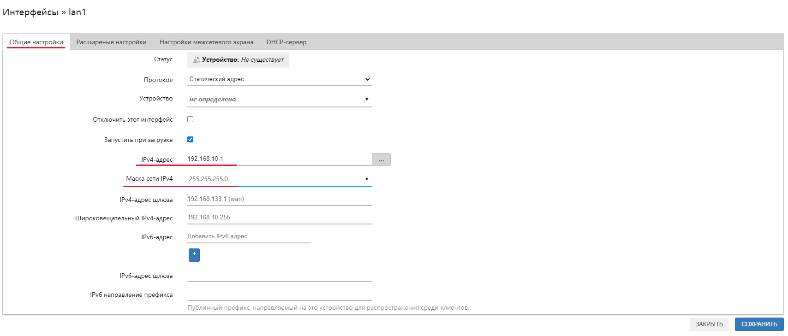

В разделе **Настройки межсетевого экрана** выберите **lan1**.  
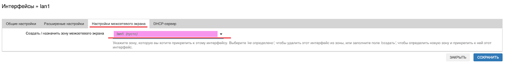

В разделе **DHCP-сервер** нажмите кнопку "НАСТРОИТЬ DHCP-СЕРВЕР" после чего нажмите кнопку "СОХРАНИТЬ".  
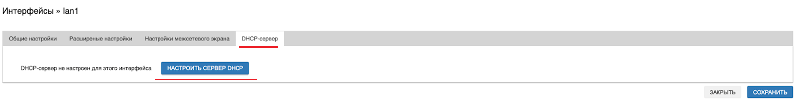  
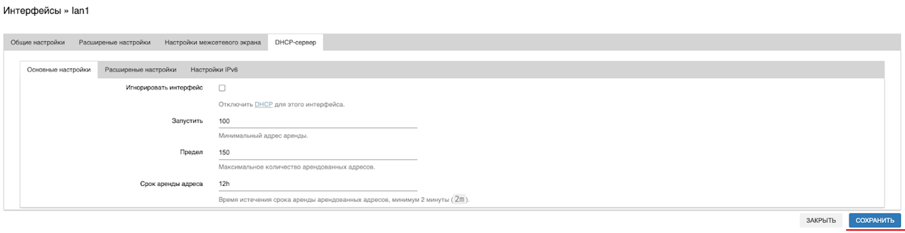

Аналогично создайте общую сеть - **lan2**, настроив её следующим образом:

**IP-адрес** - **192.168.20.1**;

**Зона межсетевого экрана** - **lan2**;

Остальные настройки оставьте теми же, что и при настройке **lan1**;

Нажмите "ПРИМЕНИТЬ" для сохранения изменений.

Теперь остаётся только настроить сети **modem** и **wan** в соответствующие зоны **wan1** и **wan2**.

Для этого во вкладке "Сеть" → "Интерфейсы" нажмите кнопку "Изменить" напротив интерфейса **modem1**.  
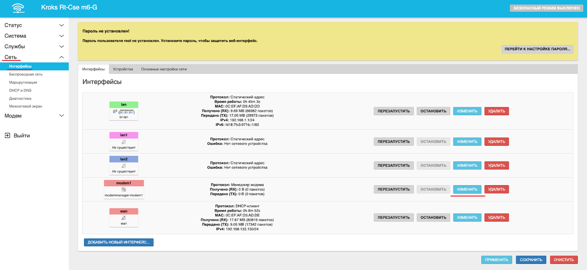

В открывшемся окне перейдите на вкладку **Расширенные настройки** убедитесь, что галочка **Использовать netcheck** выключена, а поле **Использовать метрику шлюза** - пусто (0).  
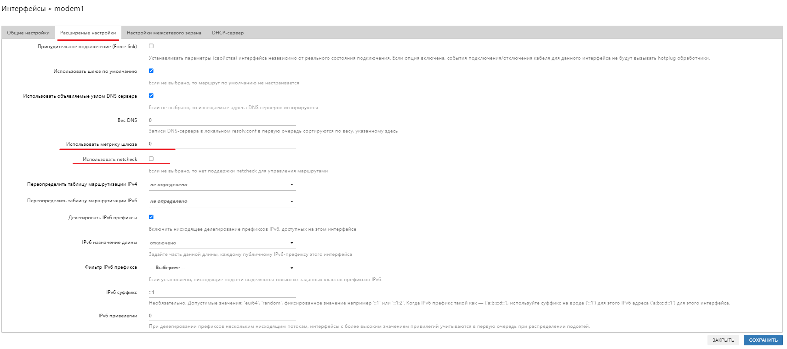

На вкладке **Настройки межсетевого экрана** выберите зону **wan1** и нажмите кнопку "СОХРАНИТЬ".  
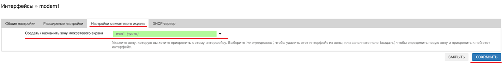

На этом настройка интерфейса модема закончена. Повторите те же шаги для интерфейса **wan** (wan6, если он есть в системе тоже необходимо настроить), за тем исключением, что на вкладке **Настройки межсетевого экрана** необходимо выбрать **wan2**.

После чего нажмите кнопку "ПРИМЕНИТЬ" внизу экрана.

:::warning
Обратите внимание, после этого шага интернет перестанет работать на всех устройствах, подключенных к Wi-Fi сети или проводным соединением с роутером.

:::

:::tip
Если необходимо, чтобы по проводу тоже выходила Общая и Частная сеть, то перенесите интерфейс **lan** в нужную зону межсетевого экрана (**lan1** или **lan2**).

:::

## ***НАСТРОЙКА БЕСПРОВОДНОЙ СЕТИ***

Переходим на вкладку "Сеть" → "Беспроводная сеть". Удаляем оттуда все беспроводные сети. После чего добавляем "Частную" сеть. Для этого нажимаем "Добавить" напротив **radio0**.  
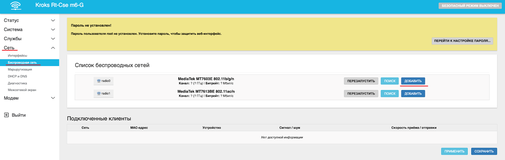

В открывшемся окне вводим **ESSID** (имя Wi-Fi сети) - **lan1** (название может быть любым).  
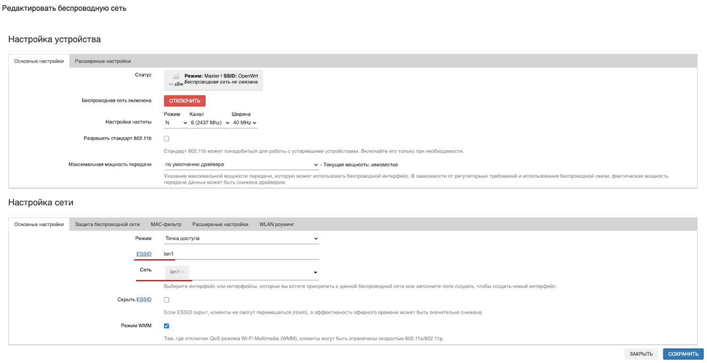

Далее переходим во вкладку "Защиту беспроводной сети" и выбираем нужное шифрование (рекомендуется **WPA2-PSK**). В поле **Ключ** вводим сложный пароль длинной не менее 8 знаков (не допускается использование кириллицы).

После чего нажимаем кнопку "Сохранить".  
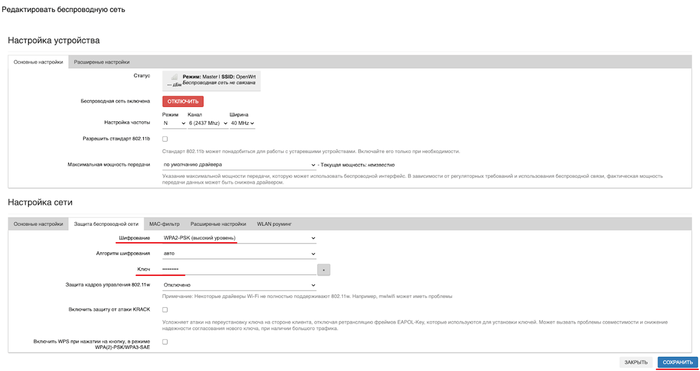

Аналогичным образом создайте вторую "Общую" сеть. Но на этот раз в пункте **Сеть** выбираем **lan2**. После чего не забудьте нажать кнопку "Применить" внизу страницы.

:::tip
Частная сеть будет брать интернет из любого из источников (рекомендуется отключать "лимитированную" сеть при отсутствии необходимости в ней). Вторая сеть берёт интернет исключительно из интерфейса **modem**. Как только **modem** перестанет работать, можно активировать сеть **wan** и пользоваться интернетом внутри "Частной" сети. Когда подключение восстановится, можно вновь отключить интерфейс **wan**.

:::
