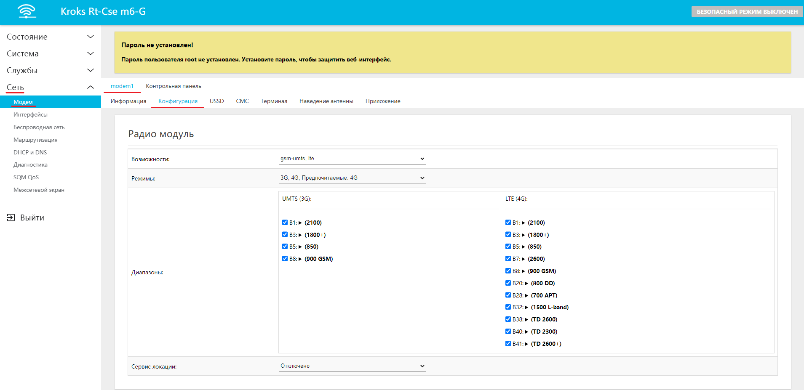
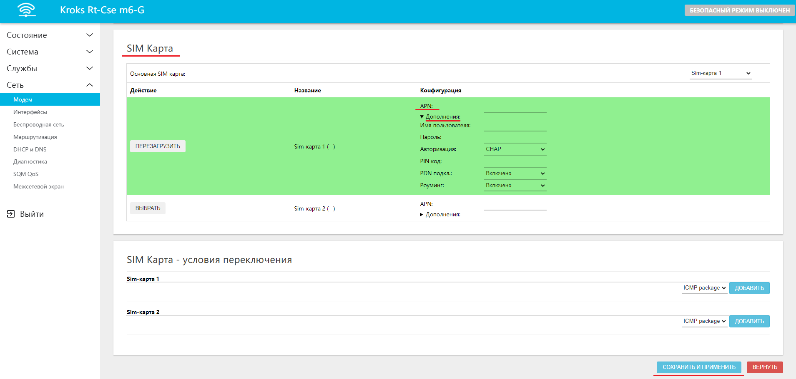

# Настройка подключения через модем

Подключение с использованием встроенного в роутер модема работает при настройках по умолчанию. В данном случае от вас не требуется ничего, только установить SIM-карту с оплаченным пакетом услуг, **включающим в себя доступ к сети Интернет для роутеров**.

:::info
Но в случае если ваш оператор указал дополнительные данные для подключения, такие как **APN** сервер, **Имя пользователя**/**пароль** и т. д. То необходимо добавить эти настройки в систему.
:::

Для указания дополнительных настроек переходим во вкладку "Сеть" → "Модем". Здесь необходимо выбрать нужный модем, если в вашем устройстве их несколько, и перейти в раздел "Конфигурация".  

Далее мы пролистываем страницу до блока **SIM Карта**. Здесь вы можете выбрать используемую SIM-карту и указать для неё дополнительные настройки, после чего останется только нажать на кнопку "СОХРАНИТЬ И ПРИМЕНИТЬ".  

