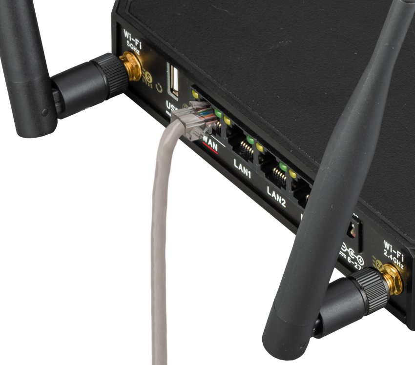
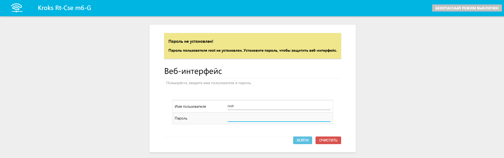
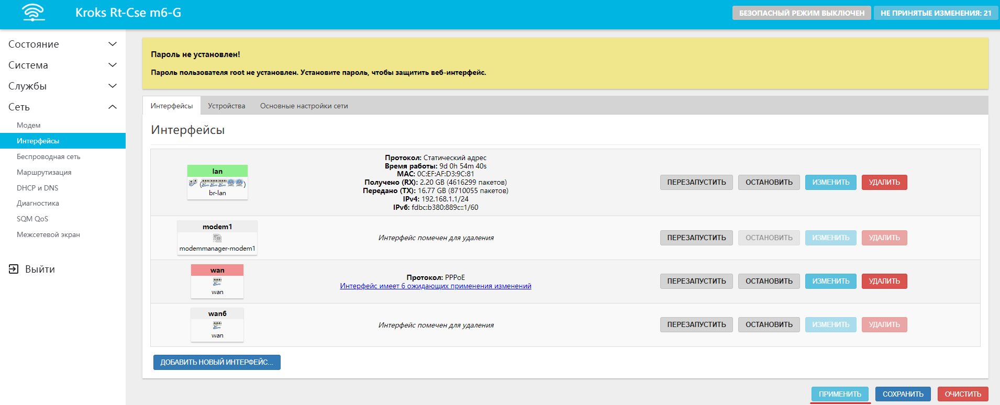

# Настройка проводного подключения

Первым шагом необходимо вставить кабель, установленный провайдером, в разъём **WAN** вашего роутера и убедиться в надежности крепления.  

Далее нам необходимо подключиться к роутеру, вы можете установить соединение через порты **LAN** роутера и своего ПК (ноутбука) с помощью патч-корда, или просто подключившись к созданной роутером Wi-Fi сети.

Теперь мы можем попасть в веб-интерфейс роутера. Для этого необходимо ввести в адресной строке браузера IP адрес вашего роутера, по умолчанию это **192.168.1.1**.  

Введите **Имя пользователя** и **пароль**, после чего нажмите кнопку "ВОЙТИ" (по умолчанию **Имя пользователя** - **root**, пароля нет).  

В боковом меню выберите вкладку "Сеть" → "Интерфейсы".

Удалите все интерфейсы, помеченные красным, с помощью кнопки "УДАЛИТЬ".  

После удаления нажмите кнопку "ДОБАВИТЬ НОВЫЙ ИНТЕРФЕЙС".

В появившемся окне введите следующие настройки:

* **Название** - **wan**. Это имя которым будет отображаться созданный интерфейс, оно может быть любым, но обычно используется wan;
* **Протокол** - выберите протокол, указанный в вашем договоре об оказании услуг (L2TP/PPTP/PPPOE);
* **Устройство** - выберите **WAN**.

Нажмите кнопку "СОЗДАТЬ ИНТЕРФЕЙС".

:::tip
Обратите внимание, если у вас в договоре указан протокол **L2TP**, тогда настройте этот интерфейс как **DHCP-клиент** и в поле **Устройство** выберите **wan**. После добавьте ещё один новый интерфейс, где в качестве протокола выберите уже **L2TP**.

:::

В следующем окне введите данные из договора об оказании услуг, они могут отличаться в зависимости от выбранного протокола подключения к сети Интернет.

Далее выберите в этом окне вкладку **Настройки межсетевого экрана** и выберите зону **wan**, после чего нажмите кнопку "СОХРАНИТЬ".  

Нажмите кнопку "ПРИМЕНИТЬ" во вкладке интерфейсов.  

Готово, вы настроили проводное подключение к провайдеру интернета.
