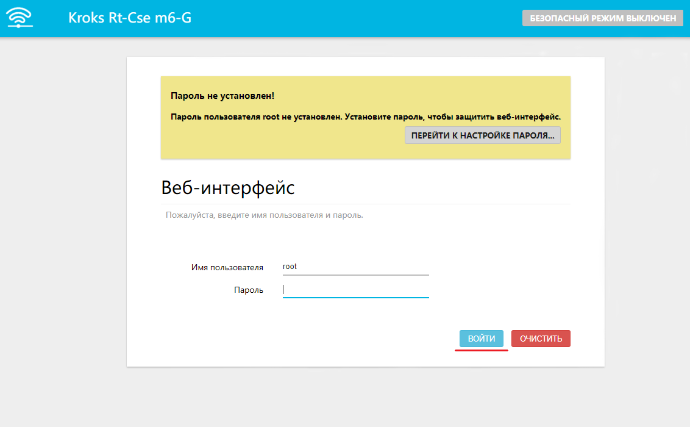
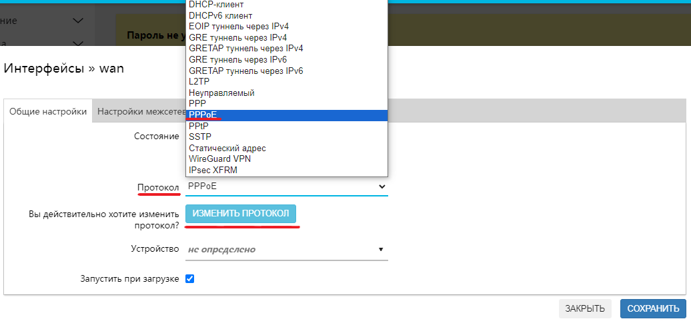
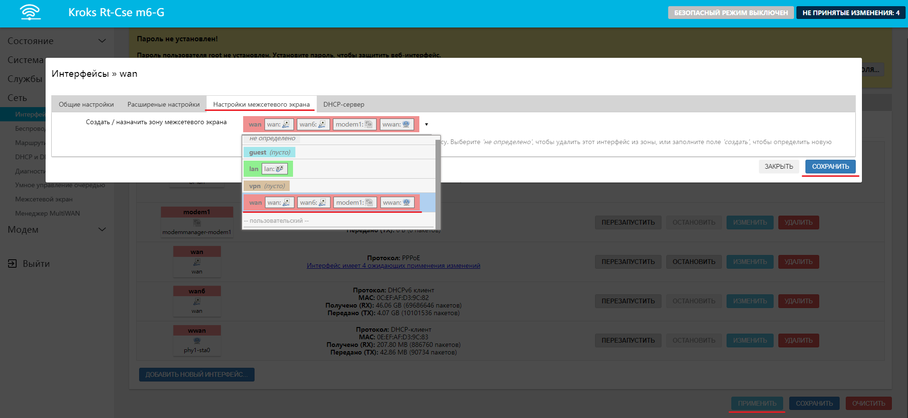

# Настройка роутера для подключения по протоколу PPPoE

:::tip
При заключении договора с Интернет-провайдером на оказание услуг доступа в сеть Интернет провайдер передаёт пользователю информацию необходимую для подключения к сети. Поэтому для подключения через протокол **PPPoE**  необходимо чтобы у вас был под рукой договор с Интернет-провайдером. Если он у вас уже есть, то можно преступить к настройке.

:::

Для начала нам необходимо войти в web-интерфейс вашего роутера. Это делается путём ввода в адресную строку браузера **ip-адрес** вашего устройства (по умолчанию он будет **192.168.1.1**).

После чего перед вами откроется окно входа в web-интерфейс. Данные для входа по умолчанию:

* **Имя пользователя** - **root**;
* **Пароль** не установлен;

Вам нужно только нажать кнопку "Войти".  

Далее перейдите на вкладку "Сеть" → "Интерфейсы". Найдите интерфейс **wan** и нажмите кнопку "ИЗМЕНИТЬ".  
.png " =1902x880")

В открывшемся окне вам необходимо в первую очередь выбрать протокол **PPPoE** и нажать кнопку "ИЗМЕНИТЬ ПРОТОКОЛ".  

После чего в обновившемся окне нужно будет ввести **Имя пользователя** и **Пароль** из договора на оказание услуг Интернет-провайдером и нажать кнопку "СОХРАНИТЬ".  
.png " =1909x885")

Теперь вам нужно переключиться на вкладку "Настройки межсетевого экрана" и выбрать в селекторе **wan**, затем поочередно нажать кнопку "СОХРАНИТЬ" и кнопку "ПРИМЕНИТЬ" в окне с интерфейсами.  

Готово, ваш роутер подключен к провайдеру по протоколу **PPPoE**.
