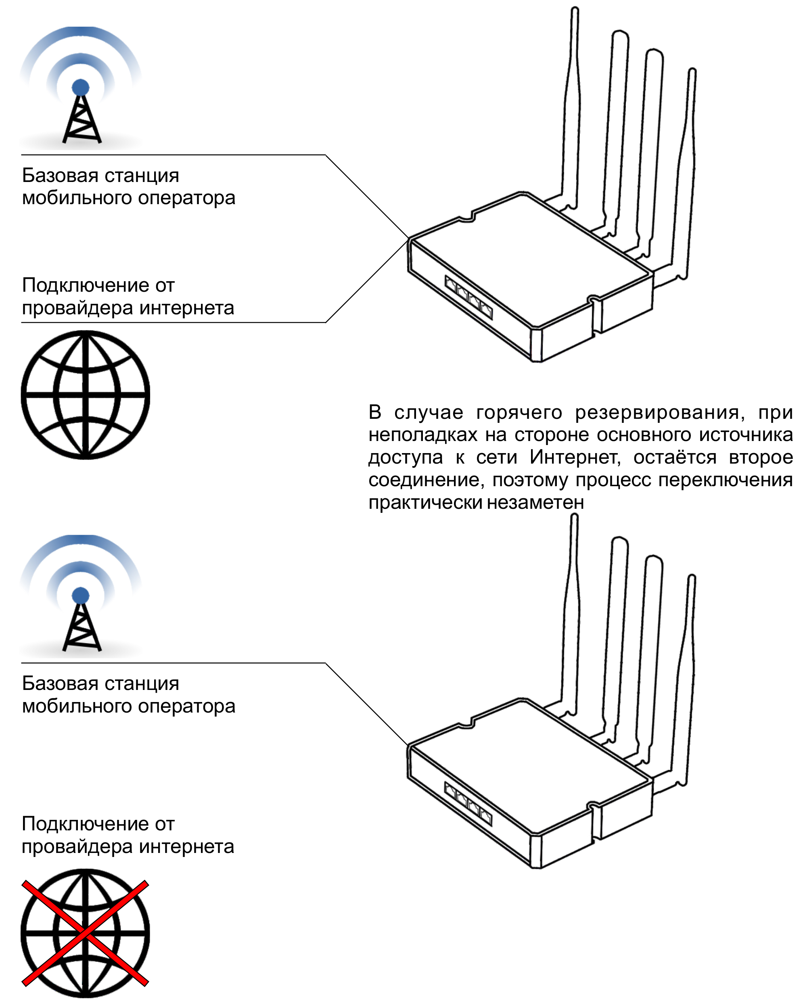
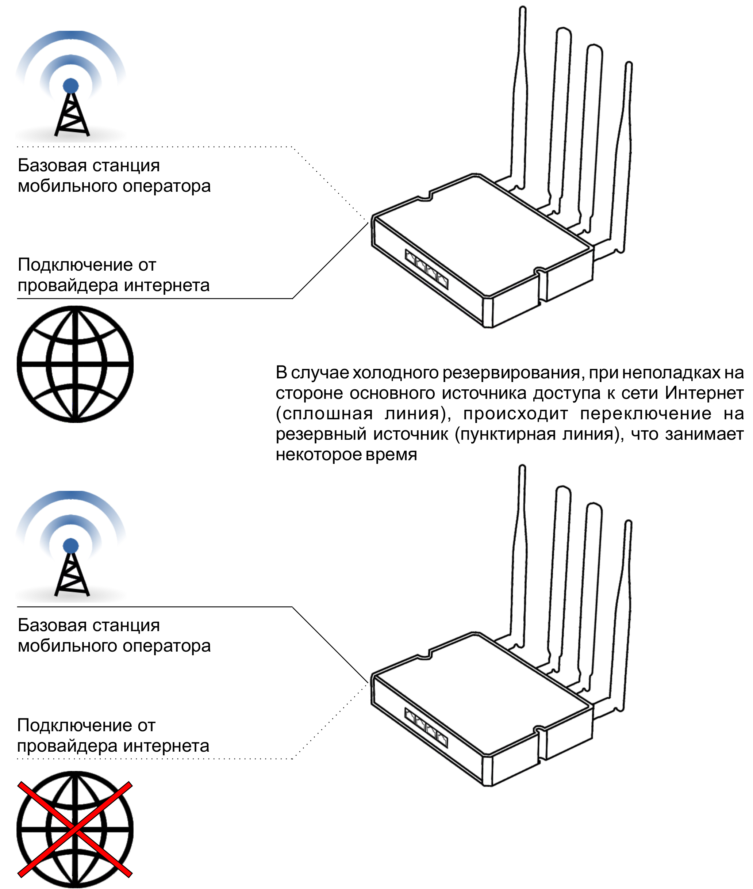

# О резервировании подключения

Роутеры ***KROKS*** поддерживают одновременную работу с несколькими интернет подключениями, следствием чего является наличие такой функции, как **резервирование канала**.

Оно позволяет вам создать условия, при которых один канал является приоритетным, а второй находится в резерве, и в случае проблем с основным каналом быстро переключается.

Поддерживается как **холодное**, так и **горячее** резервирование.

При использовании **горячего** резервирования оба источника доступа к сети Интернет **одновременно активны** и делят нагрузку между собой. В этом случае переключение занимает всего 1-2 секунды, и вы скорее всего даже не заметите что у вас исчезало интернет соединение.

При использовании **холодного резервирования** активным является только одно из двух подключений, соответственно переключение между ними занимает больше времени.

Примеры настройки резервирования вы можете наблюдать в соответствующей [статье](/docs/routery/prodvinutaya-nastroyka/primery-rezervirovaniya-podklyucheniya.md).
