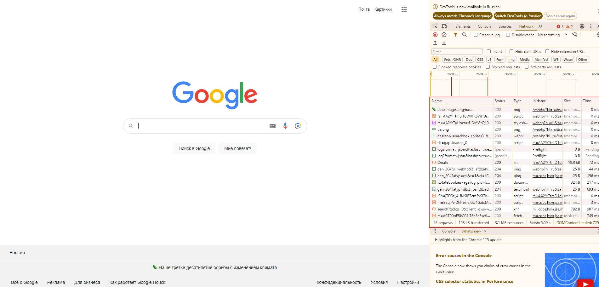
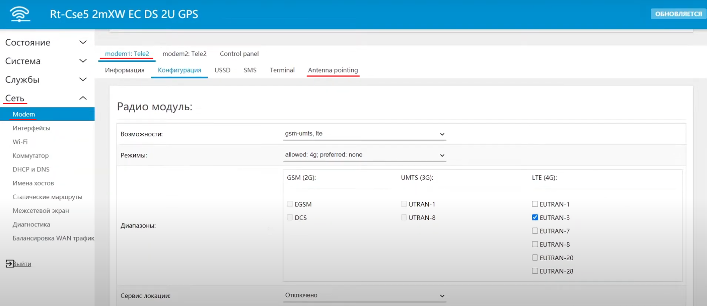
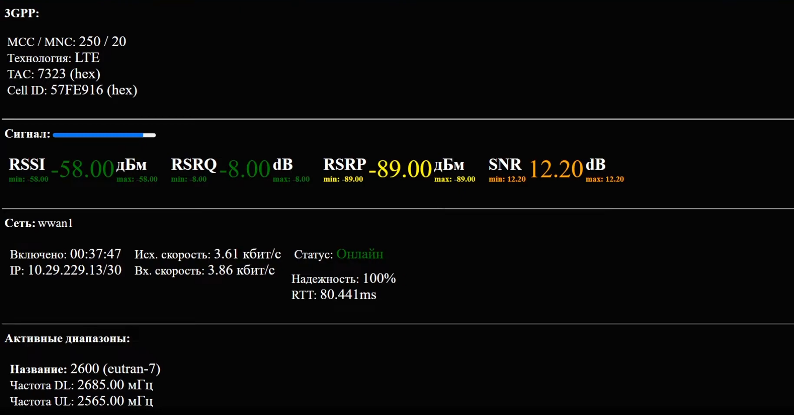
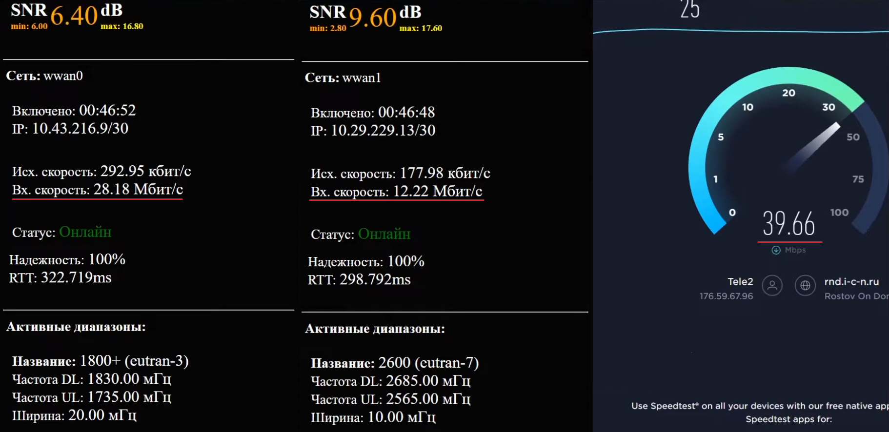
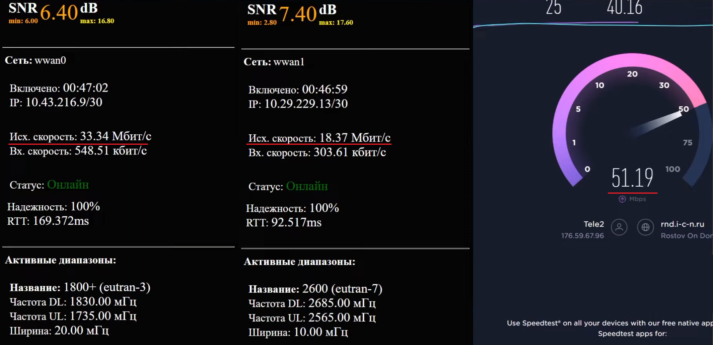

# О суммировании в роутерах с несколькими встроенными модемами

В этой статье мы расскажем, как работает агрегация на роутерах ***KROKS*** с несколькими интегрированными модемами. В чем ее плюсы, какие есть недостатки и какие есть особенности по сравнению с другой системой, когда используется не **один роутер с несколькими модемами**, а **несколько роутеров с одним модемом** в каждом.

## ***Что такое суммирование***

Начнём с того почему вообще роутер суммирует каналы.

Суммирование происходит благодаря тому, что некоторые ресурсы и некоторые протоколы позволяют вести передачу данных **несколькими параллельными сессиями**.

Это не касается тех протоколов и тех ресурсов, которые проверяют IP-адрес и не разрешают подключение в несколько сессий.

Как можно посмотреть что такое многосессионность? Разберем на примере сайта **[Google](https://www.google.com/)**.

После того как мы откроем сайт нужно вызвать **Firebag** меню, делается это путём нажатия клавиши **F12**. После чего в открывшемся окне необходимо перейти на вкладку "Netwok". Далее нужно обновить страницу и мы сможем увидеть несколько строк разных запросов. Это отображает закачку в параллельной сессии.

Именно в таких режимах наш роутер и будет суммировать каналы, но стоит заметить, что это будет работать не во всех случаях. В качестве примера можно взять стриминг видео, так как здесь идёт проверка на нескольких уровнях (проверка аккаунта, проверка по ключу и так далее). Поэтому, обратите внимание, что данная функция в некоторых случаях может не оказать должной эффективности.

В первую очередь роутер с несколькими встроенными модемами это решение для [резервирования](/docs/routery/prodvinutaya-nastroyka/primery-rezervirovaniya-podklyucheniya.md).

:::info
Особенность конструктива устройства, в виде расположения нескольких модемов на одной плате, обладает как своими преимуществами, так и недостатками. Например одной из проблем могут оказаться — **взаимные помехи**, возникающие при работе модемов. Способ борьбы с этим мы разберём [отдельно](/docs/routery/prodvinutaya-nastroyka/raznesenie-modemov-po-chastotam-v-routerah-s-neskolkimi-vstroennymi-modemami.md).

:::

## ***Тест суммирования***

Для начала мы разберемся как проверить что суммирование каналов работает. Это можно сделать, например, открыв вкладку "Сеть" → "Modem" → "Antenna pointing".

:::tip
Обратите внимание, последующие далее скриншоты могут в незначительной степени отличаться расположением вкладок или раскладкой языка от вашего веб-интерфейса. Это может произойти из-за разных версий прошивки роутера, но критически ни на что не повлияет.

:::

После нажатия на вкладку "Antenna pointing" перед вами откроется окно с информацией о подключении выбранного модема.

Теперь мы откроем вкладку "Antenna pointing" для обоих используемых модемов и любой сайт позволяющий измерить скорость вашего соединения, например, [SpeedTest](https://www.speedtest.net/).

Далее нам необходимо запустить тест скорости интернет соединения и одновременно проверить этот же параметр во вкладках "Antenna pointing".

  

После замеров мы видим что и входящая и исходящая скорости суммируются с обоих модемов.

Входящая скорость: **28,18** + **12,22** на модемах, отображается в тесте как **39,66**.

Исходящая скорость: **33,34** + **18,37** на модемах, отображается в тесте как **51,19**.

Из чего мы можем сделать вывод, что функция суммирования работает.

Более подробно примеры суммированя трафика описаны в соответствующей [статье](/docs/routery/prodvinutaya-nastroyka/primery-summirovaniya-trafika.md)