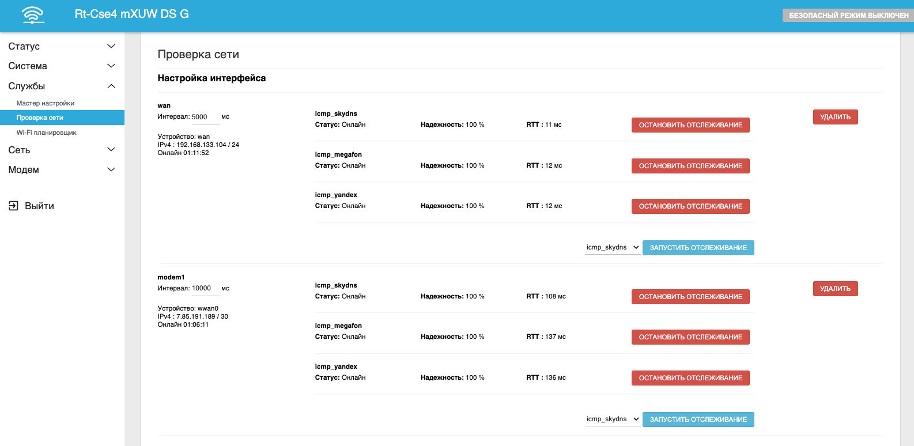
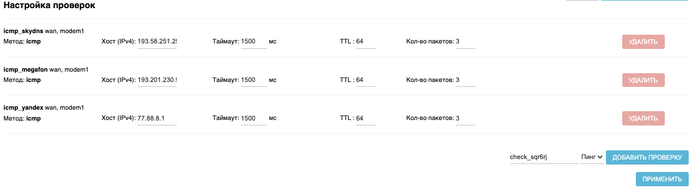
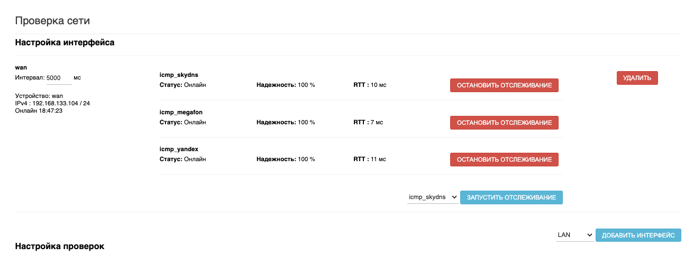
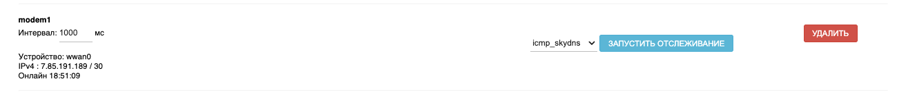
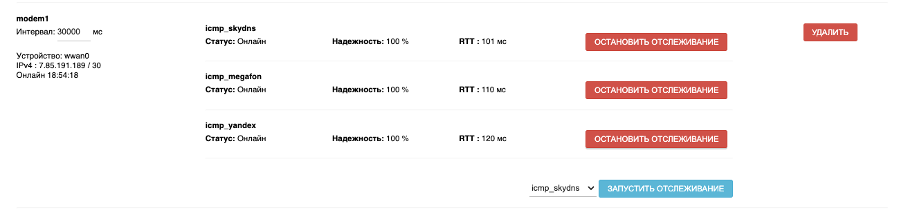
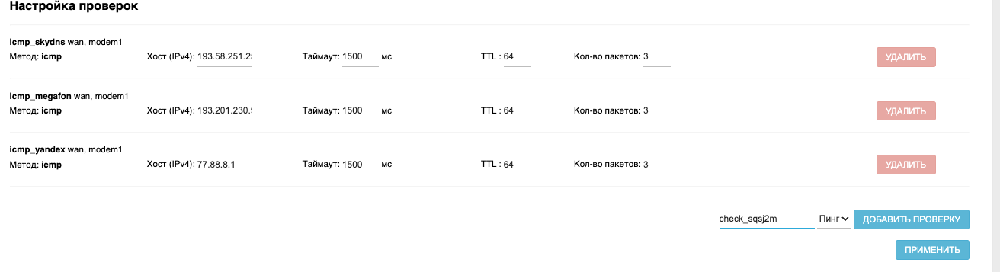
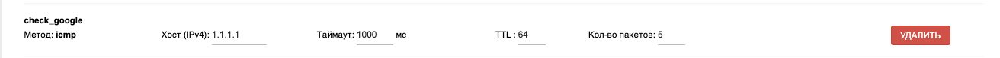
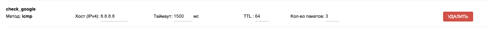

# Проверка сети

В роутерах Крокс существует механизм отслеживания работы подключения к сети интернет и автоматической перезагрузки интерфейса в случае его неработоспособности. Для настройки проверки сети используется интерфейс, расположенный  на вкладке "Сервис" -> "Проверка сети".

## ***Обзор интерфейса***

В пункте Настройка инетрфейса перечислены интерфейсы для которых в данный момент работает проверка сети. В примере это wan и modem1. У каждого интерфейса есть несколько полей его характеризующих:

* Интервал - периодичность проверки сети в миллисекундах. В каждой секунде 1000 миллисекунд
* Устройство - физическое устройство через которое идёт подключение
* IPv4/IPv6 - IP-адрес интерфейса во внешней сети
* Онлайн - время прошедшее после запуска инетрфейса

Справа можно увидеть список узлов. Именно к ним сервис проверки сети делает обращения раз в Интервал проверки. Если узел остаётся доступным - в строке Статус пишется Онлайн. Если же по каким-то причинам не удаётся соединиться с узлом - статус меняется на Офлайн.

Под надёжностью подразумевается стабильность возможности соединения к узлу. Например, если из 10 попыток подключиться успешными являются 9 - то надёжность будет 90%.

Последний показатель - RTT - Время за котрое происходит подключение к узлу. Если точнее - считается время отправки одного пакета данных к удалённому узлу, время обработки этого пакета и подготовка ответа и передача ответа от узла к роутеру. Считается в миллисекундах.

В самом низу можно добавить новый интерфейс для отслеживания. Список доступных для проврок интерфейсов находится в выпаджающем списке.

Ниже расположена настройка проверок, гдже можно отредактировать предустановленные проверки или добавить новые.

## ***Добавление нового интерфейса***

В правом нижнем углу находится выпадающий список интерфейсов. Выберем MODEM1 и нажмём Добавить интерфейс.

Установим интервал в 30 секунд - 30000 миллисекунд. Далее добавим все доступные проверки. Для этого выберем каждую проверку в выпадающем списке справа и нажмём кнопку Запустить отслеживание.

::: info
Обратите внимание - если у вас корпоративная сеть без выхода в сеть интернет, вам необходимо создать собственную проверку с IP-адресом, находящимся внутри вашей корпоративной сети и добавить только её. Можно создать несколько проверок.
:::

## ***Добавление собственных проверок***

Для создания собственной проверки вам необходимо ввести имя новой проверки в поле внизу справа и нажать кнопку Добавить проверку. Мы введём check_google так как будем опрашивать dns-сервер Google. Вы же можете назвать нужную проверку как угодно.

Далее нам необходимо настроить проверку.

* Хост - вводим IP-адрес интересующего нас узла сети интернет. В нашем случае это 8.8.8.8 - dns-сервер Google
* Таймаут - вводим время ожидания ответа от узла в миллисекундах. В нашем случае 1500 миллисекунд
* TTL - это максимальное количество преходов по маршруту от нашего роутера до конечного узла. Оставим по умолчанию 64
* Количество пакетов - количество попыток отправить запрос к узлу. Поставим 3

В итоге получаем проверку, готовую к использованию в интерфейсах. Нужно лишь нажать кнопку Применить.

## ***Выключение интерфейсов и проверок***

Для отключения отслеживания интерфкйса в сервисе проверки сети необходимо лишь нажать кнопку Удалить в правой части поля интерфейса и кнопку Применить внизу страницы.

Для того чтобы удалить проверку необходимо, чтобы она не участвовала ни в одном интерфейсе. Если это правило соблюдено - кнопка Удалить напротив проверки станет активной. Останется лишь нажать её и Подтвердить для удаления. Откоючить проверку от интерфейса можнно кнопкой ОСтановить отслеживание напротив проверки в интерфейсе.
