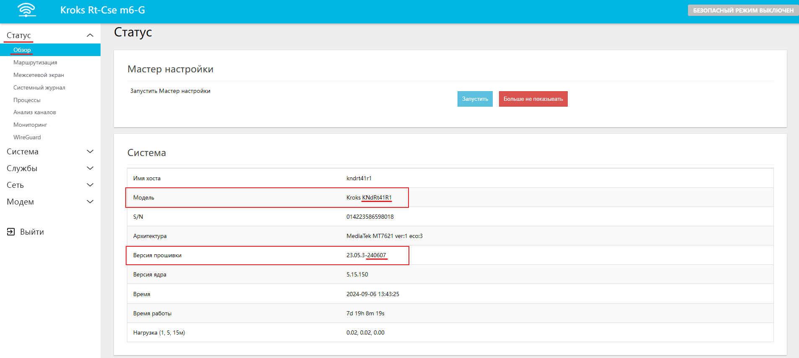
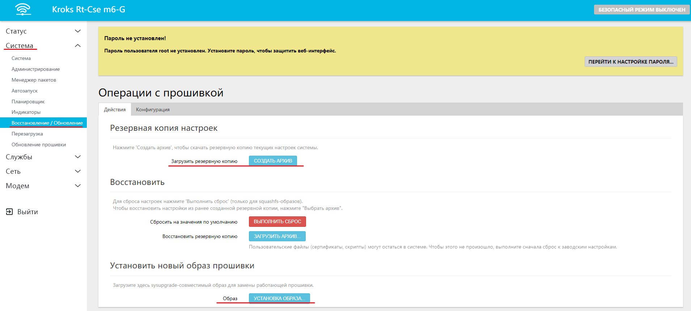

# Обновление прошивки файлом с сайта

В этой статье мы рассмотрим один из вариантов, как обновить прошивку роутера KROKS.

:::info
Прошивка – это микропрограмма, которая находится в энергонезависимой памяти устройства и представляет собой операционную систему, состоящую из различных программ. Процесс обновления микропрограммы называется перепрошивкой.
:::

Далее мы разберем способ прошивки с помощью файла с сайта, поэтому перед тем, как начать процесс обновления роутера, необходимо обратить внимание на несколько важных моментов.

* Версия прошивки вашего роутера должна отличаться от последней актуальной версии, размещенной на сайте [Kroks Downloads](https://download.kroks.ru/routers/firmware/release/). Если роутер работает нестабильно, а версия его прошивки не отличается от актуальной версии на сайте, напишите письмо с описанием проблем на [help@kroks.ru](mailto:help@kroks.ru).

:::info
Версия прошивки указана в формате даты: «год-месяц-число».
:::

* Необходимо знать точный заводской индекс модели вашего роутера, чтобы выбрать правильную прошивку.
* Роутер должен быть соединен сетевым кабелем (патч-кордом RJ45-RJ45) с вашим компьютером или ноутбуком.

## ***Определение версии прошивки и заводского индекса роутера***

Авторизуйтесь в веб-интерфейсе вашего роутера. Выбрав в меню веб-интерфейса раздел «Статус», войдите во вкладку «Обзор».

Версия прошивки вашего роутера и заводской индекс модели роутера приведены в таблице Система. Запишите или запомните версию прошивки и заводской индекс модели вашего роутера. В нашем примере версия прошивки - **240607**, а заводской индекс модели роутера - **KNdRt41R1** (Если версия прошивки в системной таблице отсутствует, вероятно, что на вашем устройстве установлена очень старая версия прошивки).

:::tip
Обратите внимание, что заводской индекс модели очень часто идентичен имени хоста. Если в системной таблице отсутствует информация с индексом модели, попробуйте поискать новую прошивку по имени хоста.
:::

:::info
Роутеры выпущенные до начала 2019 года, не отображают в системной таблице заводского индекса модели. В этом случае заводской индекс модели можно выяснить, написав письмо на [helpk@kroks.ru](mailto:help@kroks.ru) К письму необходимо приложить скриншот системной таблицы (как на рисунке 1) и несколько фотографий вашего роутера. Вместо скриншота, можно скопировать таблицу в текстовый редактор.
:::

## ***Обновление роутера***

Авторизуйтесь в веб-интерфейсе вашего роутера и, откройте в меню веб-интерфейса вкладку "Система" → "Восстановление / Обновление".

:::tip
Всегда создавайте резервную копию настроек и установок роутера перед обновлением системы.
:::

Резервная копия создаётся на той же вкладке "Восстановление / Обновление". Для этого нужно нажать кнопку "СОЗДАТЬ АРХИВ" в разделе **Резервная копия настроек.**

Нажмите кнопку "УСТАНОВКА ОБРАЗА", после чего в открывшемся окне нажмите кнопку "ОБЗОР…" и дважды щелкните по скачанному файлу прошивки в директории, где он был сохранен. Затем нажмите кнопку "ЗАГРУЗИТЬ".

:::info
Внимание! После обновления и перезагрузки роутера, происходят процессы загрузки программного обеспечения и инициализации устройств и интерфейсов. Длительность данных процессов может достигать 5 минут. В течение этого времени выключать или перезагружать роутер категорически запрещается! Если ваш роутер оборудован индикатором Status, не перезагружайте роутер до тех пор, пока индикатор Status не перестанет мигать.
:::
