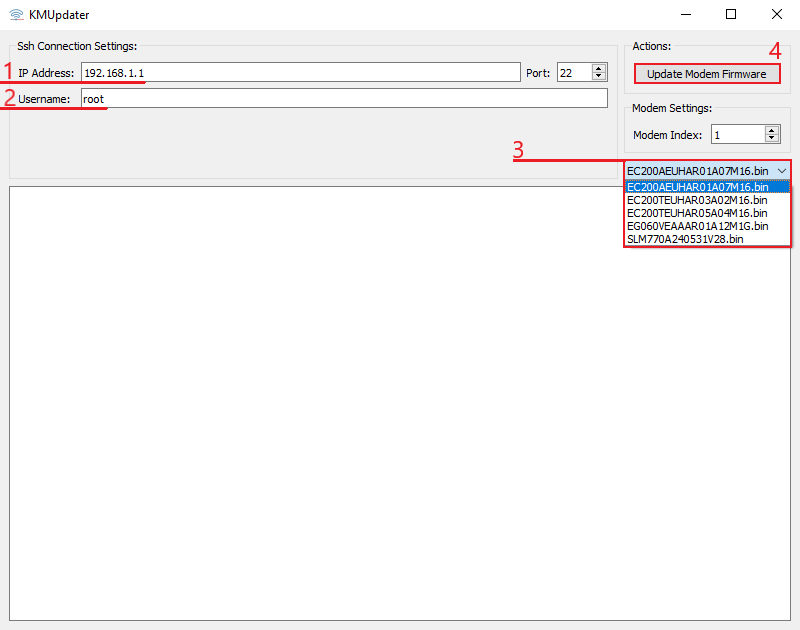

# Прошивка модема

С определённой периодичностью, для того чтобы улучшить работу прибора, исправить неполадки, добавить новые функции, улучшить безопасность или с какими либо иными целями, разработчик выпускает обновление прошивки для модемов.

Для упрощения процесса обновления мы предоставляем приложение, доступное по ссылке ниже.

:::tip
[Ссылка на программу KMUpdater](https://download.kroks.ru/routers/.tools/kmupdater_250604.7z)

:::

## ***Интерфейс программы***

1. **IP Address** - в эту строку необходимо ввести IP-адрес вашего устройства, по умолчанию он имеет значение **192.168.1.1**, проверить IP-адрес вашего устройства вы можете на этикетке в нижней части роутера.
2. **Username** - имя пользователя, по умолчанию **root**, проверить имя пользователя вы можете также на этикетке в нижней части роутера.
3. В этой вкладке вам необходимо выбрать модель вашего модема. Если модель вашего модема отсутствует в списке, значит актуальной прошивки для него нет в наличии.
   * В этом окне есть две версии модема **EC200T**. Если модель вашего модема ниже, чем **R03**, то вам следует выбрать прошивку EC200TEUHA**R03**A02M16, в ином случае вам необходима прошивка EC200TEUHA**R05**A04M16.

    :::warning
    Обратите внимание, обновить модем с версии **R03** до версии **R05** не представляется возможности в виду разной архитектуры.

    :::

:::warning
Внимательно проверяйте выбранную версию модема, если она отличается от установленного у вас, в таком случае обновление приведёт к поломке не подлежащей ремонту.

:::

После ввода необходимых данных нажмите кнопку **Update Modem Firmware** и дождитесь окончания процесса обновления.
