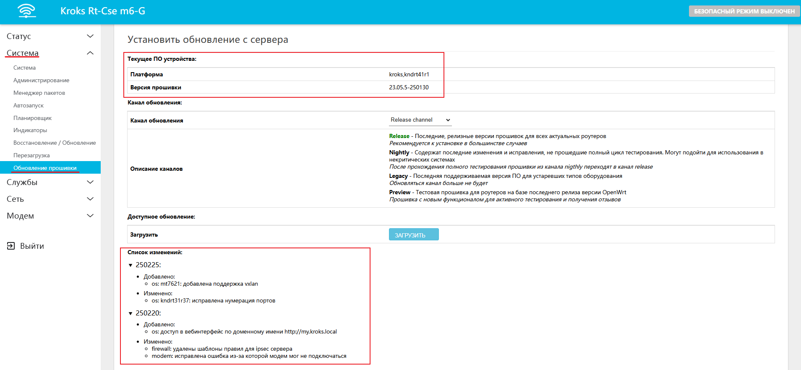
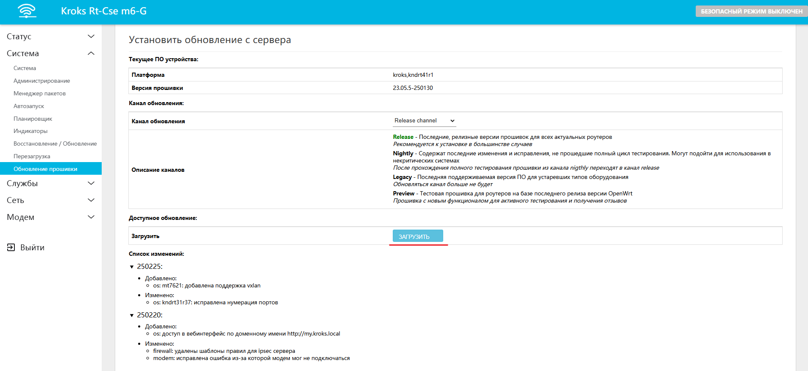
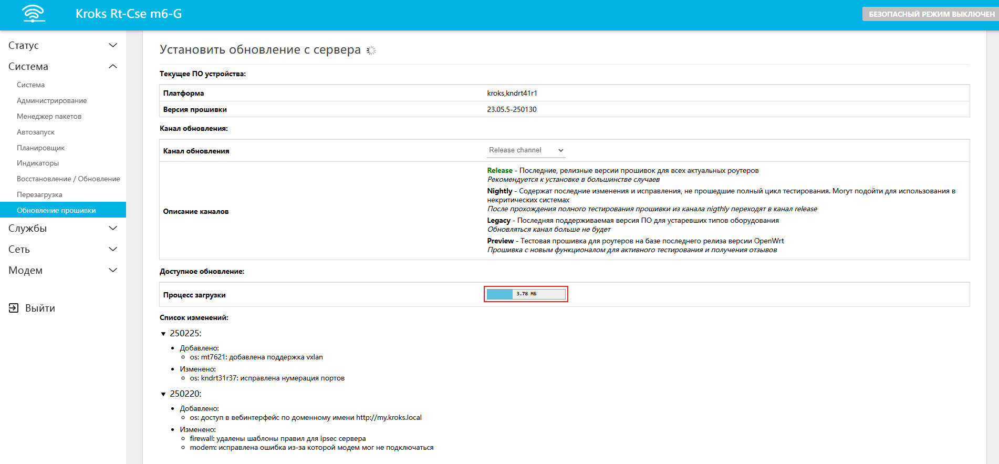
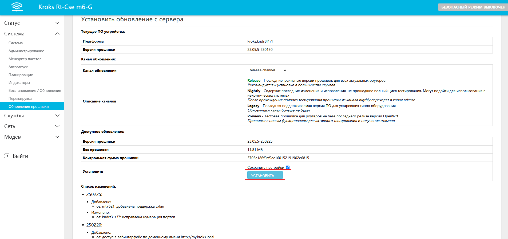
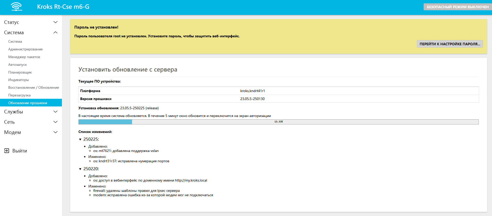

# Обновление прошивки встроенным апдейтером

В этой статье мы рассмотрим один из вариантов, как обновить прошивку роутера KROKS.

:::info
Прошивка – это микропрограмма, которая находится в энергонезависимой памяти устройства и представляет собой операционную систему, состоящую из различных программ. Процесс обновления микропрограммы называется перепрошивкой.
:::

Далее мы разберем способ прошивки роутера встроенным апдейтером.  
Этот способ проще чем [обновление с помощью файла прошивки](/docs/routery/obnovlenie-proshivki/obnovlenie-proshivki-failom-s-saita.md). От вас потребуется только открыть веб интерфейс роутера и перейти во вкладку "Система" -> "Обновление прошивки". Здесь вы обнаружите информацию о вашем устройстве, его платформу и версию установленного ПО. Кроме того в нижней части экрана вы можете увидеть список изменений в актуальной версии прошивки.

Также в этом окне вы можете выбрать в селекторе необходимый вам канал обновления (описание каждого находится под этим селектором, рекомендуется оставить канал **Release channel**.  
После того как вы определитесь с выбором канала нажмите кнопку "ЗАГРУЗИТЬ".

Перед вами появится небольшая шкала, визуализирующая процесс скачивания прошивки.

По окончанию загрузки обновления вам нужно будет нажать кнопку "УСТАНОВИТЬ".

:::info
Над кнопкой "УСТАНОВИТЬ" вы можете поставить галочку для сохранения имеющихся настроек роутера. **Обратите внимание - не рекомендуется это делать, в случае если вы не обновляли прошивку в течение 3-6 месяцев и дольше**.

:::

Теперь вам осталось только дождаться окончания процесса обновления, после чего роутер автоматически перезагрузится.

На этом обновление прошивки с помощью встроенного апдейтера завершено. 
