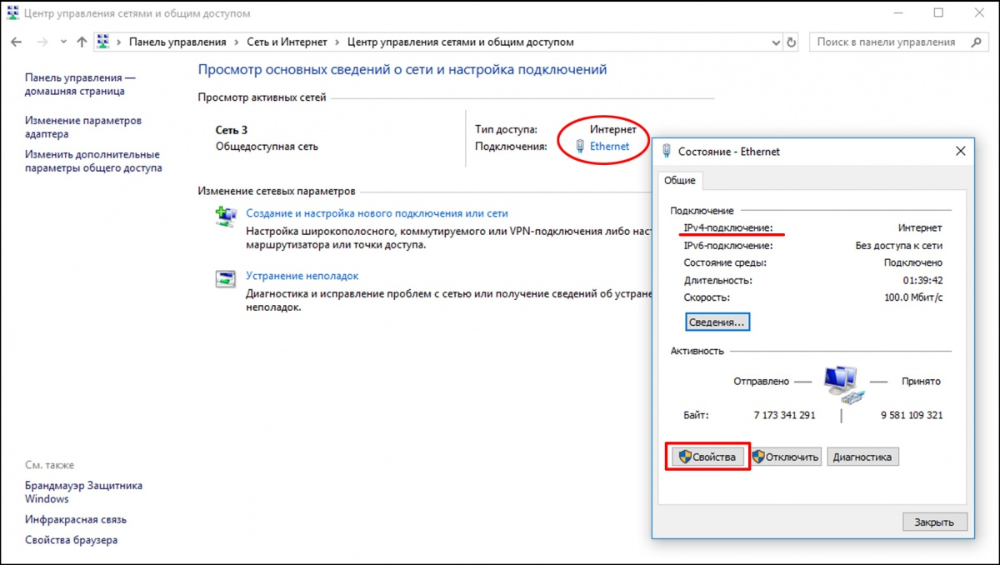
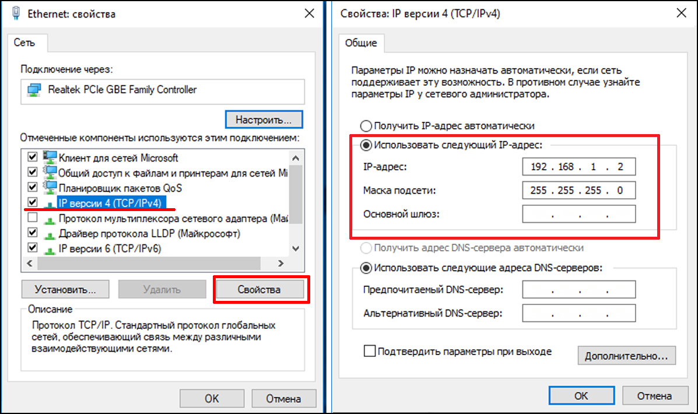
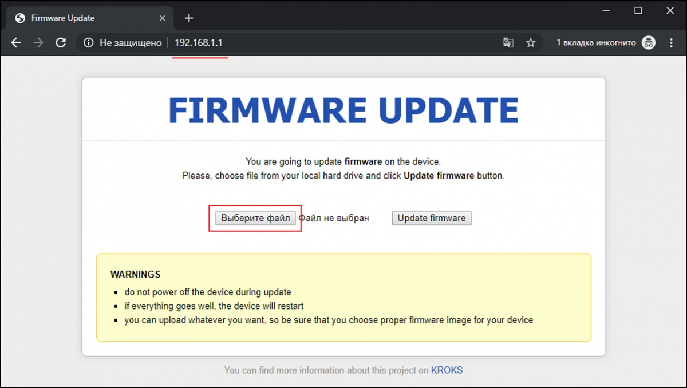
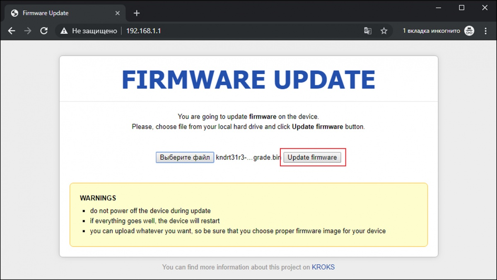

# Восстановление прошивки

Кратковременные перебои, скачки напряжения в электросети, ошибки пользователей и пр. могут вызвать при обновлении роутера сбой процессов загрузки и инициализации. Ошибка при обновлении прошивки приводит к несоответствию контрольной суммы. Прошивка роутера, попросту говоря, «слетает». Роутер перестает выполнять свои функции.

Подобная проблема может возникнуть и при попытке установить прошивку, не соответствующую модели роутера. Этому более подвержены более ранние модели устройств, не имеющие защиты от установки неправильной прошивки.

## ***Симптомы поврежденной («слетевшей») прошивки***

* роутер не может загрузиться в течение 5-10 минут (в зависимости от модели);
* индикаторы устройства мигают одновременно с определённой периодичностью;
* недоступен веб-интерфейс роутера. Невозможно войти в веб-интерфейс устройства набрав в адресной строке браузера его IP-адрес 192.168.1.1;
* роутер работает некорректно по причине несоответствия прошивки. В данном случае перепрошивка из веб-интерфейса становится недоступной.

## ***Восстановление***

Восстановление прошивки роутера производится в несколько этапов.

Определите заводской индекс вашего роутера и скачайте прошивку с официального сайта. Как это сделать, подробно изложено в статьях о [обновлении файлом прошивки](/docs/routery/obnovlenie-proshivki/obnovlenie-proshivki-failom-s-saita.md) и [обновлении через встроенный апдейтер](/docs/routery/obnovlenie-proshivki/obnovlenie-proshivki-vstroennim-apdeiterom.md).

**В случае, если вы не знаете модель роутера в формате, например, **KNdRt31R27**, напишите в техническую поддержку по адресу [help@kroks.ru](mailto:help@kroks.ru), либо посмотрите маркировку непосредственно на плате роутера.**

### ***Смена IP-адреса компьютера***

Измените IP-адрес сетевого адаптера компьютера, при помощи которого будет производиться восстановление роутера, на статический.

**Статический IP-адрес может быть любым в подсети 192.168.1.0/24 и обязательно, должен отличаться от IP-адреса роутера. Пример: 192.168.1.2.**

Откройте окно «Сетевые подключения» и выполните:

1. Для Windows 7 и Windows 8: Пуск – Панель управления – Центр управления сетями и общим доступом – Изменение параметров адаптера;
2. Для Windows 10: Пуск – Параметры – Сеть и Интернет – Центр управления сетями и общим доступом.

В открывшемся окне нажмите на тип подключения, откроется окно состояния подключения. В окне Состояние нажмите кнопку Свойства.

В открывшемся окне свойств, выберите протокол интернета версии 4 (TCP/IPv4) и нажмите кнопку Свойства.

Выбрав переключателем-точкой опцию Использовать следующий IP-адрес введите статический IP-адрес и нажмите ОК.

В нашем примере, мы указали статический IP-адрес 192.168.1.2 сетевого адаптера компьютера.

### ***Перевод роутера в режим восстановления***

Для входа в режим восстановления, отключите питание роутера. Нажмите и удерживайте кнопку RST (Reset) на выключенном роутере. Удерживая нажатой кнопку RST (Reset)  включите питание роутера и, выждав 5-6 секунд после включения, отпустите кнопку.

На роутерах, оборудованных светодиодным индикаторам Status, дождитесь мигания индикатора Status и отпустите кнопку RST (Reset).

### ***Прошивка роутера***

Запустите обозреватель интернета (браузер) и откройте новое окно в режиме инкогнито.

Например, в Google Chrome это можно сделать, нажав сочетание клавиш Ctrl + Shift + N или выбрав в меню браузера Новое окно в режиме инкогнито. В режиме инкогнито, браузер не использует промежуточный буфер содержащий информацию, которая может быть запрошена с наибольшей вероятностью.

В адресной строке браузера введите IP-адрес вашего роутера: 192.168.1.1 и нажмите Enter. Будет запущен режим восстановления прошивки. Нажмите кнопку Выберите файл и дважды щелкните по скачанному файлу прошивки в директории, где он был сохранен.

Затем нажмите кнопку Update firmware.

Начнется процесс восстановления прошивки вашего роутера.

Восстановление прошивки роутера может длиться от 6 до 10 минут (в зависимости от модели). Если ваш роутер оборудован светодиодным индикатором Status, подождите, пока этот индикатор не перестанет мигать.

### ***После восстановления***

Настройте роутер после восстановления прошивки.

Закройте окно  браузера, находящееся в режиме инкогнито.  Введите в адресной строке браузера  IP-адрес 192.168.1.1 и авторизуйтесь в веб-интерфейсе роутера.

**Внимание! После восстановления прошивки, все настройки выполненные пользователем (сети, пароли, правила) будут возвращены к заводским.**

Переведите сетевой адаптер вашего компьютера  в режим автоматического получения настроек сети через DHCP-сервер. Затем произведите настройку вашего роутера в соответствии с инструкцией по настройке роутеров KROKS.
