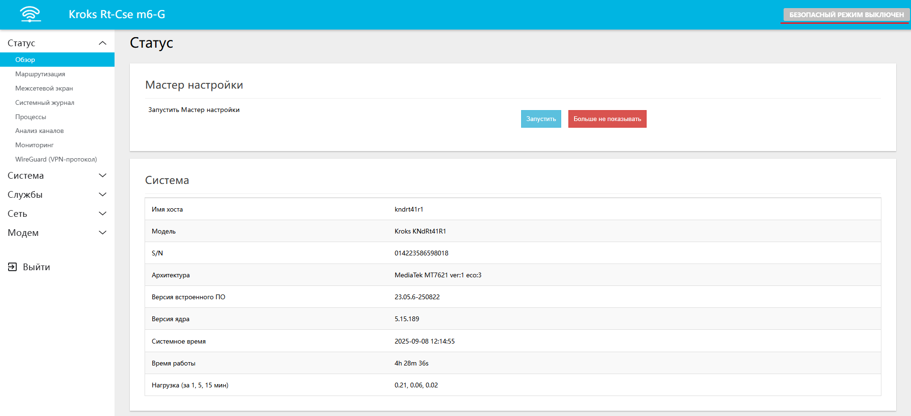
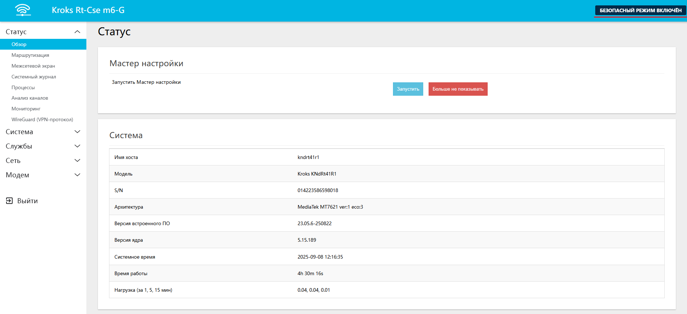

# Безопасный режим в роутерах Крокс

После [входа](/docs/routery/chasto-zadavaemye-voprosy/vhod-v-web-interface.md) в веб-интерфейс вашего роутера в верхней части страницы вы увидите следующее оповещение "БЕЗОПАСНЫЙ РЕЖИМ ВЫКЛЮЧЕН".

Для включения безопасного режима вам достаточно нажать на это оповещение, статус обновится на "БЕЗОПАСНЫЙ РЕЖИМ ВКЛЮЧЕН", после чего не забудьте нажать кнопку "ПРИМЕНИТЬ" в нижней части страницы.

Безопасный режим может помочь вам в случае ошибочной настройки роутера из-за которой доступ в веб интерфейс будет утерян. Приведем несколько примеров таких ситуаций ниже:  
* Вы изменили пароль от Wi-Fi точки доступа, но не запомнили его и теперь не можете подключиться к сети роутера, а другого способа попасть в веб-интерфейс у вас нет.  
* Вы случайно выключили точку доступа к которой подключен роутер и теперь не можете попасть в его веб-интерфейс.  
* Вы отключили функцию DHCP сервера для LAN порта.

:::tip
Если безопасный режим включён, то в ситуациях, когда вы теряете доступ к роутеру или случайно выводите его из строя после изменений в веб-интерфейсе, через определённое время настройки автоматически сбросятся к предыдущей рабочей конфигурации.
:::
