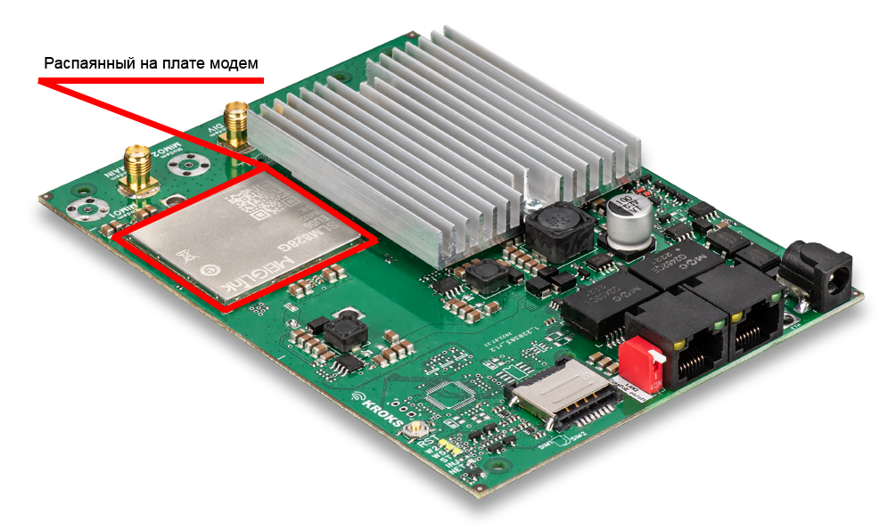
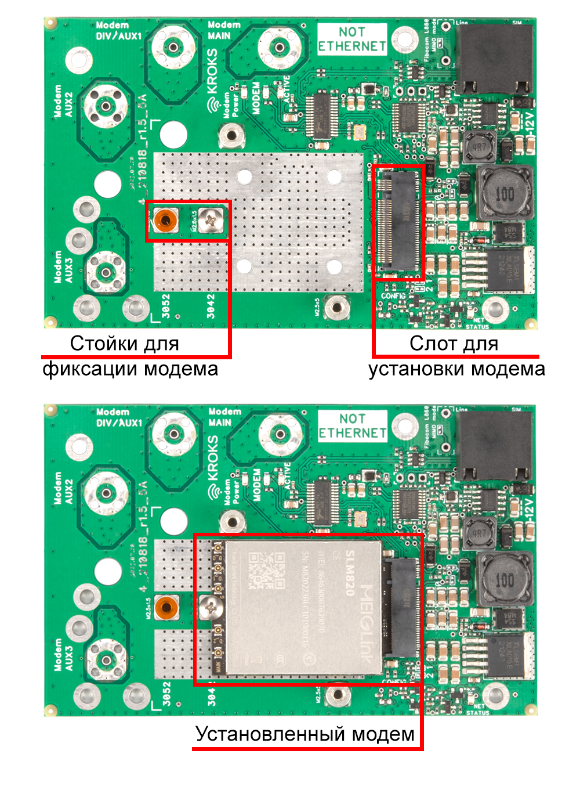
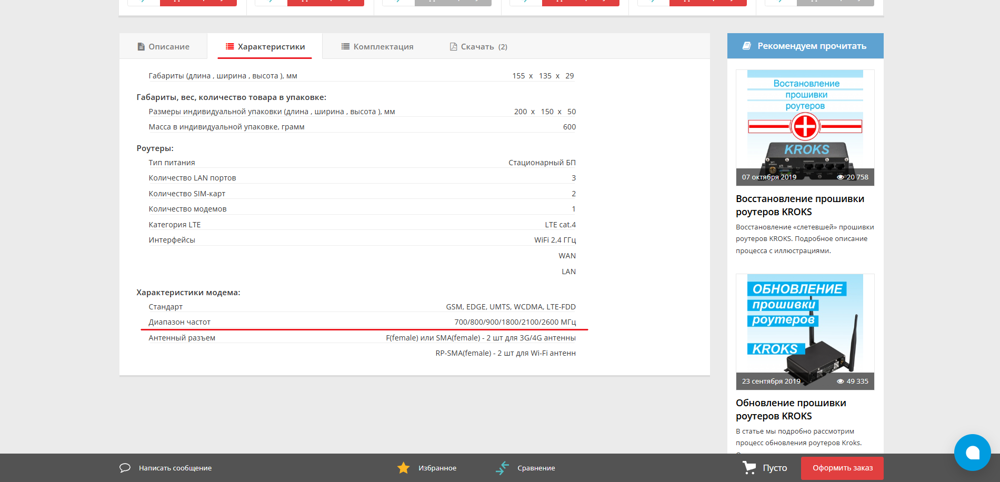
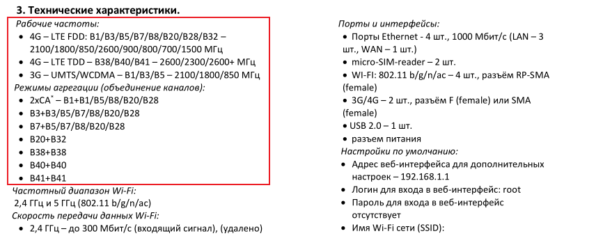

# Модемы в роутерах KROKS

В большинстве роутеров KROKS имеются встроенные 3G/4G модемы. Благодаря такому модему наши роутеры способны обеспечивать доступ к сети Интернет в любой точке, где есть сигнал мобильной сети.  
Модемы могут отличаться по нескольким признакам:  
* **Способ установки**;  
* **Категория модема**;  
* **Поддерживаемые бэнды**.

С каждым из этих пунктов мы разберемся подробнее в этой статье.

## ***Способы установки модема***

Здесь всё довольно просто, в домашних и большинстве уличных роутеров KROKS модемы непосредственно распаяны на плате устройства. В таком случае вам не рекомендуется как-либо с ними взаимодействовать.

Но также некоторые из роутеров изначально поставляются без встроенного модема, соответственно у них присутсвует возможность установки mini PCI или M.2 модемов.  
Вот пример такой платы:

## ***Категории модемов***

Категория модема определяет максимальную скорость передачи данных модемом, а также технологии, используемые модемом для обеспечения связи.  
Среди роутеров KROKS встречаются модемы следующих категорий:

* **Cat.4**  
Самые "младшие" модемы из используемых в наших роутерах. Используют технологии одночастотного MIMO и могут работать в диапазонах частот LTE. Это один из начальных стандартов LTE, который обеспечивает стабильно соединение для базовых интернет-задач, таких как серфинг по интернету и потоковое видео в стандартном качестве.  
Подходит для ситуаций, когда вам требуется устойчивое, но не максимальное соединение.  
**Максимальная скорость загрузки 4G** — до 150 Мбит/с.  
**Максимальная скорость выгрузки 4G** — до 50 Мбит/с.

* **Cat.6**  
Модемы категории 6 уже поддерживаю технологию агрегации частот, что позволяет объединять несколько частотных полос для увеличения пропускной способности. Также такие модемы могут использовать технологию MIMO 2x2, что улучшает качество связи и скорость передачи данных.  
Отлично подходит для пользователей, которые активно просматривают потоковые видео в хорошем качестве, онлайн-игры и другие приложения, требующие высокой скорости и низкой задержки.  
**Максимальная скорость загрузки 4G** — до 300 Мбит/с.  
**Максимальная скорость выгрузки 4G** — до 50 Мбит/с.

* **Cat.12**  
Такие модемы поддерживают более сложные способы агреггирования частот и могут использовать не только технологию MIMO 2x2, но и её улучшенную версию MIMO 4х4. Он может объединять до 3 частотных полос, что значительно увеличивает эффективность передачи данных и снижает задержки.  
Подходит для предприятий и пользователей, которым требуется высокоскоростной интернет для загрузки больших файлов, видеоконференций и работы с программами, требующими высокой пропускной способности.  
**Максимальная скорость загрузки 4G** — до 600 Мбит/с.  
**Максимальная скорость выгрузки 4G** — до 150 Мбит/с.

## ***Поддерживаемые бэнды***

Если вы не знакомы с таким понятием как *бэнд*, подробнее об них вы можете узнать в [этой](/docs/repitery/standarty-i-diapazony-chastot-mobilnyh-operatorov) статье. Если коротко, бэнды — это диапазоны частот используемые операторами мобильной связи.  
Разные модемы поддерживают разные бэнды и соответственно работают в разных диапазонах частот. Например, вам может понадобиться эта информация для выбора подходящей 3G/4G антенны к вашему роутеру.  
Узнать рабочий диапазон частот роутера вы можете на его странице сайта в разделе характеристики.

Также эта информация доступна и в документации к устройству.

