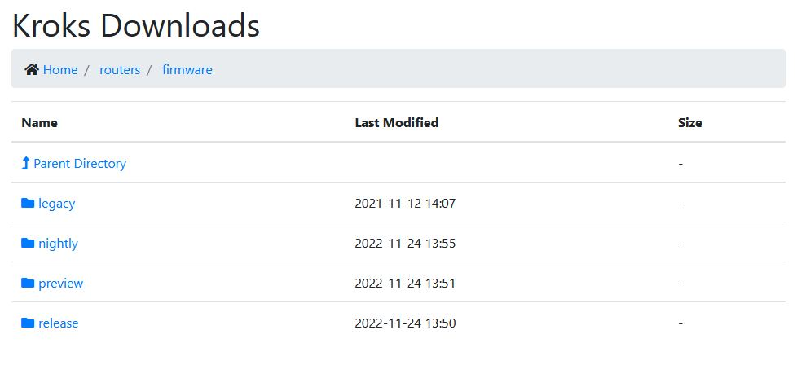

# Навигация по разделу с прошивками

## ***Главная страница***

[Раздел с прошивками](https://download.kroks.ru/routers/firmware/)  

## ***Release***

Последние, стабильные версии прошивок для всех актуальных роутеров.

:::tip
**Рекомендуются к установке в большинстве случаев.**

:::

## ***Legacy***

Последняя поддерживаемая версия ПО (211111) для устаревших типов оборудования.

:::warning
**Обновляться раздел больше не будет.**

:::

## ***Nightly***

"Ночные" прошивки. Содержат последние изменения и исправления, не прошедшие полный цикл тестирования. Могут подойти для использования в некритических системах. После прохождения полного тестирования nightly прошивки переходят в статус release.

## ***Preview***

Тестовые прошивки для роутеров - содержит экспериментальные версии программного обеспечения для вашего роутера. Здесь вы найдете прошивки, которые еще проходят проверку и доработку. Использование тестовых версий позволяет заранее оценить грядущие изменения, но может сопровождаться нестабильной работой устройства. Устанавливайте такие прошивки только при необходимости и на свой страх и риск, обязательно создайте резервную копию текущей конфигурации роутера.

:::info
Версия прошивки (название директории) соответствует дате в формате ГГММДД. Т.е. прошивка в каталоге 211111 будет соответствовать 11 ноября 2021 года. А 231211 - 11 декабря 2023 года.

:::
