# Роутер без модема

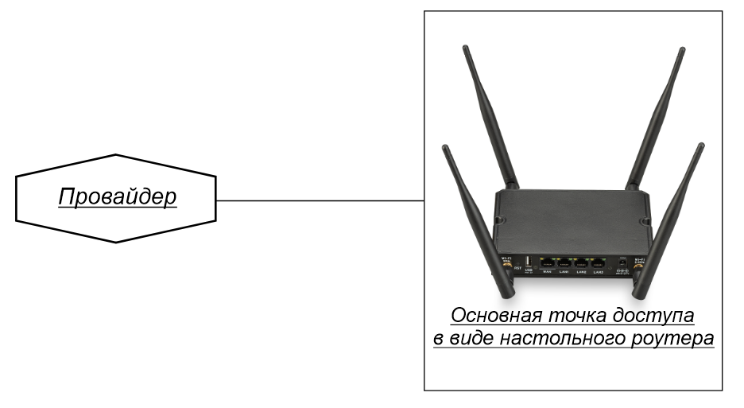

## ***Проверка подлинности***

Перед началом использования роутера убедитесь, что непосредственно на корпусе роутера есть этикетка Крокс (Kroks), если комплект куплен не на официальном сайте и содержит сторонний роутер - обращайтесь за поддержкой к продавцу. Исключением являются роутеры ТРИКОЛОР.  
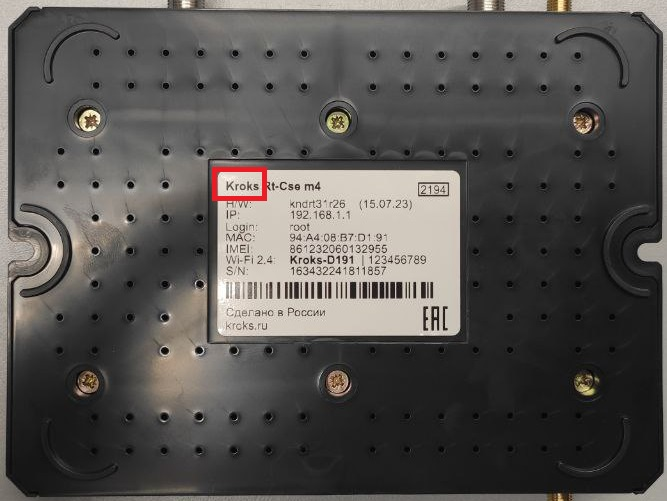

## ***Проверка подключения антенн***

* Проверьте подключение wifi антенн. Они должны быть подключены к WiFi-портам (2 или 4 шт., идут в комплекте). Примеры подключения:  
   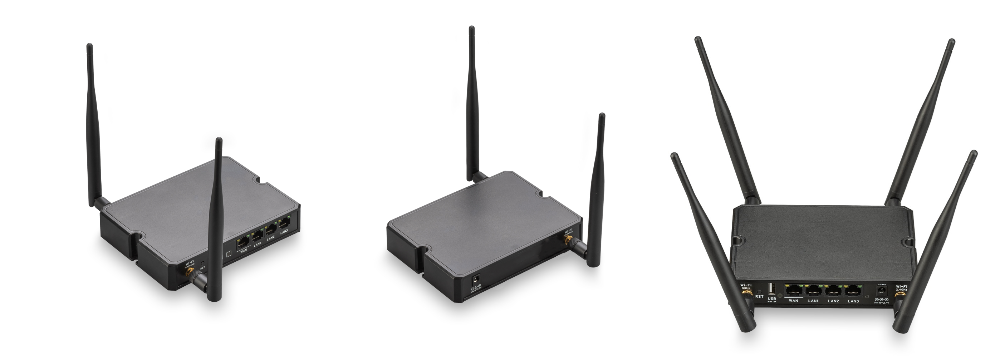
* Вставьте комплектный блок питания сначала в роутер в специальное гнездо, а только затем в сеть  
   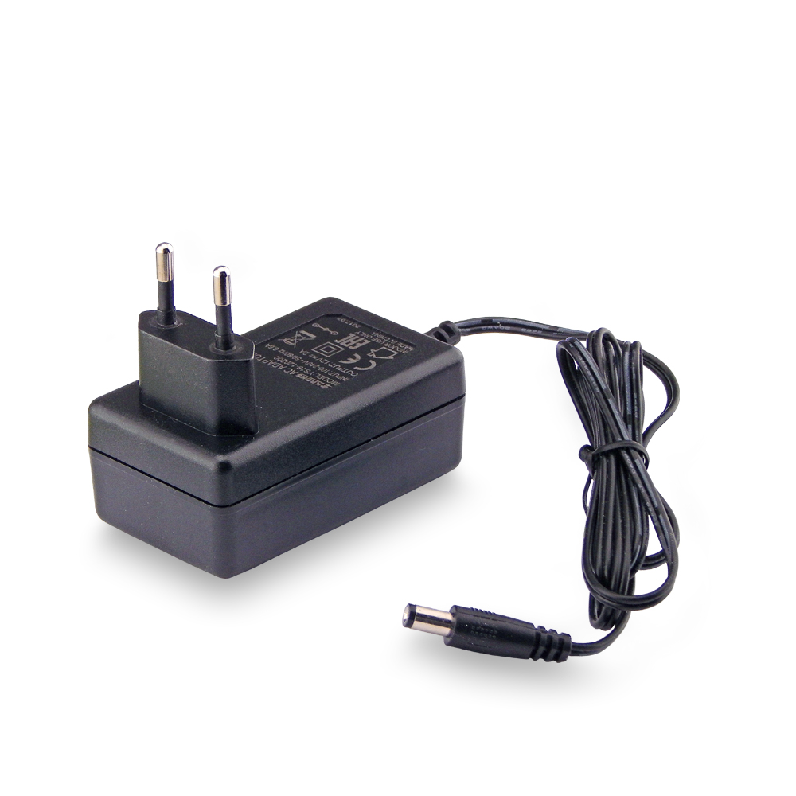

## ***Первое включение роутера***

Исправный роутер, после подачи питания, при загрузке (обычно от одной до трёх минут) моргает светодиодом «**Status**» и через некоторое время должен зажечь его непрерывно.

## ***Подключитесь к вашему роутеру***

* **Проводное подключение** - просто вставьте кабель одним концом в своё устройство в порт **Ethernet**, а другим концом в любой свободный порт **LAN** роутера.
* **Беспроводное подключение** - имя WiFi-сети и пароль написаны на этикетке устройства, если этикетка отсутствует то стандартный пароль: **123456789**.

:::warning
Не должно быть подключено никаких промежуточных устройств. Пример подключения по LAN:  
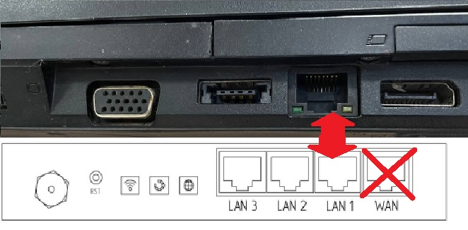

:::

## ***Вход в WEB-интерфейс роутера***

* Зайдите на страницу WEB-интерфейса роутера, через страницу в браузере (Яндекс, Chrome и тд.). В адресную строку необходимо вписать:  **192.168.1.1**  
     
   

   Интерфейс должен выглядеть, как на скриншоте ниже 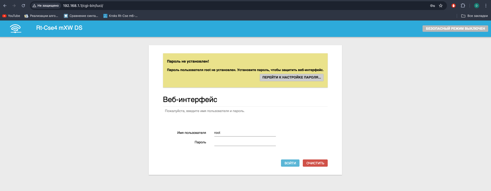  
   Если интерфейс выглядит как на примере ниже, то в адресную строку необходимо вписать: **192.168.1.1/cgi-bin/luci/**  
   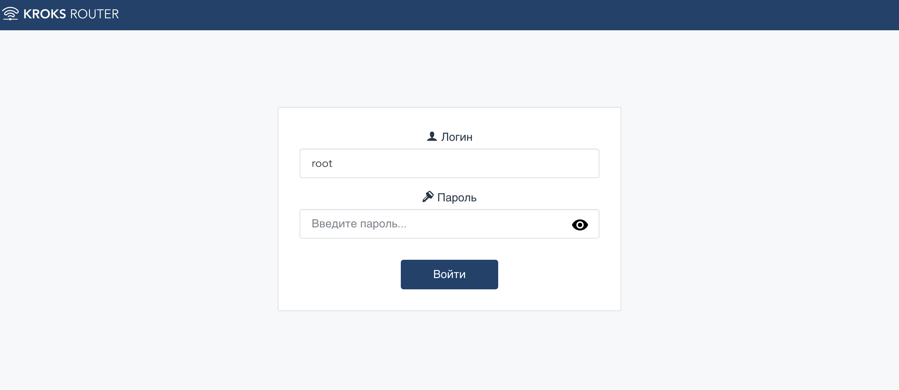

* Заходим в веб интерфейс кнопкой **«ВОЙТИ»**. По умолчанию пароль не установлен.  
   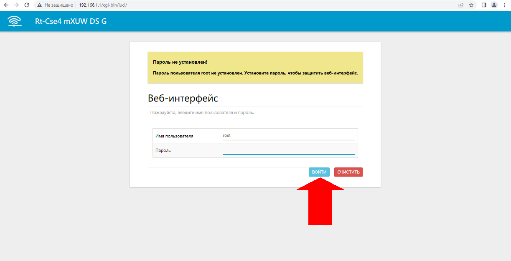

## ***Подключение к интернету***

**Примечание** - при заключении договора с Интернет-провайдером на оказание услуг доступа в сеть Интернет провайдер передаёт пользователю информацию необходимую для подключения к сети.

Поэтому для подключения через протокол **PPPoE**  необходимо чтобы у вас был под рукой договор с Интернет-провайдером. Если он у вас уже есть, то можно преступить к настройке.

В боковом меню выберите вкладку "Сеть" → "Интерфейсы".

Удалите все интерфейсы, помеченные красным, с помощью кнопки "УДАЛИТЬ".  
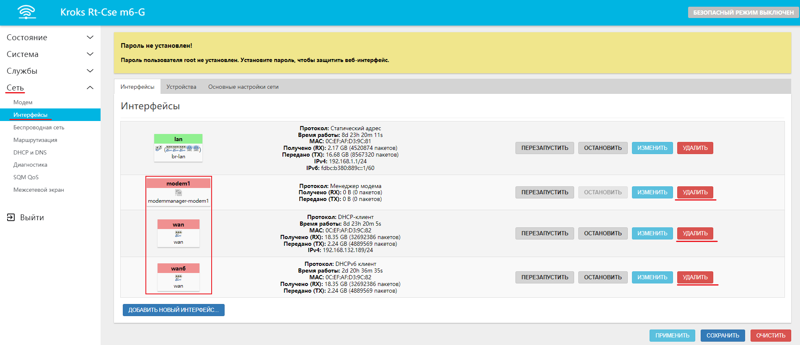

После удаления нажмите кнопку "ДОБАВИТЬ НОВЫЙ ИНТЕРФЕЙС".

В появившемся окне введите следующие настройки:

* **Название** - **wan**. Это имя которым будет отображаться созданный интерфейс, оно может быть любым, но обычно используется wan;
* **Протокол** - выберите протокол, указанный в вашем договоре об оказании услуг (L2TP/PPTP/PPPOE);
* **Устройство** - выберите **WAN**.

Нажмите кнопку "СОЗДАТЬ ИНТЕРФЕЙС".

:::tip
Обратите внимание, если у вас в договоре указан протокол **L2TP**, тогда настройте этот интерфейс как **DHCP-клиент** и в поле **Устройство** выберите **wan**. После добавьте ещё один новый интерфейс, где в качестве протокола выберите уже **L2TP**.

:::

В следующем окне введите данные из договора об оказании услуг, они могут отличаться в зависимости от выбранного протокола подключения к сети Интернет.

Далее выберите в этом окне вкладку **Настройки межсетевого экрана** и выберите зону **wan**, после чего нажмите кнопку "СОХРАНИТЬ".  
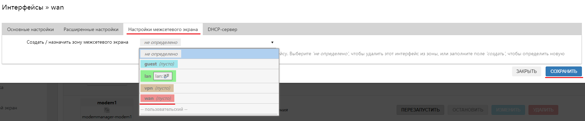

Нажмите кнопку "ПРИМЕНИТЬ" во вкладке интерфейсов.  

Готово, вы настроили проводное подключение к провайдеру интернета.

## ***Пример корректной работы роутера***

Проверить соединение с сетью Интернет можно на той же вкладке "Сеть" → "Интерфейсы".

Значения **Получено (RX)** и **Передано (TX)** интерфейса **wan** должны быть отличными от нуля.  
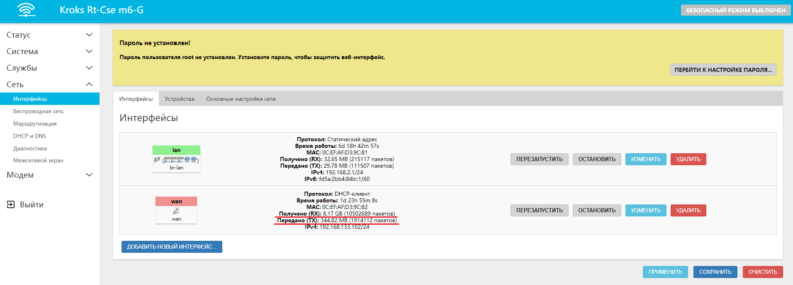
