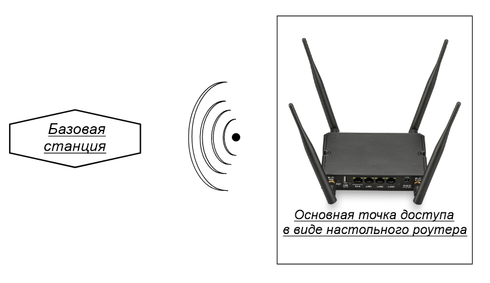
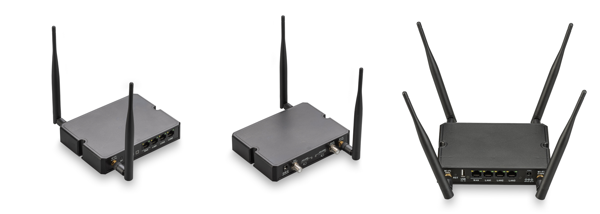
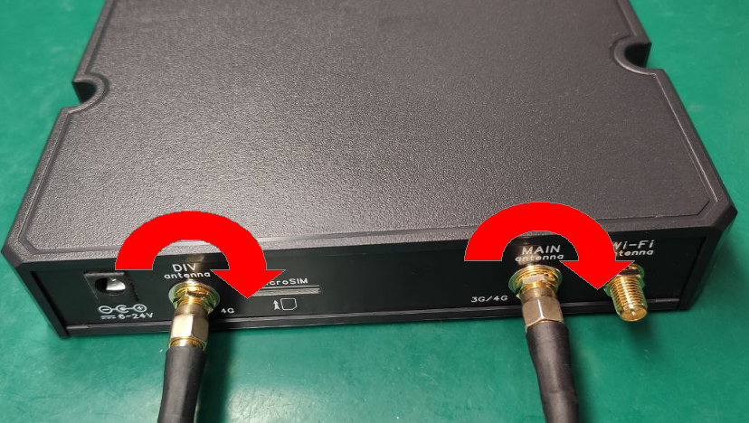
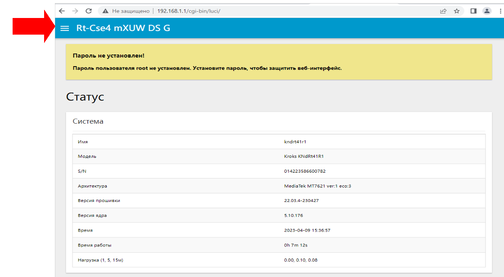
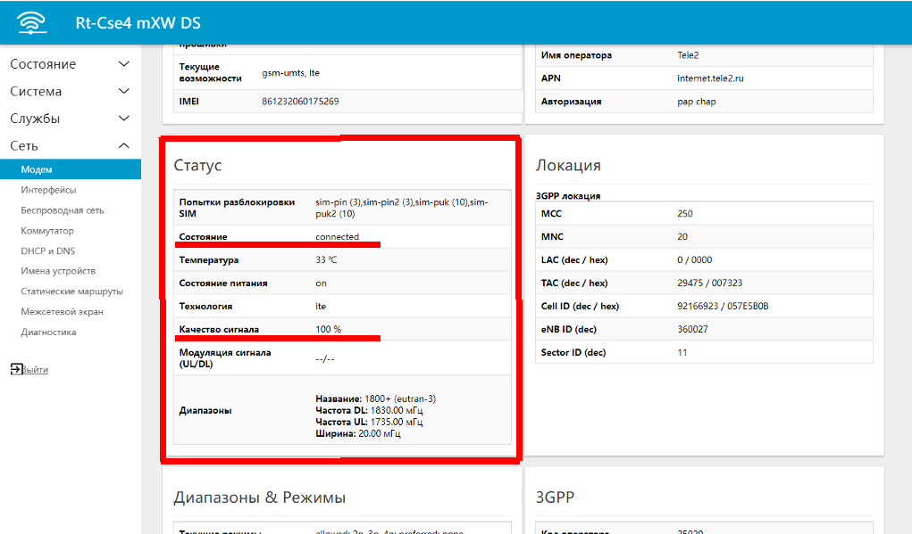
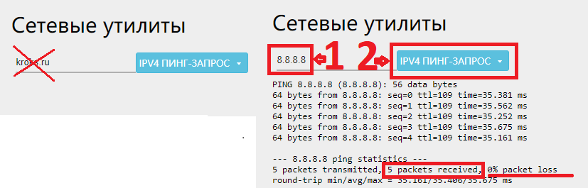

# Роутер с модемом

## ***Проверка подлинности***

Перед началом использования роутера убедитесь, что непосредственно на корпусе роутера есть этикетка Крокс (Kroks), если комплект куплен не на официальном сайте и содержит сторонний роутер - обращайтесь за поддержкой к продавцу. Исключением являются роутеры ТРИКОЛОР (в данной инструкции только TR-3G/4G-router-02)

## ***Проверка подключения антенн***

* Проверьте подключение wifi антенн. Они должны быть подключены к WiFi-портам (2 или 4 шт., идут в комплекте). Примеры подключения:  
   
* Проверьте подключение кабельных сборок либо антенн (2-4 шт., могут не идти в комплекте) к портам **MAIN**|**DIV**|**MIMO1**|**MIMO2**|**AUX1**|**AUX2**. Приоритетно подключить **MAIN** и **DIV**.

:::warning
Антенны **WIFI** НЕЛЬЗЯ использовать в качестве **3g/4g** антенн, т.к. они имеют другой тип разъёма!

:::

* Пример подключения **SMA** разъемов (**F** аналогично):  
   

:::warning
При подключении не допускается вращение кабеля относительно разъёма роутера, закручивайте гайку на кабеле (при неподвижных устройстве и кабеле), иначе есть опасность повреждения внутренности роутера.

:::

Вставьте комплектный блок питания сначала в роутер в специальное гнездо, а только затем в сеть  

### ***Первое включение роутера***

Исправный роутер, после подачи питания, при загрузке (обычно от одной до трёх минут) моргает светодиодом «**Status**» и через некоторое время должен зажечь его непрерывно.

:::info
Убедитесь, что в порт WAN не подключен никакой кабель.

:::

## ***Подключитесь к вашему роутеру***

* **Проводное подключение** - просто вставьте кабель одним концом в своё устройство в порт **Ethernet**, а другим концом в любой свободный порт **LAN** роутера.
* **Беспроводное подключение** - имя WiFi-сети и пароль написаны на этикетке устройства, если этикетка отсутствует то стандартный пароль: **123456789**.

:::warning
Не должно быть подключено никаких промежуточных устройств. Пример подключения по LAN:  

:::

## ***Вход в WEB-интерфейс роутера***

* Зайдите на страницу WEB-интерфейса роутера, через страницу в браузере (Яндекс, Chrome и тд.). В адресную строку необходимо вписать:  **192.168.1.1**  
  

Интерфейс должен выглядеть, как на скриншоте ниже  

Если интерфейс выглядит как на примере ниже  

то в адресную строку необходимо вписать: **192.168.1.1/cgi-bin/luci/**

* Заходим в веб интерфейс кнопкой **«ВОЙТИ»**. По умолчанию пароль не установлен.  

## ***Проверка корректной работы модема и SIM-карты***

Переходим в пункт меню **Сеть** и нажимаем на подпункт **Модем.**  
  
Откроется страница содержащая несколько мини-окон.

:::info
(если у вас нет меню, то сначала нажмите на три белые полоски слева, сверху экрана)  

:::

### ***Пример корректной работы роутера***

* в окне **Модем** отображается название модема и прочая информация. Если **нет** информации о модеме(по прошествии нескольких минут после загрузки), то переходите к пункту "**Обновление ПО роутера**".
* в окне **SIM-карта** отображается SIM ID и прочая информация
* в окне **Статус** в сроке **Состояние** должно быть написано connected, а **Качество сигнала** отлично от 0%.

## ***Проверка корректности наведения антенны и настроек модема***

Антенна должна располагается в зоне уверенного приема сигнала (на окне или на крыше).

Ознакомьтесь со статьей: [Наведение антенны с помощью роутера Крокс](/docs/routery/upravlenie-modemom/navedenie-antenny.md).

## ***Подключение к интернету***

Для подключения роутера к интернету нет необходимости прописывать настройки, если это не оговорено оператором, статус модема должен быть connected, если он периодически становится отличным от connected, то вам следует убедиться:

* sim-карта должна быть с тарифом для роутеров и модемов (если покупали не лично в салоне оператора сотовой связи - свяжитесь с оператором);  
  * ВНИМАНИЕ! ЕСЛИ ТАРИФ СИМКАРТЫ НЕ ДЛЯ РОУТЕРОВ И МОДЕМОВ, ОНА \[симкарта\] МОЖЕТ НЕКОТОРОЕ ВРЕМЯ ДАВАТЬ ИНТЕРНЕТ В РОУТЕРЕ, ПОКА ОПЕРАТОР НЕ ЗАБЛОКИРУЕТ ЭТУ ВОЗМОЖНОСТЬ (либо пока не закончится объем раздаваемого трафика в этом месяце). Оператор видит разницу между телефоном и роутером: ставите симкарту в телефон - интернет есть, ставите в роутер - интернета нет. Вы должны быть абсолютно уверены в тарифе симкарты!  
* на sim-карте должен быть оплачен и активен интернет (проверяйте в личном кабинете оператора);  
* для стабильной работы антенна должна быть корректно наведена на базовую станцию(см выше в инструкции) Если статус модема все время connected и тариф на sim-карте оплачен и активен, а интернета все равно нет, то переходим пункт меню **Сеть** подпункт **Диагностика**, заменяем kroks.ru на 8.8.8.8 и нажимаем кнопку **IPV4 ПИНГ-ЗАПРОС**.  
     
   

Если количество "packets transmitted" равняется количеству "packets received", а "packet loss" равно 0%, то ваше устройство установило соединение с сетью провайдера, но он не даёт вам интернет, и причина в одном из пунктов выше. В случае когда значение "packet loss" меньше 100%, но больше 0% - это говорит о нестабильном приеме сигнала - внимательней выполните рекомендации статьи: [Наведение антенны с помощью роутера Крокс](/docs/routery/upravlenie-modemom/navedenie-antenny.md).

В случае если не удается добиться уверенного приема сигнала, есть вероятность наличия значительных помех в радиоэфире. Для проверки рекомендуем переместиться в центр ближайшего густонаселенного пункта и перепроверить там. Если связь будет стабильной, рекомендуем обраться к специализированным монтажникам для проведения инспекции радиоэфира и условий монтажа в проблемном месте.
