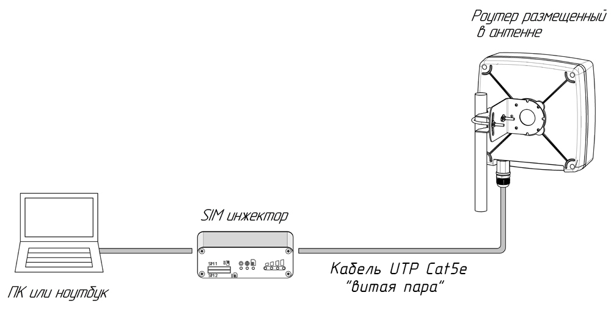
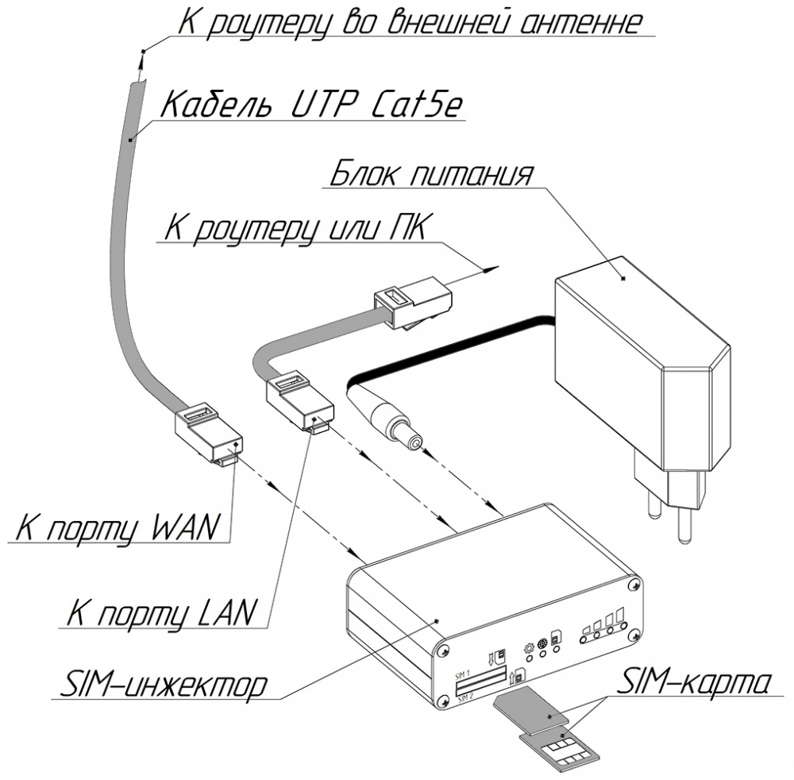
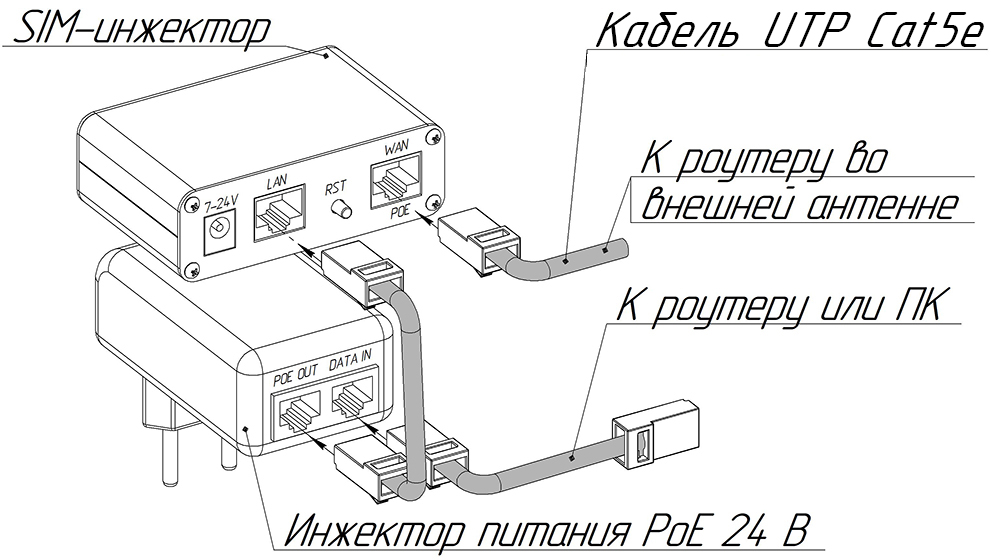
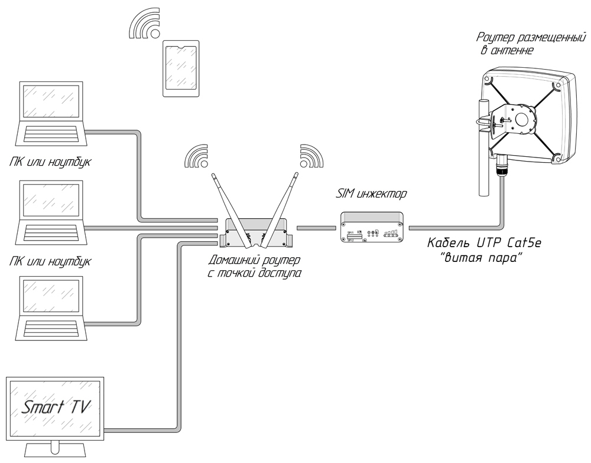

# Сим-инжектор

SIM Injector представляет из себя устройство удаленного подключения SIM-карт. С ним гораздо удобнее и быстрее производить установку и замену SIM-карты, получать информацию о качестве сигнала по индикации на передней панели. Поддержка 2 SIM-карт предусматривает возможность использования услуг нескольких операторов связи. Расстояние до внешнего роутера, встроенного в антенну, может достигать 50 метров. Поддержка passive-PoE технологии позволяет осуществлять питание и передачу данных по витой паре. Максимальное напряжение питания в линии 24 Вольта.

## ***Варианты подключения***

### ***Общая схема подключения***

### ***Стандартный вариант подключения***

### ***Подключение с использованием инжектора питания***

### ***Схема подключения в комбинации с домашним роутером***

## ***Установка СИМ-карты***

* Если у вас сим инжектор на 1 сим карту то контакты должны быть направлены вверх, а косая часть сим карты смотреть внутрь сим слота.
* Если у вас сим инжектор на 2 сим карты то контакты должны быть направлены друг на друга, а косая часть сим карты смотреть внутрь сим слота.  
     
   

После этого включите адаптер питания в розетку, подождите полной загрузки устройства (от 1 до 5 минут).

## ***Подключение к интернету***

Для подключения роутера к интернету нет необходимости прописывать настройки, если это не оговорено оператором, статус модема должен быть connected, если он периодически становится отличным от connected, то вам следует убедиться:

* sim-карта должна быть с тарифом для роутеров и модемов (если покупали не лично в салоне оператора сотовой связи - свяжитесь с оператором);  
  * ВНИМАНИЕ! ЕСЛИ ТАРИФ СИМКАРТЫ НЕ ДЛЯ РОУТЕРОВ И МОДЕМОВ, ОНА \[симкарта\] МОЖЕТ НЕКОТОРОЕ ВРЕМЯ ДАВАТЬ ИНТЕРНЕТ В РОУТЕРЕ, ПОКА ОПЕРАТОР НЕ ЗАБЛОКИРУЕТ ЭТУ ВОЗМОЖНОСТЬ (либо пока не закончится объем раздаваемого трафика в этом месяце). Оператор видит разницу между телефоном и роутером: ставите симкарту в телефон - интернет есть, ставите в роутер - интернета нет. Вы должны быть абсолютно уверены в тарифе симкарты!  
* на sim-карте должен быть оплачен и активен интернет (проверяйте в личном кабинете оператора);  
* для стабильной работы антенна должна быть корректно наведена на базовую станцию(см выше в инструкции) Если статус модема все время connected и тариф на sim-карте оплачен и активен, а интернета все равно нет, то переходим пункт меню **Сеть** подпункт **Диагностика**, заменяем kroks.ru на 8.8.8.8 и нажимаем кнопку **IPV4 ПИНГ-ЗАПРОС**.  
     
   

Если количество "packets transmitted" равняется количеству "packets received", а "packet loss" равно 0%, то ваше устройство установило соединение с сетью провайдера, но он не даёт вам интернет, и причина в одном из пунктов выше. В случае когда значение "packet loss" меньше 100%, но больше 0% - это говорит о нестабильном приеме сигнала - внимательней выполните рекомендации статьи: [Наведение антенны с помощью роутера Крокс](/docs/routery/upravlenie-modemom/navedenie-antenny.md).

В случае если не удается добиться уверенного приема сигнала, есть вероятность наличия значительных помех в радиоэфире. Для проверки рекомендуем переместиться в центр ближайшего густонаселенного пункта и перепроверить там. Если связь будет стабильной, рекомендуем обраться к специализированным монтажникам для проведения инспекции радиоэфира и условий монтажа в проблемном месте.
