# Уличный вариант

Перед началом самостоятельной диагностики по данной инструкции убедитесь, что непосредственно на корпусе роутера есть этикетка КРОКС (KROKS), если комплект куплен не на официальном сайте и содержит сторонний роутер - обращайтесь за поддержкой к продавцу. Исключением являются роутеры ТРИКОЛОР и RTK

## ***Первое включение роутера***

В зависимости от наличия поддержки сим инжектора, схема подключения будет отличаться:

### ***Для устройств с сим инжектором***

* Если роутер не имеет встроенный кабель, подключите кабель витая пара, имеющий 4 пары проводников категории 5e, и обжатый по T568A или T568B к внешнему блоку;
* К порту WAN или TO UP сим-инжектора подключите кабель от внешнего блока (роутера с антенной);
* К порту LAN сим инжектора подключите компьютер;
* к порту POWER подключите блок питания (ВАЖНО!!!! Не должно быть подключено никаких промежуточных устройств).

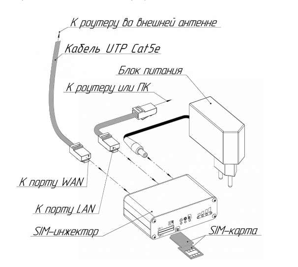  
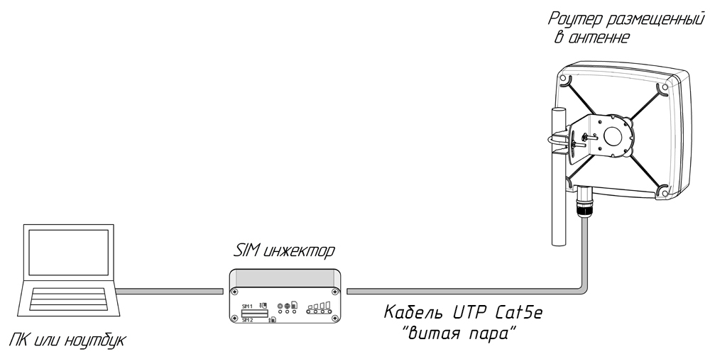

Установите сим карту(-ы) в слот(-ы):

* Если у вас сим инжектор на 1 сим карту то контакты должны быть направлены вверх, а косая часть сим карты смотреть внутрь сим слота.
* Если у вас сим инжектор на 2 сим карты то контакты должны быть направлены друг на друга, а косая часть сим карты смотреть внутрь сим слота.

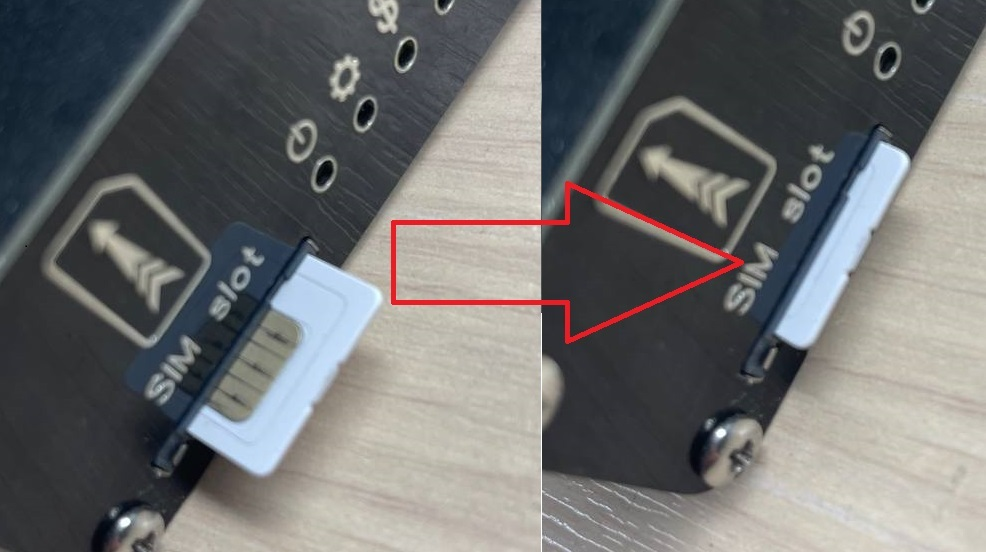  
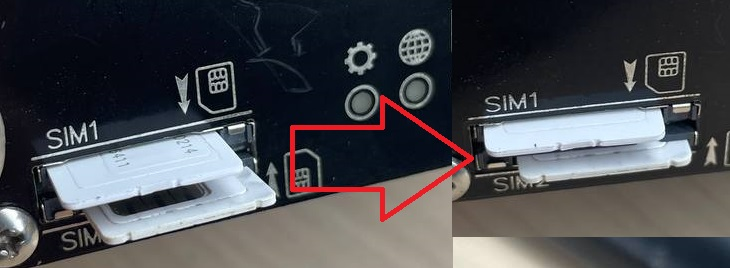

После этого включите адаптер питания в розетку, подождите полной загрузки устройства (от 1 до 5 минут)

### ***Для устройств без сим инжектора***

* Если роутер не имеет встроенный кабель подключите кабель витая пара имеющий 4 пары проводников категории 5e, и обжатый по T568A или T568B к внешнему блоку;
* К порту POE инжектора подключите кабель от внешнего блока(роутера с антенной);
* К порту LAN инжектора подключите компьютер.  
   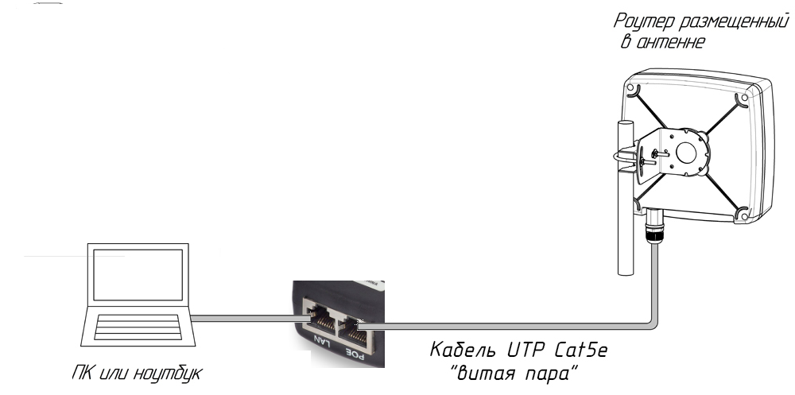
* Установите сим карту(сим карты) в слот(ы) внешнего блока В зависимости от ревизии устройства сим слот может быть разной конструкции: Если слот выглядит как на фото ниже то сим карты размера mini sim устанавливаются контактами вниз и коcой частью наружу.  
   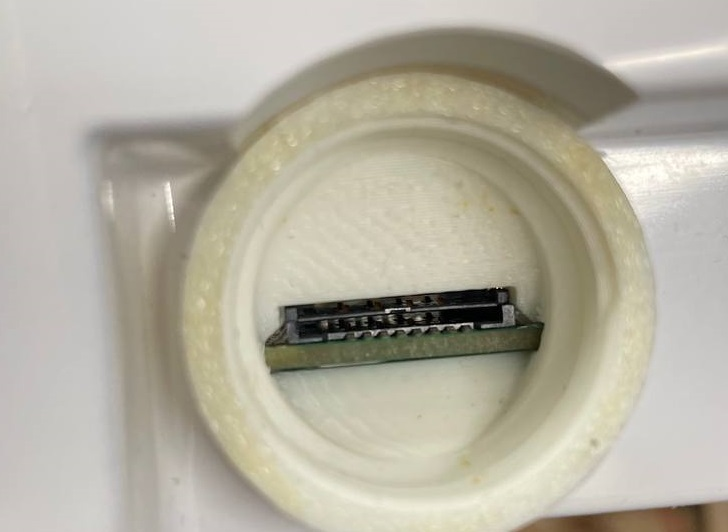  
   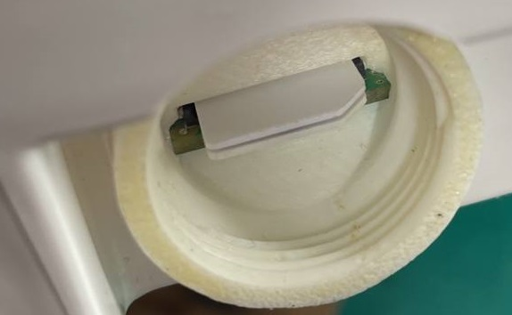

   Если слот выглядит как на рисунке ниже то сим карты размера micro sim устанавливаются контактами друг к другу и коcой частью наружу.  
   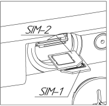

   После этого включите POE инжектор в розетку, подождите полной загрузки устройства (от 1 до 5 минут).

## ***Настройка и диагностика неисправностей***

* Зайдите на страницу веб интерфейса роутера, через страницу в браузере (Яндекс, Chrome и тд.). В адресную строку необходимо вписать: **192.168.1.1**  
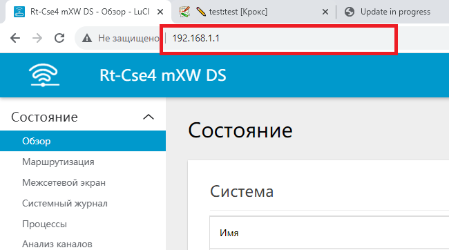  
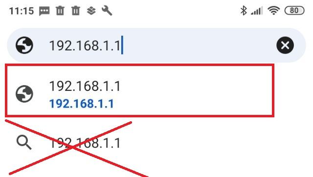

Интерфейс должен выглядеть, как на скриншоте ниже:  
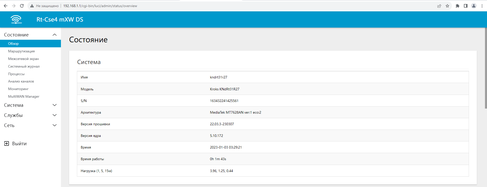

Если интерфейс выглядит как на примере ниже:  
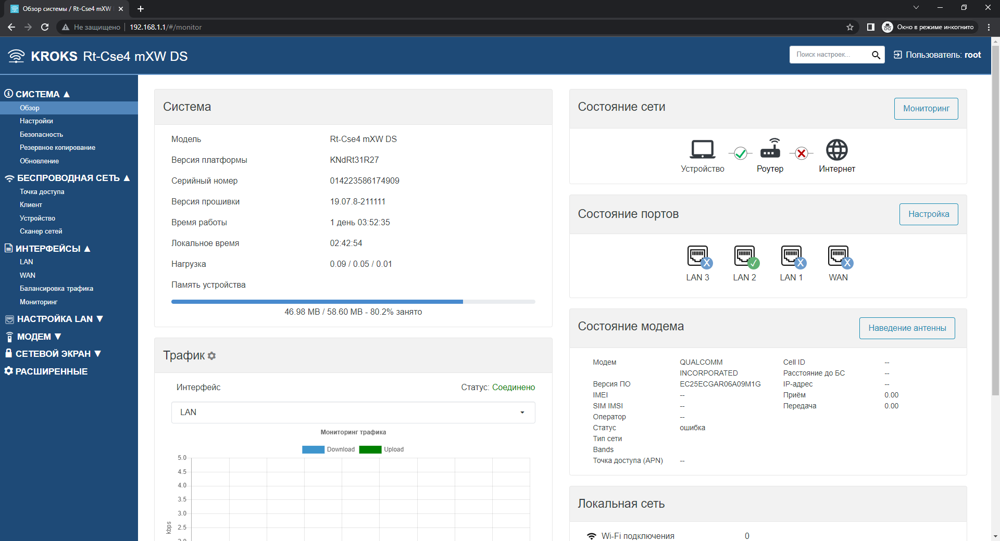

то в адресную строку необходимо вписать: **192.168.1.1/cgi-bin/luci/**

Если не удалось зайти, то:

* Сделайте сброс настроек: для этого необходимо дождаться полной загрузки устройства и  зажать кнопку RST на сим инжекторе(или на плате роутера) на 10-20секунд.
* Произведите восстановление прошивки. Подробно о том, как делается восстановление прошивки рассказано в статье: [Восстановление прошивки](/docs/routery/obnovlenie-proshivki/vosstanovlenie-proshivki.md).

:::info
Кнопка RST на сим-инжекторе НЕ РАБОТАЕТ до ПОЛНОЙ загрузки роутера, поэтому для восстановления прошивки необходимо вскрыть гермобокс(в cлучае если он опломбирован обратитесь в техподдержку по адресу [help@kroks.ru](mailto:help@kroks.ru) и на плате роутера нажать кнопку RST.

:::

#### ***Проверка корректной работы модема и SIM-карты***

Заходим в веб интерфейс кнопкой **«ВОЙТИ»** (если вы изменяли логин или ставили пароль, их требуется ввести).  

Затем переходим в пункт меню **Сеть** и нажимаем на подпункт **Модем** (если у вас нет меню, то сначала нажмите на три белые полосочки слева, сверху экрана).  
  
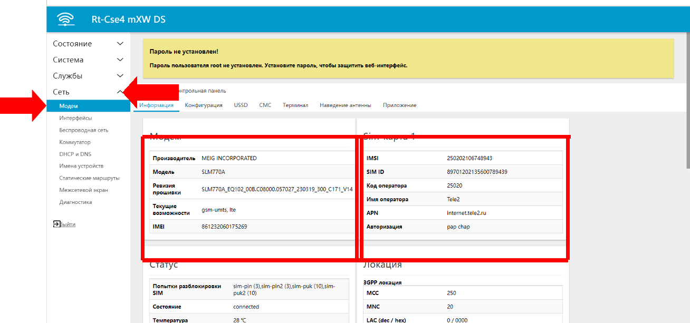

Откроется страница содержащая несколько мини-окон.

Пример корректной работы роутера:

* В окне **Модем** отображается название модема и прочая информация. Если **нет** информации о модеме(по прошествии 1-2 минут после загрузки), то переходите к пункту "Обновление ПО роутера".
* В окне **SIM-карта** отображается SIM ID и прочая информация.
* В окне **Статус** в сроке **Состояние** должно быть написано connected, а **Качество сигнала** отлично от 0%.

Если в окне **Статус** в строке **Состояние** отображается failed, и **Причина ошибки** sim-missing - это означает то что устройство по какой-то причине не смогло прочесть сим-карту. В таком случае проверьте корректность установки sim-карт(ы).  
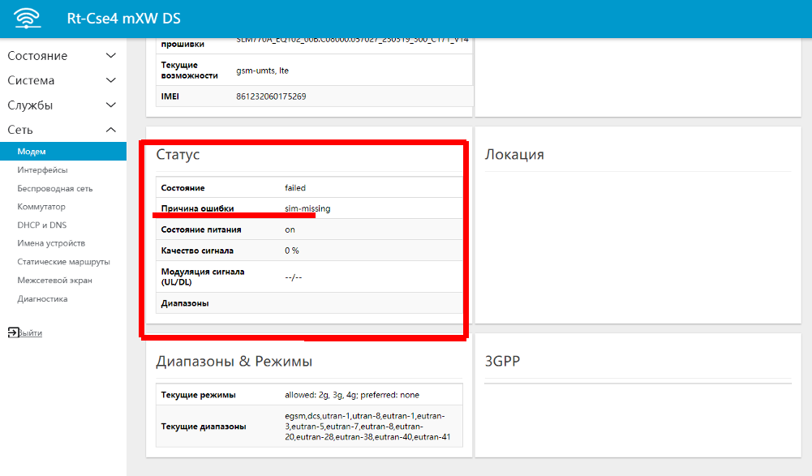

* Если в вашем устройстве 2 и более sim-карт, то в настройках выберите нужную, о том как это сделать подробно рассказано в статье: [Выбор sim-карты.](/docs/routery/upravlenie-modemom/pereklyuchenie-sim-karty.md)
* Если состояние sim-карты по прежнему failed, то протрите контакты sim-карты спиртом или замените ее).
* Если ваш комплект имеет сим-инжектор то переходите к подпункту: "Проверка корректной работы сим инжектора".
* В случае если эти рекомендации не помогли, вероятно вам может помочь выполнение следующей инструкции: [Доработка сим-инжектора](/docs/routery/remont/dorabotka-sim-inzhektora.md) (применимо и к сим-холдерам роутеров произведенных до апреля 2023г) либо отправляйте роутер в сервисный центр строго следуя следующей инструкции: [Гарантия и возврат](/docs/routery/remont/garantiynyy-remont.md).

### ***Проверка корректной работы сим инжектора***

Если у вас есть выбор всех 4х симкарт но они не читаются, то вероятно вам может помочь выполнение следующей инструкции: [Доработка сим-инжектора](/docs/routery/remont/dorabotka-sim-inzhektora.md)

Если у вас есть выбор только из 2х симкарт:

* у вас есть красная надпись "ошибка связи с сим инжектором"  
   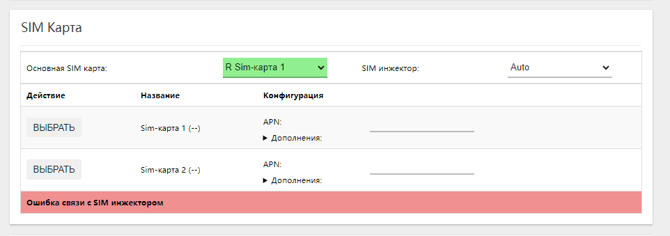  
   в этом случае необходимо принудительно прошить сим инжектор(зайти во вкладку контрольная панель, и нажать кнопку "ПРИНУДИТЕЛЬНО ПРОШИТЬ").  
   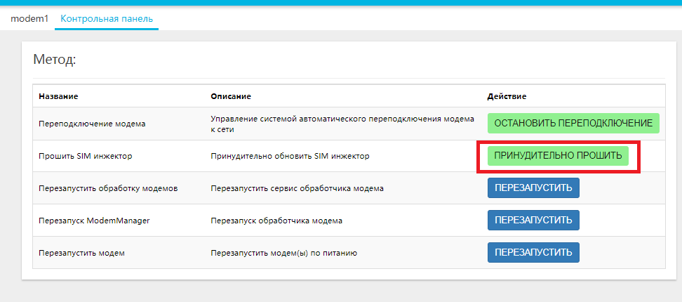  
   если после этого связь не наладилась то необходимо проверить на другом кабеле, а так же на коротком кабеле, если на коротком кабеле будет работать а на длинном заведомо исправном кабеле нет(или вообще с любым кабелем работать не будет) то переходите к последнему пункту статьи.
* у вас есть красная надпись "SIM инжектор отключен в настройках модема"  
   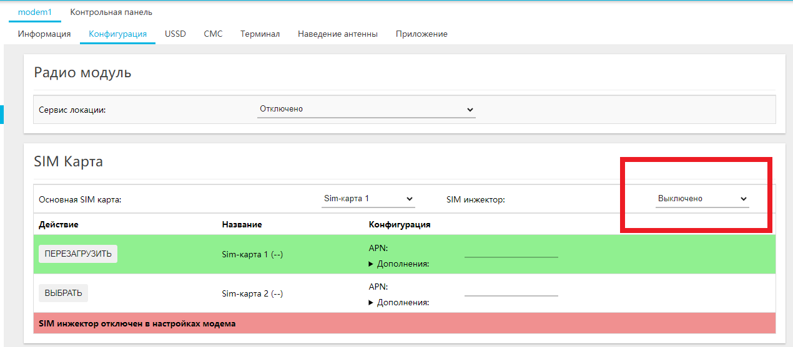  
   в этом случае включите сим инжектор, и ОБЯЗАТЕЛЬНО нажмите кнопку применить.  
   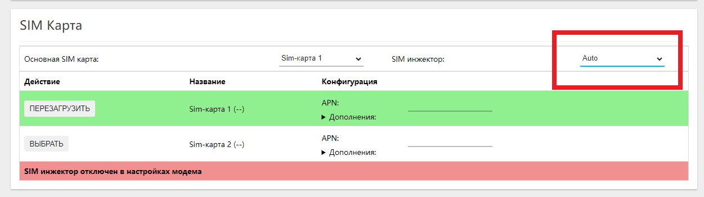  
   
* у вас есть красная надпись "сим инжектор запускается" или "обновление прошивки сим инжектора" подождите минуту и обновите страницу.
* у вас нет меню включения\\выключения сим инжектора, а так же в названии устройства нет RSIM. Ваш внешний блок не поддерживает сим инжектор и работать с ним не будет.

#### ***Проверка корректности наведения антенны и настроек модема***

Антенна должна располагается в зоне уверенного приема сигнала (на окне или на крыше). Ознакомьтесь со статьей: [Наведение антенны с помощью роутера Крокс](/docs/routery/upravlenie-modemom/navedenie-antenny.md).

Если качество сигнала 0%, необходимо убедиться что включены все диапазоны: заходим в пункт меню **Сеть** подпункт **Модем**, после чего переходим в вкладку **Конфигурация**, в выпадающем списке **Режимы** выбираем (2G 3G 4G) и убеждаемся что выбраны все диапазоны.  
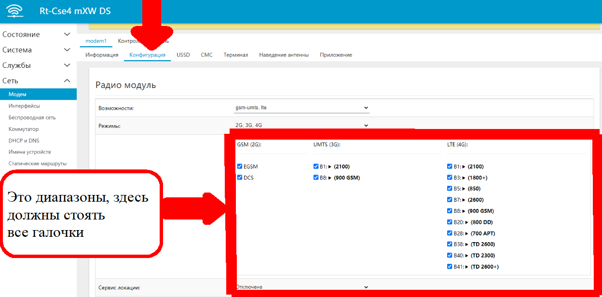

Листаем до самого низа страницы и нажимаем СОХРАНИТЬ И ПРИМЕНИТЬ.  
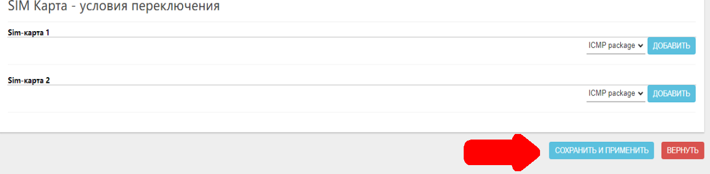

Если после этого действия у вас появились красные полосы- это значит настройки не применились.

Пример: (так быть НЕ должно):  
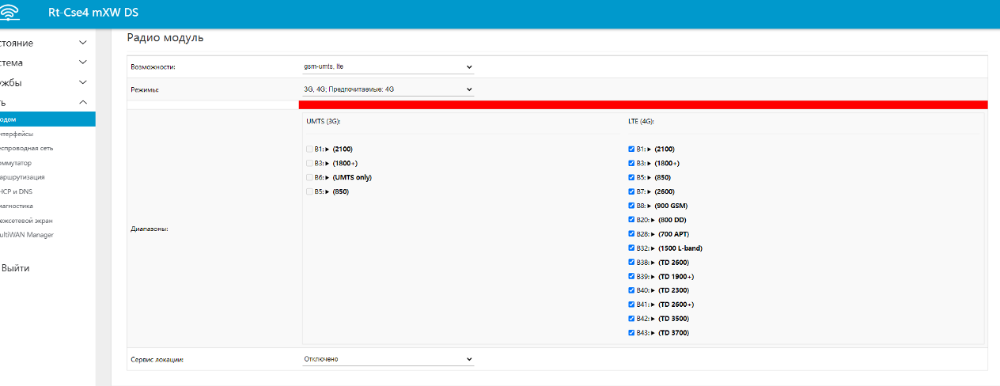

Есть несколько вариантов решения проблемы, пробуйте их по очереди, пока проблема не решится:

* В меню **Сеть->Модем** выбираем вкладку **«Контрольная панель»** и жмем **Остановить переподключение**, после чего повторить операцию выбора диапазонов:  
   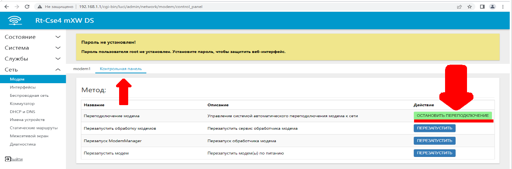
* В меню **Сеть->Модем** выбираем вкладку **«Контрольная панель»**, после чего в строке **«Перезапустить модем»** жмем кнопку **«Перезапустить»**, ожидаем 1 мин, и повторяем операцию выбора диапазонов:  
   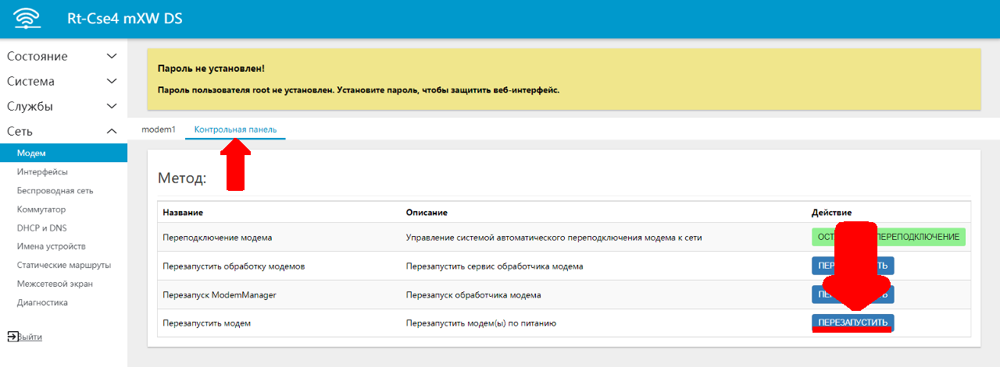

## ***Подключение к интернету***

Для подключения роутера к интернету нет необходимости прописывать настройки, если это не оговорено оператором, статус модема должен быть connected, если он периодически становится отличным от connected, то вам следует убедиться:

* sim-карта должна быть с тарифом для роутеров и модемов (если покупали не лично в салоне оператора сотовой связи - свяжитесь с оператором);  
  * ВНИМАНИЕ! ЕСЛИ ТАРИФ СИМКАРТЫ НЕ ДЛЯ РОУТЕРОВ И МОДЕМОВ, ОНА \[симкарта\] МОЖЕТ НЕКОТОРОЕ ВРЕМЯ ДАВАТЬ ИНТЕРНЕТ В РОУТЕРЕ, ПОКА ОПЕРАТОР НЕ ЗАБЛОКИРУЕТ ЭТУ ВОЗМОЖНОСТЬ (либо пока не закончится объем раздаваемого трафика в этом месяце). Оператор видит разницу между телефоном и роутером: ставите симкарту в телефон - интернет есть, ставите в роутер - интернета нет. Вы должны быть абсолютно уверены в тарифе симкарты!  
* на sim-карте должен быть оплачен и активен интернет (проверяйте в личном кабинете оператора);  
* для стабильной работы антенна должна быть корректно наведена на базовую станцию(см выше в инструкции) Если статус модема все время connected и тариф на sim-карте оплачен и активен, а интернета все равно нет, то переходим пункт меню **Сеть** подпункт **Диагностика**, заменяем kroks.ru на 8.8.8.8 и нажимаем кнопку **IPV4 ПИНГ-ЗАПРОС**.  
   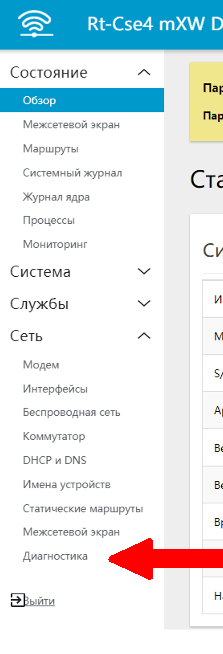  
   

Если количество "packets transmitted" равняется количеству "packets received", а "packet loss" равно 0%, то ваше устройство установило соединение с сетью провайдера, но он не даёт вам интернет, и причина в одном из пунктов выше. В случае когда значение "packet loss" меньше 100%, но больше 0% - это говорит о нестабильном приеме сигнала - внимательней выполните рекомендации статьи: [Наведение антенны с помощью роутера Крокс](/docs/routery/upravlenie-modemom/navedenie-antenny.md).

В случае если не удается добиться уверенного приема сигнала, есть вероятность наличия значительных помех в радиоэфире. Для проверки рекомендуем переместиться в центр ближайшего густонаселенного пункта и перепроверить там. Если связь будет стабильной, рекомендуем обраться к специализированным монтажникам для проведения инспекции радиоэфира и условий монтажа в проблемном месте.
