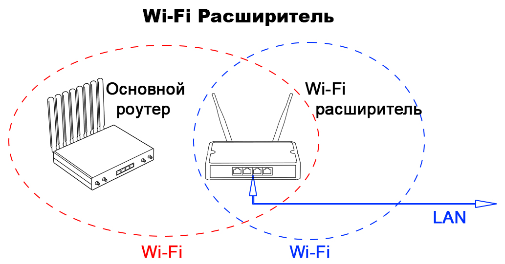
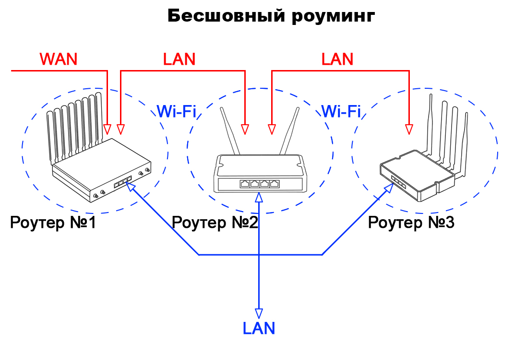
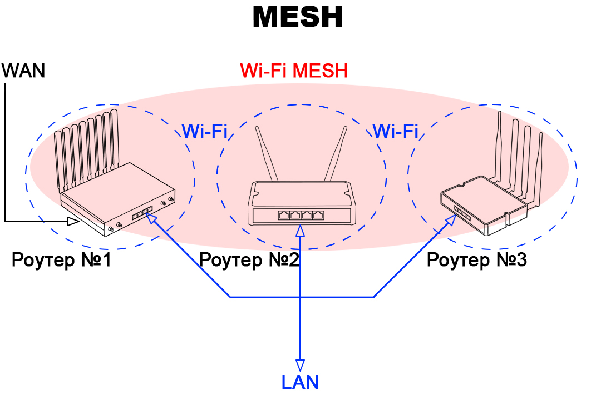

# Варианты расширения Wi-Fi сети

## ***По Wi-Fi***

Служит для расширения существующей Wi-Fi сети.

**Применение:**

* Расширение Wi-Fi в квартире.

**Схема:**

* Основной роутер подключен к интернету (4G, витая пара), Wi-Fi-расширитель подключён к нему по Wi-Fi и раздает дальше интернет как по Wi-Fi, так и по витой паре.

**Плюсы:**

* Очень простая настройка.
* Основным можно использовать роутер любого производителя (Kroks, Asus, Keenetic и пр.).
* Основной роутер и Wi-Fi расширитель соединены "по воздуху", без проводов.
* К интернету должен быть подключен только основной роутер.
* Не нужен физический доступ к основному роутеру. Подключиться можно к уже существующей сети роутера, находящегося в другом помещении.

**Минусы:**

* Роутеры будут находится в разных подсетях (общие сетевые папки, принтеры и пр. будут недоступны).
* Неисправность основного роутера лишает всю систему выхода в интернет.

## ***Бесшовный роуминг***

Создает Wi-Fi сеть с большой зоной покрытия и быстрым переключением между роутерами (точками).

**Применение:**

* Создание Wi-Fi в офисе, отеле.

**Схема:**

* Один роутер подключен к интернету (4G, витая пара), все остальные роутеры подключены к нему LAN в LAN. При этом каждый роутер раздаёт как единую бесшовную Wi-Fi сеть, так и локальную сеть и интернет по витой паре.

**Плюсы:**

* Переключение Wi-Fi клиентов между точками без задержек и прерываний. Актуально для аудио-, видеозвонков, конференций, стримов и пр.
* Все клиенты в одной общей сети.
* Количество точек может быть достаточно большим.

**Минусы:**

* Настройка требует внимательности.
* ****Каждая**** точка должна быть подключена к основному роутеру **либо** напрямую, **либо** через соединение LAN в LAN с соседними роутерами.

## ***Mesh-сеть***

**Применение:**

* Создание Wi-Fi в помещениях различного типа.

**Схема:**

* Один роутер подключен к интернету (4G, витая пара), все остальные роутеры объединены в единую mesh-сеть  подключением друг к другу по Wi-Fi. Интернет и локальная сеть доступны как по Wi-Fi, так и по витой паре.

**Плюсы:**

* Переключение Wi-Fi клиентов между точками без задержек и прерываний.
* Все клиенты в одной общей сети.
* Количество точек может быть достаточно большим.
* К интернету должен иметь доступ один роутер в Mesh сети.

**Минусы:**

* Общая скорость работы всей системы может быть медленней, чем при бесшовном роуминге.

Одним из основных отличий mesh от бесшовного роуминга является то, что каждый роутер в mesh "знает" только о существовании нескольких соседних роутеров (которые находятся в зоне его действия Wi-Fi), в то время как в бесшовном роуминге в настройках каждого из роутеров есть информация о **всех** роутерах в этой сети.
