# Mesh сеть

## ***Описание***

Эта схема объединяет все роутеры в единую Wi-Fi сеть, подключившись к которой, клиент (ПК, ноутбук, смартфон) будет иметь доступ к интернету и локальным ресурсам внутри сети.

Клиенты могут быть подключены как по Wi-Fi, так и по витой паре (через LAN порт любого из роутеров в этой сети).

При этом, перемещаясь от роутера к роутеру, клиент будет плавно переключаться между ними.

В концепции этой схемы есть роутер №1 - только он имеет выход в интернет (проводной провайдер или 4G). Все остальные роутеры - №2, №3 и т.д. должны быть **только** подключены к питанию. Всё остальное настраивается по инструкции ниже.

## ***Требования***

* Прошивка всех роутеров не ниже 220810. Скачать можно **[здесь](https://download.kroks.ru/routers/firmware/release/)**.
* Все роутеры сброшены до заводских настроек.

## ***Настройка роутера №1***

* Зайдите во вкладку *Сеть* - *Беспроводная сеть*.
* Удалите существующие Wi-Fi сети.
* Нажмите применить.

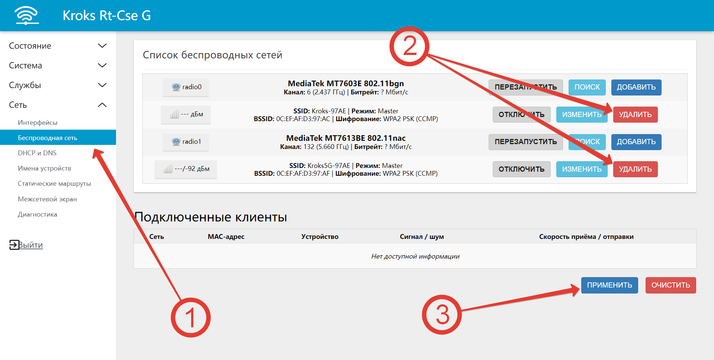

Т.к. в нашем примере двухдиапазонный роутер, то необходимо выбрать ту частоту, в которой будет создана будущая Mesh-сеть. Пусть это будет 2,4 GHz.

* Нажмите *Добавить*.

* В появившемся окне убедитесь, что вы находитесь во вкладке *Основные настройки*.
* По умолчанию будут настройки частоты как на примере. **Важно**, чтобы на всех роутерах настройки частоты были одинаковыми. Без необходимости не меняйте их.
* В выпадающем списке выберите *802.11s*.
* Введите желаемое имя для будущей Wi-Fi сети.
* Выберите *lan*.

* Переключитесь на вкладку *Дополнительные настройки*.
* Поставьте галочку на принудительном использовании 40 МГц. Этот пункт напрямую связан со вторым пунктом из предыдущего шага. Если вы меняете ширину канала в настройках частоты на 20 МГц, то эта галочка должна быть снята.
* Переключитесь на вкладку *Защита беспроводной сети*.
* Выберите тип шифрования *WPA3-SAE (высокий уровень)*.
* Введите пароль для будущей Wi-Fi сети.
* Нажмите *Сохранить*.
* Нажмите *Применить*.
* Вставьте сим-карту в роутер или подключите провод от провайдера в WAN порт. Настройка этого роутера завершена.

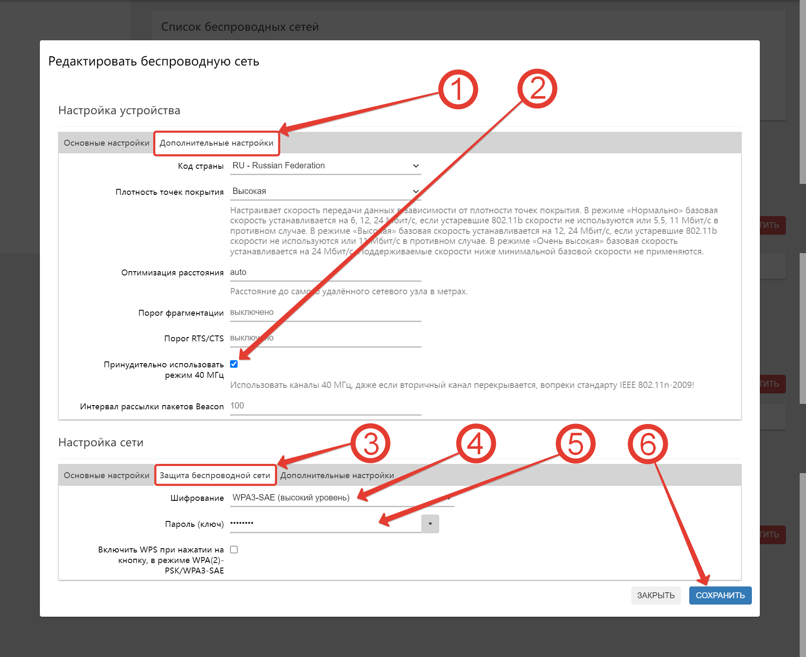  
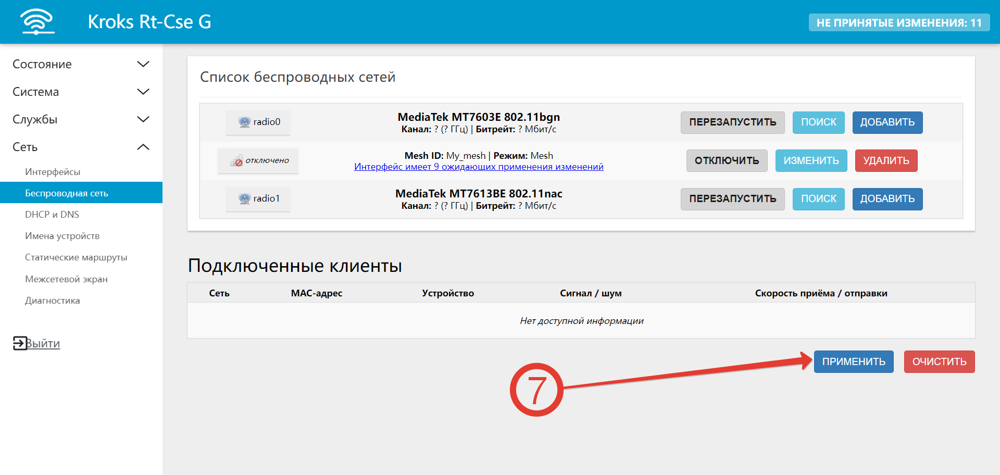

## ***Настройка роутера №2***

:::info
В процессе настройки нужно будет несколько раз нажать кнопку *Сохранить* для сохранения промежуточных настроек, но **не нажимайте** *Применить* до тех пор, пока это не будет прямо указано в инструкции.

:::

### ***Настройка LAN***

* Подключите роутер, зайдите во вкладку *Сеть - Интерфейсы*.
* Нажмите *Изменить* на интерфейсе *LAN*.
* Убедитесь, что вы на вкладке *Общие настройки*.
* Убедитесь, что у вас выбран *Статический адрес*.
* Изменить IP-адрес на *192.168.1.2*.
* Нажмите *Сохранить*.

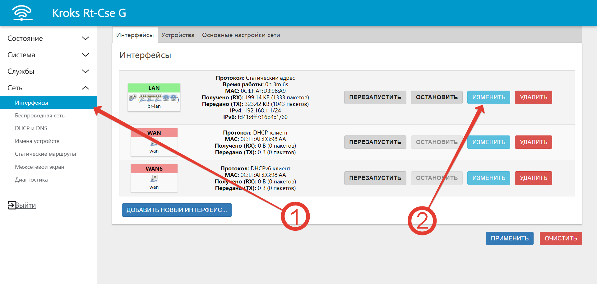  
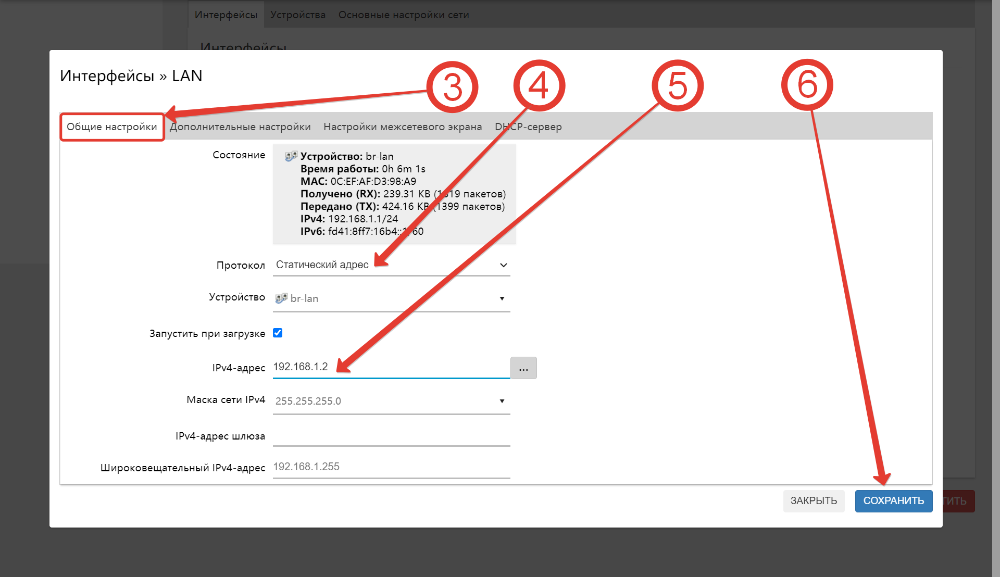

* Вас переадресует на предыдущую страницу. Снова нажмите *Изменить* на *LAN* интерфейсе.

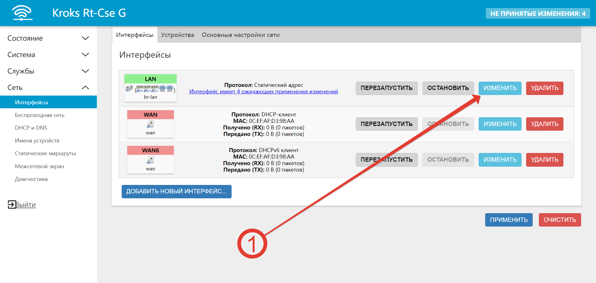

* Убедитесь, что вы на вкладке Общие настройки.
* Укажите в качестве шлюза адрес роутера №1 - *192.168.1.1*.
* Перейдите на вкладку *Дополнительные настройки*.
* Укажите 192.168.1.1 в качестве DNS-сервера.
* Перейдите во вкладку *DHCP-сервер - Основные настройки*.
* Установите галочку *Игнорировать интерфейс*.
* Нажмите *Сохранить*.

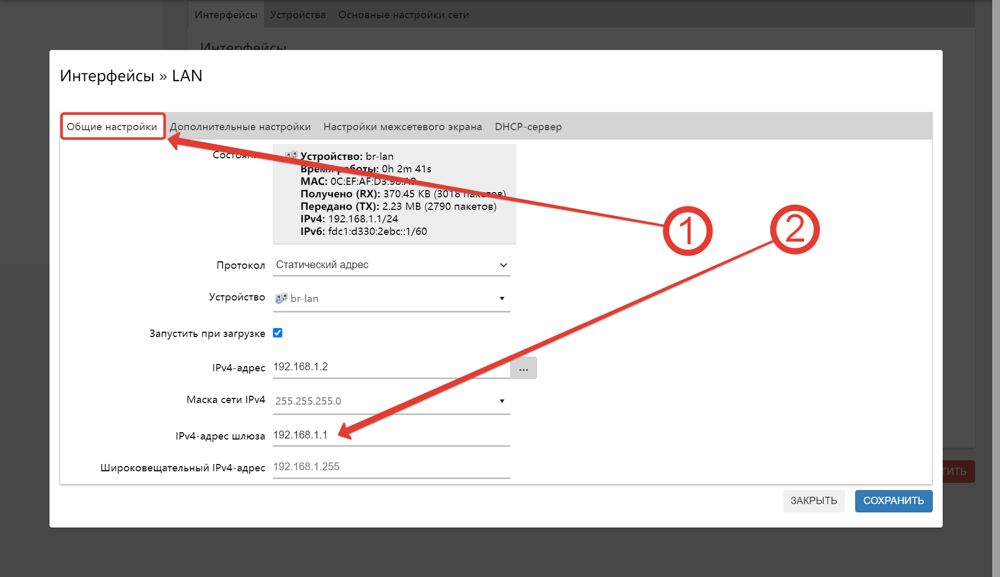  
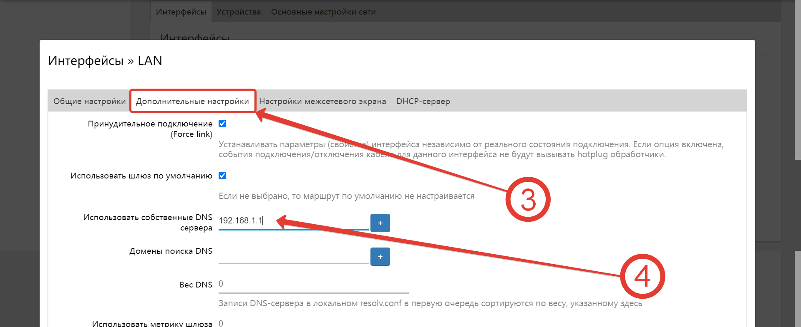  
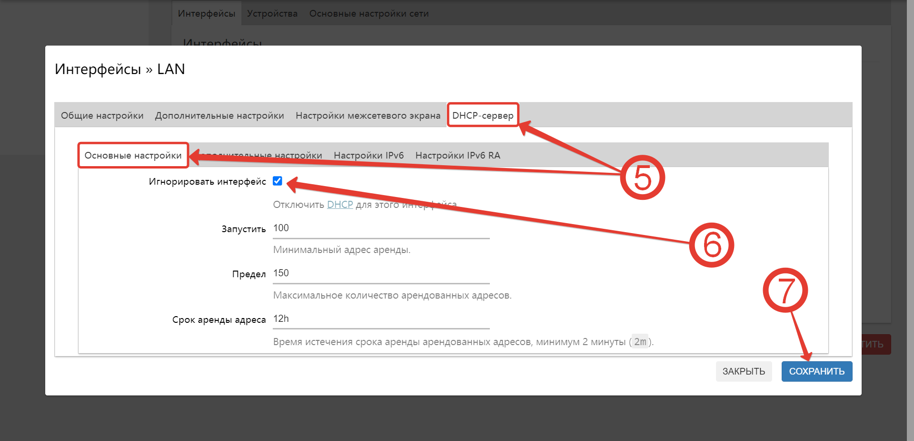

### ***Настройка Wi-Fi***

:::info
Настройка Wi-Fi этого роутера будет **полностью аналогична** настройке Wi-Fi основного роутера. Пройдёмся ещё раз подробно по всем пунктам.

:::

* Зайдите во вкладку *Сеть - Беспроводная сеть*.
* Удалите существующие Wi-Fi сети.

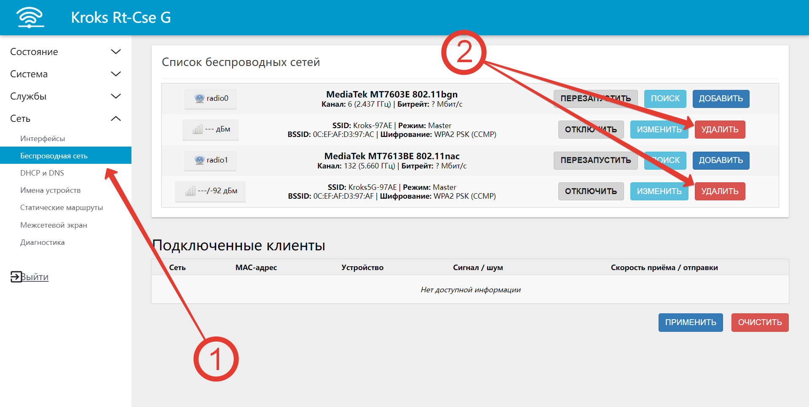

Т.к. в нашем примере двухдиапазонный роутер, то необходимо выбрать ту частоту, в которой будет создана будущая Mesh-сеть. Пусть это будет 2,4 GHz.

* Нажмите *Добавить*.

 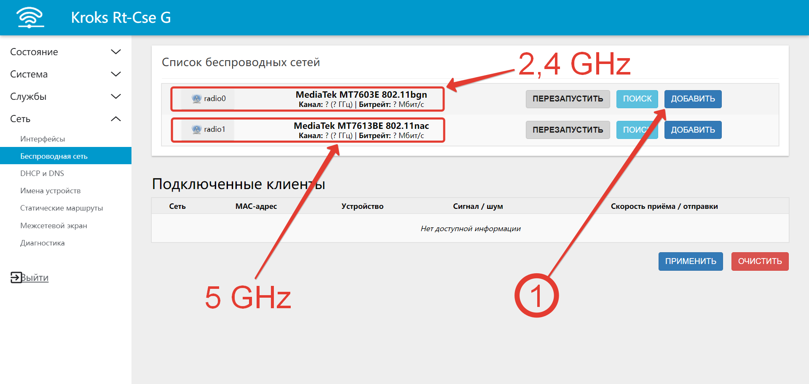

* В появившемся окне убедитесь, что вы находитесь во вкладке *Основные настройки*.
* По умолчанию будут настройки частоты как на примере. **Важно**, чтобы на всех роутерах настройки частоты были одинаковыми. Без необходимости не меняйте их.
* В выпадающем списке выберите *802.11s*.
* Введите желаемое имя для будущей Wi-Fi сети.
* Выберите *lan*.

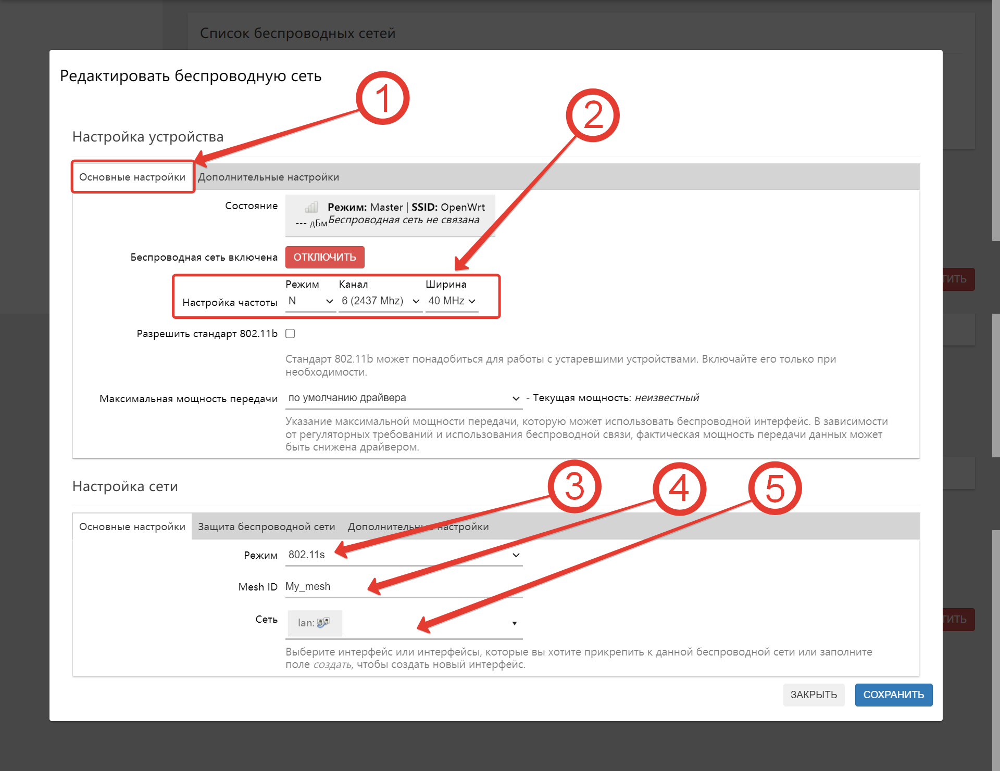

* Переключитесь на вкладку *Дополнительные настройки*.
* Поставьте галочку на принудительном использовании 40 МГц. Этот пункт напрямую связан со вторым пунктом из предыдущего шага. Если вы меняете ширину канала в настройках частоты на 20 МГц, то эта галочка должна быть снята.
* Переключитесь на вкладку *Защита беспроводной сети*.
* Выберите тип шифрования *WPA3-SAE (высокий уровень)*.
* Введите пароль для будущей Wi-Fi сети.
* Нажмите *Сохранить*.
* **Только теперь нажмите *Применить***.

  

После нажатия *Применить* у вас должна появится запись в поле *Подключенные клиенты*.

Обратите внимание на (1) и (2) - в полях сигнала и скорости передачи данных **должны появится значения**, которые будут динамически меняться.

Это будет означать, что вы всё сделали правильно.

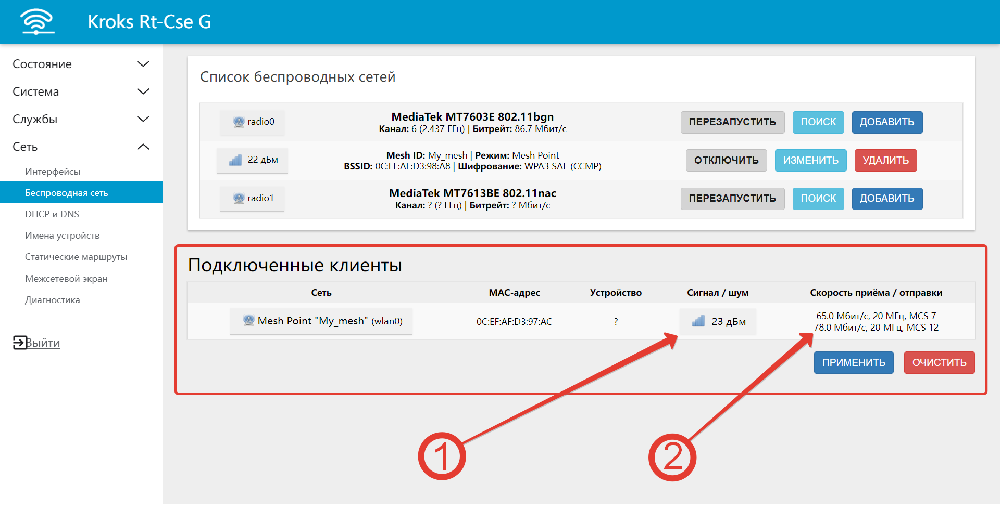

## ***Важные примечания***

* В этой схеме всегда должна быть **единственная точка выхода в интернет** - роутер №1. Он работает и как шлюз и как DNS-сервер.
* Роутер №3, №4 и т.д. настраиваются аналогично роутеру №2 с единственным замечанием - указывайте ему IP-адрес из этой же подсети, соответствующий его номеру.

Например:

* Роутер **№3** - 192.168.1.**3**
* Роутер **№4** - 192.168.1.**4** и т.д.

Вопросы по настройке и работе mesh-сети отправляйте на адрес [help@kroks.ru](mailto:help@kroks.ru).
